status: draft  
title: "New Replacement Figures for 14 CFR-25, 29, Appendix C"  
Date: 2026-09-18 12:00
tags: Jeck, Appendix C

### _"Modernized Appendix C - The Beauty & Benefits of Digitized Figures"_  
_Quote from an unpublished outline of topics by Richard Jeck._  

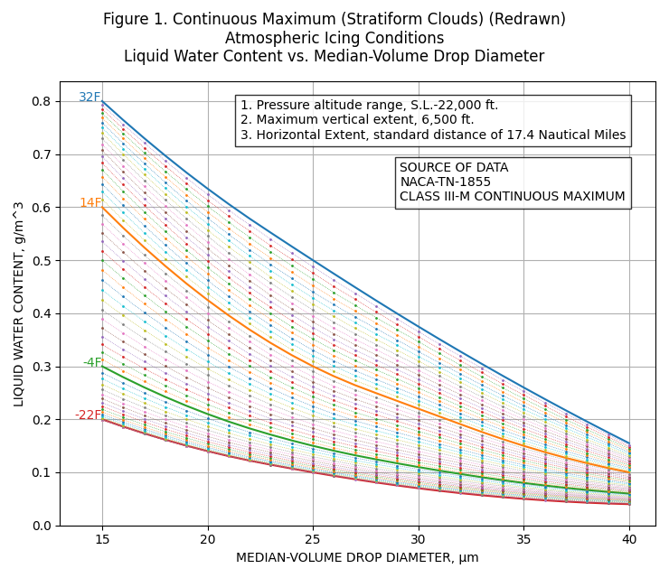  

## Summary  

The late Dr. Richard Jeck of the FAA [^1] in his [unpublished] "Icing Information Notes" advocated "New Replacement Figures for 14 CFR-25,29, Appendix C". 

The "Icing Information Note" was essentially a 
draft of what became Appendix F of DOT/FAA/AR-07/4 [^1].  

Here, I will note a missed opportunity to make them available, 
and offer other "modernized" means of producing figures as an alternative.  


## Appendix F  

As it is brief, Appendix F is reproduced in large part below:  

>APPENDIX F—COMPUTERIZED VERSIONS OF 14 CFR PARTS 25 AND 29 APPENDIX C
>
>Title 14 Code of Federal Regulations (CFR) Parts 25 and 29 Appendix C (herein referred to as
Appendix C) contains six graphs of design variables that are used by designers of in-flight ice
protection systems and by data analysts for icing test flights, icing wind tunnel tests, and by
computer modelers of ice shapes on aircraft surfaces. The six figures have been published in the
CFR since the early 1960s. Unfortunately, the published versions of some figures are a poor,
muddy quality shown in figures 1-6. This makes for an undesirable appearance when these
graphs are copied into technical reports or projected onto a screen during briefings, for example.
The graphical grid spacing is also awkward because it is not evenly matched to the numerical
scales marked along the axes. Finally, these fixed (paper) versions of the graphs are not
convertible to other useful versions that have been previously demonstrated [F-1].  
>
>These graphs would be useful beyond the original vision of the suppliers if the graphs were in
electronic form so they could be customized and/or imported directly into computer programs.  
>
>This can be easily done by tabulating the coordinates of the curves in figures 1-6 in a
computerized spreadsheet as in tables F-1 and F-2. Then, the charting capabilities of the
spreadsheet software can be used to produce clean, properly scaled reproductions of the original
graphs at will. Figures F-1 through F-6 show the results.   
> 
>The advantages of spreadsheet-based graphs in this example are that they:  
> 
>• Modernize Appendix C  
• Have a cleaner, sharper appearance than the often muddy look of the printed versions
currently in the CFR  
• Have a more convenient grid spacing on the vertical and horizontal axes than the printed
versions in the CFR  
• Are easier to size and insert electronically into word processor or other computerized
documents  
• Can be adjusted or customized to suit the needs of various applications  
• Can be converted to other useful variables or scales [F-1]  
> 
>In summary, common computer technology can modernize supplementary material that is
currently available only in fixed, old-fashioned printed form in the CFR. When the CFR is made
available on compact disc or other computer-compatible media, then working files, such as these
spreadsheet versions of graphs, can be included and supplied directly to the user.  
>
>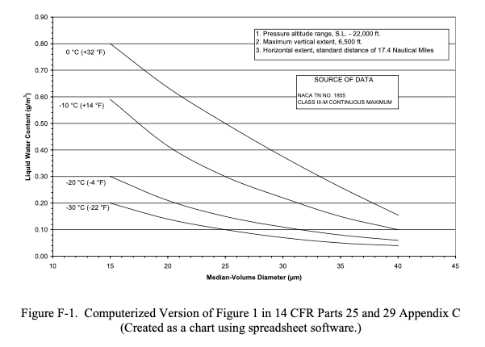  

## A Missed Opportunity  

Unfortunately, the part of:  

> working files, such as these
spreadsheet versions of graphs, can be included and supplied directly to the user

did not to my knowledge come to pass.  

At the time (circa 2007), the "Electronic Aircraft Icing Handbook" EAIH [^2] existed, 
and would seem to be a natural place for the spreadsheet files. 
However, the EAIH is no longer on a FAA web-site, and the archived version, while it contains other spreadsheets, 
does not have the files described by Jeck.  

As of this writing, the current figures [^2] are the same ones as from 60+ years ago. 
Here is the current Figure 1, which appears a little clearer than the ones I remember from circa 2005:  
 
  
_Public Domain image._    

The image is a transparent PNG, which is convenient for layering on other data for direct comparison 
(although it still has the "old-fashioned" grid).  

The European Union Aviation Safety Agency (EASA) [^3] has "digitized" figures. 
That version of Appendix C Figure 1 is shown below:  

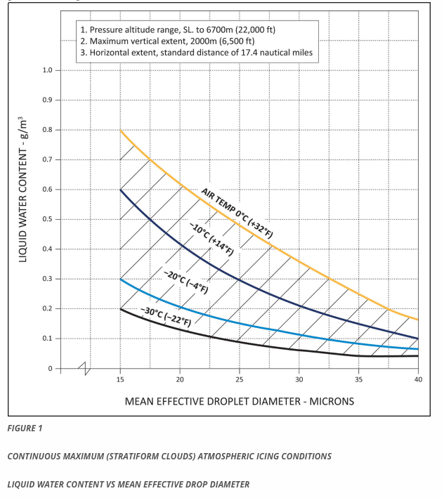  
_From [easa.europa.eu](https://www.easa.europa.eu/en/document-library/easy-access-rules/online-publications/easy-access-rules-large-aeroplanes-cs-25?page=67#)_    

AC 20-73A (published in 2016) uses a "modernized" version:  
  

## Another advantage of digitization: interpolation    

Besides a sharper image, another advantage of digitized figures is that the 
numerical data is stored, and functions can be written to interpolate within the figures. 
The advisory material is silent on how one should interpolate, so that is a matter of implementation. 
I have seen several implementations, some better than others.  

As computers require precise input to produce reliable output, 
this gives us a chance to note minor quirks and small errors in the figures, 
and how to deal with them.  

### Figure 1  

For continuous maximum icing conditions, 
FAA AC 20-73A [^4] defines temperature and LWC values at three MVD values 
(the prior AC 20-73 also had the table):  

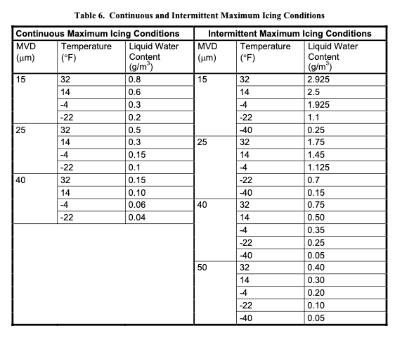  
_Public Domain image._    

The source data NACA-TN-1855 [^5] is frankly short on details of how the values were selected. 
We can see an implied interpolation when it is compared to a "French" curve 
(a 1960s era Stewart 82-14 in this case, although I am sure that other models could provide a better match).  

  

The method of interpolating within values is not defined. 
I have seen many people "re-invent the wheel" many times, with slightly different results.  

If we use quadratic interpolation between defined MVD values, 
the shape of MVD curves for a given temperature differ from Figure 1.  

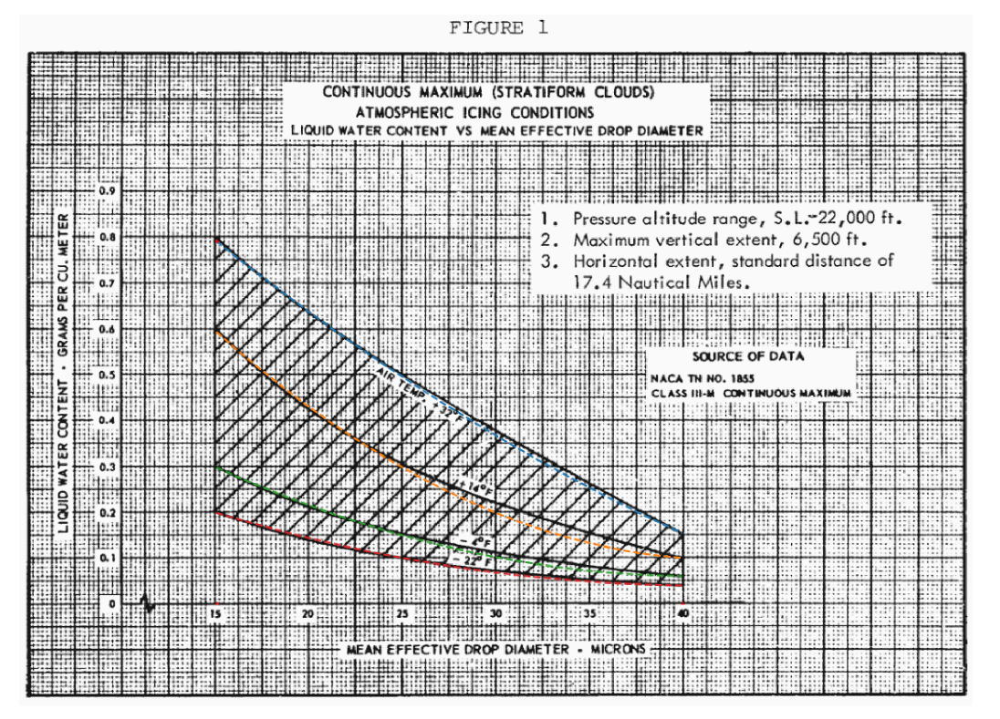  

if we add points read from Figure 1 at intermediate MVD values (20, 30, 35), 
the curves can be well-reproduced:  

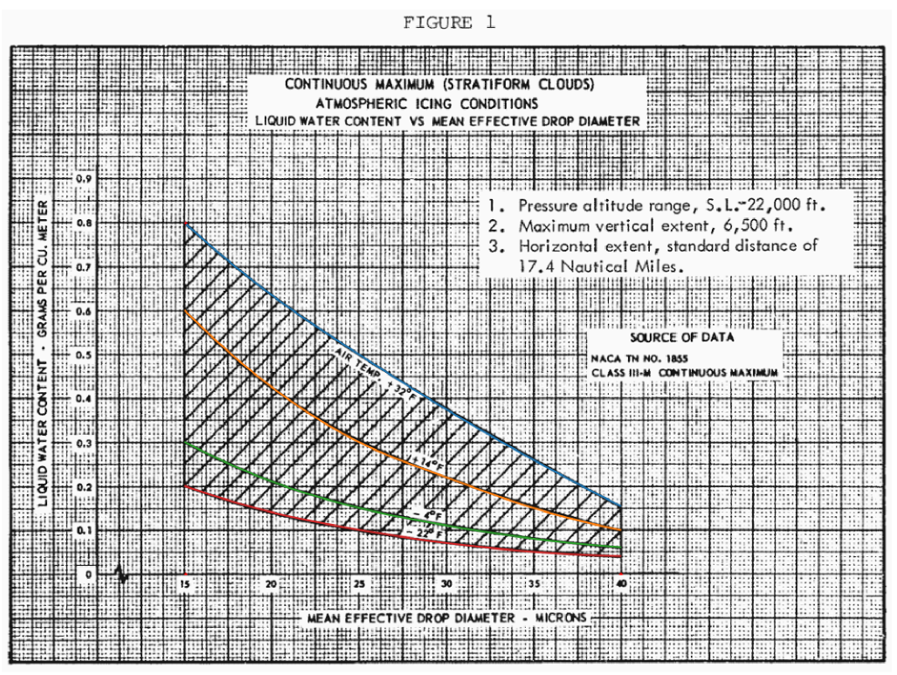  

The redrawn version:  

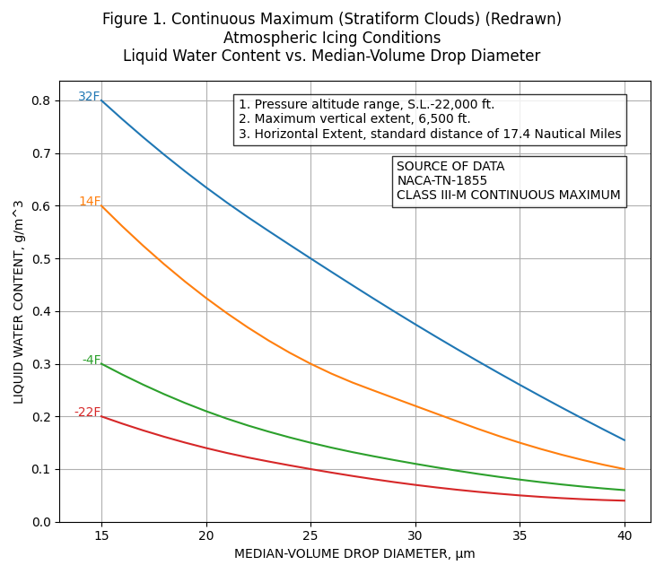  

If we use interpolation between the temperature lines, 
any value can be readily interpolated within the defined temperature and MVD values. 
We can also create a rearranged version of Figure 1.  

The result is sensitive to what interpolation is used between temperature lines. 
If linear interpolation is used, then the calculated LWC trends have discontinuous slopes. 
If cubic interpolation is used, the LWC values are anomalously low near 18 F. 
Quadratic interpolation yields the most believable interpolation in my opinion.  

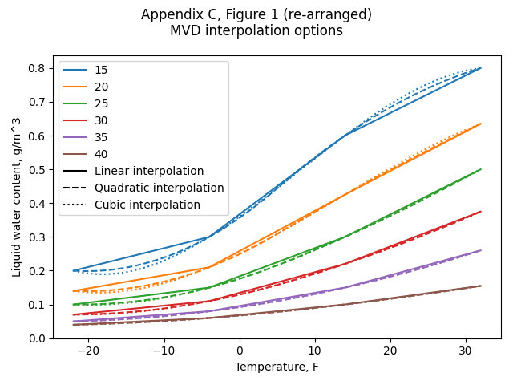  

Selecting quadratic interpolation, we have:  

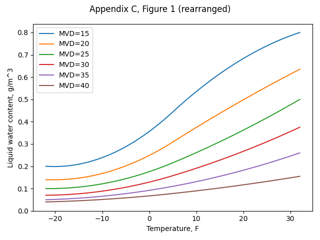

We can now also add lines at 1F temperature and 1 μm MVD increments to Figure 1:  

  

Beauty is in the eye of the beholder. 
If one does not like this appearance, the Matplotlib [^6] software used to produce this plot offers many 
options to reformat it. 

### Figure 2  

Figure 2 is straight-forward to implement, as the corners are well-defined.  

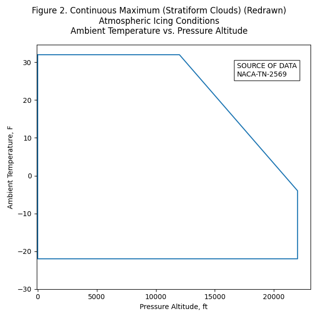  

Uses include determining if a condition is within Appendix C, 
and finding conditions along the altitude-temperature boundary.  

### Figure 3   


Jeck's "computerized" version is very similar, although there is a difference. 
Jeck's F-3 stops a 300 nmi, while Figure 3 extends to 310 nmi

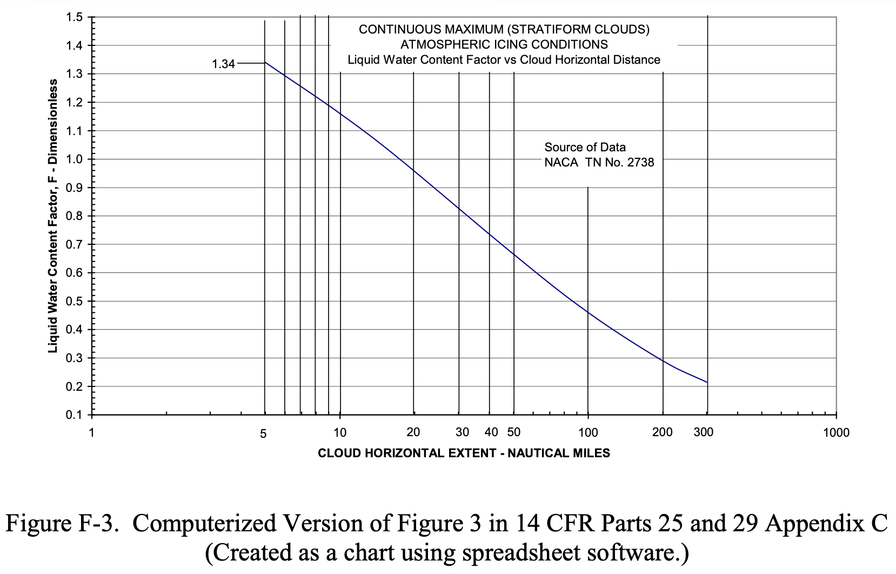  

I have no explanation, except perhaps he somehow compensated for:  
>The graphical grid spacing is also awkward because it is not evenly matched to the numerical
scales marked along the axes.

If you want to replot Figure 3 as close as I can discern it
(without compensation for 'not evenly" spaced grid lines), 
here is an implementation using 6 points, and quadratic interpolation:  

```text
    nmi, F
    5,    1.34   # end point
    10,   1.165  # intermediate point read from Figure 3
    17.4, 1.00   # intermediate point read from Figure 3
    50,   0.665  # intermediate point read from Figure 3
    170,  0.325  # intermediate point read from Figure 3
    310,  0.2    # end point
```

The redrawn figure:  

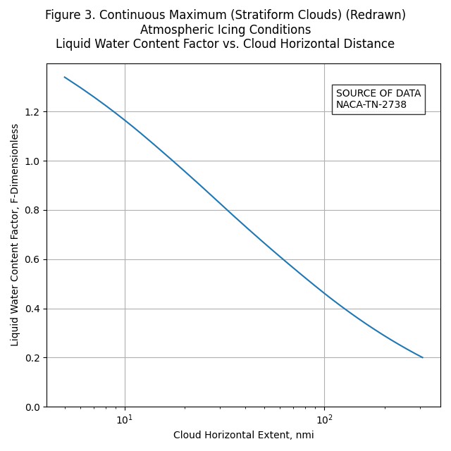  

See also Jeck's "APPENDIX C—THE ORIGIN AND INTERPRETATION OF HORIZONTAL EXTENT
SPECIFICATIONS AND THE LWC FACTOR CURVES IN 14 CFR PARTS 25 AND 29
APPENDIX C" in DOT/FAA/30-7 for more information. 
It does not address specifically how to interpolate within it, but it has much useful, detailed information.  

The final paragraph is included here:  

>C.5 APPLICATION OF THE LWC FACTOR CURVES.  
The original purpose of these curves, as explained by Lewis, et al. [C-4, C-6, and C-3], was to
estimate the maximum probable LWC to be expected as an average during flight for various
distances through continuous icing conditions. The brief instructions accompanying the set of
graphs in Appendix C are noncommittal in describing how these curves are to be applied. As a
result, users have interpreted the instructions variously and have proposed other ways of
employing the LWC adjustment factor curves. These mostly involve attempts to justify
substituting longer exposures to compensate for smaller than desired LWCs during test flights.
This practice is not a correct use of the LWC factor, however. The factor actually represents
only the maximum probable LWC to be expected as an average versus the averaging distance in
 
### Intermittent Maximum Icing  

The reader may implement functions for Appendix C, Figure 4, 5, and 6 using similar methods to those described above.  

Note that the X-axis of Figure 5 appears to be mislabeled. 
The highest altitude label on the axis should be 32000 ft, not 30000 ft. (Jeck corrected it as so in some of his works). 
If it truly were 30000 ft, some anomalous kink in the right-hand line would be required when plotted with a regular axis.  

  
_Public Domain image._    

The EASA version of Figure 5 (not shown) has a different axis scale, and avoids the labeling problem.  

## Illustrations of interpolation   

We now have functions to interpolate within the Appendix C figures 1, 2, and 3.

Selecting an altitude of 16000 ft, 
the maximum temperature from Figure 2 can be found as 17.6 F:  

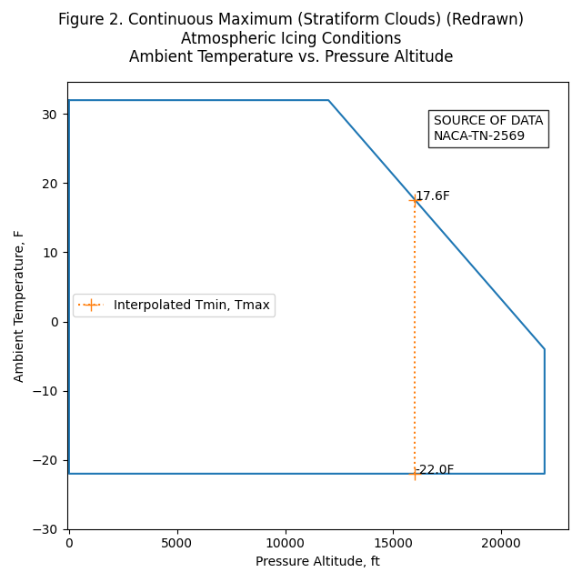  

If we select MVD=18, the LWC value can be found from Figure 1:  

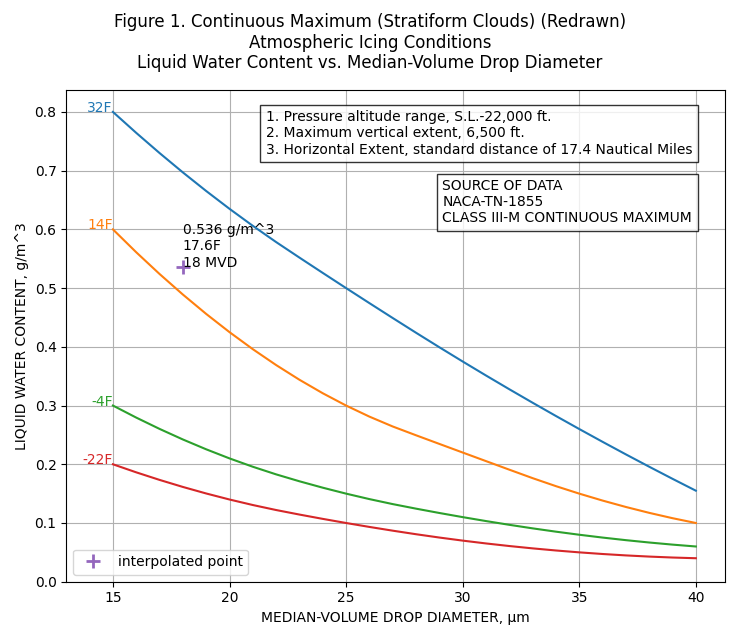  

If one selects a horizontal distance of 120 nmi, the Liquid Water Content Factor F 
can be found from Figure 3:  

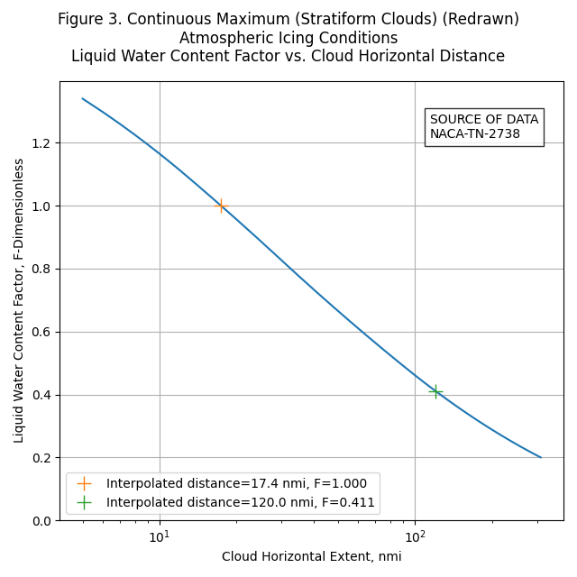  

## A mystery about Figure 1 values  

Jeck provided a table combining Figure 1 and Figure 3 LWC values as a function of MVD, temperature, and distance in DOT/FAA/AR-00/30 [^6].  

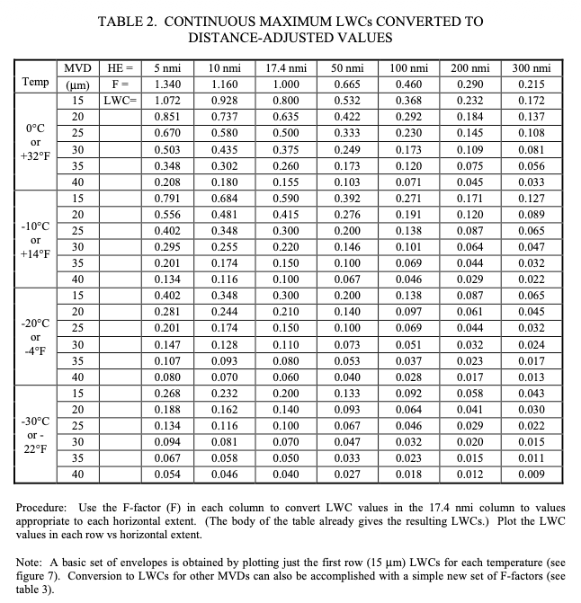  
_Public Domain image._    

The corresponding LWC values for 17.4 nmi match the AC 20-73A Table 6 values, except for 14F, 15 MVD. 
Table 2 lists 0.59, while AC 20-73A Table 6 list 0.60. 
I thought it might just a typo, but Jeck's Figure F-1 also shows the value as 0.59. 
This indicates that it was not a single typo in a single publication. 
Note that the ratio 0.59/0.6=0.983 is close the F value I read from Figure 3 for 17.4 nmi (0.985), 
perhaps indicating the LWC value was "corrected".
However, none of the other LWC values at 17.4 nmi had the adjustment.  

The 0.59 value appears to have not propagated to further publications, 
as the later AC 20-73A Figure E-1 shows the value as 0.60.
 
Jeck was very familiar with AC 20-73A (and the prior AC 20-73) and NACA-TN-1855 and cites them many times in his works. 
I am surprised that this small error exists as either a typo, or an unexplained adjustment.  

## What about spreadsheets?  
 
I find spreadsheets useful for displaying column data, 
and occasional simple arithmetic such as summing a column.  

In the past I have written complex spreadsheet routines to implement interpolations like those described. 
In general, I have found them to not be worth it. 
If you wish to implement them, then by all means go ahead.  

I have found that detailed analysis is best done in Python, 
driven by input data such as CSV and jason tables, 
or occasionally an SQL-type database where warranted. 
The most transportable output has proven to be CSV and jason tables, 
with PNG figures that can be conveniently included in text documents.  

If you want to just plot the line data for the figures in a spreadsheet, 
csv files are provided here.  

- For Figure 1, the MVD data is in 1 μm increments: [appendix_c_figure_1.csv](images/Jeck/appendix_c_figure_1.csv)  

- An example spreadsheet plot made in LibreOffice in the OpenDocument Format [^7] for Figure 1: [appendix_c_figure_1.ods](images/Jeck/appendix_c_figure_1.ods)  

- For Figure 2, the corner points are provided: [appendix_c_figure_2.csv](images/Jeck/appendix_c_figure_2.csv)  
 
- For Figure 3, the distance data is in 1 nmi increments: [appendix_c_figure_3.csv](images/Jeck/appendix_c_figure_3.csv)  

## Conclusions  

I hope that readers find the digitized figures useful, though few may find beauty in them. 
You can find the Python code that includes the interpolation functions at [github](). 

As Dr. Jeck wrote:  

> The purpose is solely to improve the appearance and utility of the Appendix C figure.  

This is the kind of thing that I would like to see in something like the Electronic Icing Handbook [^8] eventually.  

## Notes:  

[^1]: Dr. Jeck's obituary: [loudounfuneralchapel.com](https://www.loudounfuneralchapel.com/obituaries/richard-jeck/obituary)  
[^2]: CFR 14 Part 25 Appendix C [ecfr.gov](https://www.ecfr.gov/current/title-14/chapter-I/subchapter-C/part-25/appendix-Appendix%20C%20to%20Part%2025)  
[^3]: Appendix C to CS-25 [easa.europa.eu](https://www.easa.europa.eu/en/document-library/easy-access-rules/online-publications/easy-access-rules-large-aeroplanes-cs-25?page=67#)  
[^4]: FAA Advisory Circular AC No. 20-73: Aircraft Ice Protection. April 21, 1971. [faa.gov](https://www.faa.gov/documentLibrary/media/Advisory_Circular/AC_2--73.pdf)  
[^5]: [matplotlib.org](https://matplotlib.org)  
[^6]: Jones, Alun R., and Lewis, William: Recommended Values of Meteorological Factors to be Considered in the Design of Aircraft Ice-Prevention Equipment. NACA-TN-1855, 1949. [ntrs.nasa.gov](https://ntrs.nasa.gov/citations/19930082528)   
[^7]: Jeck, Richard K., Icing Design Envelopes (14 CFR Parts 25 and 29, Appendix C) Converted to a Distance-Based Format, DOT/FAA/AR-00/30, April, 2002. [ntrl.ntis.gov](https://ntrl.ntis.gov/NTRL/dashboard/searchResults/titleDetail/PB2002107034.xhtml)  
[^8]: OpenDocument [en.wikipedia.org](https://en.wikipedia.org/wiki/OpenDocument)   
[^9]: "Electronic Aircraft Icing Handbook"  
"This web page contains basic information on aircraft icing. Information placed on this page can be used to update or supplement information in the existing Aircraft Icing Handbook (AIHB). Update material can be printed out and inserted in the AIHB. The files on this page are referenced to those sections of the AIHB which they update or supplement, but are self-contained, not requiring consultation of the AIHB for their use. When appropriate the text information on this site is accompanied by spreadsheet or other files intended to enhance the value of the information to users."  
This includes format updates for DOT/FAA/CT-88/8-2 "Chapter III Ice Protection Methods", 
as well as files for analyzing water drop spectrum data, and a database of icing references circa 2007.  
This is mentioned in "Aircraft Ice Protection" AC 20-73A [faa.gov](https://www.faa.gov/documentLibrary/media/Advisory_Circular/AC_20-73A.pdf), 
but I could not find it on a current FAA website. 
You can view the version from 2007 at 
[web.archive.org](https://web.archive.org/web/20070813181929/http://aar400.tc.faa.gov/Programs/FlightSafety/icing/eaihbk.htm)  
