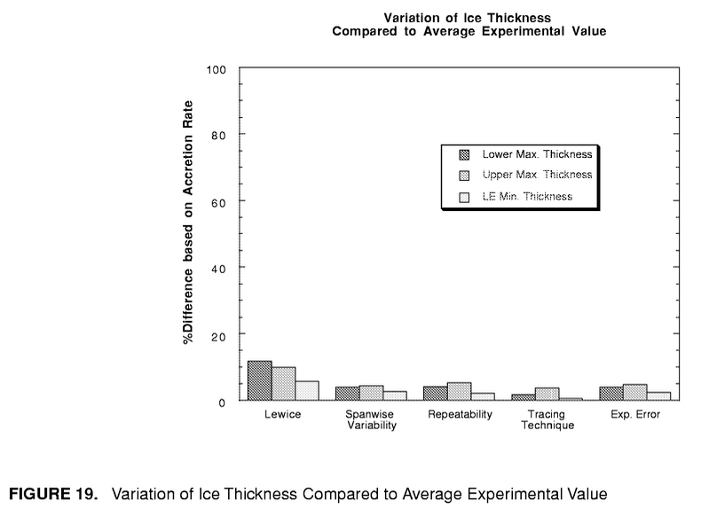
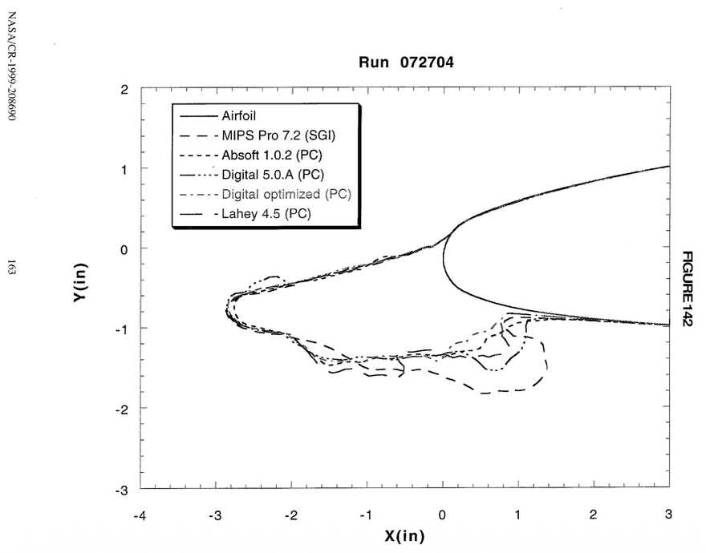
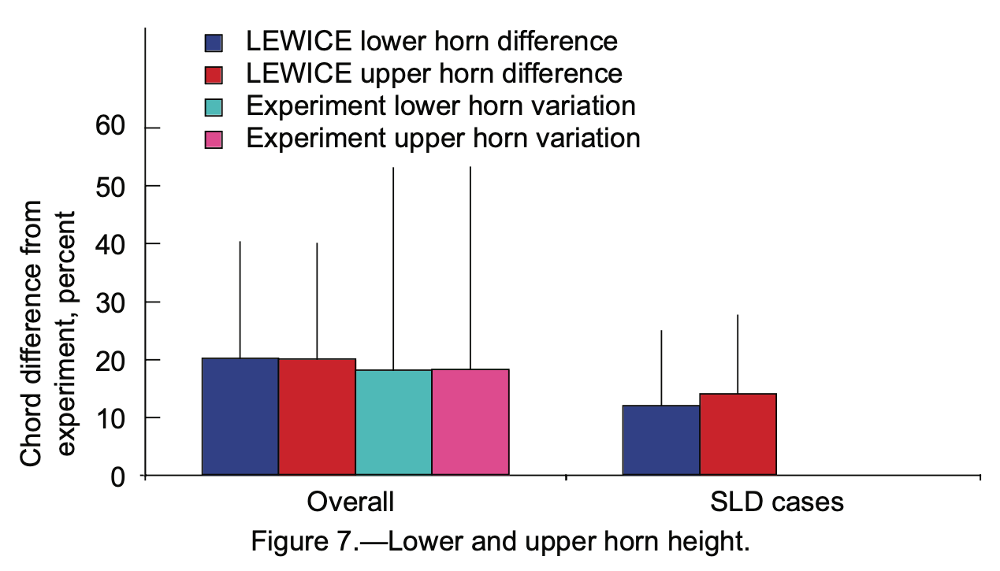

Title: Overall comparison assessments between experiment and LEWICE   
status: draft  
tags: LEWICE, ice shapes, NASA

<p style="font-size:50px;color:red">DRAFT</p>

### _"It is possible for any (or all!) ... parameters to be incorrectly output."_  

  
_<div style="text-align: center;">A case with identified horn locations that are debatable.</div>_

## Published assessments  

The overall comparison of LEWICE [^1] analysis to experimental data to has been published twice.  

The first was in 1999 [^2], and included 800 experiment cases. 
The second was in 2008 [^3], and had more than 3000 experimental cases. 
These are the data that are included in the IceVal database [^4].  

## The 1999 Assessment  

The assessment published in 1999 [^2] looked at the differences in ice shape produced 
in experiments vs LEWICE analysis.
It also considered differences caused by 
ice tracing techniques between individuals, 
variations along the span of the test article, 
test repeatability, 
and experimental error. 
These latter factor were relatively small.  

  
_Public Domain image from [NASA/CR-208690](https://ntrs.nasa.gov/citations/19990021235)._  

Curiously, the relative difference ("%Difference based on Accretion Rate") 
for upper horn height for experiment vs LEWICE 
is plotted as about 10%, which is about half that found in the 2008 report [^3] (20%, discussed below). 
The 1999 report had about 800 experimental cases, while the 2008 report has over 3000, 
and this may be a factor.  

It was also noted that LEWICE compiled and run on difference platforms can have different results. 
The differences were not quantified. 
The differences were not noted as unacceptable.  

  
_Public Domain image from [NASA/CR-208690](https://ntrs.nasa.gov/citations/19990021235)._  

## The 2008 Assessment  

For brevity, we will look at only two of the assessment comparison values: 
the upper surface maximum ice height, and its location, as defined in Figure 18 ("h_upper").  

  
_Public Domain image from [NACA/CR-2008-215174](https://ntrs.nasa.gov/citations/20080041518)._  

The validation report [^3] notes that a non-dimensional height ratio was used.  

>Where the ice shape
does have a glaze ice horn, the max. thickness does
give the horn thickness. In order to compare different
conditions with different chord lengths and accretion
conditions, the individual ice thicknesses were non-dimensionalized by the maximum accumulation thickness as given in Equation 3.

  

```text
maximum accumulation thickness = t_max = LWC Airspeed Time / ice_density  (with unit conversions)

relative height difference = (thick_experiment - thick_lewice) / t_max

```

Here, we will use the overall +/- 0.20 relative difference values from Figure 7 as 
a point of comparison. 
(Despite the label difference "Chord difference from experiment", 
one of the authors assured me that it is indeed the relative difference based on the accumulation parameter. 
Also, the companion report NASA CR-1998-208687 has a similar figure with the "%Difference based on Accretion Rate" label.).  

  
_Public Domain image from [NACA/CR-2008-215174](https://ntrs.nasa.gov/citations/20080041518)._  

This is may not be an applicable threshold for all use-cases. 
However, I have not found another documented threshold candidate value.  

## Overall assessment values from the database  

We will attempt to reproduce the "LEWICE upper horn difference" and "LEWICE upper horn angle difference" 
values from Figures 7 and 8.  

The database does not list the overall comparison values, nor the values for individual cases. 
However, the horn thickness and accumulation parameter values are reported, 
so the assessment parameters were calculated herein from those values.  

All cases where an experimental case had LEWICE case with matching conditions were used.
The reported upper horn thickness values were used. 
The documentation does not describe how some ambiguous data were handled, 
such as not identifying any upper horn. 
In cases where no upper horn was reported, zero was used for the horn thickness. 

The sorted values show large variations at the extremes, 
particularly at the high end. 
The average value is greater than zero, 
indicating that the test values are larger on average than the LEWICE values by this measurement. 
The variance, taken as the average of the absolute values of the relative differences, 
is larger than that reported in Figure 7 (0.25 vs. 0.20, or 25% vs 20%).  


Below is an alternative view of the data. 
Here, data is sorted into unique test conditions. 
Many of the unique conditions have only one test case, 
but several conditions have several cases. 
These may be either repeated runs, or measurements at different span locations
(noted succinctly as "repeats").   

  

This type of chart is informative, but it is a little busy, 
so the first form above will be used from here on.  

## The effect of undetected ice horns  

If when no upper horn reported, 
instead of assign zero for the ice height, 
the case is filtered out, the comparison values are smaller, 
but several hundred cases are filtered out. 
The average of the absolute value of the differences (about 0.18) is similar 
to the point of comparison value from Figure 8.  

  

The average of the absolute value of the differences (about 0.18) is similar 
to the point of comparison value from Figure 8, but the offset (average of signed values, 0.083)
was apparently not considered for Figure 8. 
So, it is not clear that these are comparable values.  

Omitting the cases with undetected horns leaves several hundred cases unevaluated and unexplained. 
I consider missing a horn to be a significant deficiency, 
so subsequent analyses will use assigning zero for missing upper horn heights, 
so that the effect of missing horns is evident.  

The analysis was repeated with filtered cases, 
removing some of the suspect cases as noted in [Challenges Using the IceVal Database]({filename}iceval_challenges.md). 
While a few extreme points were removed, the overall assessment did not change by much.  

  
 
The cases with large differences were examined, 
and it was noted that many of them were caused by either no upper horn detected, 
or by an anomalous selection of the horn, when by engineering judgment, 
there were obviously better choices available. 
Detailed examples will be shown in an upcoming post.  

### Horn position comparison  

Below, we compare the upper surface horn position as measured by the angles defined in Figure 18.  

Horn angles were compared between experiment and analysis in Figure 8. 
An average difference for the upper horn angle was about +/- 26 degrees. 
This will be used as a point of comparison for upper horn angle differences.  

  
_Public Domain image from [NACA/CR-2008-215174](https://ntrs.nasa.gov/citations/20080041518)._  

This is may not be an applicable threshold for all use-cases. 
However, I have not found another documented threshold candidate value.  
  
The calculated differences are shown below.  

  

The variance about the average values (33.8) 
is larger than the point of comparison (26) from Figure 8.  

##  Overall assessment values using THICK   

The LEWICE utility program THICK was run to obtain a second set of ice measurements 
to those contained in the database. 
The inputs to THICK are the airfoil geometry, 
and ice shape points (taken from the IceVal database).

Data comparable to the IceVal database table ThickUtilityData can be found in the output of THICK. 
The THICK values below are from the echo.dat files results of me running THICK on my machine. 
The values are often similar to the database, but there are some notable differences.

As explained in the LEWICE manual, THICK uses a simple, geometric evaluation, 
and the values may not match those that are selected by engineering judgment:  

>The astute user will notice that 
several of the quantitative values generated using this process [running THICK] do not agree with the values given
in the LEWICE validation report spreadsheet “matrix.xls”. This demonstrates that the automated process cannot (yet) 
be substituted for good engineering judgment. The following section will describe some of the problems 
and potential solutions.  

I take the above to mean that the values in the IceVal database are the same those in the 
no-longer available "matrix.xls" file, and that some of those values have been modified by human review 
and judgment from those directly output by THICK.  

>The utility program THICK performs a simplistic geometric comparison between two data
files and outputs the results. As such, it is prone to errors based upon a lack of icing knowledge. 
It is possible for any (or all!) of the eight parameters to be incorrectly output. 
Even so, THICK has
proven to be a useful tool for reducing the amount of time needed to quantify ice shape parameters. 
There are two basic problems which occur repeatedly when analyzing output from THICK:
misalignment of the geometries and misidentification of the horns.  

As discussed in "Challenges using the IceVal Database", there is no fix for the misaligned tracings 
(other than filtering out the cases with ice inside the airfoil, as was done with the filtered set herein).  

The values from the THICK output summary file "echo.dat" were used herein. 
When THICK was run with the ice shapes from the database, 
the measurement values differed from the database values. 
More than half of the values differed from the database, 
but often by trivial amounts. 
However, several cases were notably different. 

The overall comparisons are similar, 
with the THICK characterization having a slightly larger variance. 

  

## Comparisons of maximum ice height   

As the "misidentification of the horns" is noted above as a challenge, 
the identification part was removed for an analysis were only the maximum reported thickness 
was considered, without regard to the location.  

  
 
For both the database and the THICK values, 
the average and variance values are reduced compared those in the prior graph. 
To me, this indicates that improving the identification of horn locations 
for the ice measurements characterizations 
could result in more accurate comparison results.  

## Related  

This post is part of the ["6000 Ice Shapes - the IceVal DatAssistant"]({filename}iceval.md) thread.  

## Notes   

[^1]: 
William B. Wright, User's Manual for LEWICE Version 3.2 
[NASA/CR—2008-214255](https://ntrs.nasa.gov/citations/20080048307)  
The software is available at [software.nasa.gov](https://software.nasa.gov/software/LEW-18573-1)  

[^2]: 
William B. Wright and Adam Rutkowski, "A summary of validation results for LEWICE 2.0." 1999. [NASA/CR-208690](https://ntrs.nasa.gov/citations/19990021235).  
See also the companion [NASA/CR-1998-208687](https://ntrs.nasa.gov/citations/19990017993).  

[^3]: 
Wright, William, Mark Potapczuk, and Laurie Levinson. "Comparison of LEWICE and GlennICE in the SLD Regime." 46th AIAA aerospace sciences meeting and exhibit. 2008. [NACA/CR-2008-215174](https://ntrs.nasa.gov/citations/20080041518)  

[^4]: 
Levinson, Laurie, and William Wright. "IceVal DatAssistant-An Interactive, Automated Icing Data Management System." 46th AIAA Aerospace Sciences Meeting and Exhibit. 2008. [NASA Report Number: E-16236](https://ntrs.nasa.gov/citations/20070031804)   
The software is available at [software.nasa.gov](https://software.nasa.gov/software/LEW-18343-1)  
