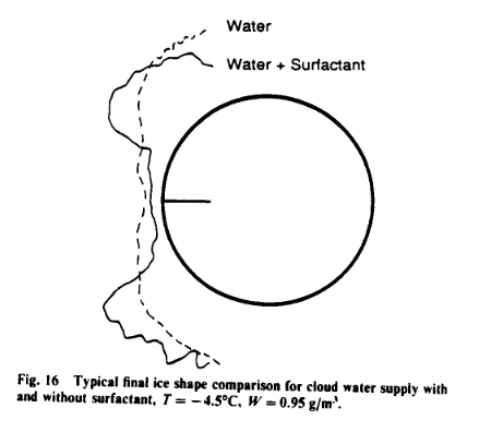

Title: Bilanin Pi Terms and the Weber Number  
Date: 2022-08-07 12:00  
category: icing tunnels  
tags: icing tunnel  

### _"An unfortunate fact is that if proposed additional scaling parameters prove to be what is required to conduct improved subscale tests, icing wind tunnel subscale tests are likely to be even more restrictive."_  

# "Proposed Modifications to Ice Accretion/Icing Scaling Theory" [^1]  

## Summary  
Water surface tension is identified as a factor in ice shapes and test similarity.  

## Key points  
1. 18 dimensionless Pi-terms were identified.  
2. "the π method has failed to provide a scaling methodology which can be used to test subscale aerodynamic components"  
3. "however, does not preclude seeking approximate scaling methodologies"   
4. Several later studies investigate the role of water surface tension and the Weber number.  

## Abstract

>The difficulty of conducting full-scale icing tests has long been appreciated. Testing in an icing wind tunnel has
been undertaken for decades. 
While aircraft size and speed have increased, tunnel facilities have not,
thus making subscale geometric tests a necessity. 
Scaling laws governing these tests are almost exclusively based on analysis
performed over 30 years ago and have not been rigorously validated. 
The following work reviews past scaling analyses 
and suggests revision to these analyses based on recent experimental observation. 
It is also
suggested, based on the analysis contained herein, that current ice accretion predictive technologies,
such as LEWICE, when utilized in the glaze ice accretion regime, 
may need upgrading to more accurately estimate the rate of ice buildup
on aerodynamic surfaces.

## Discussion  

This publication identifies water surface tension as a potentially important 
factor in the formation of ice. 
The Weber number relates water surface tension to other forces, 
and can describe the flow of water on a surface or the tendency 
for droplets to breakup. 

### Buckingham-π Analysis of Icing Scaling

"Straightforward application of the Buckingham-π theory" found 18 dimensionless parameters
(although vapor pressure was noted as a term not included).

For brevity, I will not enumerate them all here. 
Some terms are familiar, such a Mach and Reynolds numbers. 
You can see all 18 pi terms in the publication, or in Dillon [^2].

Bilanin summarizes:

>[Inconsistencies arise] in an attempt to keep the Mach,
Reynolds and Weber numbers constant between [scaled]
tests. Obviously, this is not possible and not 
surprisingly __the π method has failed to provide a 
scaling methodology which can be used to test 
subscale aerodynamic components__.  

[Emphasis added.]

NASA-TM-106461 [^3] discusses this:

>In an attempt to analyze the icing scaling problem rigorously, 
Bilanin identified 18 dimensionless group which affect the normalized ice thickness. 
A consideration of three of these similarity parameters, the Mach
number, the Reynolds number, and the Weber number,
illustrates the fundamental difficulty of icing scaling analysis.  
>>M^2 = V^2 / (Cp,a Ta) &nbsp;&nbsp;&nbsp;&nbsp; (1)  
>>Re = V chord ρa / μa &nbsp;&nbsp;&nbsp;&nbsp; (2)  
>>We = V^2 chord ρa / σw/a &nbsp;&nbsp;&nbsp;&nbsp; (3)   

[Note there is a typo in the original equation (1), corrected herein.]

>Because the temperatures of interest to icing extend over 
a very narrow range on the absolute temperature scale, 
Ta, Cp,a, μa and σw/a are effectively constant. Thus, to
match the Mach number between scale and reference
cases requires
>>Vs = Vr &nbsp;&nbsp;&nbsp;&nbsp; (4)  

>The altitudes at which icing occurs are generally low 
enough that the test facility total pressures are close to flight
icing-encounter total pressures. In this case, scale and reference
ρa are nearly equal. Then to match Reynolds number requires
>>Vs = chord_r / chord_s  Vr   &nbsp;&nbsp;&nbsp;&nbsp; (5)  

>and to match the Weber number requires
>>Vs = chord_r^0.5 / chord_s^0.5  Vr   &nbsp;&nbsp;&nbsp;&nbsp; (6)  

>Clearly, it is impossible to satisfy similarity of Mach, Reynolds,
and Weber numbers simultaneously, 
except for the special case in which both scale size and velocity 
equal their respective reference values. The Mach number 
can be neglected because at the relatively low speeds of interest to icing, 
compressibility effects are small.
Even with this simplification, however, equations (5) 
and (6) are inconsistent, and each requires scale velocities
greater than the reference when the scale size is less than the 
reference. Because test velocities greater than typical flight are not
generally achievable in icing test facilities,
equations (5) and (6) impose impractical restrictions. 

Bilanin then notes: 

>This, however, does not preclude seeking 
approximate scaling methodologies which is the 
subject of the discussion that follows.  

### Past scaling laws

There is a review of scaling methods, similar to that in [AEDC-TR-85-30]({filename}aedc_tr_87_23.md) [^4],
defining Ac and n in slightly different forms:  

>The freezing fraction n is defined as the mass freezing/mass water incoming. 
Note that Eq. (4) is nondimensional, __exact__

>>d(δi/C) / d(τ U∞/C) = LWC β n / ρi &nbsp;&nbsp;&nbsp;&nbsp; (4)

>and __scaled ice accretion exactly requires__ that  

>>LWC β / ρi τ U∞ / C = Ac n = constant

>or that Ac, the accumulation parameter, and n
each be held constant which is what is normally attempted. 

[Emphasis in the original]

### Brief evaluation of the data  

>The freezing fraction has been computed by several investigators using a
model proposed by Messinger in 1951 (Ref. 11) [^5]. If
evaporation is neglected in this model...  

[Eq. 5 not included herein]

>[this results in] the functional form of freezing fraction used in the SIMICE code 
(Ref. 12). 

Later it is noted that the freezing fractions determined by SIMICE are much lower than those
determined experimentally. 

>Obviously, something is very wrong here, since at 
the lower freezing fractions differs from the measured value 
by a factor of 2.3. The problem is that the 
freezing fraction n in Equ. 5 is not being 
computed sufficiently accurately using the
Messinger formulation. 

In a later section Bilanin calculates the effects of a surface water film 
to see if that could explain the differences. 

However, later NASA/CR-2004-212875 [^6] would note:

>Bilanin performed a similar study using a limited set of
ice-shape data from Ruff. Bilanin found agreement of n_e 
[experimentally determined freezing fraction]
and n_a [analytically determined freezing fraction] 
at rime, but the two deviated significantly for
the lowest freezing fractions. He concluded that the
Messinger analysis for freezing fraction had serious deficiencies, 
probably because surface-water effects, particularly splashing, 
were not included in the heat balance.
However, Bilanin did not consider the possibility that his
results might be explained by experimental complications, 
such as possible problems with the facility LWC
calibration and the uncertainty in the leading-edge thickness 
for low freezing fractions.  
>Unlike Bilanin’s results, the experimentally-determined
freezing fractions for the Anderson and Tsao study in
figure 3.5.6 showed no systematic deviation from the
analytical values at low freezing fractions.

[Emphasis in the original]

### Film dynamics at a stagnation point

A "zeroth-order expansion" analysis in distance from the stagnation
point is performed, resulting in 

>At 200 ft/sec, the film thickness on a cylinder with 
2R = 1 inches is estimated to be 
δw(o) ~ 0.001 inches or about 25 μm which is 
nearly the diameter of the drop impacting the surface. 

>The above analysis, while admittedly
approximate, does confirm that a thin film is 
anticipated over the ice when conditions of low 
freezing fraction are anticipated. These films
may modify the freezing fraction as described by 
Messinger in a very direct way by providing
surface roughness which will augment the heat
transfer, as well as provide thermal resistance 
through which the latent heat of fusion must pass. 
Also, splash back from this layer cannot be
ruled out. It should be noted that the Weber 
number, based on dynamic air pressure for a layer 
of this thickness, is of the order of 102 which 
suggests that the stripping of this film by the 
airstream may also occur.  

> It is significant to note at this time that 
Olsen (Ref. 20) has photographed the microphysics
of accretion at a stagnation point, and had
confirmed the presence of liquid and run back at 
the stagnation region. This work, however, 
indicates that liquid beading is also observed 
indicating that the surface tension neglected in the
above analysis plays an important role. While
from the photographs it is difficult to estimate
the height of the droplets, it is clear that when
surface tension is acting, the film thickness
estimates are low and perhaps an effective droplet
height at least an order of magnitude larger can 
be argued. This liquid roughness, and upon 
freezing, ice roughness is known to greatly affect 
the local convection heat transfer rate (Ref. 21). 
Detailed observations of the stagnation 
region have recently been made by Hansman et al. 
(Ref. 22) and are discussed at this meeting. 

I am not sure that Ref 20, NASA-TM-83556 is the correct citation, 
as I did not find the photos there. 
There are relevant photos in Olsen [NASA-TM-87184] [^7], 
that were reproduced in Hansman [^8].

  
_Figure 2 from Hansman_

### Freezing fraction with film dynamics  

There is an interesting reformation of Messinger's freezing fraction equation:  

n = (dMi / dt) / (LWC U∞d2)
= (Cpw (T∞ - Tf) / hfs) - qam / (hfs LWC U∞d2) + Cpw (1-n) δwqam / (2 hfs kw d2)

>The first two terms are the freezing fraction as
described by Messinger. The last term which is 
proportional to the film thickness reduces the 
freezing fraction as a consequence of the presence 
of the film. 

After some development, the thermal resistance of the water layer is estimated:

>Therefore, at a liquid water content of 1 g/m3, and at cruise ...
[there is] a 1 to 10 mil film layer [and] the effective heat transfer is reduced
by 2 to 20%, respectively. 

### Film Beading  

The physics of the water film forming beads is examined, and equations developed. 

>U1 / U2 = C2 / C1  
σw/a2 / σw/a1 = C1 / C2  
γ1 = γ2 [contact angle]  

>The above icing tests can be undertaken using
the Ac and n scaling laws. The surface 
tension can be changed using a surface active agent that 
does not change the freezing temperature and the contact 
angle can be held constant by changing the airfoil material. 
It is finally noted that Hansman et al. (Ref. 22) have just 
recently completed tests which repeated two icing conditions
in a wind tunnel where the only difference in tests added a
surfactant to to upstream spray. 
Very significant differences in the accreted ice pattern were noted,
strongly supporing our conjecture that the icing tests must 
scale properly the microphysics of the liquid film 
dynamics and bead formation. 

  
_Figure 16 from Hansman_

## Conclusions

>It is argued that improve ice accretion scaling may require a better match in Reynolds 
Number and more accurate consideration of the physics of water film and droplet dynamics on the 
airfoil surface. Additional scaling parameters are proposed which require that the surface tension 
phenomenon be more accurately accounted for in wind tunnel tests. An unfortunate fact is that if 
proposed additional scaling parameters prove to be what is required to conduct improved subscale tests, 
icing wind tunnel subscale tests are likely to be even more restrictive.  

>Lastly, the phenomenon of droplet splash back cannot be ruled out and there is little justification
to go to the great care in computing the impact of droplets with a surface if significant
splash back occurs. It is strongly recommended that test be conducted in the near
future which can examine the question of splash back.  

Due to this publication and the prior works cited, 
numerous other investigations have explored the effects of surface tension 
and the importance to the water layer and water drops. 

This work is still continuing today, 
as several recent publications mention the Weber number [^9]. 

While Bilanin explicitly noted one form of the Weber number: 
>We = V^2 chord ρa / σw/a 

there are other forms that use other dimensions (such as drop size or water film thickness), 
other speed (water film speed rather than air speed), 
and other densities (water rather than air). 
Those will be explored in ongoing investigations. 

To very briefly summarize the work:

NASA/CR-2003-211822 [^10] conducted tests and concluded:

>Acceptable scale Re and We fall in the range of 60
to 160% of the respective reference values.

This leads to test conditions scaling that is not so "even more restrictive". 

but also:
>Evaluation of pressure effects on ice shape
suggested that even greater tolerances on Re may
be possible, and We_c is apparently not the right
form of Weber number to be used as a similarity
parameter.

(We_c is a different form of Weber number than what Bilanin used.)

Later still, NASA/CR-2004-212875 [^6], (which we will review in a future post)
evaluated numerous forms of the Weber number, 
and selected WeL (where L is a significant length proportional to chord,
and the density of water was used, rather than the air density used by Bilanin) 
as the scaling parameter to use for scaling 
for ice shape on unprotected surfaces, and recommend a +/-15% tolerance:  
>within the FAA Part 25 Appendix-C
envelope which includes drop sizes from 15 to 50 μm
median volume diameter (MVD). 

[We will get to large drop icing in [Large Drop Icing Conditions in Icing Wind Tunnels]({filename}large_drop_icing.md)].
  
## Citations

Bilanin cites 22 publications:

- Duhnham, R. E., Bezos, G. M., Gentry, C. L.: Two-Dimensional Wind Tunnel Tests of a Transport Type Airfoil in Water Spray. AIAA-85-0258, January, 1985.  
- Feo, A.: Rotating Arms Applied to Studies of Single Angular Drop Impacts. AIAA-87-0257, January, 1985.  
- Bragg, M. B., Gregorek, G. M., and Shaw, R. J.: "An Analytical Approach to Airfoil Icing." AIAA Paper No. 81-0403, Presented at the 19th Aerospace Sciences Meeting, January 12-15, 1981.  
- Papadakis, M., Elangovan, R. Freund, G. A. Jr., Breer, M. D.: Experimental Water Droplet Impingement Data on Two-Dimensional Airfoils, Axisymmetric Inlet and Boeing 737-300 Engine Inlet. AIAA-87-0097, January, 1987.  
- Guibert, A. G., Janssen, E., and Robbins, W. M.: Determination of Rate, Area, and Distribution of Impingement of Waterdrops on Various Airfoils from Trajectories Obtained on the Differential Analyzer. NACA-RM-A905, 1949. [digital.library.unt.edu](https://digital.library.unt.edu/ark:/67531/metadc53095/)  
- Ruff, G. A.: Development of an Analytical Ice Accretion Prediction Method (LEWICE). Sverdrup Technology, Inc., LeRC Group Progress Report, February, 1986.  
- MacAurthur, C. D.: Numerical Simulation of Airfoil Ice Accretion. AIAA-83-0112, January, 1983.  
- Lozowski, E. P., Stallabrass, J. R., and Hearty, P. F.: "The Icing of an Unheated Nonrotating Cylinder in Liquid-Water Droplet-Ice Crystal Clouds." National Research Council of Canada (NCR) Report LTR-LT-88, February 1979. [journals.ametsoc.org](https://journals.ametsoc.org/downloadpdf/view/journals/apme/22/12/1520-0450_1983_022_2053_tioaun_2_0_co_2.pdf)  
- Bilanin, A. J.: Scaling Laws for Testing Airfoils Under Heavy Rainfall. Journal of Aircraft, Vol. 24, No. 1, January, 1987.  
- Department of Transportation Federal Aviation Administration "Aircraft Ice Protection," Advisory Circular 20-73, April 21, 1971.
- Messinger, B. L.: Equilibrium Temperature of an Unheated Icing Surface as a Function of Airspeed. Preprint No. 342, Presented at I.A.S. Meeting, June 27-28, 1951.  
- Ruff, Gary A.: Analysis and Verification of the Icing Scaling Equations. AEDC-TR-85-30 Vol. II, March, 1986.   
- Hauger, H. H., and Englar, K. G.: Analysis of Model Testing in an Icing Wind Tunnel. Rep. No. SM 14993, Douglas Aircraft Co., Inc., May 14, 1954.   
- Sibley, P. J., and Smith, R. E., Jr.: Model Testing in an Icing Wind Tunnel. Rep. No. LR 10981, Lockheed Aircraft Cor., Oct. 14, 1955.  
- Dodson, E. O.: "Scale Model Analogy for Icing Tunnel Testing." Boeing Airplane Company, Transport Division, Document No. D66-7976, March 1962.  
- Jackson, E. T.: Development Study: The Use of Scale Models in an Icing Wind Tunnel to Determine Ice Catch on a Prototype Aircraft with Particular Reference to Concorde. British Aircraft Corporation (Operating) Ltd., Filton Division, SST/B75/RMMcK/242, July, 1967.  
- Armand, C. et. al.: "Techniques and Facilities Used at the Onera Modane Centre for Icing Tests." North Atlantic Treaty Organization Advisory Group for Aerospace Research and Development, AGARD-AF-127, November 1978.  
- Ruff, Gary A.: Analysis and Verification of the Icing Scaling Equations AEDC-TR-85-30 Vol. 1 (Revised) [apps.dtic.mil](https://apps.dtic.mil/sti/tr/pdf/ADA167976.pdf)  
- Schlichting, D.: Boundary-Layer Theory. McGraw-Hill Book Company, New York, NY, 1968.  
- Olsen, W., Shaw, J., and Newton, J. "Ice Shapes and the Resulting Drag Increase for a NACA 0012 Airfoil." NASA-TM-83556, January 1984. [ntrs.nasa.gov](https://ntrs.nasa.gov/citations/19850019527)   
- Achenbach, E.: The Effect of Surface Roughness on the Heat Transfer from a Circular Cylinder to the Cross Flow of Air. International Journal of Heat Mass Transfer, Vol. 20, 1977.  
- Hansman, J. R., Jr., and Turnock, S. R.: Investigation of Surface Water Behavior During Glaze Ice Accretion. AIAA-88-0015, January, 1988.  

An online search [^11] found Bilanin cited by 53 publications.

## Notes  
[^1]: Bilanin, Alan J.: Proposed Modifications to Ice Accretion/Icing Scaling Theory. AIAA-88-0203, Janurary, 1983.  
[^2]: Dillon, Thomas William. An investigation into the effects of modifying the surface tension of the spray water in icing tunnel tests. Diss. Carleton University, 1998. [carleton.ca](https://curve.carleton.ca/system/files/etd/0994c7b1-0e21-43c4-a293-f5feadb3b6bc/etd_pdf/66c0b115102323c8f47f76176c5e98c6/dillon-aninvestigationintotheeffectsofmodifyingthe.pdf)  
[^3]: Anderson, David. "Rime-, mixed-and glaze-ice evaluations of three scaling laws." 32nd Aerospace Sciences Meeting and Exhibit. NASA-TM-106461, AIAA-94-0718, 1994. [ntrs.nasa.gov](https://ntrs.nasa.gov/citations/19940019574)  
[^4]: Ruff, Gary A.: Analysis and Verification of the Icing Scaling Equations AEDC-TR-85-30 Vol. 1 (Revised) [apps.dtic.mil](https://apps.dtic.mil/sti/tr/pdf/ADA167976.pdf)  
[^5]: Messinger, B. L.: Equilibrium Temperature of an Unheated Icing Surface as a Function of Airspeed. Preprint No. 342, Presented at I.A.S. Meeting, June 27-28, 1951.  
[^6]: Anderson, David N.: Manual of scaling methods. No. E-14272, NASA/CR-2004-212875. 2004.  [ntrs.nasa.gov](https://ntrs.nasa.gov/api/citations/20040042486)   
[^7]: Olsen, W., and E. Walker. "Experimental Evidence for Modifying the Current Physical Model for Ice Accretion on Aircraft Surfaces. NASA-TM-87184." 3rd International Workshop on Atmospheric Icing of Structures. 1986. [ntrs.nasa.gov](https://ntrs.nasa.gov/citations/19880003091)  
[^8]: Hansman Jr, R. John, and Stephen R. Turnock. "Investigation of surface water behavior during glaze ice accretion." Journal of Aircraft 26.2 (1989): 140-147. 
[ntrs](https://ntrs.nasa.gov/api/citations/19900011611/downloads/19900011611.pdf)  
[^9]: [Weber number at scholar.google.com](https://scholar.google.com/scholar?start=0&q=icing++%22weber+number%22&hl=en&scisbd=1&as_sdt=0,48)  
[^10]: 
Anderson, David. "Acceptable tolerances for matching icing similarity parameters in scaling applications." 39th Aerospace Sciences Meeting and Exhibit. AIAA-2001-0832, NASA/CR-2003-211822. 2001.
[ntrs.nasa.gov](https://ntrs.nasa.gov/api/citations/20030064040/downloads/20030064040.pdf)  
[^11]: 
[Bilanin at scholar.google.com](https://scholar.google.com/scholar?hl=en&as_sdt=0%2C48&q=Proposed+Modifications+to+Ice+Accretion%2FIcing+Scaling+Theory&btnG=)  
