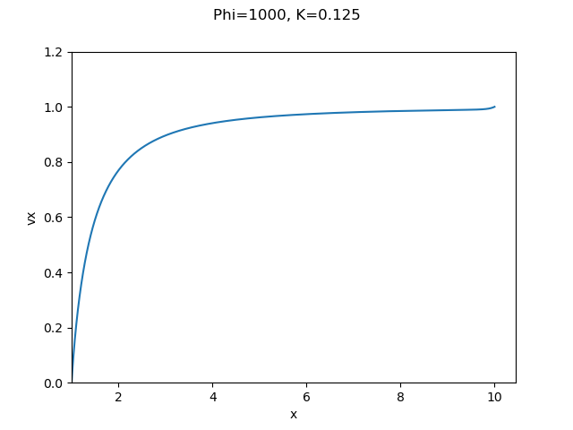
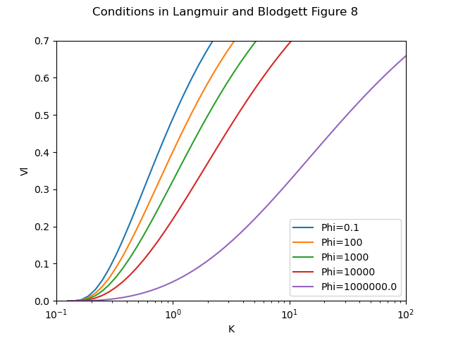
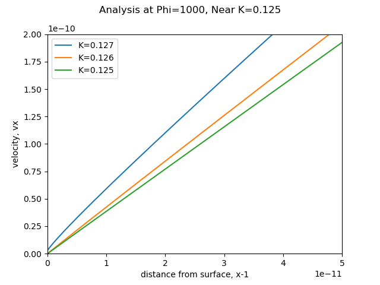
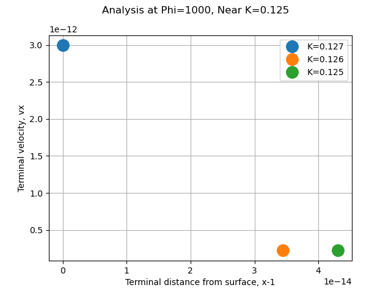

Title: Let's Build a 1D Water Drop Trajectory Simulation  
category: Diversions  
tags: impingement  
status: draft  

  

#Let's build a 1D water drop trajectory simulation  

##Discussion  

We are going to start with a one dimensional simulation along the stagnation line. 
This will keep the implementation simple to be readily understood. 
This may not seem very useful, but it has applications: 

1. determine the drop size that will not impinge on a cylinder. 
2. icing wind tunnel center-line simulation. 

When we add water drop evaporation rates, we will have something like the AEDC1DMP (Arnold Engineering Development Center 1 Dimensional Multi-Particle) code, 
but it will be the "one dimensional single particle code". 

We will use the dimensionless coordinate system from Figure 1 above (from NACA-TN-2903). 

We will use python syntax, where exponentiation is "**". 

"u" is the dimensionless airspeed. 

For incompressible potential flow, 
The airspeed approaching a cylinder is (from L&B):

  

For y = 0 (the stagnation line or center-line), this simplifies to:

    ux = 1 - 1 / x**2
    
The coefficient of drag, Cd, for a sphere, where R is Reynolds number, is (from L&B)

  

  
  
  

Let us go implement the equations. 

Selecting a case where Phi=1000 and K=0.125, 
we expect that there will be no impingement.  
The drop is released at x=10 (non-dimensional) 
at the same speed as the free stream air flow. 
We see the the drop speed vx drops fairly quickly from the assumed initial condition (vx=1, non-dimensional), 
then slowly decelerates until near x=2 where it decelerates more rapidly. 
On this scale, it is hard to tell if it impinges on the cylinder, 
the surface of which is at x=1.  
  

Let us see if it reproduces Figure 8:  
 
 
It does a good job at the lower values of Phi, 
but the results are different for the Phi = 1000000 case.  

  

Here are cases near K = 0.125. Note the zoomed in scale. 
The K=0.127 case does impinge on the cylinder.   

  

We need to zoom even further to see the the other cases. 
We will look only at the terminal velocities and positions. 
The K=0.126 case does not impinge, 
which is slightly different than the theory value of 0.125 for no impingement. 
The K= 0.125 value does not impinge, as predicted. 

  

>5.3.2 Nominal Test Conditions in a Full-Scale Icing Facility

>The duct or wind tunnel geometry assumed for test case 2 is shown in Figure 14. This
wind tunnel like configuration has a large inlet and a steep contraction section, to minimize flow
disturbances. Icing spray nozzles are assumed to be put in the plane of the large inlet. The test
section is located at x = 46 ft, so that the state of the water particles injected at the inlet of the
wind tunnel should be in kinetic and thermal equilibrium with the air flow by the time they reach
the test section. The tunnel has a large contraction ratio (inlet flow area divided by test section
flow area), hence, the range of permissible inlet air flow velocities is small, ranging from near 0
to about 45 ft per second. At the higher inlet air velocities, the test section has reached near-
choking, or sonic flow conditions. Generally, icing tests are conducted at air flow or flight-
simulating speeds in the range of a few hundred miles per hour. Therefore, a nominal set of inlet
test conditions was defined for the representative calculation made with AEDC1DMP. The
nominal test conditions are listed below.

  
  

Equations were implemented in the file "iads1dmp.py" for the iads1dmp 
("Icing Analysis Developmental Software 1 Dimensional Multi-Phase" code, 
an homage to AEDC1DMP and the python lower case file naming convention). 
Incompressible flow equations were used. 

The drop velocity values agree well with the AEDC1DMP results. 
   

The temperature values agree well for the 50 micrometer case, 
but not as well as for the 500 micrometer case, although the end points match well. 
The iads1dmp used the heat transfer correlation from NACA-TN-3024 for a sphere. 
I suspect that the AEDC1DMP may have used a different heat transfer coefficient
(the coefficient used is not give in the reference). 

  

The drop sizes change slightly as the travel. 
Most of the change occurs near the pot of the spray, where the drops are hot. 
   

We will call this "good enough" to proceed. 

is the AEDC1DMP 
(Arnold Engineering Development Center 1 Dimensional Multi-Phase) code described in [^3].

[^3]: 
Schulz, R. J.: Second Report for Research and Modeling of Water Particles in Adverse Weather Simulation Facilities. TASK REPORT 97-03, AEDC, July, 1998, https://apps.dtic.mil/sti/pdfs/ADA364922.pdf  

