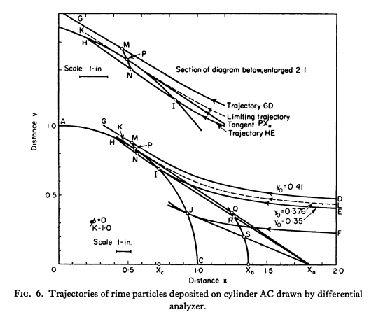

Title: Let's Build a 1D Water Drop Trajectory Simulation  
Date: 2022-05-25 12:00  
category: Diversions  
tags: impingement, evaporation    

  

###_"The discrepancies are of the magnitude to be expected from ... the step by step integration"._  [^1]  

#Let's build a 1D water drop trajectory simulation  

##Summary
Water impingement values on a cylinder are calculated with step-by-step integration. 

##Key points
1. 1D equations of motion were implemented.  
2. Results agree well with the minimum drop size required for impingement.  
3. Water drops may contact the cylinder at very low K values.  
4. The methods appears accurate enough to use for other applications.  

##Discussion  

We are going to start with a one dimensional simulation along a single line,
the stagnation line of flow around a cylinder, y=0 in the figure above. 

We will implement the equations of motions for a drop around a cylinder from 
["Mathematical Investigation of Water Droplet Trajectories"]({filename}Mathematical Investigation of Water Droplet Trajectories.md) [^1].

Readers unfamiliar with ["Mathematical Investigation of Water Droplet Trajectories"]({filename}Mathematical Investigation of Water Droplet Trajectories.md) 
may wish to review it before proceeding further herein, 
especially to be familiar with the dimensionless terms K and Phi.

We will use the dimensionless coordinate system from Figure 1 above (from [NACA-TN-2903]({filename}NACA-TN-2903.md)). 

We will use python syntax, where exponentiation is "**". 

"u" is the dimensionless airspeed. 

For incompressible potential flow, 
the airspeed approaching a cylinder is (from [^1]): 

  

For y = 0 (the stagnation line or center-line), this simplifies to: 

    ux = 1 - 1 / x**2
    
The coefficient of drag, Cd, for a sphere, where R is Reynolds number, is:

  

  
  
  

Let us go implement the equations, in the file cylinder_drop_1d_trajectory_shift.py [^2]. 

I used a time-base, fixed step integrator for the drop position and velocity. 
This will not win any speed contests, but it is simple to implement and understand. 

I used d = x + 1 as the position coordinate, 
the reasons will be explained further below. 

The time step selected has some effect on the result. 
The dimensionless time step tau = 0.1 had a different result than the other values, 
which are so close together that they cannot be differentiated on this scale. 
I selected tau = 0.001 as the default value. 

  

The results are surprising robust to the dimensionless initial location X0 
of the drop for this low K value (small dimensionless drop size). 
The drop was released at the same speed as the nominal airspeed, 
(I did not use the Langmuir and Blodgett estimate of initial drop speed).
The drop velocities rapidly converge to the trajectory for X0 = -20. 
I made X0 = -4 (d=-3) as the default value (the same as Langmuir and Blodgett).

  

We want to, among other uses, determine the minimum drop size for impingement. 
In theory, for K = 0.125, the drop decelerates enough so that while it does not stop completely, 
infinite time is required to reach the cylinder surface. 
This will require high accuracy very near x = 1 to differentiate if a drop hits or not. 

Equation (23) was recast to use d = x-1, or x = d+1, rather than x. 

    ux = 1 - (d+1)**2 / ((d+1)**2)**2
    ux = 1 - 1 / (d+1)**2
    ux = 1 - 1 / (d**2 + 2*d +1)
    ux = ((d**2 + 2*d +1) - 1) / (d**2 + 2*d +1)
    ux = (d**2 + 2*d ) / (d**2 + 2*d +1)

    for small d values, d < 1e-15: 
    ux ~= 2*d / (2*d +1)   drop the d**2 terms
    ux ~= 2*d              approximate the denominator

This may not appear to be much of a change, 
but having a linear term (2\*d) rather than a squared term (x\**2)
leaves much more "room" in the available floating point precision. 
For example, if d= 4.109382787428e-16 then x is represented in floating point
as rounded off to 1.0000000000000004. 
For smaller values, d can differentiate if a drop hits or not to high precision, 
while x is limited.

I do not have infinite time to wait for a solution, 
so I will compromise and consider that if d < 1e-25, then the drop has impinged on the cylinder. 
This level of precision was required to accurately simulate impingement (or not) 
near K = 0.125. 
The predicted drop final position and velocity agree with the expected results of 
no impingement at K = 0.125, and impingement with K = 0.126.

  

To compare results at other values of K, we will use Figure 8 from [^1].  
 

The calculated values are similar, but not identical. 
To use a phrase from ["Mathematical Investigation of Water Droplet Trajectories"]({filename}Mathematical Investigation of Water Droplet Trajectories.md):  
>_"The discrepancies are of the magnitude to be expected from ... the step by step integration"._  

  

###Centroid crossing versus leading edge contact for impingement 

The equations of motion are written for the centroid (center of mass) of the water drop. 
Langmuir and Blodgett did not mention considering the drop diameter for impingement detection,
rather it appears that where the drop mass centroid crosses the cylinder surface is considered impingement. 

>  
>Figure 6 from [^1].  

While the drop diameters are typically small compared to the cylinder diameters, 
the leading edge of the drop is ahead of the mass centroid by the drop radius. 
When we are capable of integrating down to a dimensionless distance of 1e-25 this makes a difference. 
If we define impingement as leading edge contact rather than mass centroid crossing, 
we find that all drop sizes contact, 
down to the lowest K values (dimensionless drop sizes) that the integrator will operate at. 
This is quite different for the theoretic impingement lower K limit of 0.125 for a cylinder. 

  
Note that the terminal distance corresponds to the diameters ratio, d_drop/d_cylinder. 

##Conclusions

We will call this implementation "good enough" for now. 

The model is capable of determining water drop relative airspeed, 
which will be important in our next step in the [Water drop evaporation thread]({filename}water_drop_evaporation_thread.md)
of calculating mass and heat transfer rates from a drop. 

##Notes: 

This is part of the [Water drop evaporation thread]({filename}water_drop_evaporation_thread.md), 
which you may want to review if you came here via a direct link. 

[^1]:
Langmuir, Irving, and Blodgett, Katherine B.: A Mathematical Investigation of Water Droplet Trajectories. Tech. Rep. No. 5418, Air Materiel Command, AAF, Feb. 19, 1946. (Contract No. W-33-038-ac-9151 with General Electric Co.)  
[^2]: [https://github.com/icinganalysis/icinganalysis.github.io](https://github.com/icinganalysis/icinganalysis.github.io)  
