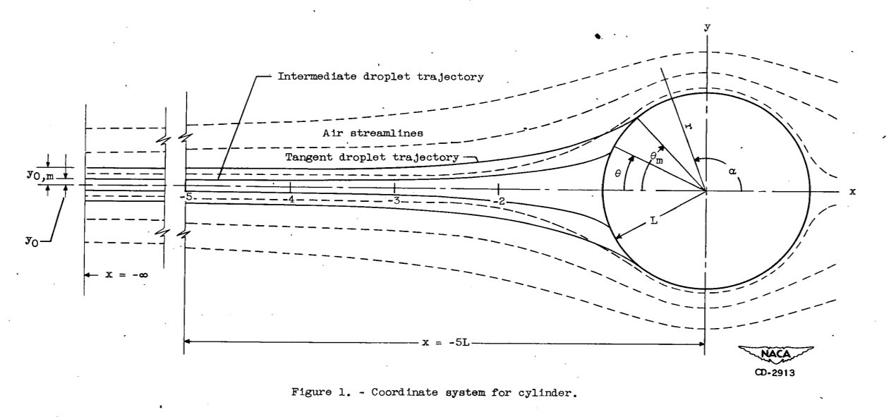

Title: Let's Build a 1D Water Drop Trajectory Simulation  
category: Diversions  
tags: impingement  
status: draft  

  

#Let's build a 1D water drop trajectory simulation  

##Discussion  

We are going to start with a one dimensional simulation along the stagnation line. 
This will keep the implementation simple to be readily understood. 
This may not seem very useful, but it has applications: 

1. determine the drop size that will not impinge on a cylinder. 
2. icing wind tunnel center-line simulation. 

When we add water drop evaporation rates, we will have something like the AEDC1DMP (Arnold Engineering Development Center 1 Dimensional Multi-Particle) code, 
but it will be the "one dimensional single particle code". 

We will use the dimensionless coordinate system from Figure 1 above (from NACA-TN-2903). 

We will use python syntax, where exponentiation is "**". 

"u" is the dimensionless airspeed. 

For incompressible potential flow, 
The airspeed approaching a cylinder is (from L&B):

  

For y = 0 (the stagnation line or center-line), this simplifies to:

    ux = 1 - 1 / x**2
    
The coefficient of drag, Cd, for a sphere, where R is Reynolds number, is (from L&B)

  

  
  
  

Let us go implement the equations. 

Selecting a case where Phi=1000 and K=0.125, 
we expect that there will be no impingement.  
The drop is released at x=10 (non-dimensional) 
at the same speed as the free stream air flow. 
We see the the drop speed vx drops fairly quickly from the assumed initial condition (vx=1, non-dimensional), 
then slowly decelerates until near x=2 where it decelerates more rapidly. 
On this scale, it is hard to tell if it impinges on the cylinder, 
the surface of which is at x=1.  
  

Let us see if it reproduces Figure 8:  
 
 
It does a good job at the lower values of Phi, 
but the results are different for the Phi = 1000000 case.  

  

Here are cases near K = 0.125. Note the zoomed in scale. 
The K=0.127 case does impinge on the cylinder.   

  

We need to zoom even further to see the the other cases. 
We will look only at the terminal velocities and positions. 
The K=0.126 case does not impinge, 
which is slightly different than the theory value of 0.125 for no impingement. 
The K= 0.125 value does not impinge, as predicted. 

  

is the AEDC1DMP 
(Arnold Engineering Development Center 1 Dimensional Multi-Particle) code described in [^3].

[^3]: 
Schulz, R. J.: Second Report for Research and Modeling of Water Particles in Adverse Weather Simulation Facilities. TASK REPORT 97-03, AEDC, July, 1998, https://apps.dtic.mil/sti/pdfs/ADA364922.pdf  

