status: draft  
title: Running LEWICE version 3.2.3 for the IceVal cases  
Date: 2026-05-18 14:00  
tags: LEWICE, ice shapes, NASA, IceVal

### _"The resulting analysis showed that LEWICE compared well to the available experimental data." [^1]_  
 
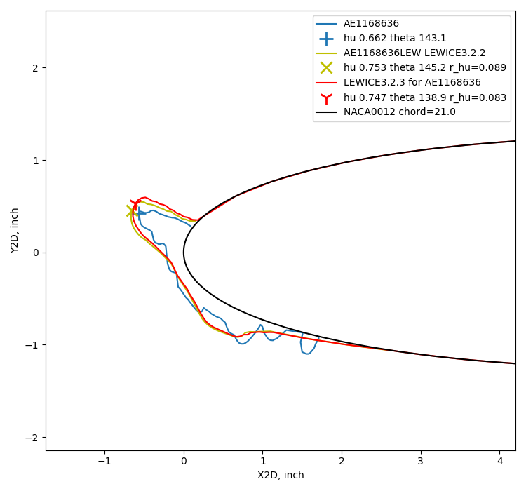  
_
An example of a good comparison between analysis and experiment.
_  

## Introduction  

The IceVal database [^2], and its predecessors, were originally assembled to validate the 
LEWICE [^3] ice shape prediction code. 

Here, we will repeat that analysis with a more recent version of LEWICE, 
and look at the effects of using "corrected" angle of attack values in the analysis.  

The LEWICE ice shapes results in the IceVal database were apparently run with LEWICE version 3.2.2
(We will abbreviate that as the Database LEWICE shape). 
The IceVal users guide is not explicit, other than "the latest version of the LEWICE ice shape prediction code". 
The 2008 LEWICE validation report was written at about the same time. It does not mention IceVal, 
but the validation report was for LEWICE version 3.2.2.  

## Comparisons with all IceVal cases  

The currently available version is LEWICE 3.2.3 (which will be abbreviated as LEWICE3.2.3). 
To compare ice shapes, the [Geometric Analysis Method]({filename}thicker.md) is used here. 
When LEWICE3.2.3 is run for the IceVal LEWICE case conditions, 
the results are, on average, quite similar between the Database LEWICE values and LEWICE3.2.3.
 
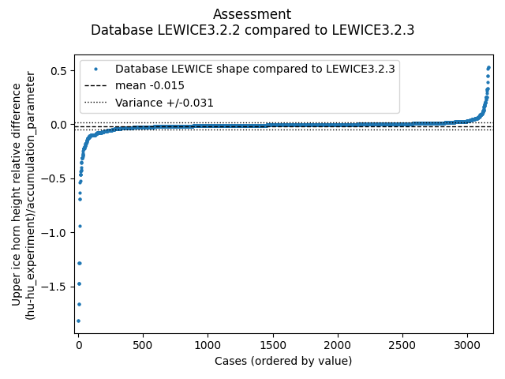  

Here is an example of a case with where the ice shape determined by analysis 
matches the shape from experiment well.  
 
  

However, several cases near either end of the plot have notable differences.  
40 of these cases were examined in detail. 
For 22 cases, the database LEWICE shape has a notably thinner or thicker maximum upper ice height. 
I suspect these cases as having the wrong ice shape in the database associated with the RunID. 
Two examples are shown below:  

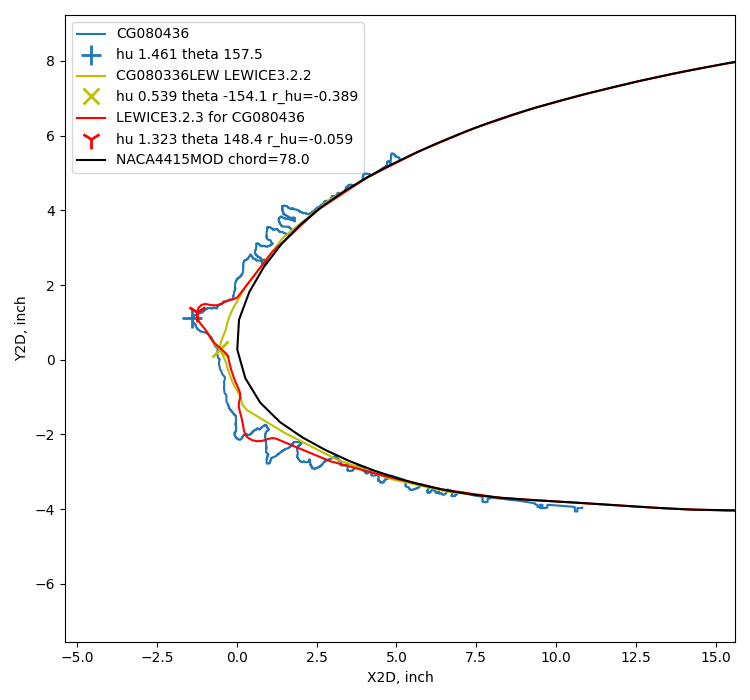  

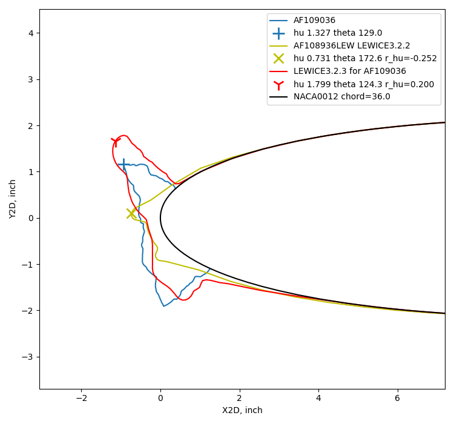

There are also 18 cases where both the experimental tracing and the database LEWICE shape 
appear to be mis-associated with the RunIDs, with two examples shown below.    

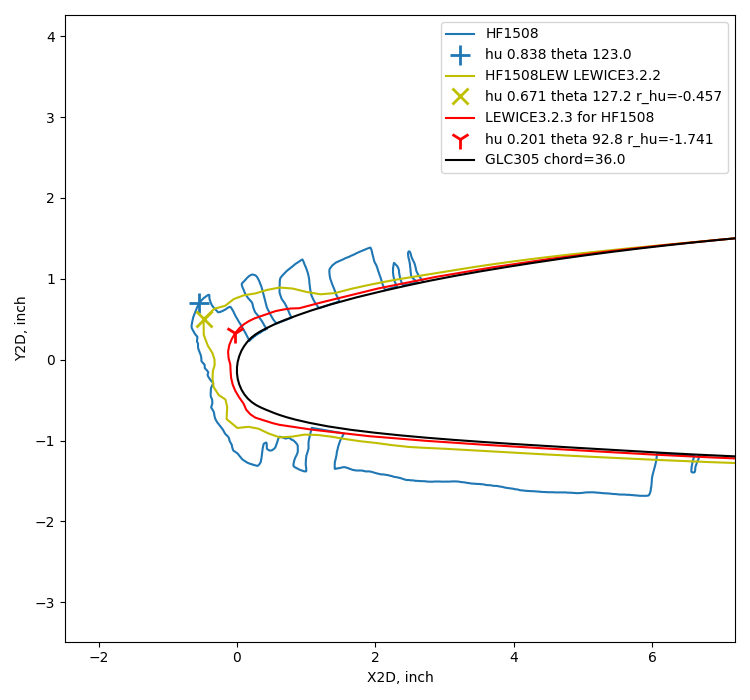  

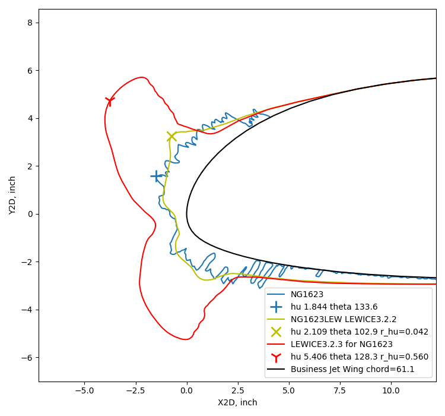

When LEWICE3.2.3 results are compared to experimental results, 
the overall comparison assessment results for ice height are similar to the results 
we saw previously using the database LEWICE shapes:  

  

  

While the 40 suspect cases noted above have some significant differences in ice shapes, 
they are roughly balanced between too thick and too thin, and 
there are not enough of them to affect the overall assessments much if 40 of 3165 shapes are removed from the analysis.  

## The effect of corrected angle of attack  

The LEWICE cases in the IceVal database were all run at the nominal angle of attack.  

In some cases, a "corrected" angle of attack was determined and included in the database. 
This is an angle of attack for which the test article installed in the tunnel 
will achieve similar flow characteristics to flight without the tunnel walls 
and other installation flow effects.  

The corrected angle of attack is often determined by first conducting analysis to establish 
a stagnation line target location to be matched. 
The test article is instrumented with pressure taps, 
then for tests in the tunnel the angle of attack is varied 
until the measured stagnation location is close to the target. 
An example is contained in 2nd Ice Prediction Workshop material at [folk.ntnu.no](https://folk.ntnu.no/richahan/IPW/files/IPW2/Documents/IPW-2-case-descriptions-v12.pdf).  

As the process for determining corrected angle of attack can be onerous, 
it has not always been determined for every test. 
However, I view determining the corrected angle angle of attack as a current best practice, 
and should be used for all current and future tests. 
As we shall see below, the effect of using corrected angle of attack is often not large,
and does not always improve the ice shape match between LEWICE analysis and experiment. 
So, analyzing historical data is often done using just the nominal angle of attack. 

In the IceVal database, there are 441 test cases with a 
CorrectedAOA value that differs from the AOA value.

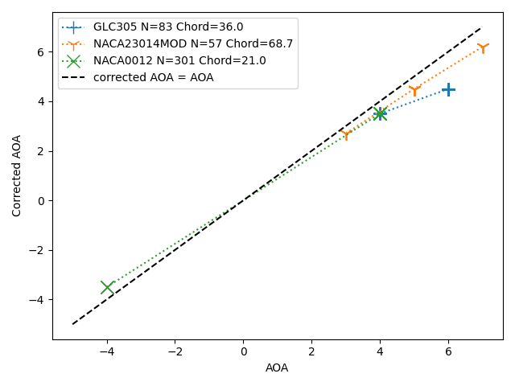  

For this subset of 441 cases, when LEWICE3.2.3 is run using the nominal AOA values, 
the horn angle variance (26.7) is similar to that with the large data set (3133 points, 25.4 variance).  

  

When LEWICE runs with the nominal and corrected AOA values are compared, 
there is very little difference in maximum horn height:  

  
However, the horn angles change by several degrees, on average:  

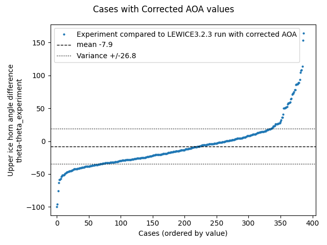  

The mean value is negative, indicating that the horn angle when run with the corrected values 
are lesser, so they are higher up and/or aft than the horns run with the nominal angle of attack.  

  
_Public Domain image from [NASA/CR-2008-215174](https://ntrs.nasa.gov/citations/20080041518)._  

  
 
Here is a case where using the correct angle of attack improved the ice shape match,
by both engineering judgement and the horn angle difference (d_theta).  

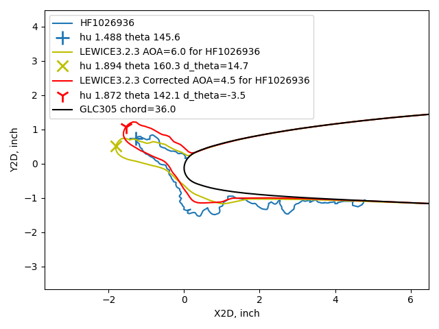  

In other cases, there is not an obvious difference in ice shapes or improvement in the shape match.  
Here are two examples where LEWICE results are close to each other, 
but differ visibly from the experimental ice shape.  

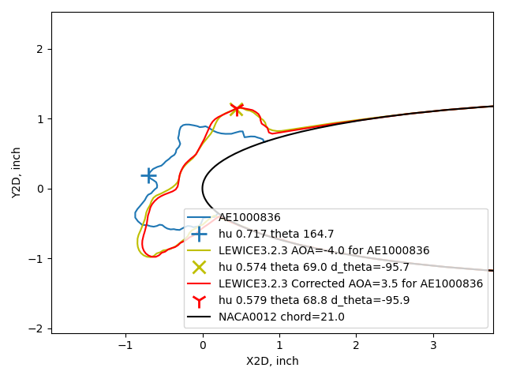  

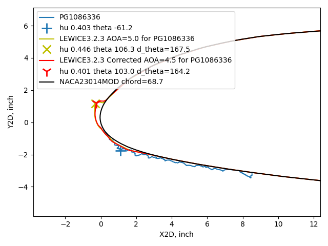  

Here are two examples where the angle difference from the experimental shape was 
near the average variance of 25 degrees. 
In first case, the ice shape match was improved by using the corrected angle of attack. 
In the second case, it was not improved.  

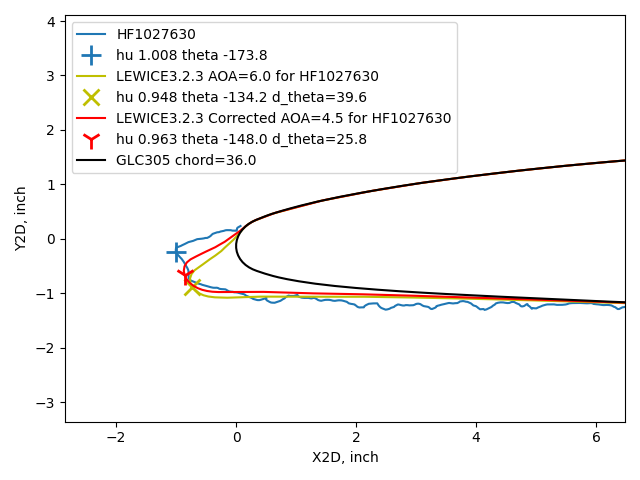  

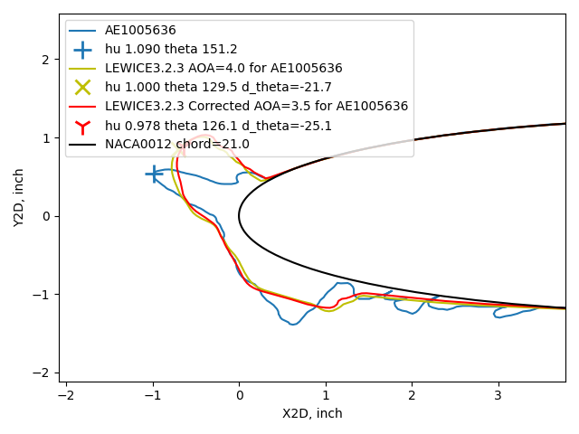  

For thin ice shapes, horn angle difference does not always appear to represent the 
shape difference. 
In the case below, the horn angle difference (d_theta) is near the average variance, 
for either the cases using AOA or corrected AOA. 
To me, there appears to be a "large" difference in either case. 

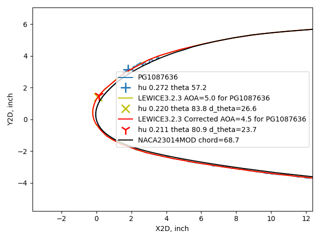  

For geometrically scaled tests in a wind tunnel, 
the shape details of thin ice are sometimes not attempted to be simulated, 
and distributed roughness is used instead to represent ice. 
A 0.2-inch thick ice shape at 5% scale would be 0.01 inch thick, 
and challenging to model in detail.  

## Related  

This post is part of the ["6000 Ice Shapes - the IceVal DatAssistant"]({filename}iceval.md) thread.  

## Notes  

[^1]: 
Wright, William, Mark Potapczuk, and Laurie Levinson. "Comparison of LEWICE and GlennICE in the SLD Regime." 46th AIAA aerospace sciences meeting and exhibit. 2008. [NASA/CR-2008-215174](https://ntrs.nasa.gov/citations/20080041518)  

[^2]: 
Levinson, Laurie, and William Wright. "IceVal DatAssistant-An Interactive, Automated Icing Data Management System." 46th AIAA Aerospace Sciences Meeting and Exhibit. 2008. [NASA Report Number: E-16236](https://ntrs.nasa.gov/citations/20070031804)  
The software is available at [software.nasa.gov](https://software.nasa.gov/software/LEW-18343-1)  

[^3]: 
User's Manual for LEWICE Version 3.2 [NASA/CR—2008-214255](https://ntrs.nasa.gov/citations/20080048307)  
The software is available at [software.nasa.gov](https://software.nasa.gov/software/LEW-18573-1) 
