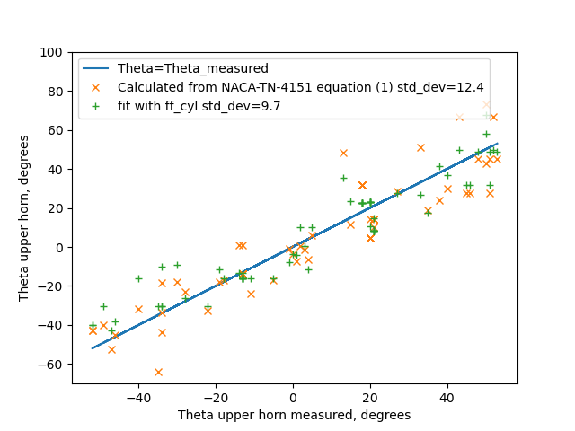

Title: Ice Shapes and Their Effects  
Category: NACA  
status: draft  

###_"an irregular shape is developed due to the ice formation, which is ruinous to the aerodynamic efficiency of the airfoils"_ [^1]  

  
>from NACA-TN-1598 [^2]  

#Conclusions of the Ice Shapes and Their Effects Thread

##Summary 
Data from the post-NACA era are used to resolve open questions 

##Key Points  
1. The Ice Shapes and Their Effects thread is summarized.  
2. Post-NACA era data is used to resolve some open questions.  
3. Correlations of drag due to ice have limited, "first order" accuracy.  

##Discussion  

###Review of the "Ice Shapes and Their Effects" thread so far

In this thread, we saw:

An almost "lost gem" of the NACA-era, [NACA-TN-313, "The Formation of Ice upon Airplanes in Flight"]({filename}NACA-TN-313.md) with, in 1929: 
- Description of supercooled large drop (SLD) icing conditions  
- "Detect and exit" icing mitigation strategy  
- Natural icing flight tests of icephobic materials  
- Identification of different types of icing  

The effect of "protuberances" on an airfoil section lift and drag in [NACA-TR-446, "Airfoil Section Characteristics as Affected by Protuberances"]({filename}NACA-TR-446.md)  

The effects of simulated residual ice in [NACA-WR-L-292, "Effects of a Simulated Ice Formation on the Aerodynamic Characteristics of an Airfoil"]({filename}NACA-WR-L-292.md)     

Airplane levels effects of icing are measured, and broken into major components in [NACA-TN-1598, "Effects of Ice Formations on Airplane Performance in Level Cruising Flight"]({filename}NACA-TN-1598.md)   
  
Estimated drag results by "discriminating use of the data" from NACA-TR-446 in [NACA-TN-2962, "Effect of Ice and Frost Formations on Drag of NACA 651_212 Airfoil for Various Modes of Thermal Ice Protection"]({filename}NACA-TN-2962.md)  

The drag due to ice on a swept airfoil section measured in [NACA-RM-E53J30, "Effect of Ice Formations on Section Drag of Swept NACA 63A-009 Airfoil with Partial-Span Leading-Edge Slat for Various Modes of Thermal Ice Protection"]({filename}NACA-RM-E53J30.md)  

Correlations between ice shapes, aerodynamic performance, and icing conditions in [NACA-TN-4151, "Correlations Among Ice Measurements, Impingement Rates, Icing Conditions and Drag Coefficients for an Unswept NACA 65A004 Airfoil"]({filename}NACA-TN-4151.md)  

A more general correlation of drag due to ice on an airfoil in [NASA-TM-D-2166, "Prediction of Aerodynamic Penalties Caused by Ice Formations on Various Airfoils"]({filename}NASA-TM-D-2166.md)  

Glaze ice shape correlations for two commercial aircraft airfoils in [Wilder, Ramon W.: "Techniques used to determine Artificial Ice Shapes and Ice Shedding, Characteristics of Unprotected Airfoil Surfaces"]({filename}wilder.md)  

###Open Questions  

We will look at recent data to address some questions:  
1. Does leading edge freezing fraction correlate to airfoil ice shape parameters?  
2. How well do LEWICE results compare to the ice shapes data that we have seen?  

###Correlation to freezing fraction 

####NACA-TN-4151

In the review of NACA-TN-4155, it was noted:

>Thus, equation (1) relates the ice angle 0 to the icing and operating
conditions that are generally known or calculable in a flight performance
study.

    θ = 483 w^0.5 (Em/(32-t_o)^(1/3) - 72 - 58 (1 - 1/1.35^αi), deg   (1)
    
    h = 4.35X10-4 τ V_o (w β_m)*0.5 (32-t_o)^0.3   (2)

LWC (w) and a water catch efficient term (E_m or β_m) are in both, and a temperature difference. 

  
_Figure 7 from NACA-TN-4151_ 

We can see elements of a "freezing fraction" calculation from Messinger [^3] in equations (1) and (2)
from above. 

From Messinger (equations re-arranged), we also see a water catch rate and a temperature difference:

    mw = LWC * β * V_o  or mw = LWC * E_m / length * V_o

    n = ((hc * (ts - ta)) + (Le * hc * 0.7 / cp * (pvs - pv) / p) + (mw * cpw * (ts - ta)) 
          -(hc * (r * u**2 / 2 / cp))-(mw * (u**2 / 2))) / (Lf * mw)

In the [Conclusions of the Icing Thermodynamics Thread]({filename}thermodynamics_thread_wrap_up.md) 
it was noted that 
[NASA/CR-2005-213852](https://ntrs.nasa.gov/api/citations/20050215212/downloads/20050215212.pdf)  
treated the airfoil leading edge as a cylinder with a diameter equal to twice the leading edge radius of curvature 
for calculating leading edge freezing fraction. 
We will use that here. 

For the cases in NACA-TN-4151 Table II, 
the leading edge equivalent cylinder freezing fractions were calculated. 
A Langmuir "D" drop size distribution was assumed. 

A fitting function of the form 

    A * freezing_fraction + B * aoa + C = theta_upper_horn_measured 
was used to determine the best fit coefficient values of A and B and C. 

The results of this are compared to the values from equation (1) below:  

  

Both fits have some variance, but the one using freezing fraction 
has a slightly better fit. 

A similar fit was made for ice height with the addition 
of a water catch term:

    A * freezing_fraction * water_catch + B * aoa + C = theta_upper_horn_measured 

  

The results are comparable between equation (2) values 
and the fit with freezing fraction. 

To summarized, calculated equivalent cylinder leading edge freezing fraction 
correlates as well to the ice shape height and theta as 
the icing conditions equations (1) and (2). 
They convey very similar information. 

I view this as further validation of Uwe von Glahn's assertion that 
**"The collection of ice by the cylinders is similar to the collection of ice by airplane components"** [^4] from 1955.  

####AEDC-TR-87-23 [^5]

AEDC-TR-87-23 (which we will review in more detail in the upcoming "Icing Wind Tunnel Test Thread") 
used the drag coefficient Cd as an ice shape similarity indicator
(and skipped over the ice shape details):  

>drag coefficient (Cd) was used as an index of similitude by quantitatively indicating how much the shape or ice surface changed.

It found that calculated leading edge freezing fraction corresponds
to Cd measured with an ice shape, in a complex way. 

  

While AEDC-TR-87-23 did not include this, there is correspondence
between calculated leading edge freezing fraction and ice horn angle for the 
NACA0012 airfoil used in the study:

  

__This suggests that calculated leading edge freezing fraction is not 
only an indicator of ice shape factors, but it also indicates the 
aerodynamic effect of drag due to an ice shape, 
and that the corresponding shape factors (location and height of the ice horn)
are aerodynamically meaningful.__

###Comparison of NASA-TM-83556 [^7] to LEWICE2D [^6] and NACA-TR-446

In the [Conclusions of the Cylinder Thread]({filename}cylinder_thread_wrap_up.md) 
and [Conclusions of the Icing Thermodynamics Thread]({filename}thermodynamics_thread_wrap_up.md) 
comparisons to LEWICE 2D were made. 

We will do so again here, using data from NASA-TM-83556 where 
the drag due to ice shapes was measured. 
(We will review this data in more detail in the upcoming "Icing Wind Tunnel Test Thread").
Fortunately, a NACA0012 airfoil was used, as was used in NACA-TR-446. 
There is a fair chord Reynolds number match between this (2.2 to 3.6 x10^6) and NACA-TR-446 (3.1 x10^6).
The data is at an angle of attack of 4 degrees,
while the NACA-TR-446 data is at Cl=0.5, which is at approximately 4 degrees angle of attack.

  
_Figure 10 from NASA-TM-83556_ 

LEWICE 2D yields similar, but not identical, ice shapes. 
In general, the LEWICE shapes are thinner (due in part to being run with the default ice density of 917 kg/m^2),
and the ice horn angles are larger. 

  
  

LEWICE 2D does not have a way to evaluate drag due to ice 
and it is challenging for any CFD method, 
particularly for glaze ice cases at higher angle of attack values. 

To crudely estimate the effects of the LEWICE ice shapes, 
we will try using NACA-TR-446 data. 
A challenge is that the NACA-TR-446 data is only available at certain 
protuberance heights and x/c stations. 
The largest height/chord ratio in the NACA-TR-446 values is 0.0125, 
but the ice horn heights are in the 0.03 to 0.08 range. 
The closest stations of interest are at x/c=0 and x/c=0.05, 
while the ice horn bases are at values of x/c < 0.005. 
This is pushing _"discriminating use of the data"_ [^8] to its limits.
The measured ice data only roughly corresponds to the protuberance data: 

  

we will also use a fit of delta Cd due to ice with ice horn angle and ice height,
and allow extrapolation to larger horn angles (this is a subset of the data in AEDC-TR-87-23).  

  

(A comparison to NASA-TM-D-2166 [^9] methods were discussed in the review of [NASA-TM-D-2166]({}NASA-TM-D-2166.md),
and were found to be of limited accuracy.)

With any of the very approximate extrapolation of Cd, 
the estimated effects are different than Figure 10 (b) from above. 

  

With the NACA-TR-446 based extrapolation, the 338 km/h case at -2C is correctly identified 
as the case with the largest effect, but the other values do not match Figure 10 (b) well. 

The method using a fit of NASA-TM-83556 horn angle data did not correctly identify the condition with the largest section drag coefficient,
least the highest Cd test condition was a close second in the analysis. 
In general, values do not match Figure 10 (b) well. 
I suppose that "first-order approximation" (a phrase from NASA-TM-D-2166) applies as a description. 

Note that these results were for a moderate chord (0.53 m) airfoil. 
Results may be different for a larger or smaller airfoil in
similar icing conditions. 

It is not clear to me if the limited accuracy of the effect extrapolation methods used 
make the LEWICE ice shapes effects seem to be significantly different when they may not really be, 
or if the LEWICE ice shapes themselves are meaningfully different. 

As I have often seen in icing publications, 
a phrase like __"Additional work is needed"__ [^5] applies here.

Additional work is ongoing in groups such as the 
AIAA Ice Prediction Workshop Workshop [^10]. 
While the ice shape results above were specifically for LEWICE2D, 
I am not sure that any other currently available code 
that was presented at the workshop so far
would produce significantly better results. 
The workshop has not gotten to ice shape effects yet. 

##What is still used today 

###Protuberance effects

The "protuberance" effect data from NACA-TR-446 in perpetuated in Brumby [^11],
which in addition to NACA-TR-446 collected several other studies and 
summarized them on a series of graphs. 

These are still used today for purposes like in NACA-TR-446 of
"the prediction of the effects of short span protuberances" 
such as spoilers, and the effect of repairs such as external doublers. 

Protuberances had renewed interest after supercooled large drop (SLD) icing 
was recognized as a potential threat to current aircraft. 
Large drop icing can form in area different from smaller drops, 
and if ice forms aft of a protection system it can produce different shapes. 
the "Forward Facing Quarter Round" has been used as a stand-in for such ice. 

  
>Figure 7 from DOT/FAA/AR-00/14 [^12].

You can find a more detail discussion in Bragg, "Iced-airfoil aerodynamics" [^13].  

###Icing conditions parameters  

As we saw above, the "empirical" icing conditions parameters in NACA-TN-4151 
anticipated and correlate to equivalent leading edge freezing fraction values. 

This gets used in NASA/CR-2004-212875 [^14] and NASA/CR-2005-213852 [^15].  

  
>Figure 3 from NASA/CR-2005-213852.  

###Ice shape parameters

While there is no completely agreed upon "standard" set of parameters to describe an ice shape, 
the values from NACA-TN-4151 get perpetuated in the LEWICE user's manual [^16],
and these (with the addition of icing limits) are probably the closest thing we have to a "standard" set:

  

However, the validation report [^17] used a modified definition for theta:

  

##Related  

Most of the ice shapes from this thread were produced in icing wind tunnels. 
We will review these test facilities in the upcoming "Icing Wind Tunnels Thread".

##Notes  
[^1]: Carroll, Thomas, and McAvoy, William H.: The Formation of Ice upon Airplanes in Flight. NACA-TN-313, 1929.   
[^2]: Preston, G. Merritt, and Blackman, Calvin C.: Effects of Ice Formations on Airplane Performance in Level Cruising Flight. NACA-TN-1598, 1948.  
[^3]: 
Messinger, B. L.: Equilibrium Temperature of an Unheated Icing Surface as a Function of Airspeed. Preprint No. 342, Presented at I.A.S. Meeting, June 27-28, 1951.  
[^4]: 
von Glahn, Uwe H.: The Icing Problem, presented at Ottawa AGARD Conference. AG 19/P9, June 10-17 1955, reprinted in Selected Bibliography of NACA-NASA Aircraft Icing Publications, NASA-TM-81651, August, 1981  I could not locate this on the NTRS. It is available at (https://core.ac.uk/reader/42858720) (circa November, 2021)  
[^5]: Bartlet, C. S.: "An Empirical Look at Tolerances in Setting Icing Test Conditions with Particular Application to Icing Similitude". AEDC-TR-87-23, DOT/FAA/CT-87-31, August, 1983.  
[^6]: 
https://software.nasa.gov/software/LEW-18573-1,  
https://ntrs.nasa.gov/citations/19990021235  
[^7]: Olsen, William, Shaw, Robert, and Newton, James: Ice Shapes and the Resulting Drag Increase for a NACA 0012 Airfoil. NASA-TM-83556, 1984.  
[^8]: Gray, Vernon H., and von Glahn, Uwe H.: Effect of Ice and Frost Formations on Drag of NACA 651-212 Airfoil for Various Modes of Thermal Ice Protection. NACA-TN-2962, 1953.  
[^9]: Gray, Vernon H.: Prediction of Aerodynamic Penalties Caused by Ice Formations on Various Airfoils. NASA-TM-D-2166, 1964. 
I could not find a download for this on the nrts, it is available at 
[https://archive.org/details/nasa_techdoc_19810068590](https://archive.org/details/nasa_techdoc_19810068590).  
[^10]:
1st AIAA Ice Prediction Workshop Workshop in Conjunction with the AIAA AVIATION 2021 Forum All Virtual/Remote Participation 26-29 July 2021, https://icepredictionworkshop.wordpress.com/  
[^11]: Brumby RE. Wing Surface Roughness – Cause & Effect. D.C. Flight Approach, Jan. 1979. pp. 2-7.  
[^12]: Bragg, Michael B., and Eric Loth. Effects of large-droplet ice accretion on airfoil and wing aerodynamics and control. ILLINOIS UNIV AT URBANA DEPT OF AERONAUTICAL AND ASTRONAUTICAL ENGINEERING, 2000. DOT/FAA/AR-00/14,
available at [tc.faa](http://www.tc.faa.gov/its/worldpac/techrpt/ar00-14.pdf)  
[^13]: Bragg, Michael B., Andy P. Broeren, and Leia A. Blumenthal. "Iced-airfoil aerodynamics." Progress in Aerospace Sciences 41.5 (2005): 323-362.  [icing.ae](http://icing.ae.illinois.edu/papers/05/Iced%20Airfoil%20Aerodynamics.pdf)  
[^14]: Bond, Thomas H., and David N. Anderson. Manual of scaling methods. No. E-14272, NASA/CR-2004-212875. 2004.  [ntrs](https://ntrs.nasa.gov/api/citations/20040042486/downloads/20040042486.pdf)   
[^15]: 
Anderson, David N., and Jen-Ching Tsao. "Evaluation and Validation of the Messinger Freezing Fraction." 41st Aerospace Sciences Meeting and Exhibit. No. NASA/CR-2005-213852. 2005.  [ntrs](https://ntrs.nasa.gov/api/citations/20050215212/downloads/20050215212.pdf)  
[^16]: 
Wright, William. User's manual for LEWICE version 3.2. No. E-15537. 2008. NASA/CR—2008-214255 [ntsr](https://ntrs.nasa.gov/api/citations/20080048307/downloads/20080048307.pdf)  
[^17]: 
Wright, William B. A Summary of Validation Results for LEWICE 2.0. No. E-11467. 1998.  NASA/CR-1998-208687  [researchgate](https://www.researchgate.net/profile/William-Wright-23/publication/24286769_A_summary_of_validation_results_for_LEWICE_20/links/0c96051dc1c80ad31a000000/A-summary-of-validation-results-for-LEWICE-20.pdf)  

