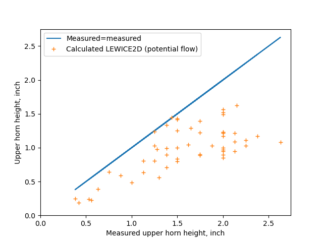

Title: Ice Shapes and Their Effects  
Category: NACA  
status: draft  

###_"an irregular shape is developed due to the ice formation, which is ruinous to the aerodynamic efficiency of the airfoils"_ [^1]  

  
>from NACA-TN-1598 [^2]  

#Ice Shapes and Their Effects Thread

This thread will cover ice shapes and the aerodynamic effects of the ice.

This will primarily cover ice shapes on unprotected surfaces.

There are additional publications on ice shapes for deicing systems and propellers that will not be reviewed here. 

##Publications

###Review of the "Ice Shapes and Their Effects" thread so far

In this thread, we saw:

An almost "lost gem" of the NACA-era, [NACA-TN-313, "The Formation of Ice upon Airplanes in Flight"] with, in 1929: 
- Description of supercooled large drop (SLD) icing conditions  
- "Detect and exit" icing mitigation strategy  
- Natural icing flight tests of icephobic materials  
- Identification of different types of icing  

The effect of "protuberances" on an airfoil section lift and drag in [NACA-TR-446, "Airfoil Section Characteristics as Affected by Protuberances"]({filename}NACA-TR-446.md)  

The effects of simulated residual ice in [NACA-WR-L-292, "Effects of a Simulated Ice Formation on the Aerodynamic Characteristics of an Airfoil"]({filename}NACA-WR-L-292.md)     

Airplane levels effects of icing are measured, and broken into major components in [NACA-TN-1598, "Effects of Ice Formations on Airplane Performance in Level Cruising Flight"]({filename}NACA-TN-1598.md)   
  
Estimated drag results by "discriminating use of the data" from NACA-TR-446 in [NACA-TN-2962, "Effect of Ice and Frost Formations on Drag of NACA 651_212 Airfoil for Various Modes of Thermal Ice Protection"]({filename}NACA-TN-2962.md)  

The drag due to ice on a swept airfoil section measured in [NACA-RM-E53J30, "Effect of Ice Formations on Section Drag of Swept NACA 63A-009 Airfoil with Partial-Span Leading-Edge Slat for Various Modes of Thermal Ice Protection"]({filename}NACA-RM-E53J30.md)  

Correlations between ice shapes, aerodynamic performance, and icing conditions in [NACA-TN-4151, "Correlations Among Ice Measurements, Impingement Rates, Icing Conditions and Drag Coefficients for an Unswept NACA 65A004 Airfoil"]({filename}NACA-TN-4151.md)  

A more general correlation of drag due to ice on an airfoil in [NASA-TN-D-2166, "Prediction of Aerodynamic Penalties Caused by Ice Formations on Various Airfoils"]({filename}NASA-TN-D-2166.md)  

Glaze ice shape correlations for two commercial aircraft airfoils in [Wilder, Ramon W.: "Techniques used to determine Artificial Ice Shapes and Ice Shedding, Characteristics of Unprotected Airfoil Surfaces"]({filename}wilder.md)  

##Discussion  

We will look at recent data to address some questions:  
1. Does leading edge freezing fraction correlate to airfoil ice shape parameters?  
2. How well do LEWICE results compare to the ice shapes data that we have seen?  

###Correlation to freezing fraction 

In the review of NACA-TN-4155, it was noted:

We can see elements of a "freezing fraction" calculation from Messinger [^4] in equations (1) and (2)
from above. 

    θ = 483 w^0.5 (Em/(32-t_o)^(1/3) - 72 - 58 (1 - 1/1.35^αi), deg   (1)
    
    h = 4.35X10-4 τ V_o (w β_m)*0.5 (32-t_o)^0.3   (2)

LWC (w) and a water catch efficient term (E_m or β_m) are in both, and a temperature difference. 

From Messinger (equations re-arranged), we also see a water catch rate and a temperature difference:

    mw = LWC * β * V_o  or mw = LWC * E_m / length * V_o

    n = ((hc * (ts - ta)) + (Le * hc * 0.7 / cp * (pvs - pv) / p) + (mw * cpw * (ts - ta)) 
          -(hc * (r * u**2 / 2 / cp))-(mw * (u**2 / 2))) / (Lf * mw)

In the [Conclusions of the Icing Thermodynamics Thread]({filename}thermodynamics_thread_wrap_up.md) 
it was noted that 
[NASA/CR-2005-213852](https://ntrs.nasa.gov/api/citations/20050215212/downloads/20050215212.pdf)  
treated the airfoil leading edge as a cylinder with a diameter equal to twice the leading edge radius of curvature 
for calculating leading edge freezing fraction. 
We will use that here. 

For the cases in NACA-TN-4151 Table II, 
the leading edge equivalent cylinder freezing fractions were calculated. 
A Langmuir "D" drop size distribution was assumed. 

A fitting function of the form 

    A * freezing_fraction + B * aoa + C = theta_upper_horn_measured 
was used to determine the best fit coefficient values of A and B and C. 

The results of this are compared to the values from equation (1) below:  

  

Both fits have some variance, but the one using freezing fraction 
has a slightly better fit. 

A similar fit was made for ice height with the addition 
of a water catch term:

    A * freezing_fraction * water_catch + B * aoa + C = theta_upper_horn_measured 

  

The results are comparable between equation (2) values 
and the fit with freezing fraction. 

To summarized, calculated equivalent cylinder leading edge freezing fraction 
correlates as well to the ice shape height and theta as 
the icing conditions equations (1) and (2). 
They convey very similar information. 

I view this even more validation of Uwe von Glahn's assertion that 
**"The collection of ice by the cylinders is similar to the collection of ice by airplane components"** [^4] from 1955.  

###Comparison to LEWICE 2D  

In the [Conclusions of the Cylinder Thread]({filename}cylinder_thread_wrap_up.md) 
and [Conclusions of the Icing Thermodynamics Thread]({filename}thermodynamics_thread_wrap_up.md) 
comparisons to LEWICE 2D were made. 

We will do so again here, 
but with the caution that the cases in NACA-TN-4151 
are perhaps not a "fair" test. 
The thin NACA 65A004 airfoil had separation at higher angles of attack, 
The (default) potential flow solution was used to run LEWICE.
Potential flow will not model the separation correctly 
(and frankly, any CFD method will be challenged). 

The NACA 65A004 airfoil used in NACA-TN-4151 was not included in the LEWICE validation set, 
nor any other 4% thickness airfoils. 

Also, the LEWICE 2D manual notes that:  
>The range of angle of attack values in the validation database is -4 to +7 degrees.

and the 8, 10, and 11 degree AOA cases exceed that.

We will probably learn more about the limitations of potential flow 
than the capabilities of LEWICE 2D. 

LEWICE 2D calculations are compared to NACA-TN-4151 Table II 
values below.  

There is some correlation of upper horn angle at higher values, 
but poor correlation at lower theta values, 
many of which are at higher AOA values where there is separation. 

  

LEWICE was run with the default ice density of 917 kg/m^3. 
For ice height, the upper bound is not exceed 
but the LEWICE 2D values tend to be low. 
Using a lower ice density (or expeditiously increasing icing time) 
would move the LEWICE 2D value up to a better average, 
but would not improve the scatter. 

  

##What is still used today 

###Protuberance effects

The "protuberance" effect data from NACA-TR-446 in perpetuated in Brumby [^3],
which in addition to NACA-TR-446 collected several other studies and 
summarized them on a series of graphs. 

These are still used today for purposes like in NACA-TR-446 of
"the prediction of the effects of short span protuberances" 
such as spoilers, and the effect of repairs such as external doublers. 

Protuberances had renewed interest after supercooled large drop (SLD) icing 
was recognized as a potential threat to current aircraft. 
Large drop icing can form in area different from smaller drops, 
and if ice forms aft of a protection system it can produce different shapes. 
the "Forward Facing Quarter Round" has been used as a stand-in for such ice. 

  
>Figure 7 from DOT/FAA/AR-00/14 [^4].

You can find a more detail discussion in Bragg, "Iced-airfoil aerodynamics" [^5].  

###Icing conditions parameters  

As we saw above, the "empirical" icing conditions parameters in NACA-TN-4151 
anticipated and correlate to equivalent leading edge freezing fraction values. 

This gets used in NASA/CR-2004-212875 [^6] and NASA/CR-2005-213852 [^7].  

  
>Figure 3 from NASA/CR-2005-213852.  

###Ice shape parameters

While there is no completely agreed upon "standard" set of parameters to describe an ice shape, 
the values from NACA-TN-4151 get perpetuated in the LEWICE user's manual [^8],
and these (with the addition of icing limits) are probably the closest thing we have to a "standard" set:

  

However, the validation report [^9] used a modified definition for theta:

  

##Related  

Most of the ice shapes from this thread were produced in icing wind tunnels. 
We will review these test facilities in the upcoming "Icing Wind Tunnels Thread".

##Notes  
[^1]: Carroll, Thomas, and McAvoy, William H.: The Formation of Ice upon Airplanes in Flight. NACA-TN-313, 1929.   
[^2]: Preston, G. Merritt, and Blackman, Calvin C.: Effects of Ice Formations on Airplane Performance in Level Cruising Flight. NACA-TN-1598, 1948.  
[^3]: Brumby RE. Wing Surface Roughness – Cause & Effect. D.C. Flight Approach, Jan. 1979. pp. 2-7.  
[^4]: Bragg, Michael B., and Eric Loth. Effects of large-droplet ice accretion on airfoil and wing aerodynamics and control. ILLINOIS UNIV AT URBANA DEPT OF AERONAUTICAL AND ASTRONAUTICAL ENGINEERING, 2000. DOT/FAA/AR-00/14,
available at [tc.faa](http://www.tc.faa.gov/its/worldpac/techrpt/ar00-14.pdf)  
[^5]: Bragg, Michael B., Andy P. Broeren, and Leia A. Blumenthal. "Iced-airfoil aerodynamics." Progress in Aerospace Sciences 41.5 (2005): 323-362.  [icing.ae](http://icing.ae.illinois.edu/papers/05/Iced%20Airfoil%20Aerodynamics.pdf)  
[^6]: Bond, Thomas H., and David N. Anderson. Manual of scaling methods. No. E-14272, NASA/CR-2004-212875. 2004.  [ntrs](https://ntrs.nasa.gov/api/citations/20040042486/downloads/20040042486.pdf)   
[^7]: 
Anderson, David N., and Jen-Ching Tsao. "Evaluation and Validation of the Messinger Freezing Fraction." 41st Aerospace Sciences Meeting and Exhibit. No. NASA/CR-2005-213852. 2005.  [ntrs](https://ntrs.nasa.gov/api/citations/20050215212/downloads/20050215212.pdf)  
[^8]: 
Wright, William. User's manual for LEWICE version 3.2. No. E-15537. 2008. NASA/CR—2008-214255 [ntsr](https://ntrs.nasa.gov/api/citations/20080048307/downloads/20080048307.pdf)  
[^9]: 
Wright, William B. A Summary of Validation Results for LEWICE 2.0. No. E-11467. 1998.  NASA/CR-1998-208687  [researchgate](https://www.researchgate.net/profile/William-Wright-23/publication/24286769_A_summary_of_validation_results_for_LEWICE_20/links/0c96051dc1c80ad31a000000/A-summary-of-validation-results-for-LEWICE-20.pdf)  
