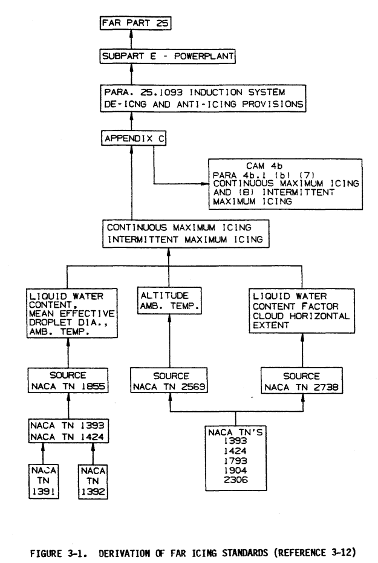
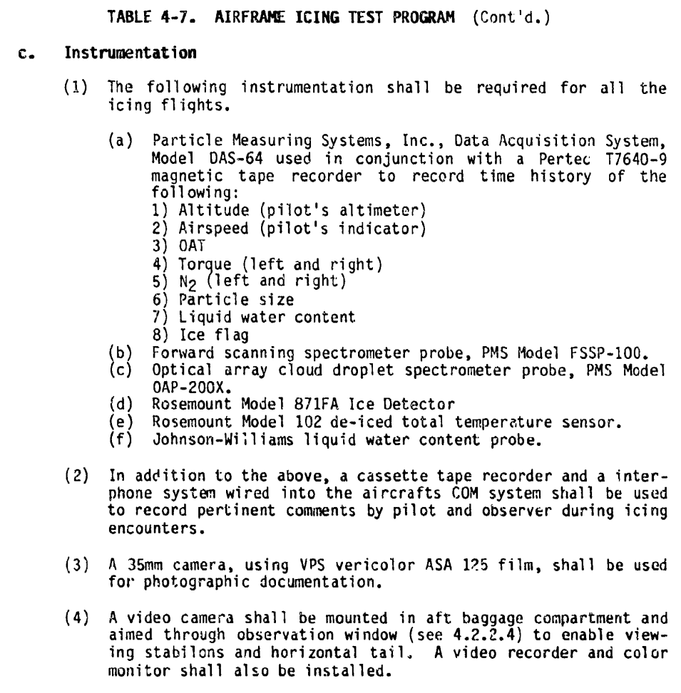

title: Conclusions of the Meteorological Instruments Thread  
Date: 2023-01-08 12:00  
category: NACA  
tags: instruments  

### _"difficulties with the calibration proved to be more serious than had been anticipated"_ [^1]  

    

## Summary  
The meteorological instruments and data from the NACA-era are still used today.  

## Key Points  
1. The rotating multicylinder was the primary instrument that determine the values in the current Appendix C icing regulations.  
2. Other instruments gave supplementary data, but were calibrated against the rotating multicylinder.  
3. Later publications document the continuing use of the NACA-era instruments.  

## Discussion  

### NACA-era instruments  

In this [Meteorological Instruments thread]({filename}instruments.md) we saw several instruments and technologies:  

- Rotating Multicylinders  
- Fixed Cylinder  
- Rotating-Disk Icing-Rate Meter  
- Capillary Collector  
- Rainbow Recorder  
- Dew-Point Recorder  
- Visibility Meter  
- Sooted Slides (and oiled slides)  
- Drop Photography  
- Heated probes  
- Inference from drop impingement  
- Modified pressure probe  
- Corona discharge (multicylinder)  

### Instruments used to derive icing requirements  

The instruments and flight data from the NACA-era were used to develop 
the current "Appendix C" icing certification standard [^2]. 

 

[^3]  

[As we saw in ["Conclusions of the Cylinder Thread"]({filename}cylinder_thread_wrap_up.md), 
it is not entirely clear where this figure originally came from.]  

The instruments from the individual NACA publications were:  

NACA-TN-1391 (1947) [^4]  
- free-air temperature  
- dew-point meter for water content  
- fixed cylinder for maximum drop size  

NACA-TN-1392 (1947) [^5]  
- free-air temperature  

NACA-TN-1393 (1947) [^6]  
- free-air temperature  
- rotating cylinders (MVD, distribution, liquid water content)  

NACA-TN-1424 (1947) [^7]  
- free-air temperature  
- rotating cylinders (MVD, distribution, liquid water content)  
- rotating disk (liquid water content)  

NACA-TN-1793 (1949) [^8]  
- free-air temperature  
- rotating cylinders (MVD, distribution, liquid water content)  

NACA-TN-1904 (1949) [^9]  
- free-air temperature  
- rotating cylinders (MVD, distribution, liquid water content)  
- rotating disk (liquid water content)  
- cloud indicator (heated cylinder) (liquid water content)  
- fixed cylinder for maximum drop size  

NACA-TN-2306 (1951) [^10]  
- free-air temperature  
- rotating cylinders (MVD, distribution, liquid water content)  
- three rotating disks "Installed for comparison and developmental tests" (liquid water content)  
- cloud indicator (heated cylinder) (liquid water content)  
- fixed cylinder for maximum drop size  

NACA-TN-1855, NACA-TN-2569, and NACA-TN-2738 all used the NACA publications noted. 
NACA-TN-2569 used a limited amount of additional data from the NRCC (National Research Council Canada), 
largely for intermittent maximum icing conditions. 

    

We see that the rotating cylinder was used in all cases 
(except for the early NACA-TN-1391 and NACA-TN-1392). 
The cloud indicator (heated probe) and rotating disk were used in some cases 
to provided LWC values with better time resolution 
(on the order of seconds, rather than the minutes of the rotating cylinders method).  

The fixed cylinder provided information on maximum drop size 
(which is not directly part of the Appendix C regulation). 
The later flight tests (NACA-TN-1904, NACA-TN-2306) used a full suite of instruments. 

The NRCC had arrived at a similar instrumentation suite by 1952 [^11].    

  

### Later comments about NACA-era instruments

#### ADS-4, “Engineering Summary of Airframe Icing Technical Data”, 1964 [^12]  

We see several NACA-era instruments recommended for use in 1964:  

>The flight test aircraft must have instrumentation to determine liquid water
content and droplet size, or a means of determining ice accretion rate and
extent of impingement from which these parameters can be established.
Rotating multi-cylinders are the standard instruments, 
but are inconvenient to use on pressurized aircraft.
The NACA icing rate-meter or any calibrated ice
detector can be used to determine liquid water content; whereas drop size can
be approximated from extent of impingement on any shape with known 
impingement characteristics.  

The "NACA icing rate-meter" is presumably the rotating disk,
although the modified pressure probe was sometimes referred to as 
an icing rate meter. 
The fixed cylinder is a likely shape to use for "drop size can
be approximated from extent of impingement on any shape with known 
impingement characteristics".  

#### Review of Icing Criteria; William Lewis in [1969 Aircraft Ice Protection Report of Symposium]({filename}1969 Aircraft Ice Protection Report of Symposium.md) [^1]   

William Lewis summarized icing criteria, such as drop size and LWC values. 
He had comments on the NACA era instrumentation that was used to measure them.  

>Anticipating a need for more extensive and representative statistical
icing data, both Ames and Lewis Laboratories in 1949 undertook to develop
automatic instruments suitable for routine use on transport airplanes.
Unfortunately, the difficulties involved in the measurement of cloud
parameters proved so formidable that neither attempt was completely
successful. The Ames Laboratory developed a heated-wire instrument for
measuring liquid water content that provided excellent in flight, in the
hands of research personnel. However, it was to complicated for automatic
operation; and reduction of data was a complex and difficult procedure,
therefore, it was never used extensively. The net result was an excellent
research instrument and a very meager amount of data. Meanwhile, the
Lewis Laboratory began with the development of a __very simple cyclic icing
rate meter__.  
 
[The [modified pressure probe described in NACA-RM-E51E16]({filename}modified pressure probe.md)].  
 
>Problems were encountered with the calibration, but since the
device was so well adapted to automatic operation, arrangements were made
with the airlines to begin an extensive program of data collection. As
the program progressed, __difficulties with the calibration proved to be more
serious than had been anticipated__, but data collection continued to expand.
The net result was a large amount of data providing useful information on
such factors as horizontal and vertical extent of icing conditions, but
considerable uncertainty remains as to the meaning of indications of icing
rate and liquid water content. The data from this program was published
in three reports (ref. 2, 3, 4) each containing tabulations of liquid water
content and a description of calibrations in use at that time. Apparently,
as the data were worked up __the calibration was changed from time to time
as a result of further studies__. I see no other possible explanation for the
striking differences among the three reports.  

>One convenient statistic that may be used for an overall comparison of data
from various sources is the 99th percentile of liquid water content from
the entire distribution without classification by either drop size or
temperature. This comparison is shown in figure 2. Values from various
sources are plotted on a time scale to provide historical perspective and
show the apparent trend in the airline data. The airline data and the
Russian data from scheduled soundings probably contain a negligible fraction
of measurements in cumulus clouds, and are therefore comparable to the
early research data from stratiform clouds.

  

Figure 2 shows the diminishment in "NACA - Airline" LWC values, 1950 to 1955.  

A question was asked about what instruments to use (in 1969), 
with different groups giving differing answers:  

>DISCUSSIONS FOLLOWING MR. LEWIS'S PRESENTATION ON
"REVIEW OF ICING CRITERIA"  
Question:  
>If investigations were initiated today, what
instruments would you use for measuring drop size
and liquid water content?  
>Answer:  
(NASA) - Still a problem, have no recommendation.  
(Boeing) - We have been using a "photographic oil
slide" obtained from the airstream with success.  
(Canadian Pratt & Whitney) - In this regard, I'd
like to point out a British Publication by R. F.
Jones, which covers the "Determination of Ice
Crystals," and can be found in "Aeronautical Society,"
Vol. 63, 1959.  

It would appear that the use of the multicylinder was waning by 1969.  

####  DOT/FAA/CT-83/21, "A new database of supercooled cloud variables for altitudes up to 10,000 feet AGL and the implications for low altitude aircraft icing" (1983) [^13]  

This had comments (in 1983) about the multicylinder, rotating-disk probe, and cloud indicator:    
> In 1952, after the NACA researchers became aware of the seriousness
of runoff errors for measurements at temperatures just below 0°C, they
reexamined their data and concluded that not more than about 5% of the
reported measurements would be affected (ibid.). A more significant problem
may have been the underindication of average LWC from measurements where the
multicylinder probe was exposed in clouds containing momentary voids. In
order to correct for this, some of the NACA flights made use of a continuously
recording, rotating-disk probe, or "cloud indicator" to document the actual
duration of clouds and voids during exposure of the multicylinder probes. As
a result, significantly larger values of average LWC were obtained in some
cases when the more accurately determined cloud exposure intervals were used
(Lewis and Hoecker, 1949, Table 1).  

I do not agree with the assertion that 
"Droplet size distributions were finally given up as totally unreliable":  
> Droplet size distributions were finally given up as totally unreliable
when NACA researchers concluded in 1949 that there were too many contradictions 
in droplet sizes as inferred from the multicylinder probes vs. the
coated, fixed-diameter cylinder probes (ibid., p. 1, p. 16). However, the
median volume diameters inferred from the multicylinder method alone were
still regarded as accurate for "small" droplets but became increasingly
inaccurate as the drop size increased. Also, large overestimates were more
probable than large underestimates, especially at large values of droplet
diameter (Lewis and Bergrun, 1952, p. 17) 

["ibid." above is Lewis and Hoecker, NACA-TN-1904, 1949, 
"Lewis and Bergrun, 1952" is NACA-TN-2738.]

Many NACA publications cite the Langmuir distributions after 1949 and 1952 
(for example, NACA-TN-3338, 1955), 
so it was not a consensus opinion that they were "totally unreliable". 

NACA-TN-2708 comments about the method used to infer that 
the multicylinder drop size distributions were not accurate:     
>it has not been demonstrated that the maximum effective diameter,
as determined by the method described by Lewis and Hoecker, bears the
presumed relationship to the volume median diameter and the drop-size
distribution.

The FAA guidance material also still cites Langmuir distributions (AC 20-73A, 2016 [^14]).  

#### Aircraft Icing Handbook (1992), Vol. II [^15]  

An example in the Handbook for natural icing flight tests 
shows several instruments:  

  

The Forward scanning spectrometer probe and the 
Optical array cloud droplet spectrometer probe 
provide detailed drop size spectrum information. 
The two different technologies measure different, 
slightly over-lapping, size ranges. 
Additional or different instruments may be required to 
cover the broader drop size ranges of "Appendix O" 
supercooled large drop (SLD) icing (rule enacted after 1992). 

The Johnson-Williams liquid water content probe is 
a descendant of the NACA heated probes. 
Otherwise, NACA-era instruments are no longer mentioned for flight tests. 

However, rotating cylinders and the oil slide method are mentioned 
for calibrating icing wind tunnels and engine test facilities.   

#### FAA Technical Center, 2006  

A series was published on several instruments for use in flight tests.  
While they focuses more on what to use now, it has some mentions of NACA-era instruments.  

- Cloud Sampling Instruments for Icing Flight Tests: (1) Icing Rate Indicators [^16]  
- Cloud Sampling Instruments for Icing Flight Tests: (2) Cloud Water Concentration Indicators [^17]  
- Cloud Sampling Instruments for Icing Flight Tests: (3) Cloud Droplet Sizers [^18]  
- Cloud Sampling Instruments for Icing Flight Tests: (4) Large Drop Sizers [^19]  

#### "100 years of progress in atmospheric observing systems", 2018 [^20]  

"100 years of progress in atmospheric observing systems" 
has Table 2-2, which shows the introductions of several instruments, 
including many of the icing instruments noted above.  

## Conclusions  

The instruments and flight tests that determined the still current 
Appendix C icing regulations were completed by 1951. 
The primary instrument was the rotating multicylinder, 
with other instruments providing finer resolution or supporting data. 
The other instruments were calibrated against the rotating multicylinder. 

The modified pressure probe saw use later. 
Significant amounts of airline flight icing data were obtained. 
However, questions about the calibration apparently kept that data 
from wide use, and the data does not appear to have influenced the Appendix C regulations. 

As we saw in ["Conclusions of the Cylinder Thread"]({filename}cylinder_thread_wrap_up.md), 
cylinder instruments are still used today (although not so much the rotating multicylinder).  

## Related  

The next thread in the NACA review series is the [Ice Protection Thread](ice%20protection.md).  

##Notes:  

[^1]: Lewis, William: "Review of Icing Criteria" in 
Anon., "Aircraft Ice Protection", the report of a symposium held April 28-30, 1969, by the FAA Flight Standards Service;  Federal Aviation Administration, 800 Independence Ave., S.W., Washington, DC 20590. I could not find this on the NTRS or on the FAA site. It is available at [DTIC](https://apps.dtic.mil/sti/pdfs/AD0690469.pdf).  
[^2]: "Airworthiness Standards: Transport Category Airplanes," U.S. Department of Transportation,
Federal Aviation Administration, Federal Aviation Regulations, FAR Part 25, Washington, D.C.  
[^3]: “Aircraft Icing Handbook, Volume I.” DOT/FAA/CT-88/8-1 (1991) https://apps.dtic.mil/sti/pdfs/ADA238039.pdf .  
Also note that there was a perhaps little known update in 1993 (that did not affect the pages of interest herein): https://apps.dtic.mil/sti/pdfs/ADA276499.pdf  
[^4]: Lewis, William: Icing Properties of Noncyclonic Winter Stratus Clouds. NACA-TN-1391, 1947.  
[^5]: Lewis, William: Icing Zones in a Warm Front System with General Precipitation. NACA-TN-1392, 1947.  
[^6]: Lewis, William: A Flight Investigation of the Meteorological Conditions Conducive to the Formation of Ice on Airplanes. NACA-TN-1393, 1947.  
[^7]: Lewis, William, Kline, Dwight B., and Steinmetz, Charles P.: A Further Investigation of the Meteorological Conditions Conducive to Aircraft Icing. NACA-TN-1424, 1947.  
[^8]: Kline, Dwight B.: Investigation of Meteorological Conditions Associated with Aircraft Icing in Layer-Type Clouds for 1947-48 Winter. NACA-TN-1793, 1949.  
[^9]: Lewis, William, and Hoecker, Walter H., Jr.: Observations of Icing Conditions Encountered in Flight During 1948. NACA-TN-1904, 1949.  
[^10]: Kline, Dwight B., and Walker, Joseph A.: Meteorological Analysis of Icing Conditions Encountered in Low-Altitude Stratiform Clouds. NACA-TN-2306, 1951.  
[^11]: Pettit, K. G.: "'The Rockcliffe Ice Wagon' and its role in Canadian icing research." Publ. R. Met. Soc. Canad. Branch, Toronto 2 (1951). http://cmosarchives.ca/RMS/r0205.pdf  
[^12]: Bowden, D.T, et.al., “Engineering Summary of Airframe Icing Technical Data”, FAA Technical Report ADS-4, General Dynamics/Convair, San Diego, California, 1963 [ADS-4](https://apps.dtic.mil/sti/citations/AD0608865)  
[^13]: Jeck, R.: "A new database of supercooled cloud variables for altitudes up to 10,000 feet AGL and the implications for low altitude aircraft icing. US Department of Transportation Rep." Transportation Rep. DOT/FAA/CT-83/21 137 (1983).  
[^14]: Federal Aviation Administration "Aircraft Ice Protection," Advisory Circular 20-73A, 2016.  
[^15]: Heinrich, A., et al. Aircraft Icing Handbook. Volume 2. GATES LEARJET CORP WICHITA KS, 1991. https://apps.dtic.mil/sti/citations/ADA238040  
[^16]: Jeck, Richard: Cloud Sampling Instruments for Icing Flight Tests: (1) Icing Rate Indicators. US Department of Transportation, Federal Aviation Administration, DOT/FAA/AR-TN06/29, 2006. 
http://www.tc.faa.gov/its/worldpac/techrpt/artn06-29.pdf  
[^17]: Jeck, Richard: Cloud Sampling Instruments for Icing Flight Tests: (2) Cloud Water Concentration Indicators. US Department of Transportation, Federal Aviation Administration, DOT/FAA/AR-TN06/30, 2006. 
http://www.tc.faa.gov/its/worldpac/techrpt/artn06-30.pdf  
[^18]: Jeck, Richard: Cloud Sampling Instruments for Icing Flight Tests: (3) Cloud Droplet Sizers. US Department of Transportation, Federal Aviation Administration, DOT/FAA/AR-TN06/31, 2006. 
https://www.tc.faa.gov/its/worldpac/techrpt/artn06-31.pdf
[^19]: Jeck, Richard: Cloud Sampling Instruments for Icing Flight Tests: (4) Large Drop Sizers.  US Department of Transportation, Federal Aviation Administration, DOT/FAA/AR-TN06/32, 2006. 
https://www.tc.faa.gov/its/worldpac/techrpt/artn06-32.pdf  
[^20]: Stith, Jeffrey L., et al. "100 years of progress in atmospheric observing systems." Meteorological Monographs 59 (2018): 2-1.  
https://journals.ametsoc.org/view/journals/amsm/59/1/amsmonographs-d-18-0006.1.xml    
