title: Estimating Icing Conditions with Highest Drag  
date: 2026-07-27 18:30
tags: ice shapes, drag, Appendix C

### _"These data will be useful in evaluating and formulating ice accretion analyses and also performance penalty predictions."_  
_from NASA-TM-83556._  

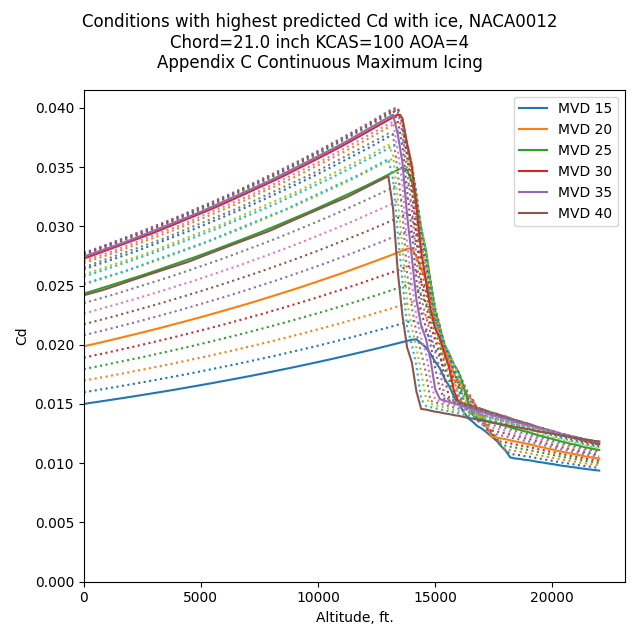  

## Summary  

In ["Ice Shape Drag Correlations"]({filename}ice_shape_drag.md) 
a correlation of drag due to icing was detailed using data from NASA-TM-83556 [^1]. 
Here, we use the correlation to predict or estimate which icing conditions can result in the highest drag.  

The icing conditions predicted to have the highest Cd values cluster in 
a limited range of Figures 1 and 2 of Appendix C [^2], 
even when wide ranges of airspeed and altitude are considered.  

## The Appendix C, Figure 1 Icing Environment  

We will use the Appendix C Continuous Maximum Icing Conditions.  

Appendix C Figure 1 defines LWC as a function of water drop size MVD
(noted as "Median Effective Drop Diameter").  

  
_Public Domain image._   

There is a standard horizontal extent of 17.4 nmi. defined that will be used here.  

A true airspeed of 100 KTAS (51.4 m/s, 185.2 KPH) was selected. 
This is in range of the experimental cases of NASA-TM-83556. 
At the selected airspeed, 626 seconds is required to traverse the 17.4 nmi standard distance.  

To simplify the analysis, all cases will use the NACA0012 airfoil at AOA=4.  

Initially, we will consider an altitude of 0 ft. and a chord length of 0.533 m (21 inch) 
to match NASA-TM-83556 cases.  

For the drop sizes, there are different peak Cd values and conditions. 
The highest Cd values occur near 28F and MVD values of 30 or 35. 
For reference, the clean airfoil Cd value is 0.008 at AOA=4.  

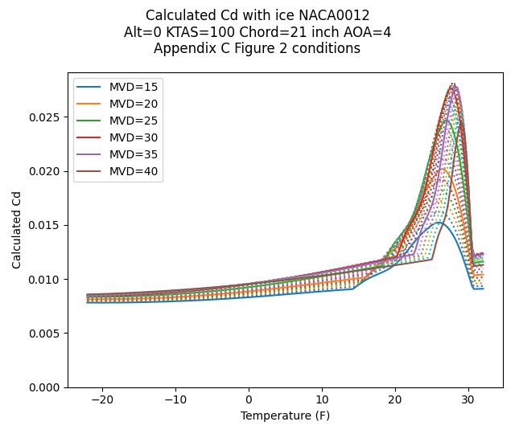

A closer view allows us to see the intermediate drop sizes considered (not labeled). 
A slightly higher peak Cd is at 33 MVD.  

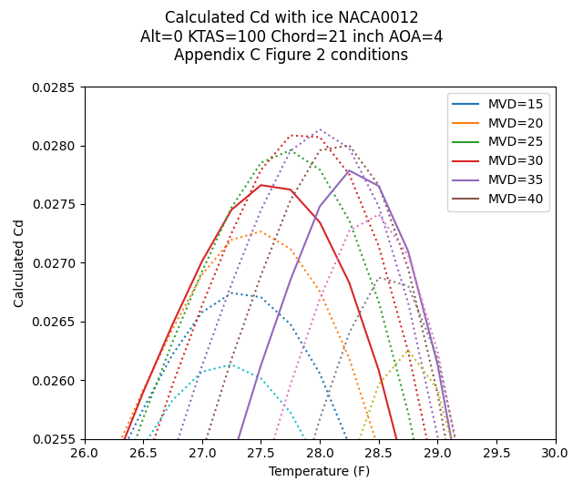  

However, the differences are very small between the candidate peaks. 
The Cd value varies by less than 1%, and the temperature by less than 1F.
This illustrates that analysis at the labeled MVD values (increments of 5) is entirely adequate, 
particularly given that the calculated Cd correlation has a +/-20% variance compared to experiment.  

## Flight cases   

For cases in flight, Appendix C Figure 2 defines temperature and altitude boundaries. 
At higher altitudes, there is a smaller range of applicable temperatures. 
This, combined with Figure 1, leads to less available water at higher altitudes.  

  
_Public Domain image._  

Another consideration for flight is airspeed. 
The "calibrated" airspeed [CAS](https://en.wikipedia.org/wiki/Calibrated_airspeed) (m/s) or KCAS (nmi/hr) is used here. 
As the AOA in these examples is fixed (AOA=4), 
CAS represents a condition where level flight is achieved at constant weight 
for differing airspeed. 
Every altitude and temperature will have a unique true airspeed value. 
This results in varying time required to traverse 17.4 nmi.  

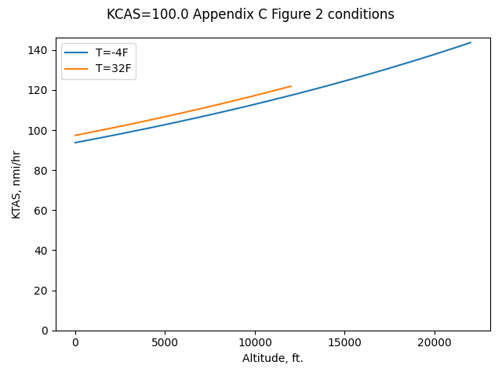  

With a chord length of 21 inch to match that in NASA-TM-83556, 
the peak Cd values is predicted to be at about 13,400 ft. 
The drop size for the peak is 33 MVD. The temperature was 27F. 
Except for the altitude, these conditions values are similar to those 
for the 0 ft. altitude case.  

  

The peak Cd values tend to increase with altitude, up to a point, 
due to several factors, including increasing true airspeed, 
higher Ko value ("modified water drop inertia parameter)", 
and the resulting greater water drop collection efficiency.  

## Effect of chord length and airspeed  

A range of airspeed was considered, and a range of chord lengths. 
These values extend beyond the range of the experimental data in NASA-TM-83556, 
so the results are speculative.  

Peak drag conditions are a function of airspeed and chord length.  

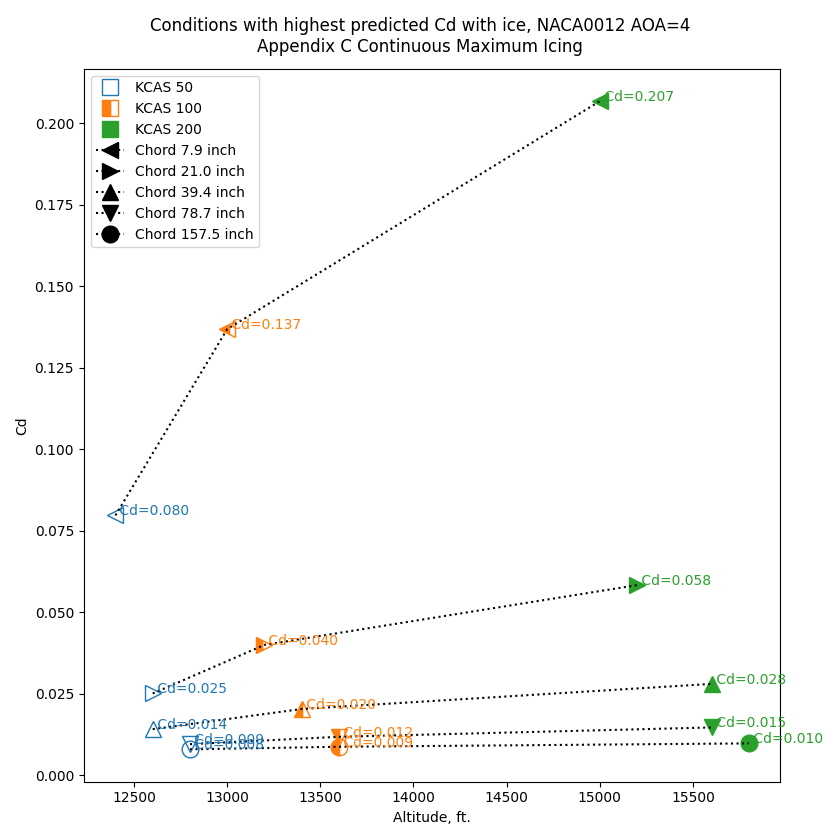  

Small airfoils have a higher Cd value due to ice partly because Ac, the 
ratio of potential ice accumulation thickness to chord length, 
is higher for the same icing conditions. 
This approximates the ice shape being a larger portion of the chord length. 
Also, the Ko value is higher for a shorter chord length, 
and ko is a component in the correlation of iced Cd.  

The conditions for peak Cd are found along the upper-right boundary of Appendix C, Figure 2. 
At higher airspeed, the temperature values are lower.  

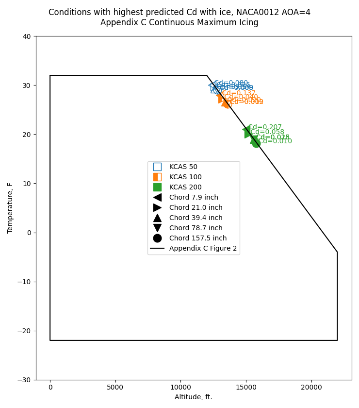  

The conditions cluster in a limited range of LWC and drop size values, 
despite the large range of airspeed and chord values.  

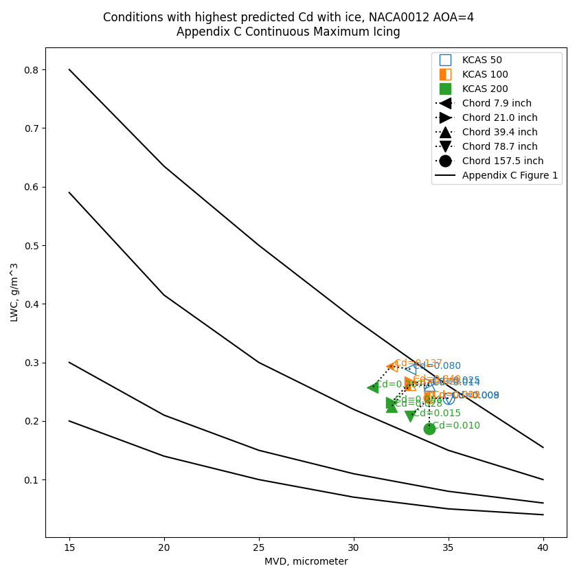  

A more detailed view:  

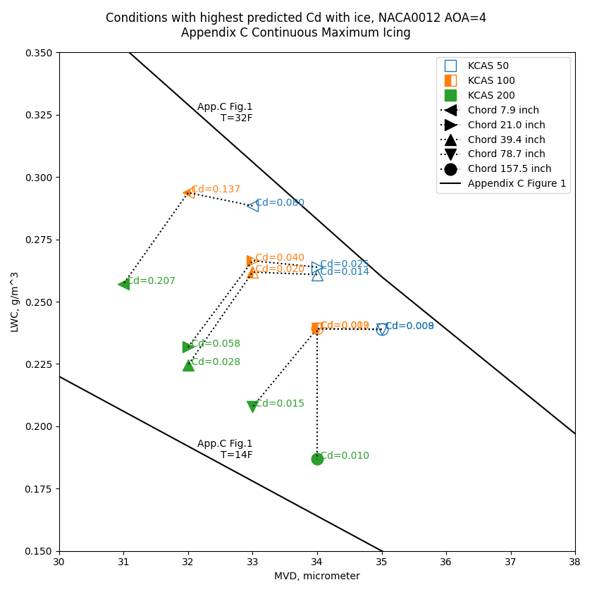  

## Conclusions  

Drag, represented as Cd, was selected as a metric, as it has a measurable effect on airplane performance. 
There are 49 experimental data points from NASA-TM-83556 that establish usable trends to 
form a correlation.  

The range of chord lengths are useful for estimating the effects on different sized aircraft, 
but also for estimating the effects of different components on one aircraft. 
The wing may have a large chord, the horizontal stabilizer a smaller one, 
and components such as aerodynamic fences, wing tip treatments, and air data probes 
have smaller yet effective chord lengths.  

The observation that peak drag conditions do not vary markedly with chord length allows 
one or a few "critical" icing conditions to be selected as representative. 
We also saw that the peak Cd value does not change much between 30 and 35 MVD (<1%), 
so determining the "exact" condition is not critical.   
 
These observations are useful for analyzing conditions, 
but may be of limited use to pilots in flight. 
Airspeed, altitude, and temperature are indicated on the flight deck, 
but LWC and MVD are only indicated in specially equipped research flights.  

### Comparisons to a prior analysis  

Previous studies to identify design icing conditions, such as [Wilder]({filename}wilder.md) [^3], 
have looked at maximum water catch as a criteria. 
That study yielded 25 MVD as the maximum water catch drop size for a large airfoil.  

  
_Public Domain image._   

The 747 aircraft discussed in Wilder has had a long and successful service record in icing conditions, 
so the selected design point could not have been far off from a representative condition, 
or being a little off has little effect. 
For large airfoils, the predicted increase in drag at even the worst case conditions is small. 
Perhaps the drag from ice was a minor (or even insignificant) decrement to performance.  

The 747 airfoil has a different ratio of leading edge diameter of curvature to chord length than the NACA0012 airfoil, 
with is a factor in the correlation of the Cd value with ice. 
The BAC 470 airfoil in Figure 9 appears to have a leading edge curvature to chord ratio of 0.016, about half that of the NACA0012.  

  
_Public Domain image._  

So, we will stretch the Cd correlation once again for an airfoil that was not in the 
NASA-TM-83556 data. 
This is putting a lot of faith in the dimensionless parameter being applicable over a wide range. 
Using the flight conditions listed in Wilder for a horizontal stabilizer analysis, 
the iced Cd correlation yields maximum value at MVD=31.  

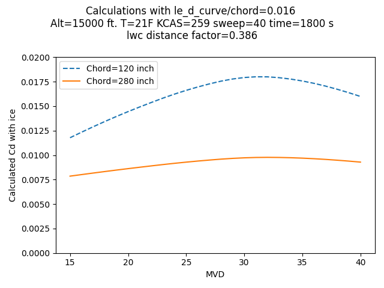  
 
I am not advocating for the abandonment of prior, successful methods. 
The drag correlation method described may or may not be an incremental improvement, 
and only more data can determine the merits.  
 
### What about the effect of ice on lift?  

There is not a study as large as NASA-TM-832556 for the effects of specific icing conditions on lift, 
so it was not attempted to determine a general correlation for lift. 

Drag has been termed a "leading indicator" for effects on lift, 
for clean airfoils as well as iced cases. 
Drag due to ice is a useful indicator as it can have measurable effects at a nominal angle of attack, 
while the lift may remain relatively close to the clean airfoil value until Cl_max is approached (which typical flight would not approach). 
Ice may be accreted at a nominal angle of attack, 
but then maneuvers may require a higher angle of attack, 
and non-normal maneuvers can approach Cl_max.  

### What about Appendix O conditions?  

Appendix O [^4] defines large supercooled drop (SLD) icing conditions. 
The LWC values are roughly comparable to Appendix C, 
but the drops sizes are different. 
Distributions of drop sizes are defined.    

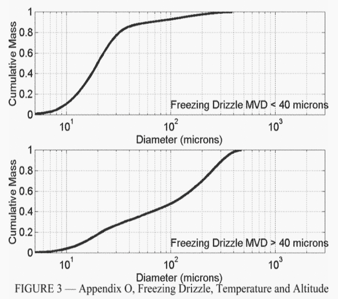  
_Public Domain image._   

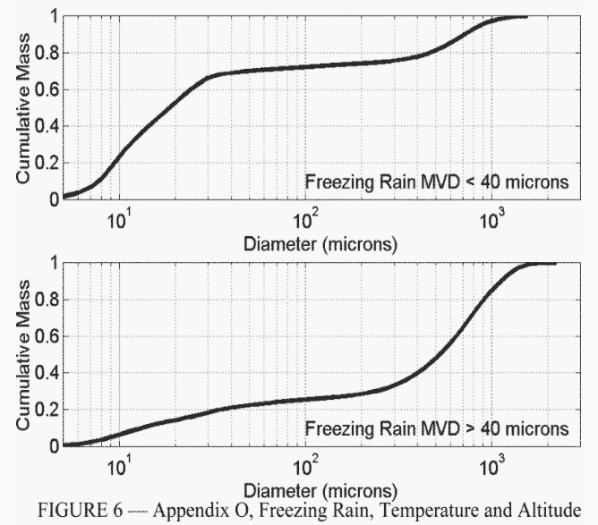  
_Public Domain image._   

The correlation used above has MVD as the only drop size indicator. 
MVD may not be representative of the wide (orders of magnitude) drop size distributions of SLD conditions.  

If one were to just use MVD anyway, 
the "freezing drizzle MVD < 40" and "freezing rain MVD < 40" distributions would 
yield results roughly comparable to those for Appendix C conditions with MVD=20.  

However, the "freezing drizzle MVD > 40" and "freezing rain MVD > 40" have MVD 
values of 100 and 500. These are well outside the range considered in NASA-TM-83556. 
The calculated values of Cd with ice would be very high, largely because the Ko values are high, 
and Ko is an important component in the drag correlation. 
This would require extrapolation well beyond the range of experimental values, 
so I am skeptical that the correlated linear relationship holds over such a large range.  

The physics of large drops may mitigate the apparently high values of Cd. 
Distortion of large drop before impact may result in higher drag for the drop, 
effectively acting as a smaller drop. 
Large drops can break up before impact, or splatter on impact, effectively acting as smaller drops.  

As with many topics in aircraft icing:  

> "Additional data needs to be collected to further substantiate these observations..."  
>_From NASA-TM-83556._  

## Related  
 
This post is an addendum to the [Ice_Shapes and Their Effects_thread]({filename}ice_shapes_thread.md), 
and was written after 
[Conclusions of the Ice Shapes and Their Effects Thread]({filename}Conclusions%20of%20the%20Ice%20Shapes%20and%20Their%20Effects%20Thread.md). 
It refines and expands information from the thread. 
I may eventually edit "Conclusions of the Ice Shapes and Their Effect Thread" 
to incorporate this information.  

## Notes  

[^1]: Olsen, W., Shaw, J., and Newton, J. "Ice Shapes and the Resulting Drag Increase for a NACA 0012 Airfoil." NASA-TM-83556, January 1984. [ntrs.nasa.gov](https://ntrs.nasa.gov/citations/19850019527)  
[^2]: Appendix C of the United States Chapter 14 Code of Federal Regulations Part 25 [ecfr.gov](https://www.ecfr.gov/current/title-14/chapter-I/subchapter-C/part-25/appendix-Appendix%20C%20to%20Part%2025)  
[^3]: Wilder, Ramon W.: "Techniques used to determine Artificial Ice Shapes and Ice Shedding, Characteristics of Unprotected Airfoil Surfaces" in Anon., "Aircraft Ice Protection", the report of a symposium held April 28-30, 1969, by the FAA Flight Standards Service; Federal Aviation Administration, 800 Independence Ave., S.W., Washington, DC 20590. [ntrl.ntis.gov](https://ntrl.ntis.gov/NTRL/dashboard/searchResults/titleDetail/AD690469.xhtml).  
[^4]: Appendix O of the United States Chapter 14 Code of Federal Regulations Part 25 [ecfr.gov](https://www.ecfr.gov/current/title-14/chapter-I/subchapter-C/part-25/appendix-Appendix%20O%20to%20Part%2025)  
 