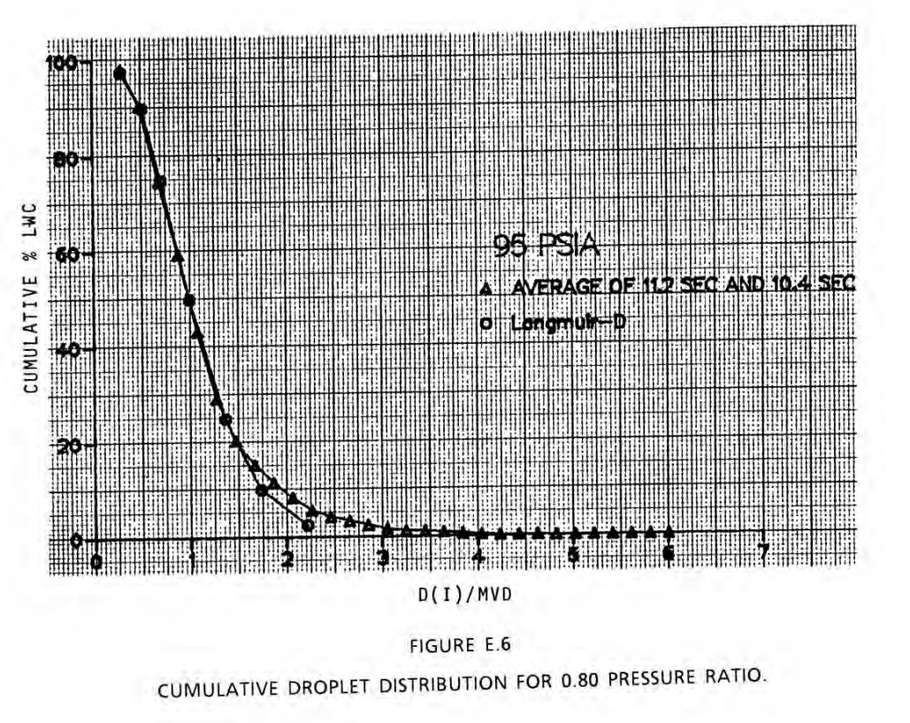
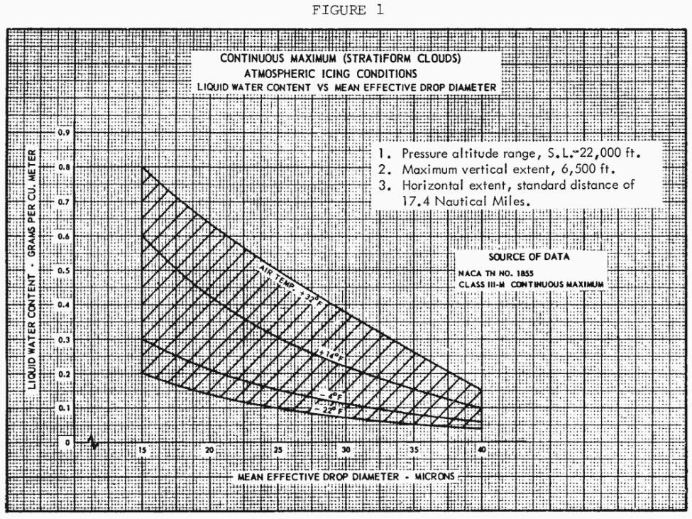

Title: Conclusions of the Cylinder Thread   
Category: NACA  
tags: cylinder  
status: draft 

> ##"The collection of ice by the cylinders is similar to the collection of ice by airplane components." [^1]

#Conclusions of the Cylinders Thread 

##Summary  
Data from the post-NACA era is used to resolve open questions

##Key points
We will answer questions about:
1. differences in analysis methods between Langmuir and Blodgett, and NACA-TN-2904 (which one is more accurate?)
2. the accuracy of the multicylinder method 
3. How representative are Langmuir drop size distributions of natural and artificially produced drop size distributions? 

##Discussion

###Review of the Cylinders thread so far

In the Cylinders thread, we saw:

- A pioneering analysis of water drop impingement on a cylinder (NACA-TN-779)
- The most cited aircraft icing publication, with more detail of water drop impingement on a cylinder, and the rotating multicylinder instrument
("Mathematical...") 
- In flight icing measurements and an icing severity index (NACA-TN-1393)
- An additional way to estimate drop size on a fixed cylinder (NACA-TN-1424)
- Nine icing instruments compared (NACA-RM-A9C09)
- The ability of the multicylinder method to determine drop distribution was questioned several times, including NACA-TN-1904
- a comparison test of three similar multicylinders found differences (NACA-TN-2708) 
- ["A Langmuir B drop size distribution is almost a normal distribution"]({filename}A Langmuir B distribution is almost a normal distribution.md)
- The effect of compressibility on impingment calculation was found to be "negligible" (NACA-TN-2903) 
- An analysis method to "more precisely" calculate water drop impingement was presented (NACA-TN-2904)
- Data analysis methods can affect multicylinder results (NACA-RM-E53D23) 
- The effect of incomplete freezing in some cases on multicylinder results was quantified (NACA-TR-1215)
- A pioneering dye-tracing impingment test method was used (NACA-TN-3338) 

And several programs in the Python programming language are available to reproduce the results in several cases. 

###Open questions

We will look at some data from the post-NACA era to help resolve these questions.
1. differences in analysis methods between Langmuir and Blodgett, and NACA-TN-2904 (which one is more accurate?)
2. the accuracy of the multicylinder method 
3. How representative are Langmuir drop size distributions of natural and artificially produced drop size distributions? 

##NASA-CR-4257

This reference certainly merits a more complete review, but for now we will settle for a summary. 

In this publication, a dye-tracer method similar to NACA-TN-3338 was used on a 6 inch cylinder for two test cases. 
Water drop impingement rates were measured and presented as beta curves. 
The repeatability of the results was estimated as +/-10%.
There are also beta curves determined by water drop trajectory analysis (the "Breer" method).

[Note: I have worked with one of the authors, Marlin Breer.]

Two cases were measured, at 20.36 and 16.45 MVD.

  

  

Detailed drop size distributions were measured using a "Fiber Optics Particle Sizing System". 
30 bin data were published 
(although some of the larger drop size bins had zero water, 
so they are effectively 23 to 27 bin data). 
They were compared to a Langmuir D distribution.
(Nozzle pressure ratios corresponding to the cases above).

 

##LEWICE  

This reference also certainly merits a more complete review, but for now we will settle for a summary. 

The LEWICE computer program calculates water drop impingement rates on a body.
(It can also calculate ice shapes). 

LEWICE uses, by default, a compressible, potential flow solution 
(users have an option to use a separately determined flow solution). 
Drop trajectories are calculated by releasing drops upstream, 
and seeing where they impinge (not unlike the methods in NACA-TN-779, Langmuir-Blodgett, and NACA-TN-2904).

We will use it to get calculated water impingement rate values to compare to other data.

##Comparison of impingement calculation methods

We can use the detailed drop distribution data from NASA-CR-4257 to calculate water catch rate curves on the cylinder. 

The NACA-TN-2904 method tends to give higher values for both the maximum Beta value 
and the total water catch Em value, compared to the test and to the other analysis methods. 

The LEWICE and Langmuir-Bodgett analyses agree well with each other, 
and agree fairly well with the test values (within the +/-10% variation). 
The Breer method trends slightly lower.

  

  

The results are compared in tables below. 
The theta_max values for the Breer method may not have been digitized well by me, 
as they were difficult to discern from the figures. 
 
Method               |Em   |Beta_max|Theta_max
---                  |---  |---     |---
Test Figure 6.6A     |0.380|0.540   |69.9
Breer analysis       |0.352|0.520   |81.2
LEWICE               |0.373|0.556   |81.6
NACA-TN-2904         |0.397|0.620   |82.0
Langmuir and Blodgett|0.376|0.540   |81.7

Method               |Em   |Beta_max|Theta_max
---                  |---  |---     |---
Test Figure 6.6B     |0.245|0.430   |63.2
Breer analysis       |0.259|0.445   |69.9
LEWICE               |0.288|0.480   |79.8
NACA-TN-2904         |0.308|0.549   |80.9
Langmuir and Blodgett|0.287|0.461   |80.2

While I am inclined to view the Langmuir and Blodgett method as more accurate than the NACA-TN-2904 method, 
I would like to see more impingement data to determine it with more confidence. 
There is more cylinder test data that I am aware of, but as ice shapes, 
not direct impingement measurements, so the question may be not completely resolved. 

##Multicylinder method measurement accuracy

Alas, cylinders of different diameters were not included in NASA-CR-4257. 
However, three different cylinder diameters were included in NACA-TN-3338. 
We will take another look at that data, and analyze it as multicylinder data.

I wonder why NACA-TN-3338 did not use the "go-to" method of the multicylinder analysis. 
This was perhaps another lost opportunity for a drop size comparison that would not require technology beyond what was available. 
Author von Glahn was familiar with the multicylinder instrument. 
He was an author of NACA-RM-E51B12, which noted the use of multicylinders 
in the calibration of the icing tunnel: 
> Cloud droplet sizes and liquid-water contents in the tunnel
were measured by the rotating-multicylinder method and were in the
range of natural icing conditions. 

While the cylinders were not rotating, that does not limit the applicability of the method, 
as the main reason for rotating the cylinders is to make any ice accretion stay close to a cylindrical shape,
rather than some other shape for which the impingement characteristics are not known. 
With the dye-tracer method, the surface shape does not change. 

We will use the Python tools previously developed for multicylinders, 
using the Langmuir and Blodgett, and the NACA-TN-2904 implementations. 

 

I digitized only one set of values for each cylinder diameter. 
Industrious readers may wish to clone the software repository, 
digitize more cases, and see if the results below still hold up. 

Note the small and subtle difference between MED and MVD from AC 20-73A:

>Appendix C icing conditions: 14 CFR parts 25, Appendix C and 29, Appendix C certification
icing condition standard for approving ice protection provisions on aircraft. The conditions are
specified by altitude, temperature, liquid water content (LWC), representative drop size (mean
effective diameter (MED)), and cloud horizontal extent.

>>NOTE: In Appendix C, the term “mean effective diameter” refers to
what is now called the “median volume diameter (MVD).” The MED
of Appendix C was determined by using rotating multi-cylinders and
assuming a Langmuir distribution.

So, I will use MED when reporting multicylinder results.

Multicylinder Method| MED (micrometer) | LWC (g/m^3)| Best Fit Type
---|---|---|---
Langmuir and Blodgett (original)| 18.8 | 0.458 | E
NACA-TN-2904| 21.1 | 0.381 | E
Langmuir and Blodgett (k_phi_unique)| 21.5 | 0.413 | E

When the distributions determined by the multicylinder methods are run in LEWICE, 
the measured mass rate values are reproduced well for the Langmuir and Blodgett methods, 
and less well for the NACA-TN-2904 multicylinder method. 

 

 

So, a drop distribution determined by the multicylinder method 
(which is driven by cylinder Em values) 
can be used to reproduce well the composite water catch, built from Beta curves. 
 
This is an illustration of the applicability and accuracy of the multicylinder distribution measurements, 
at least over the range of cylinder sizes used (2, 4, and 6 inch diameter, in this case).

The comparisons above also add weight to the view that the Langmuir and Blodgett methods are more accurate than those of NACA-TN-2904. 

###A surprise from NACA-TN-3338

NACA-TN-3338 presented (at least) three drop distributions to represent the same test drop distribution. 
While I was sceptical of them, I ran them in LEWICE, 
and the Example from NACA-TN-3338 did an excellent job of reproducing the measured masses. 

When we plot the cumulative LWC vs. drop size for the distributions 
they may not appear to be very "similar", but three of them yielded very similar 
impingement analysis results. 
The NACA-TN-2904 distribution may appear similar to the "Langmuir_k_phi_unique" line, 
but the "Langmuir_k_phi_unique" line yielded a significantly better water catch result. 
So, I caution against reading too much into distribution plot comparisons for their 
relative effects on water catch. 

#Natural drop size distributions

We will apply the multicylinder method to a measured natural icing drop size distribution from FAA-RD-80-24. 
(Once again, this reference merits a more thorough review, but we will settle for a brief summary for now). 

I selected the 6000 ft data.
Alas, there was not a multicylinder instrument included in this test, 
so we will again use LEWICE to get the cylinder masses to use for the fitting. 
I use the cylinder diameters from NACA-RM-AC9C09 "Set A": 0.125, 0.5, 1.25, and 3 inch.

As in the prior examples, Beta curves were calculated with LEWICE. 
The Langmuir C best fit reproduces the measure test distribution ("ASSP") 
Beta curves very well, 
and the Langmuir E fit works well. 

So, even if multicylinder distributions may not appear to be similar to a 
more detailed, measured natural distribution, they can be used to reproduce impingement values 
quite well. 
The apparent difference in drop size distributions made 
little effective difference in impingement. 
For this case, at least, a Langmuir C fit or a Langmuir E fit both work well.
For me, this mitigates the concern expressed in NACA-TN-2904 and several other places of: 
> ... the inherent extreme insensitivity of the rotating multicylinder method to
differences in droplet size distributions ...

##NACA era data that is still used today

Data from the NACA era that is still used today include:
1. Langmuir drop size distributions
2. Icing physics terminology (K, Ko, MED, MVD)
3. Cylinder impingement correlations
4. An approximation of an airfoil leading edge
5. Icing conditions in regulations were determined largely from multicylinder data
6. Cylinder icing thermodynamics for icing indication and detection

I will show examples of each of these.

###Langmuir drop size distribution

Langmuir and Blodgett: 
 
 

AC 20-73A: 

###Terminology 
Langmuir and Blodgett: 
 

DOT/FAA/CT88-8/1:

###Correlations

DOT/FAA/CT88-8/1: 

LTR-LT-92: 

###Approximation of an airfoil leading edge 

Manual of Scaling Methods: 

 
 
 

###Icing conditions in regulations

DOT/FAA/CT88-8/1: 

CFR 25, Appendix C:

###Cylinder icing thermodynamics for icing indication and detection

NACA-TR-1215:

LTR-LT-92: 

##Notes:
[^1]: 
von Glahn, Uwe H.: The Icing Problem, presented at Ottawa AGARD Conference. AG 19/P9, June 10-17 1955, reprinted in Selected Bibliography of NACA-NASA Aircraft Icing Publications, NASA-TM-81651, August, 1981  I could not locate this on the NTRS. It is available at (https://core.ac.uk/reader/42858720) (circa November, 2021)  

https://www.sae.org/standards/content/arp5624/  

https://www.faa.gov/documentLibrary/media/Advisory_Circular/AC_20-73A.pdf