Title: A Tour of the IceVal DatAssistant     
status: draft  
tags: LEWICE, ice shapes, NASA

### _"... all publicly available IRT-generated experimental ice shapes with complete and verifiable conditions have now been compiled into one electronically-searchable database"_  
_NASA Report E-16236 [^1]._

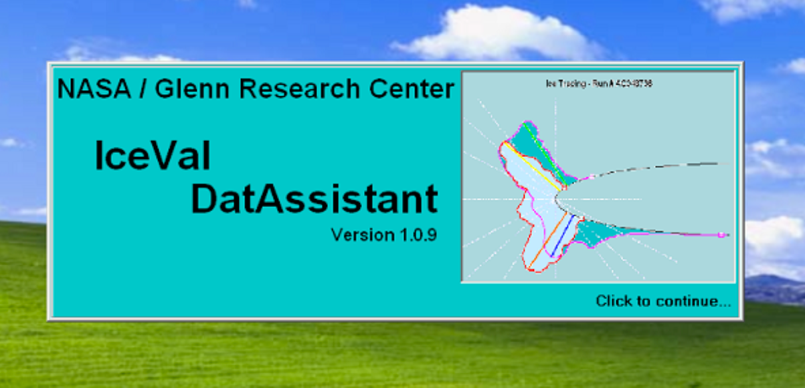  
_Public Domain NASA Report E-16236._

## A quick tour of the IceVal DatAssistant  

The IceVal DatAssistant is available from NASA. 
It runs on the Windows operating system (only). 

The IceVal DatAssistant can do several functions. 
The main interest here is the database of experimental run conditions and results.  

The tables of primary interest are IceShapeData, RunSpecs, and SprayConditions.  

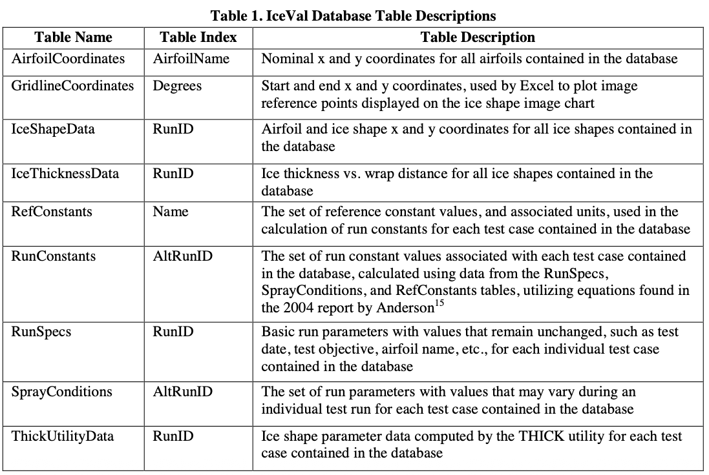  

In the time span 1988 to 2008 that the database covers, 
experimental test results were measured by cutting a thin slot into the ice, 
inserting a pre-made cardboard template, 
and manually tracing the ice shape. 
These were later digitized, and included in the database.  

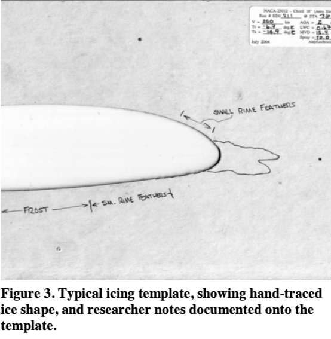  

## Range of conditions tested  

The primary values that define a unique run condition are (with database units)  
- Airfoil section  
- Chord length (inch)  
- Angle Of Attack (AOA)    
- Span angle or sweep  
- Airspeed (KTAS)  
- Temperature (°F total)  
- Spray time (minutes)  

Some test article also had provisions for thermal ice protection.  

For some cases, results were measured at several locations along the span.  

The physical test article is defined by the airfoil and chord length. 
Ten airfoils sections were tested, with the NACA0012 being used the most often:  

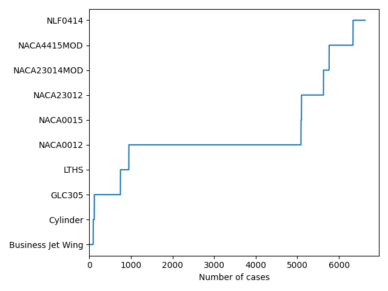  

Chord length varied from 1.5 inch (for the cylinder) to 78 inch. 
The NACA0012 airfoil was tested with 10 chord lengths, 
varying from 10.5 to 36 inch.  

  

A range of angle of attack values were used:  

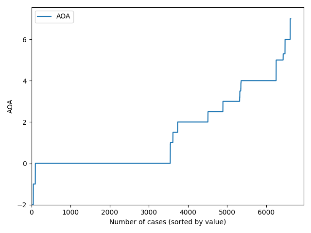  

The span angle or sweep of airfoil was varied in 36 cases with the NACA0012 airfoil.

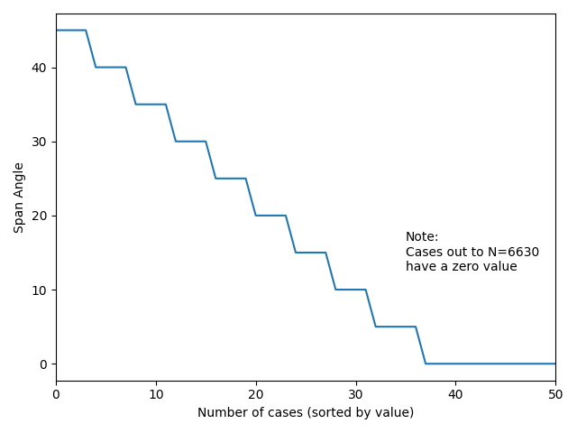

A wide range of test section flow conditions were used. 

  

  

The icing spray conditions are defined by LWC (in g/m^3), MVD (in micrometers), and spray time (in minutes). 
In some cases, these values were varied within a case.  

For example, case CG078736 had within the run, spray times of 2.4 and 9.6 minutes, with corresponding LWC values of 1.45 and 0.81, and MVD values of 30 and 181, 
and the final result is from the conditions applied sequentially.  

   

  

  


Ice protection was used in 441 of the runs.   

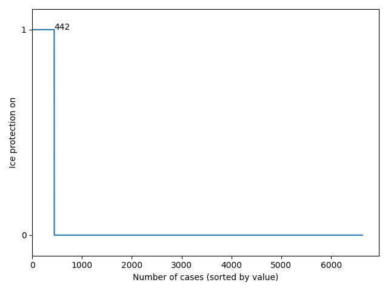  

Ice was measured at several locations along the span for some runs. 
Many of the runs measured ice only at the 36 inch location, 
which is the test centerline in the IRT. 

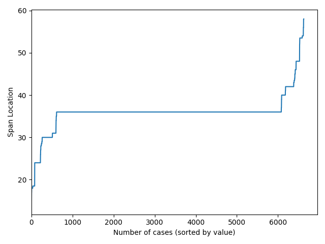

There are 2796 unique combinations of the test parameters. 
Several runs were repeated several times, in order to assess test repeatability. 
Also, 'LEW' and 'SPL' cases generally use the same tunnel conditions for corresponding cases. 
This accounts for the difference in the numbers of unique conditions and total conditions (6630).
[There are two more condition in the database for the "Mass Loss Experiment", but without ice shapes.]  

LEWICE [^2] has warning messages if a user inputs values that are outside the ranges noted above. 
The analysis case can still be run, however.  

## RunID: an unique key to access cases  

The RunID is a unique identifier or key for every case. 
It is used across several of the tables. 
With the RunID, ice shapes can be associated with the tunnel control parameters that produced them. 
Run ID typically have one or two leading characters that indicate a series of associated runs, 
such as AC1134136.

Many RunIDs have "LEW" as the last three characters. 
This indicates that it is a LEWICE analysis result. 
In nearly all the LEWICE cases, there is a corresponding experimental case, 
such as AC1134136LEW and AC1134136.  

Several RunIDS have "SPL" as the last three characters, such as AC1134136SPL. 
This indicates a LEWICE result that has some special change to the LEWICE analysis parameters,
such as time step size or number of drop size bins.

There is also an AltRunID listed. 
In many cases, it is the same as the run ID. 
The AltRunID appears to be what ever name the case was given before 
the naming standardization used in IceVal was developed. 

## Categories of results  

The majority of experimental (test) results are for the NACA0012 airfoil.  

```text
Airfoil	                Total	Test	LEW	    SPL	    Total LEWICE
NACA0012	            4138	2200	1378	560	    1938
GLC305                  628	    330	    267	    31	    298
NACA4415MOD	            575	    378	    133	    64	    197
NACA23012	            530	    305	    225	    0	    225
NLF0414                 291	    192	    94	    5	    99
LTHS	                202	    125	    72	    5	    77
NACA23014MOD	        135	    69	    44	    22	    66
Business Jet Wing	    94	    47	    47	    0	    47
Cylinder	            26	    13	    13	    0	    13
NACA0015	            11	    6	    5	    0	    5  

Totals	                6630	3665	2278	687	    2965
```

To summarize the ice shapes, the runs for a particular airfoil were plotted together 
in coordinates normalized by chord length. 

I am not sure how meaningful these are for anything other than illustrating the possible variety, 
given the wide variety of chord lengths and other condition details, 
but here they are:  

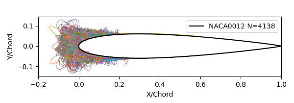  

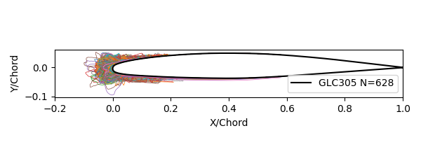  

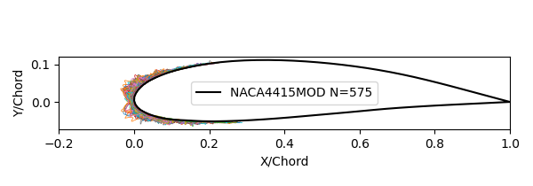  

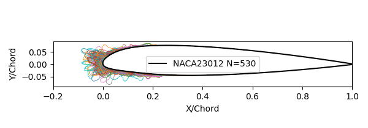  

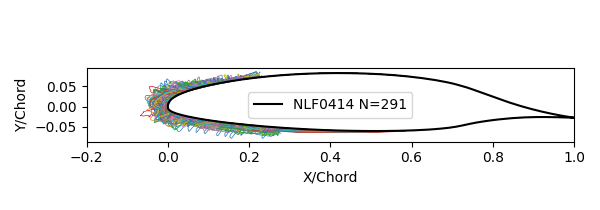  

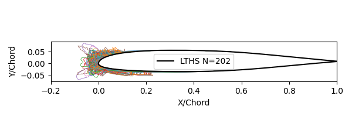  

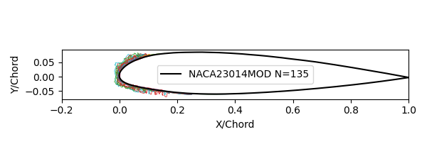  

  

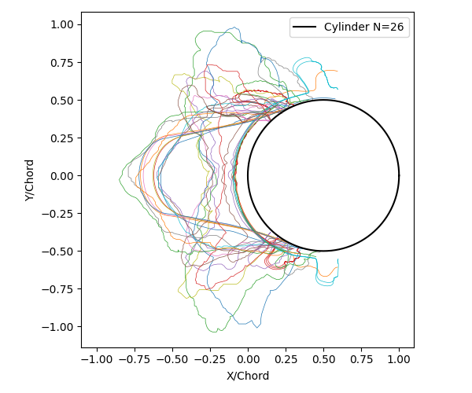  

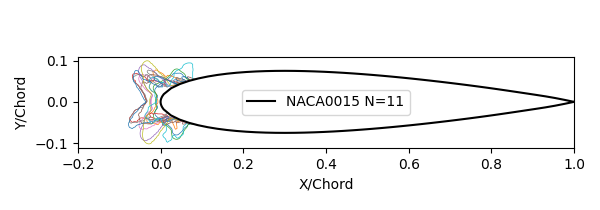  
 
Selected individual cases will be examined in upcoming posts.  

## Other results  

The ThickUtilityData table has results from running the LEWICE utility THICK [^2] 
on the ice shapes. THICK reports ice characterization parameters, 
such as maximum ice height and surface extent. 
We will examine results from THICK in a later post.  

An example of ice horns identified in the database of the tracing noted above:  

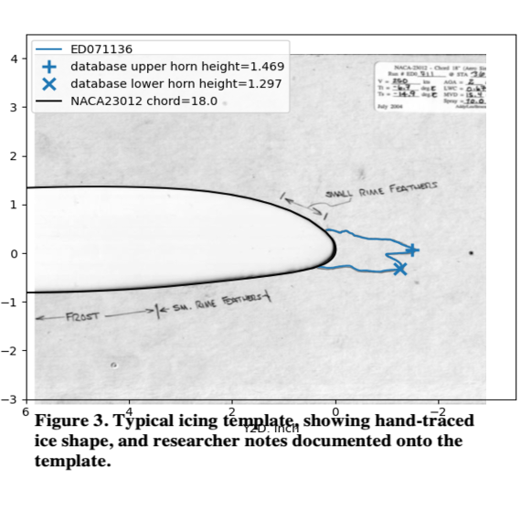  

The GridlineDataCoordinates table is interesting. 
An output from it is depicted on the figure at the top of this post. 
The ice coordinates along radial lines from the leading edge are listed. 
I do not know how this data was used.  

## Other IceVal DatAssistant functions   

There is an interface to the database that allows users to enter and manage their
own ice test and LEWICE data. 
I have worked at two companies that do significant work in aircraft icing, 
and neither used this function.  

However, some means of organizing results is eventually required. 
Approaches I have seen are hierarchical directory trees 
and detailed spreadsheets. 
There are challenges to any approach. 
Any hierarchy is to some extent arbitrary, 
and there always ends up being a "miscellaneous" category for things 
that do not fit elsewhere. 
I tend to use the directory tree, 
and have utility functions written in Python that can readily 
locate a specific case or group of cases.  

## What is missing  

The IceVal description notes some areas of future work:  

>VII. Known Issues / Future Work  
While the currently existing system has met all the existing system requirements, there are nevertheless areas of
future work which would ultimately result in an improved product. These include:  
>1) Migration to a higher capacity, more robust and/or public domain database, due to the limitations imposed
by the use of Microsoft Access;  
>2) Enhanced error handling;  
>3) Enhanced database security;  
>4) Implementation of an improved help system , including an electronically-accessible User’s Guide;  
>5) Incorporation of user-requested enhancements, such as the ability to overlay two user-selected images, or
the addition of selected fields to the database; and  
>6) Integration of the IceVal system into the GlennICE framework.  

Point 1 will be discussed in the next post.  

For point 5, it would be much better if the handwritten notes from the ice tracings 
(seen in Figure 3 further above), which include "small rime feathers" and "frost" 
that are not included in the digitized tracing. 
While these are often explained as tunnel effects
(see ["The Effects of Humidity in Icing Wind Tunnel Tests"]({filename}effects_of_humidity.md)). 
I feel they should be included at least as a text field.  

Also, photographs are often taken of the ice on a test article. 
These are highly instructive about the 3D nature of the ice shape. 
The validation report [^3] shows a digitized tracing:  

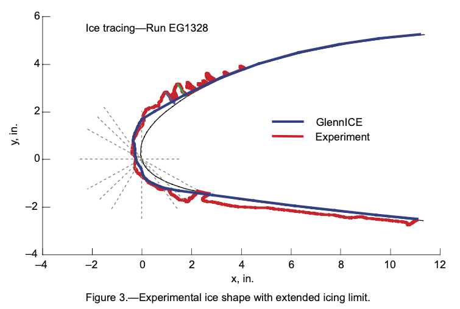  
while a photo clarifies:  

>These figures show that the ice feathers are separated and do not form a solid ridge, which is the effect imagined when looking at the two-dimensional tracing.  

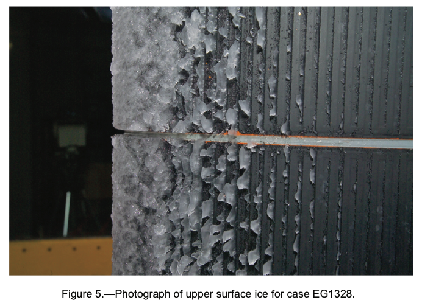

## Related  

This post is part of the ["6000 Ice Shapes - the IceVal DatAssistant"]({filename}iceval.md) thread.  

## Notes  

[^1]: 
Levinson, Laurie, and William Wright. "IceVal DatAssistant-An Interactive, Automated Icing Data Management System." 46th AIAA Aerospace Sciences Meeting and Exhibit. 2008.  
[NASA Report Number: E-16236](https://ntrs.nasa.gov/citations/20070031804)  
software available at https://software.nasa.gov/software/LEW-18343-1   

[^2]: 
William B. Wright, User's Manual for LEWICE Version 3.2 
[NASA/CR—2008-214255](https://ntrs.nasa.gov/citations/20080048307)  
The software is available at [software.nasa.gov](https://software.nasa.gov/software/LEW-18573-1)  

[^3]: 
William B. Wright and Adam Rutkowski, "A summary of validation results for LEWICE 2.0." 37th Aerospace Sciences Meeting and Exhibit. 1998.  
[NASA/CR-208690](https://ntrs.nasa.gov/citations/19990021235).  
