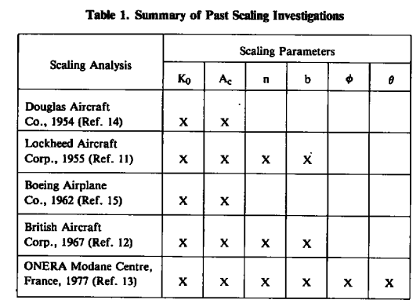
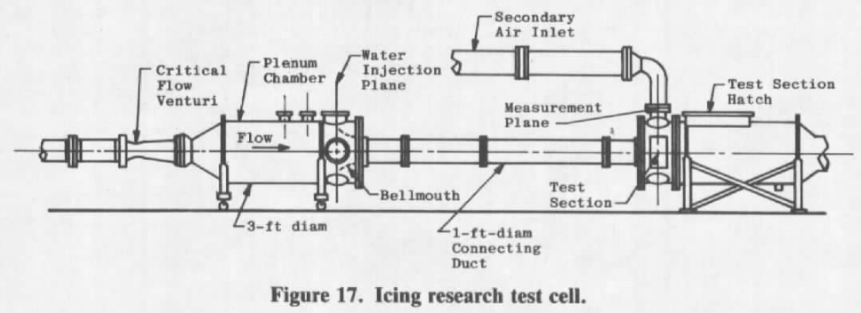
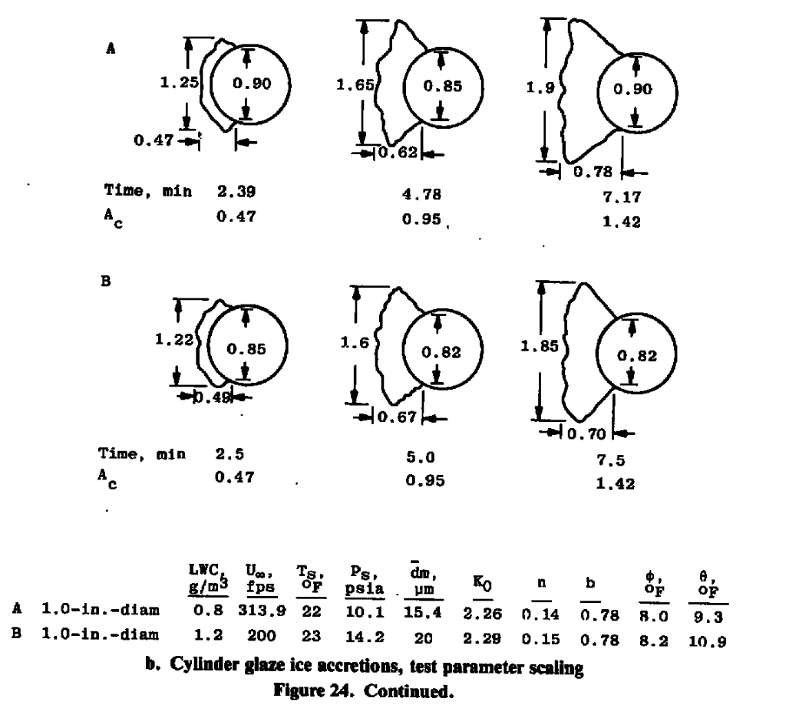

title: Development of Test Similarity  
category: icing tunnels  
status: draft  

AEDC-TR-85-30  

>1.1 BACKGROUND  

>The formation of ice on aircraft surfaces occurs during flight through supercooled
droplets. Ice accretions on these surfaces usually degrade both aircraft performance and
operational safety. For this reason, it has become important in the design and certification
phases of system development to evaluate system performance degradation because of icing.

>The most acceptable method of evaluating the performance characteristics of aircraft
and aircraft components for system certification would be to conduct flight tests in natural
icing conditions. Adequate system evaluation through icing flight tests requires specific
weather conditions, posing severe operational limitations because of the low frequency of
their occurrence. This makes certification through flight testing time consuming and
expensive because large amounts of flying time are required to adequately evaluate a system
over a wide range of conditions. Flight testing in a simulated cloud produced by an icing
tanker would appear to be the next most desirable method of conducting icing tests. In
practice, this method of flight testing is severely limited by tanker operational limitations,
lack of control of atmospheric parameters such as temperature, pressure and humidity, and
the logistics of maintaining steady flight in a cloud produced by a leading aircraft.
Therefore, ground testing in altitude facilities has become an accepted approach for
evaluating aircraft system performance in icing conditions.

>The size of many of the aircraft components to be tested greatly limits the number of test
facilities capable of conducting icing tests. It would be beneficial to the icing community if
the feasibility of using scale models in these tests could be proven. The problem is
complicated because the icing process is governed by the impingement of water droplets and
the thermodynamics of the freezing process on the surface. This document gives the results
of a study conducted at Arnold Engineering Development Center (AEDC) Engine Test
Facility (ETF) to experimentally verify a set of icing scaling equations.  

>1.2 SCOPE OF INVESTIGATION  
 
>A research program was conducted at the AEDC/ETF to evaluate the icing scaling
requirements. The objectives of the study were (1) to evaluate the equations governing the
icing process to identify proposed scaling parameters, (2) to develop a computer code to
solve the various forms of the icing scaling equations, (3) to conduct tests to determine
which, if any, of the proposed methods produced scale ice accretions, and (4) if an accurate
set of icing scaling equations were found, to write a final computer code that could be used
in icing tests.  

>The scaling verification tests were conducted using full- and half-scale circular cylinders
and full-, 1/3-, and l/6-scale airfoil sections. By applying a postulated scaling method, test
conditions that should produce scale ice accretions were calculated using the computer code
developed for this study. The size and shape of the ice accretions resulting from these test
conditions were compared with full-scale results to determine the accuracy of the scaling
method. The objectives of the study were met by identifying a scaling method that produces
scaled ice accretions over a wide range of test conditions and that can be applied to a variety
of icing testing situations.

###Impingement similarity

>K = 2/9 ρwrd2U∞/(μac) &nbsp;&nbsp;&nbsp;&nbsp; (3)

>Ko = (λ/λs) K  &nbsp;&nbsp;&nbsp;&nbsp; (8)

>Where:  
ρw is water density  
rd is drop diameter radius  
U∞ is free stream air speed  
μa is air viscosity  
c is chord length  

These and λ/λs we saw in [Langmuir and Blodgett]({filename}Mathematical Investigation of Water Droplet Trajectories.md).

###Water exposure similarity

>Ac = LWC(U∞)τ / (ρwc)  &nbsp;&nbsp;&nbsp;&nbsp; (16)

>Where:
Ac is the accumulation parameter  
LWC is the liquid water content  
U∞ is free stream air speed  
τ is time in icing  
ρw is water density  
c is chord length  
Ts is air static temperature  

###Freezing similarity  

>b = Wwcpws / hc  &nbsp;&nbsp;&nbsp;&nbsp; (20)  
>Φ = 32 - Ts - U∞2/(2 gc J cpw,s)  &nbsp;&nbsp;&nbsp;&nbsp; (21)  
>Θ = (Tsur - Ts - U∞2/(2 gc J cpa)) + We Lv / hc   &nbsp;&nbsp;&nbsp;&nbsp; (22)  

>Where:  
Ww is water catch rate  
c is chord length  
cpws is the specific heat of water on the surface  
hc is heat transfer coefficient  
Ts is air static temperature  
U∞ is free stream air speed  
gc is a unit system constant  
J is the unit system work to thermal energy factor
32 is the ice melting point temperature in Fahrenheit
Tsur is surface temperature  
cpa is the specific heat of water on the surface  
We is the rate of surface water evaporation  
Lv is the latent heat of evaporation of water

We is explained further in Appendix B of AEDC-TR-85-30. 
The gc and J terms are explained further in [A Brief Digression on Unit Systems]({filename}brief-digression-on-units.md). 

While it was not explicitly noted in AEDC-TR-85-30, note that:  
>n = (cpw,s/Lv) (Φ + Θ / b)  

So if Φ, Θ, and b are matched then n will be matched. 

>In summary, the following scaling equations will be evaluated in the experimental
portion of this study:

>(Ko)model = (Ko)full-scale  
>(Ac)model = (Ac)full-scale  
>(n)model = (n)full-scale  
>(b)model = (b)full-scale  
>(Φ)model = (Φ)full-scale  
>(Θ)model = (Θ)full-scale  

Table 1 shows prior scaling analysis works.

  

I have not found these online, and I have read two of them (but I do not have a copy of them). 
It is not surprising that the one from Lockheed Aircraft include freezing fraction, 
as Messinger worked ther at that time. 

Various methods were tried. 

  

The Icing Research Test Cell was used.

  

The method where Ko, Ac, n, Φ, and Θ were held constant 
performed the best, both for scaling test article size or other parameters.  

  
  
  
  

>These results have identified a scaling procedure that accurately duplicates the ice-
accretion profiles. In this scaling method, Ko, Ac, n, Φ, and 0 are held constant. The set of
verified scaling equations can, therefore, be expressed as follows:

>1. (Ko)model = (Ko)full-scale  
>2. (Ac)model = (Ac)full-scale  
>3. (n)model = (n)full-scale  
>4. (Φ)model = (Φ)full-scale  
>5. (Θ)model = (Θ)full-scale  

>A final version of the icing scaling similitude code, SIMICE, was written to solve the
above set of verified scaling equations (See AEDC-TR-85-30, Vol. II). The icing test
parameters that must be determined from thse equations are as follows:

>1. velocity  
>2. static pressure  
>3. static temperature  
>4. liquid water content
>5. drop diameter
>6. icing time  

I have not been able to find "AEDC-TR-85-30, Vol. II", or the SIMICE program.

>Note that there are six icing test parameters and only five equations, indicating that the
problem is underspecified and that one of the test parameters can, therefore, be arbitrarily
selected. In practice, this additional parameter is selected to overcome a test facility
limitation. The solution of the above equations will be illustrated by two practical scaling
examples to be discussed in the following section.

Note also that some icing wind tunnels do not control pressure. 
In those cases, the five equations directly determine the five test parameters. 

>8.0 SUMMARY OF RESULTS
The objectives of this study were to evaluate the equations governing the ice-accretion
process to identify proposed scaling parameters and to conduct tests to determine which, if
any, of the proposed methods produced scale ice accretions. A set of scaling equations were
verified, and limitations of the scaling techniques were identified. A computer code was
developed to solve the scaling equations for use in various icing applications. The results of
this study can be summarized as follows:  
>1. A set of equations that can be used to calculate test conditions so that scaled ice
shapes are produced on geometrically similar bodies was developed and
experimentally verified. The test conditions are such that Ko, Ac, n, Φ, and 0, are
held constant.  
>2. The posttest evaluation of the scaling parameters based on the actual test conditions
was necessary for the accurate evaluation of test results.  
>3. An icing similitude computer code, SIMICE, was developed to calculate similitude
conditions using the verified scaling equations.  
>4. The equations are applicable over the range of meteorological conditions found in
natural icing, with the possible exception of velocity.  
>5. Velocity is the primary limitation of the scaling equations. To maintain scaled flow
fields and droplet impingement characteristics, both the model and full-scale
velocities must yield a Reynolds number greater than or equal to 2.0 x 10^5 and less
than the velocity giving the critical Mach number of the body geometry.  
>6. At values of dynamic pressure of approximately 1.6 psia, the shedding
characteristics of the ice accretion were observed to effect the final ice shape.
Therefore, ice accretions did not scale well when qf > 1.6 psia and qm < 1.6 or vice
versa.  
>7. A method for scaling shedding characteristics by maintaining the dynamic pressure
was developed, but facility limitations did not permit adequate verification.
Additional testing is required to verify this ice-shedding scaling technique.  

Techniques and Facilities Used at the Onera Modane Centre for
Icing Tests

Icing Testing in the Large Modane Wind-Tunnel on Full-Scale and Reduced-Scale Models, NACA-TM-75373  1975 (1972)  

AEDC-TR-85-23  
   
 

NASA-TM-106827 1995 

