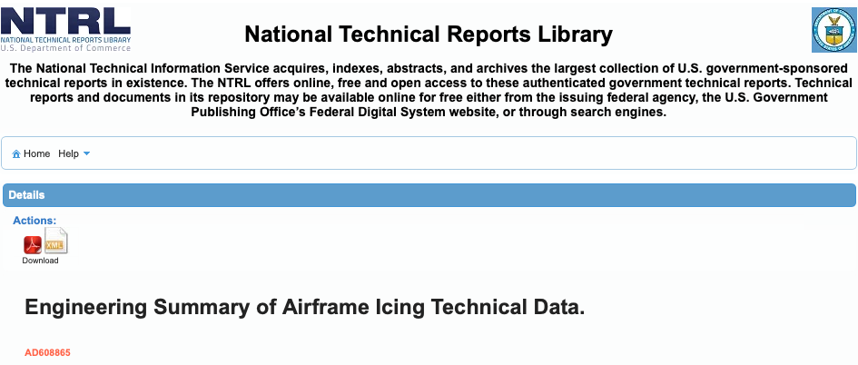

Title: The National Technical Reports Library  
Date: 2026-08-04 16:00
tags: DTIC, NTRL, search  

### _"The National Technical Information Service acquires, indexes, abstracts, and archives the largest collection of U.S. government-sponsored technical reports in existence. "_  

  

## The Defense Technical Information Center  

The Defense Technical Information Center https://discover.dtic.mil/public-access-search/ site was a "go-to" resource for me. 
It had a better search engine than some alternatives.  

I write "was", as it is now down, with a note:  
> "DoW S&T Reports Search is offline while we fine-tune the user experience. It will be back online soon."  

This has persisted since at least August 1, 2026 (I had not checked it recently before that).  
 
## The National Technical Reports Library   
 
I am in the process of updating links to use the 
National Technical Reports Library [ntrl.ntis.gov](https://ntrl.ntis.gov/NTRL). 
The search engine is not intuitive to me, but it can get the job done
(well enough that I hope they do not decide to "fine-tune the user experience"). 
As far as I know, every document that was on the DTIC public site is also on the NTRL. 

I find it most reliable to search for the "ABBR" number, 
such as ADA238039 for the Aircraft Icing Handbook Volume 1. 
The search for titles can be finicky about exact matches.   

There are dozens of links that I need to change, so this may take a while. 
I check them manually, to ensure that the link points to what is intended.  

Also see [Hard to find publications]({filename}hard_to_find_.md) 
for other resources and search tips.  

## Examples  

Anon., "Aircraft Ice Protection", the report of a symposium held April 28-30, 1969, by the FAA Flight Standards Service;  Federal Aviation Administration, 800 Independence Ave., S.W., Washington, DC 20590.  
[ntrl.ntis.gov](https://ntrl.ntis.gov/NTRL/dashboard/searchResults/titleDetail/AD690469.xhtml)

“Aircraft Icing Handbook Volume 1.” DOT/FAA/CT-88/8-1 (1991)  
[ntrl.ntis.gov](https://ntrl.ntis.gov/NTRL/dashboard/searchResults/titleDetail/ADA238039.xhtml)

