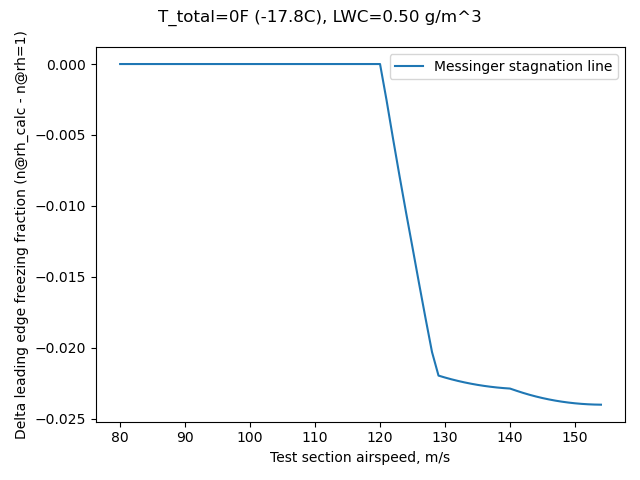
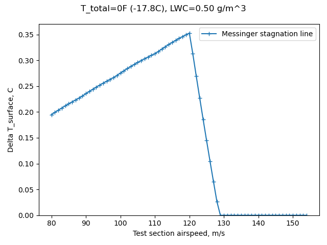
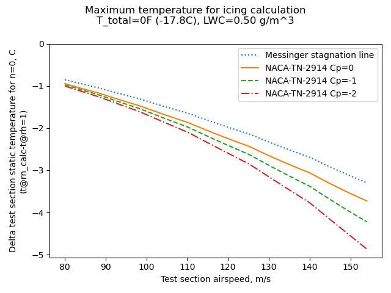

title: The Effects of Humidity in Icing Wind Tunnel Tests   
category: icing tunnels  
status: draft  

##Summary  
Supersaturated humidity can affect icing wind tunnel results.  

##Key Points  
1. Some observations of supersaturated humidity conditions were made in the NACA-era.  
2. Supersaturation was associated with frost on test article afterbodies.  
3. Recirculating icing wind tunnel conditions are calculated to tend to be supersaturated.  
4. Some potential effects of surpersaturation are calculated.  

##A brief primer on humidity  

A measurement of water vapor in the air is humidity. 
Relative humidity is the most common measure. 
In everyday life 30% to 60% relative humidity is generally considered to be comfortable. 
Lower humidities feel dry, and higher humidities feel balmy or wet.

The most water vapor that can usually exist at a given static temperature is termed
"saturated", and that condition has 100% relative humidity. 
Given sufficient time and condensation surfaces, 
any surplus vapor above this value will condense as liquid water. 

Natural icing conditions tend to be near 100% relative humidity, 
and are often slightly "supersaturated", to say 102% or 105%. 
This is due to some complex physics of small water drops and surface tension
[some of which is discussed in ["Super-Cooled Water Droplets in Rising Currents of Cold Saturated Air"]({filename}Langmuir Rising Currents.md)]. 

The rapidly changing conditions in the flow circuit of an icing wind tunnel 
can lead to significantly supersaturated conditions in the test section 
(much greater than 100% relative humidity). 
Some icing wind tunnels do not have direct control over humidity, 
and some do not routinely measure humidity. 

Supersaturation may be challenging to measure in an icing wind tunnel, 
as some instruments do not indicate values above 100% relative humidity, 
and readings may be affected by the impingement of water drops.

##Discussion

Three NACA publications mention supersaturated conditions in an icing wind tunnel. 

###Supersaturated icing wind tunnel conditions

I found four publications that mentioned the humidity in the IRT. 
Three of the four described it at superstaurated, and note the effect on frost formations. 
None of the four described if the humidity was measured, inferred, or assumed. 

####NACA-RM-E50I08  

[Emphasis added]  
>A calibration of the water content of the tunnel air was made just
upstream of the vane duct for the range of air temperatures. The variation 
in liquid-water content is shown in figure 3 as measured by standard 
rotating-cylinder technique when the water flow through the nozzles
was held constant and the air temperature varied. __The air was saturated
at all temperatures prior to sprays__ and the velocity was constant;
therefore, the liquid-water content should also have been approximately
constant.  
  

I infer from "The air was saturated at all temperatures prior to sprays" 
that some effort was made to achieve saturated conditions. 

####NACA-RM-E53C27
[Emphasis added]  
>In figure 4(b) runback deposits have begun to collect directly impinging 
droplets and are growing forward and outward. The deposits aft of the heated
forward section are caused by impingement upon frost particles. The airfoil 
invariably frosted as soon as water sprays began, __probably because
of air-stream turbulence and supersaturation of the tunnel air, which is
not the usual case in flight__.  
  

####[NACA-TN-2962]({filename}NACA-TN-2962.md)  
>For studies of the effect of afterbody frost formations on the drag
of the airfoil, no heat was furnished to the afterbody. Frost formed on
the afterbody because of air-stream turbulence and the supersaturated
condition of the tunnel air.  

[Emphasis added]  
>The afterbody __frost formations obtained in icing tunnels are
believed to be caused by turbulence of the air stream, which deposits
minute droplets on the surfaces, and by a condition of supersaturation,
which promotes the growth of frost deposits__. The initial frost deposit
on an afterbody appears immediately upon starting a spray cloud through
the tunnel and takes the form of a latticework of pinhead size crystalline 
deposits on both upper and lower surfaces of the airfoil
(fig. 26(a)). As the frost formation increases in size with time in the
icing condition, water droplets begin to impinge directly on the frost
pinnacles (fig. 26(b)). The deposition of droplets on the frost pinnacles 
causes small featherlike formations composed of ice and frost
particles to grow forward into the air stream (fig. 26(c)). These
feathers increase in size and may reach a length of several inches and
protrude as much as 1 inch in a direction normal to the air stream
(fig. 26(d)).  
  

####NACA-RM-E53E07  
[Emphasis added]  
>Photographs of ice on the ram inlet and the carburetor screen at
the end of the icing periods are shown in figure 6. At the higher
liquid-water-content condition (fig. 6(a)), a rough-glaze-ice formation
which built outward from the inlet was obtained on the rain-Inlet lips.
Little or no ice was observed inside the rain duct. Downstream of the
ram inlet, almost the entire scoop including the alternate-inlet ramp
was covered by a frost-like formation. __This frost icing is believed to
result from a combination of super saturation in the tunnel__ and turbulent 
deposit of small drops caused by the presence of rough ice formations 
on the ram-inlet lips.  
  

###Water vapor analysis of an icing wind tunnel

In the review ["The AEDC 1-Dimensional Multi-Phase code (AEDC1DMP) and the iads1dmp"]({filename}aedc1dmp.md) 
the water spray drop evaporation was calculated, 
as well as the amount of vapor in the tunnel flow. 

For that case, the tunnel modeled was assumed to have control over the humidity. 

For cases of recirculating flow icing wind tunnels without humidity control, 
the flow in the constant area section upstream of the contraction into the test section
tends to have 100% relative humidity (see [^5]). 
The flow then goes through the contraction into the test section. 
The static temperature lowers, but the vapor does not have time 
condense out to equilibrium, so the relative humidity climbs. 

Two test conditions from NACA-TN-2962 were modeled with the iads1dmp.py program, 
as shown below. The test airspeed for each was 180 MPH (about 80 m/s). 
At that airspeed, the test section relative humidity is calculated to be about 120%. 
Higher airspeeds were also considered. 
At higher airspeeds, the relative humidity can be much higher.  

  

This has some effect on the calculated heat and mass balance. 
For the leading edge stagnation line, 
the calculated surface temperature and freezing fraction (n) are affected. 

The difference in calculated leading edge freezing fraction varies by airspeed case. 
At the lower airspeeds both values are 1, so there is no difference. 
A maximum of 0.025 was found, which is probably not significant for most purposes. 
  

The difference in surface temperature varies by airspeed case, 
reaching a maximum of 0.35 C, which is probably not significant. 
(Where the freezing fraction is below 1, both values are 0C, 
so there is no temperature difference.)

  

The calculated difference test section temperature for no freezing 
(n=0) is significantly affected by airspeed and the resulting humidity. 
At the 80 m/s airspeed, there is a 1C difference, 
which may not be significant in many cases. 
However, at higher airspeed the results can be significantly different. 

  

This has implication for tests that seek to determine the maximum temperature for ice accumulation, 
and to determine runback ice. 

At the nominal airspeed of 180 MPH, 
the effect of supersaturation on the ice shape as calculated by
LEWICE2D is small.

  

At the 350 MPH, 
the effect of supersaturation on the ice shape is small, 
but more readily discernible than for the 180 MPH case. 

  

##Conclusions  

As many test facilities cannot control humidity, 
icing wind tunnel users should consider measuring test section humidity during tests. 
An instrument that is capable of reading above 100% relative humidity or the 
saturated vapor pressure should be used (some instruments are not capable).

Analysis methods that can use humidity values above 100% should be used 
for comparison to icing wind tunnel test results 
(some can only use 100% relative humidity).

If humidity cannot be measured during a test, 
analysis methods such as the AEDC1DMP and the iads1dmp.py can be used. 

Some tests, 
such as determining the maximum temperature for ice accumulation, 
and determining the presence runback ice near the maximum temperature, 
may be particularly sensitive to the effects of test section humidity. 

##Notes

[^1]: Gray, Vernon H., and Bowden, Dean T.: Icing Characteristics and Anti-Icing Heat Requirements for Hollow and Internally Modified Gas-Heated Inlet Guide Vanes. NACA-RM-E50I08, 1950.  
[^2]: Gray, Vernon H., and von Glahn, Uwe H.: Effect of Ice and Frost Formations on Drag of NACA 651-212 Airfoil for Various Modes of Thermal Ice Protection. NACA-TN-2962, 1953.  
[^3]: Gray, Vernon H., and Bowden, Dean T.: Comparison of Several Methods of Cyclic De-Icing of a Gas-Heated Airfoil. NACA-RM-E53C27, 1953.  
[^4]: Lewis, James P.: Investigation of Aerodynamic and Icing Characteristics of Flush Alternate-Inlet Induction-Systems Air Scoop. NACA-RM-E53E07, 1953.  
[^5]: Cook, Donald E.: Maximum Temperature for Ice Accumulation Calculations. AIAA-2005-655, January, 2005.   

