title: Engine Exhaust Heat  
Date: 2023-02-06 12:00  
tags: ice protection  

### _"an airplane that will be immune from the dangers of ice accumulation ... is only a matter of technical development." [^1]_  

## Summary  

Practical wing heating designs are developed and proven in natural icing flight tests. 

## Key Points  

1. Flight tests were used extensively, as icing wind tunnels were still under development.  
2. Much detailed development over 10 years was required.  
3. "Existing data indicate that sufficient heat is available... the problem is one of distribution".   
4. Design elements were developed that could be used in future compressed air heating.  

## Discussion  

## NACA-TR-403 [^1]  

> This investigation was conducted by the National
Advisory Committee for Aeronautics to study the practicability 
of employing heat as a means of preventing the
formation of ice on airplane wings. The report relates
essentially to technical problems regarding the extraction
of heat from the exhaust gases and it proper distribution
over the exposed surfaces. In this connection a separate
study has been made to determine the variation of the
coefficient of heat transmission along the chord of a Clark
Y airfoil.  
A study of the heat transmission from the airfoil reveals 
that the local transmission is very high at the leading
edge and that it decreases rapidly to a minimum value
at a point located about 30 per cent back along the chord.
Experiments on ice prevention both in the laboratory
and in flight show conclusively that it is necessary to
heat only the front portion of the wing surface to effect
complete prevention.  
The marked variation in the heat transmission over the
front portion of the wing makes the problem of an efficient
heat-distributing system a matter of some technical difficulty. 
The actual quantity of heat needed for ice prevention is, 
however, surprisingly small, being in the order
of one-tenth of that available in the engine exhaust gases.
The relative merits of various methods of ice prevention 
by means of heat are analyzed with the result that a
vapor system is found to offer the most satisfactory solution, 
especially for airplanes which are not constructed
entirely of metal. In all-metal designs it may be entirely 
practicable to employ a direct exhaust-heating
system.  
Experiment in flight show that a vapor-heating system
which extracts heat from the exhaust and distributes it to
the wings is an entirely practical and efficient method for
preventing ice formation.  
A narrow slot on the upper surface located about one-tenth 
of the chord length from the leading edge is employed
in these tests for the purpose of collecting the water which
would otherwise blow back and freeze aft of the heated
leading edge. The tests seem to indicate, however, that
this slot may not be essential.  

Wind tunnel tests were conducted with a cylinder and an airfoil section 
to determine the rates of heat transmission.  
(Thought we were done with [Cylinders]({filename}Icing on Cylinders.md)?)  
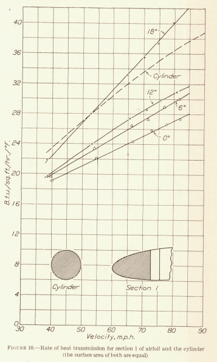  

>A study of the heat transmission from the airfoil reveals 
that the local transmission is very high at the leading
edge and that it decreases rapidly to a minimum value
at a point located about 30 per cent back along the chord.  
  

>The model wing and the boiler were
mounted on a Fairchild monoplane a shown
in the photograph. (Fig. 24.) The boiler
and the steam line were carefully insulated.
The water return line runs from the drain cock on
the lower left-hand corner of the leading edge down
in to the main steam line and terminate at the
bottom of the boiler in the manner indicated by
the sketch in Figure 21. A steam pressure gauge
facing the cabin is mounted on the upper part
of the team pipe. This gauge was used to assist
in checking the operation of the system while in
flight.  
For the purpose of reproducing atmospheric conditions 
artificially, a water-spraying system was included
as part of the equipment. The spraying jets were
mounted about 4 feet in front of the wing. The compressed 
air and water supply necessary for its operation
were installed in the cabin.  
  
>Unfortunately, owing to the weather conditions 
prevalent in this section of the country it has in only
a few cases been possible to conduct full-scale tests
under natural ice-forming conditions. In lieu of such
tests, the spray system was employed. The spray
produced drops which apparently varied in size from
fine fog particles to light raindrops. The time of
exposure of the droplets to the cold air was entirely
too short to permit the extraction of much heat from
the droplets. Consequently, all formations obtained
were of the glaze ice type. Figure 25 is a photograph
of a formation of ice obtained on the leading edge with
the wing cold. The formation appears to be not
unlike the glaze ice obtained on wings in natural ice
storm. Notice the separate deposits from each of
the two jets.  
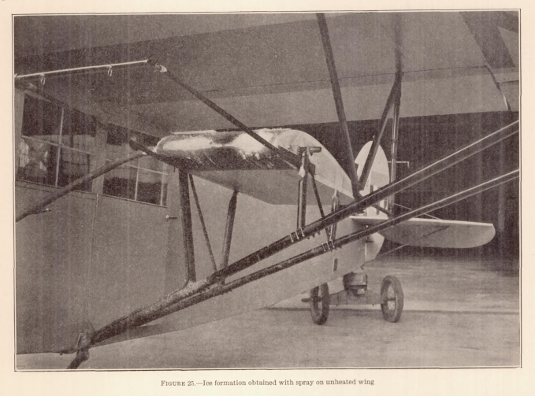  

A full-scale design was proposed 
(I do not know that it was ever built).  
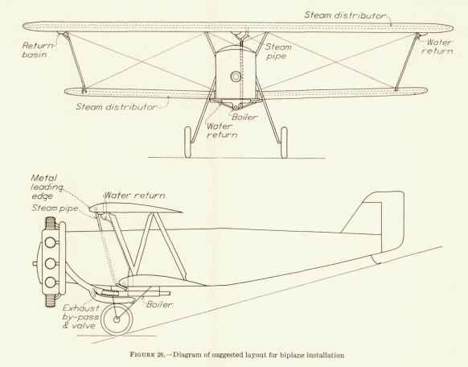  

>CONCLUSIONS   
>The most essential result obtained from this study
is the fact that ample heat is available both in the 
exhaust and in the cooling water for the purpose of ice
prevention.  
An analysis of the possible methods for preventing
ice formation showed that the employment of a vapor heating 
system (or of a direct exhaust-heating system
in connection with all-metal airplane) offers the most
convenient and promising solution.  
The experiment showed that a vapor-heating system
using a mixture of water and alcohol is an entirely
practicable method, facilitating, in particular, the
correct heat distribution to the wing surface.
It was found that it is sufficient to heat only the
front portion to prevent in fact the formation of ice
on the entire wing.  
It was found that the ice, which formed on the rear
portion of a cloth-covered wing by water blowing back
from the heated leading edge, was attached rather
weakly to the surface and did not build up to any 
appreciable extent before it blew off.  
The conclusion is drawn, however, that a small slot
may be necessary on the upper surface behind the
heated section to collect the rain water, particularly
in connection with all-metal wing. The operation
and efficiency of such slot have been carefully examined. 
It was found that the efficiency of the slot in
collecting water is decreased greatly if its location is
lesss than one-tenth of the chord length from the leading edge. 
A slot on the lower surface of the wing was
found to be unnecessary.  
It is believed that the high-wing monoplane will be
the most convenient type for the incorporation of 
ice-prevention equipment based on the employment of
engine waste heat. The successful design of an airplane 
that will be immune from the dangers of ice
accumulation is, as far as can be judged from analysis
and laboratory experiments, only a matter of technical
development.  

I do not know of an airplane that used the full-scale
steam ice protection system, the model scale tests 
described here may be the only application.  

The "... only a matter of technical development" took a decade, 
as we shall see.

## NACA-TN-712 [^2]  

We saw some of NACA-TN-712 previously in the 
[Icing Wind Tunnel Thread]({filename}Icing Wind Tunnel Test Thread.md).  
Here, we will discuss the ice protection aspects. 

>SUMMARY
An investigation was made in the N. A. C. A. ice tunnel
at air temperatures from 20 to 28 F, and at a velocity
of 80 miles per hour to determine whether ice formations
on a model wing could be prevented by the use of the heat
from the engine-exhaust gas.
Various spanwise duct systems were tested in a 6-foot-chord 
N. A. C. A. 23012 wing model.  
The formation of ice over the entire wing chord was
prevented by the direct heating of the forward 10 percent
of the wing by hot air, which was passed through leading-edge 
ducts.

>Existing data indicate that sufficient heat is available; 
the problem is therefore to determine how this heat can be 
utilized to the best advantage or, in other words, 
the problem is one of distribution.

>TESTS AND RESULTS  
>A photograph and a sketch shown in figure 5 illustrate 
a glaze-ice formation on the model.
This formation
is typical of ice encountered in precipitating clouds at
temperatures about 28° F.
The adjustment of the nozzle
for this formation was such that large drops of water
struck the model.
Figure 6 illustrates a rime formation,
which is typical of ice that would build up on a wing
passing through a supercooled mist of very small waterdrops.
The spray nozzle was adjusted so that only very
small waterdrops
struck the model.
Rime ice formed only
along or near a stagnation-pressure region.
Other significant data are given on the sketches of figures 5 and 6.  

  

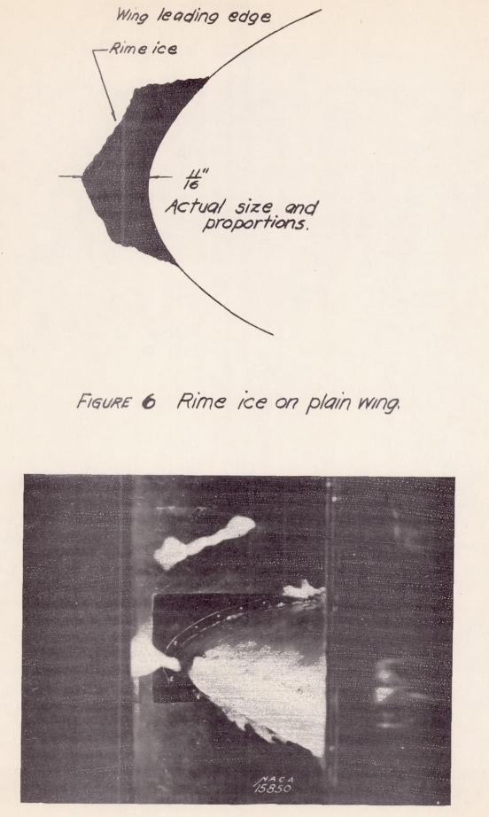  

>CONCLUSIONS
For the spray conditions existing during the tests,
which produced typical ice formations at about 3 inches
per hour, the following conclusions are drawn:  
>1. Ice formations over the wing of a 6-foot model
were removed or prevented by a heating condition that
would produce a skin temperature over the leading 10-percent 
portion of about 200 F. above tunnel air when the
spray was not operating.  
The gas temperature in the duct
that was necessary to produce this skin temperature varied 
from 360 to 834 F. with corresponding air-duct velocities 
of 152 and 45 feet per second, respectively.  
>2. Ice formations at the leading edge were locally
prevented by air that passed on the interior of the wing
surface at a velocity of 30 feet per second and at a 
temperature of 122 F.  
>3. The heating requirements for the after portion of
a wing chord are less stringent than at the leading edge
because there it is only necessary to form a film of water
between the ice and the wing
to effect removal.  

While NACA-TN-712 did not directly comment on the use of the icing wind tunnel, 
["We Freeze to Please": A History of NASA's Icing Research Tunnel and the Quest for Flight Safety](https://ntrs.nasa.gov/citations/20020066162) 
notes that: 
>Although Rodert also used the icing tunnel to conduct experiments with electrically
heated windscreen panels, he saw no future for tunnel-based research. He believed icing
tunnels could not create conditions that resembled natural icing and far more could be
accomplished with flight research.  

As such, the next publication, NACA-TN-783, 
used flight tests for development. 

## NACA-TN-783 [^3]  

>SUMMARY  
The National Advisory Committee for Aeronautics has
conducted exhaust-heat de-icing tests in flight to provide
data needed in the application of this method of ice prevention.
The capacity to extract heat from the exhaust
gas for de-icing purposes, the quantity of heat required,
and other factors were examined. 
The results indicate
that a wing-heating system employing a spanwise exhaust
tube within the leading edge of the wing removed 30 to 35
percent of the heat from exhaust gas entering the wing.
Data are given from which the heat required for ice prevention 
can be calculated.
Sample calculations have been made on a basis of existing 
(engine power)/(wing area) ratios to show
that sufficient heating can be obtained for ice protection
on modern transport airplanes, provided that
uniform distribution of heat can be secured.  

This publication has some excellent photos.  

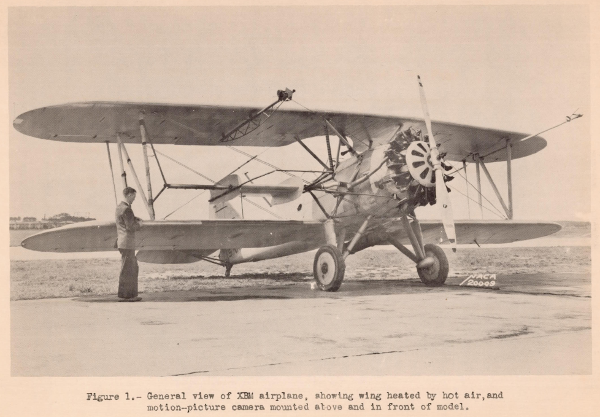  

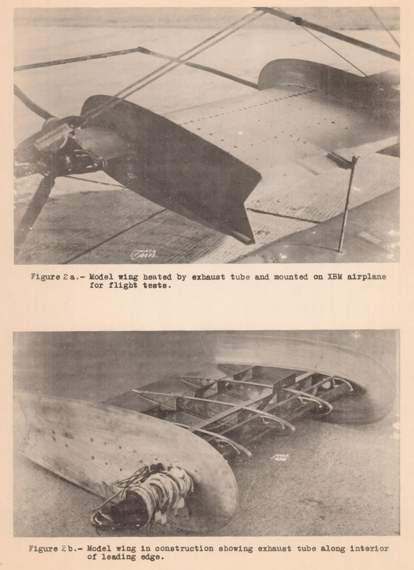  

Two different means of providing the heat were considered 
(figures 3 and 4).

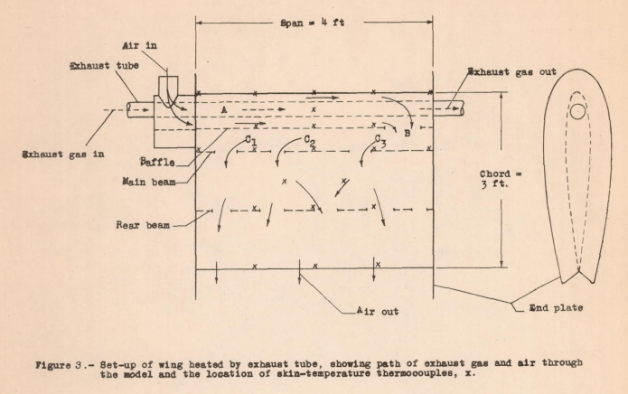    

    

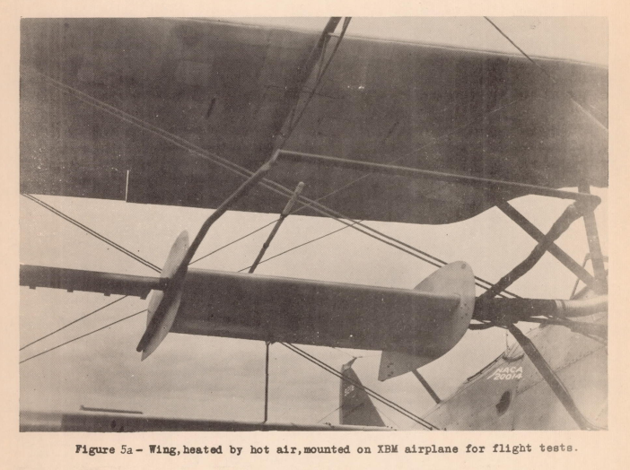  

A water-spray system, similar to that in NACA-TR-403, 
was used in some cases to provide water drops.  

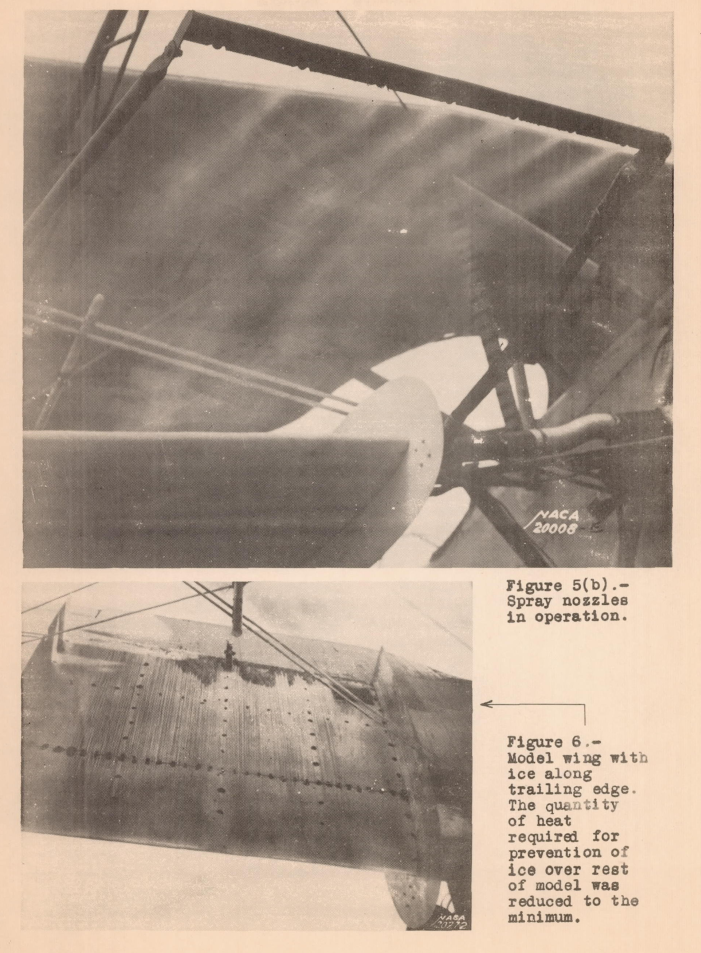  

  

>CONCLUSIONS  
>1. A wing with an exhaust-gas tube running spanwise 
inside of the leading edge provided a system 
capable of removing 30 to 35 percent of the 
heat from the exhaust gas entering the wing.  
>2. Heat transmission tests in misty cloud formations 
indicated that the heat required for ice prevention may be 
calculated from an equation involving the airplane speed 
and chord, and the ambient-air temperature.  

## Detailed design development  

Several studies were conducted to develop details of the design. 

- Rodert, Lewis A., and Jackson, Richard: Preliminary Investigation and Design of an Air-Heated Wing for Lockheed 12A Airplane. NACA-WR-A-34, April 1942.  
- Rodert, Lewis A. and Jackson, Richard: A Description of the Ju 88 Airplane Anti-Icing Equipment. NACA-WR-A-39 1942.  
- Jones, Alun R., and Rodert, Lewis A.: Development of Thermal Ice-Prevention Equipment for the B-17F Airplane. NACA-ARR-3H24, 1943.  
- Jones, Alun R., and Rodert, Lewis A.: Development of Thermal Ice-Prevention Equipment for the B-24D Airplane. NACA-WR-A-35, Feb. 1943.  

A Ju 88 airplane with exhaust heating was "obtained" by NACA in 1942 
(I imagine there is more to the story that was left unsaid).  

The overall design layout is similar to that used in NACA flight tests described below. 

   

As a full-scale design had been implemented in 1941 by NACA, 
it does not appear that the Ju 88 design had direct influence on the NACA designs. 
 
## Full-Scale Flight Tests    

_"such tests should be conducted as soon as possible" NACA-TN-723, 1939_  

The "... only a matter of technical development" step advocated 
in NACA-TR-403 (1931) took a decade to achieve, 
but designs were now ready for full-scale airplane flight tests 
in natural icing conditions.  

Three full-scale flight tests were performed on three different aircraft.  

- NACA-ACR-A-53, Lockheed 12A, 1942.  
- NACA-WR-A-7, B-24, 1943.  
- NACA-ARR-4B02, B-17, 1944.  

We will review one of those, NACA-ACR-A-53. 

## NACA-ACR-A-53 [^4]  

This publication has many excellent photos.  

>SUMMARY  
>Flights have been made with and airplane in icing conditions
in order to test the effect of exhaust gas heat applied
to the wings as a means of preventing ice formations. 
Other ice-prevention equipment, 
including an exhaust gas-heated pitot-static head, 
hot-air-heated windshield, and an inflatable 
de-icer of recent design, were also tested...

  

The overall air flow went something like this (although with different venting): 

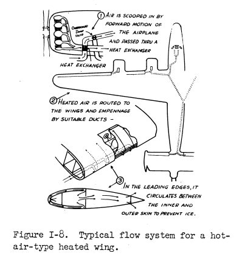  
_Figure I-8 from Modern Icing Technology. [^5]_  

  

  
The exhaust heated pitot tube and the wing exhaust vent 
are shown in Figure 18.

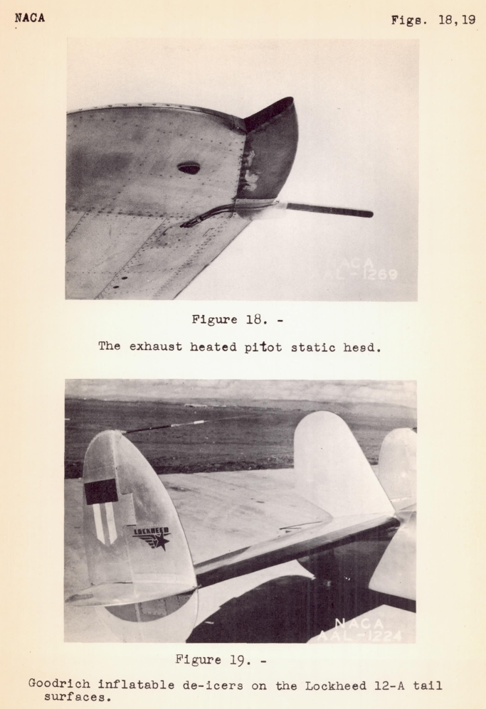  

![Figure 21. A photograph taken on an icing flight during which ice was prevented on the airplane wing and pitot-static head oy the use of exhaust heating. Ice on the tell-tale strut gives an indicatlon of the nature of the icing conditions. Data: Airspeed, 140 mph; altitude, 8,000 to 13,000 feet; Cumulus-Nimbus Clouds; air temperature -10 F to 22 F; air moderately to severely rough; types of ice rime, glaze, and snow slush; Estimated rate of icing 6 to 7 inches per hour. The flight was made between Tacoma, Washington, and the Pacific coast. The ice on the indicator appears to be 0.5 inch thick.](images/NACA-ACR-A-53/Figure 21.png)  

>Ice was removed from the horizontal stabilizer
by the inflatable de-icer under certain icing conditions,
although other icing conditions the ice was only
partially removed.

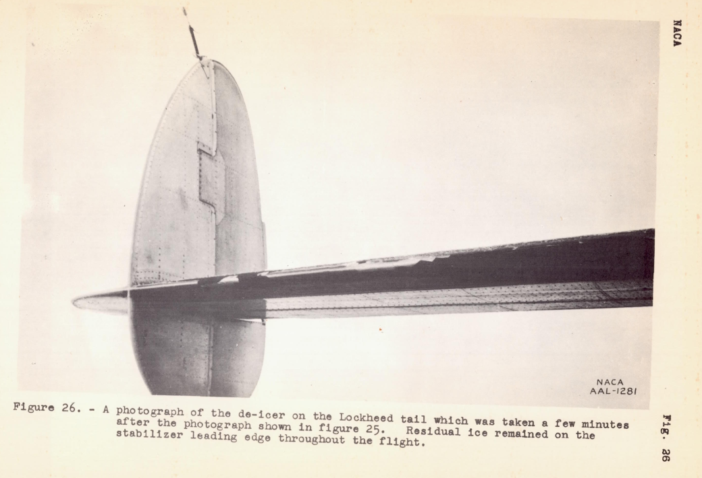  

![Figure 20. Ice formation on the tell-tale strut; wing and pitot-static head protected from ice formation by the use of exhaust heating. Data: Airspeed, 140 m. p. h.; altitude, 10,000 to 12,000 feet; Cumulus clouds; air temperature, 20 to 26 F.; air, moderately rough; rime ice formation; estimated rate of icing, 7 inches/hour. The flight was made in the vicinity of Moffett Field, Calif. Figure 27. A view of the Lockheed tail surface and radio antenna showing a formation on the wire resulting from a light rime icing condition. The wire antenna is visibly thickened by ice in places. ](images/NACA-ACR-A-53/Figure 27.png)  

>Important factors in the design of exhaust-heating
equipment, in addition to the degree of ice protection
afforded, such as corrosion, thermal expansion; failures
resulting from vibration, and increased weight and cost
have been considered.
After about 50 hours of flying time,
an inspection of the airplane indicated that while the
need for maintenance and repairs had been found, a remedy
for each defect was not difficult to discover.  

>CONCLUSIONS  
>1. Under all conditions of icing encountered in the flight tests, satisfactory 
protection against the formation of ice on the wing leading edges of the 
Lockheed 12A airplane was obtained by use of heat from the engine exhaust.  
>2. A consideration of the weight of exhaust wing-heating equipment, 
the effects of the equipment on the performance of the airplane, 
and the problem of maintenance of the exhaust-heated wings has 
immediate practical possibilities.  
>3. The use of air heating on the pilot's windshield and exhaust heating on the 
pitot-static head was found to provide satisfactory protection against ice
on these parts. 

The successful test experience with the Lockheed 12A 
would soon be repeated on two other aircraft (B-17 and B-24), 
using similar exhaust heating designs. 

## Conclusions  

Exhaust heat provided a practical means of ice protection. 
It saw further use through the 1950s. 

I do not know of any current aircraft that use 
engine exhaust heat for wing ice protection.  

The coming jet age would require different means of ice protection, 
which we will review in the upcoming post on compressed air heat. 

## Citations  

An online search (scholar.google.com) found  
NACA-TR-403 is cited 14 times,  
NACA-TN-712 5 times,  
NACA-TN-783 0 times,  
"Modern Icing Technology" 11 times,  
NACA-ACR-A-53 0 times,  
NACA-WR-A-34 5 times,  
NACA-WR-A-39 4 times,  
NACA-ARR-3H24 11 times,   
NACA-WR-A-35 5 times,  
and NACA-WR-A-7 5 times.  

Curiously, none of these are listed in the 132 publications of the 
["Selected Bibilography of NACA-NASA Aircraft Icing Publications"]({filename}/The Historical Selected Bibliography of NACA-NASA Icing Publications.md).  

I view this as an under-appreciated area, 
as there is much to glean even if 
one is not building an exhaust heat system 
(particularly wing leading edge heat exchangers). 
There are many similarities to the now commonly used 
compressed air heating systems. 

Also, detailed natural icing flight test accounts are always instructive
(NACA-TR-403, NACA-TN-783, NACA-ACR-A-53, NACA-WR-A-7, NACA-ARR-4B02). 

## Notes

[^1]: Theodorsen, Theodore, and Clay, William C.: Ice Prevention on Aircraft by means of Engine Exhaust Heat and Technical Study of Heat Transmission from a Clark Y Airfoil. NACA-TR-403, 1931. [ntrs.nasa.gov](https://ntrs.nasa.gov/citations/19930091477)  
[^2]: Rodert, Lewis A.: A Preliminary Study of the Prevention of Ice on Aircraft by use of Engine Exhaust Heat. NACA-TN-712, 1939. [ntrs.nasa.gov](https://ntrs.nasa.gov/citations/19930081464)  
[^3]: Rodert, Lewis A., and Jones, Alun R.: A Flight Investigation of Exhaust Heating De-icing. NACA-TN-783, 1940. [ntrs.nasa.gov](https://ntrs.nasa.gov/citations/19930081573)  
[^4]: Rodert, Lewis A., and Jackson, Richard: Preliminary Report on Flight Tests of an Airplane having Exhaust-Heated Wings. NACA-ACR-A-53, April 1941. [ntrs.nasa.gov](https://ntrs.nasa.gov/citations/19930093052)  
[^5]: Tribus, Myron: "Modern Icing Technology" 1952. [lib.umich.edu](https://deepblue.lib.umich.edu/bitstream/handle/2027.42/7990/bad2682.0001.001.pdf?sequence=5)  
[^6]: Rodert, Lewis A., and Jackson, Richard: Preliminary Investigation and Design of an Air-Heated Wing for Lockheed 12A Airplane. NACA-WR-A-34, April 1942.  
[^7]: Rodert, Lewis A. and Jackson, Richard: A Description of the Ju 88 Airplane Anti-Icing Equipment. NACA-WR-A-39 1942.  
[^8]: Jones, Alun R., and Rodert, Lewis A.: Development of Thermal Ice-Prevention Equipment for the B-17F Airplane. NACA-ARR-3H24, 1943.  
[^9]: Jones, Alun R., and Rodert, Lewis A.: Development of Thermal Ice-Prevention Equipment for the B-24D Airplane. NACA-WR-A-35, Feb. 1943.  
[^10]: Neel, Carr B., Jr., and Jones, Alun R.: Flight Tests of Thermal Ice-Prevention Equipment in the XB-24F Airplane. NACA-WR-A-7, Oct. 1943.  
[^11]: Look, Bonne C.: Flight Tests of the Thermal Ice-Prevention Equipment on the B-17F Airplane. NACA-ARR-4B02, 1944.  

