title: Testing Messinger Freezing Fraction Correlations with the IceVal Database  
Date: 2026-06-09 16:00  
tags: LEWICE, ice shapes, NASA, IceVal

### _"an empirical relationship was obtained which correlated ice accretion thickness and ice angles with theoretical impingement parameters."_  [^1]  

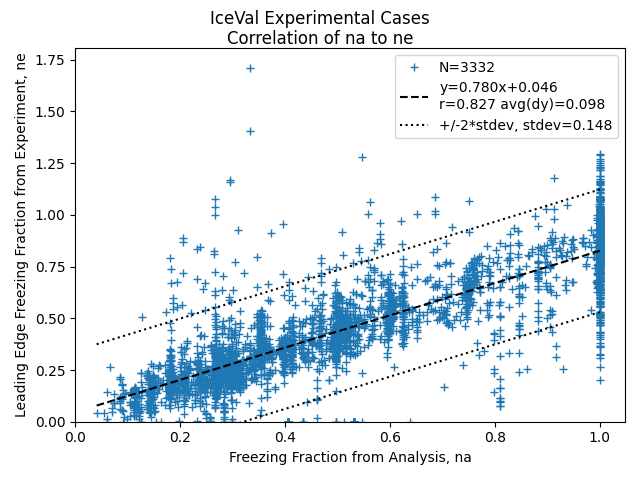  

## Introduction  
 
Studies have correlated icing conditions to ice shapes and their effects. 
Here, we will test one using the 3332 experimental ice shapes cases in the IceVal database [^1] 
without ice protection. 

The studies had well-planned series of test conditions for their objectives. 
However, when we use all 3332 IceVal experimental shapes from tests with diverse objectives, 
things can get messy. 

We will see that the final results are surprisingly good.  

## NASA/CR-2005-213852 [^3]  

NASA/CR-2005-213852 "Evaluation and Validation of the Messinger Freezing Fraction" 
has been reviewed previously in 
[Conclusions of the Ice Shapes and Their Effects thread]({filename}Conclusions%20of%20the%20Ice%20Shapes%20and%20Their%20Effects%20Thread.md).  

It looked at correlating ice shape parameters to calculated leading edge freezing fraction.  

The test cases within it are now a subset of the IceVal database.  

40 condition were tested to verify an implementation of [Messinger]({filename}messinger.md) [^4] freezing fraction calculations 
for the leading edge of an airfoil.  
 
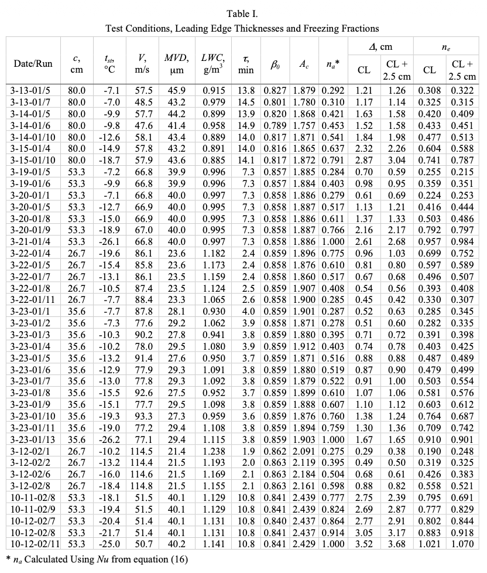  
_Public Domain image from [^3]._  

A key assumption is that the leading edge water collection efficiency can be accurately estimated from 
the Langmuir-Blodgett correlation (See reference [^3] or 
[Langmuir]({filename}Mathematical%20Investigation%20of%20Water%20Droplet%20Trajectories.md) for more details).  

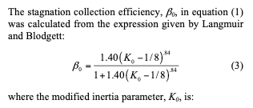  
_Public Domain image from [^3]._  

For an airfoil, the leading diameter of curvature is used when calculating Ko, 
not the leading edge radius as for a cylinder.  

The values correlate quite well to values calculated by LEWICE, 
with 3332 cases considered, including cases for several airfoils at several AOA values, 
and several large drop icing cases.  

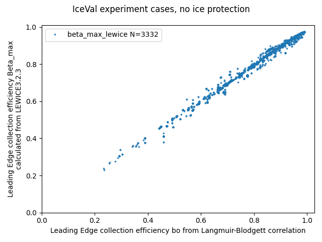

The analytic leading edge freezing fraction can then be calculated.
(See reference [^3] or [Manual of Scaling Methods]({filename}NASA-CR-2004-212875.md) for more details).  

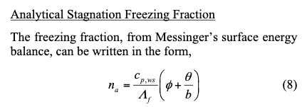  
_Public Domain image from [^3]._  

An experimental freezing fraction "ne" can be calculated from equation (1). 
 
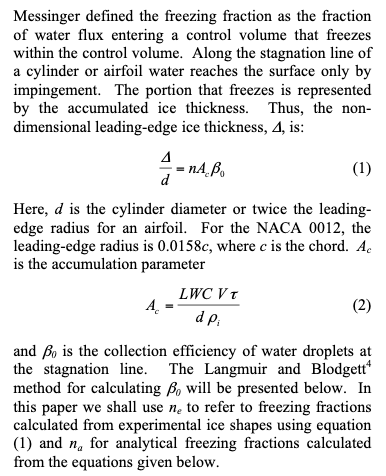  
_Public Domain image from [^3]._  

For a series of cases where the accumulation parameter (total water exposure) dimensionless parameter Ac was held constant, 
the ice shapes change with as temperature was varied, with a resulting change in freezing fraction.  

The na and ne values were found to correlate well.  

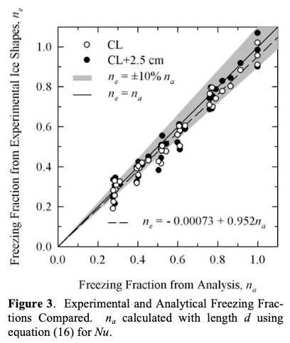  
_Public Domain image from [^3]._  

## Comparisons with IceVal data  

If we look at 672 cases in IceVal for the NACA0012 airfoil at A0A=0, 
the correlation for na is not as close as for the 40 cases in NASA/CR-2005-231852 Figure 3.  


From the figure above, several cases "stack" vertically at selected values of na. 
Many of the test sequences were planned to make this happen.  

For the cases without ice protection in the IceVal database, the correlation is comparable.  
  
 
## Upper surface ice horn thickness   

As the effects of ice have been correlated to upper surface ice horn height hu, 
it is desirable to be able to predict the value of hu.

The calculation of ne in equations (1) and (2) are for the airfoil leading edge. 

We can extend this to define a "nx" value for the upper horn height hu:

```text
hu / d = nx Ac Beta_o
```
For the 3332 IceVal cases, the correlation is surprisingly flat. 
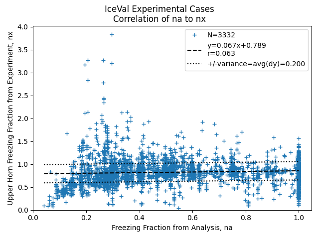  

There are numerous outliers. 
It is perhaps doubtful that this could be a useful correlation. 

However, we can back-calculate a predicted hu value for each case from the correlation and the 
definition of nx. 
we can then calculate a non-dimensional height ratio relative heigh difference as in the LEWICE validation report [^5].  

> Where the ice shape
> does have a glaze ice horn, the max. thickness does
> give the horn thickness. In order to compare different
> conditions with different chord lengths and accretion
> conditions, the individual ice thicknesses were non-dimensionalized by the maximum accumulation thickness as given in Equation 3.

  


```text
maximum accumulation thickness = t_max = LWC Airspeed Time / ice_density  (with unit conversions)

relative height difference = (thick_experiment - thick_lewice) / t_max
```

When this values is compared to experiment, the variance (average difference) is 0.15:  
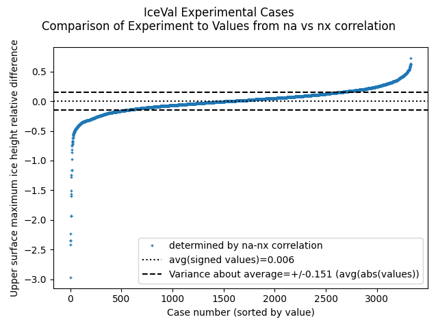  

This is quite comparable to the comparison between LEWICE values and experiment 
of 0.159:  

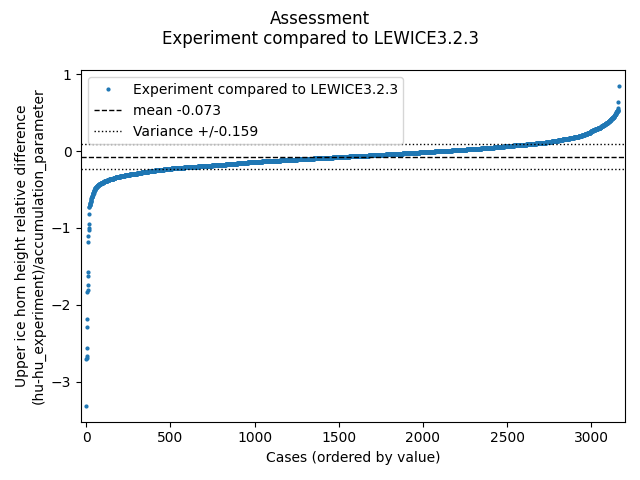  

## Upper surface horn angle  

Also surprisingly, a similar comparison for upper horn angle is comparable between the LEWICE results 
and using a na to theta_u correlation:  

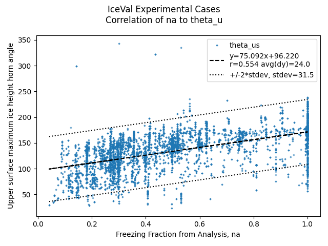  

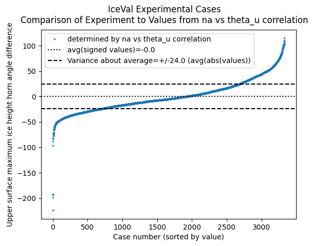  

The correlations resulted in a +/-24 degree average horn angle difference, 
while LEWICE had a +/-25 degree difference.

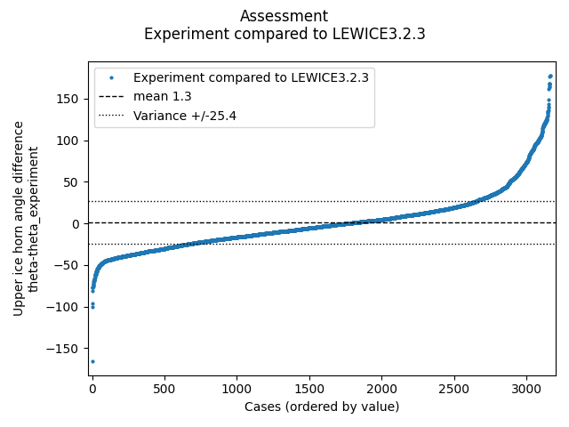

## Illustrations of use of the nx correlations  

27 cases were selected to illustrate how well (or not) the correlations can identify an upper horn location. 
The cases cover a wide range of na and aoa values. 
They also cover cases either the correlation or LEWICE was accurate, 
or one appeared to be better than the other. 

The identified horn location is plotted, as well as the test ice shape and LEWICE analysis 
with identified upper and lower horns. 
In some cases, the correlation match the upper horn better than the identified by the geometric method.  
Both THICK and the geometric method have challenges for identifying horns, 
as discussed in [A Geometric Method]({filename}thicker.md).  

In a few cases, it is evident that the ice shapes tracing does not match the test conditions 
listed in IceVal. 
For a few cases it is debatable if either the correlations or LEWICE are accurate.  

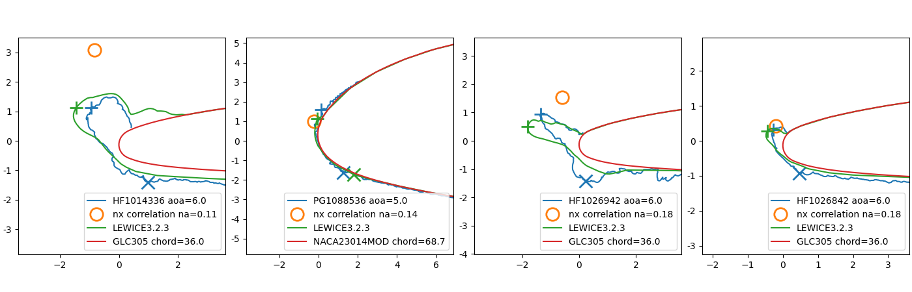
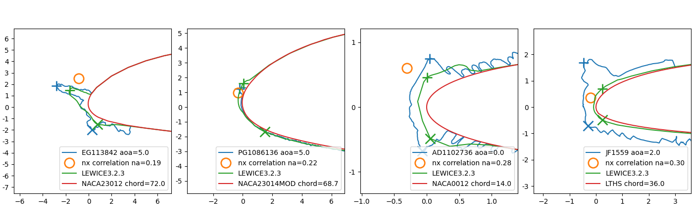
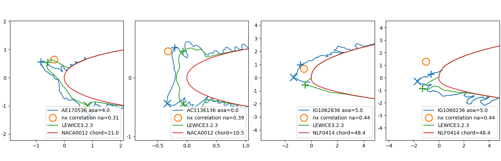
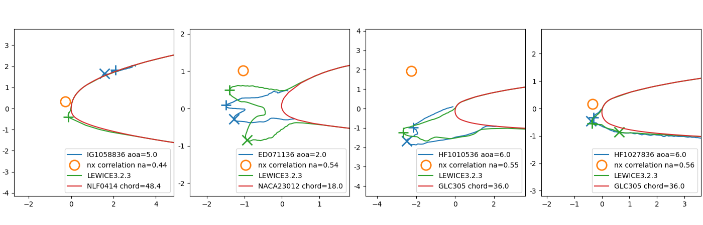
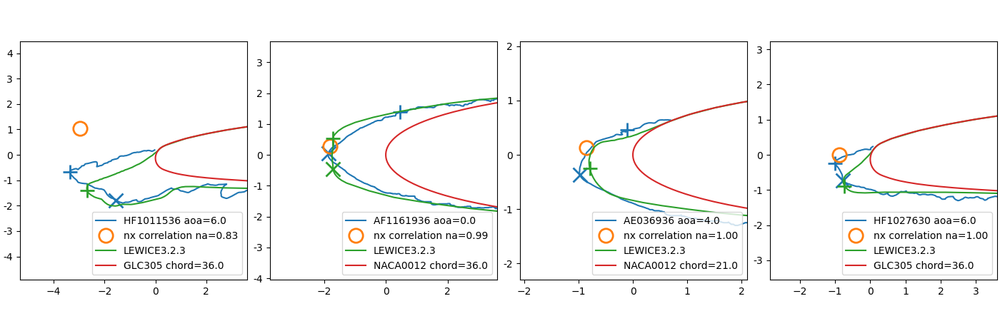
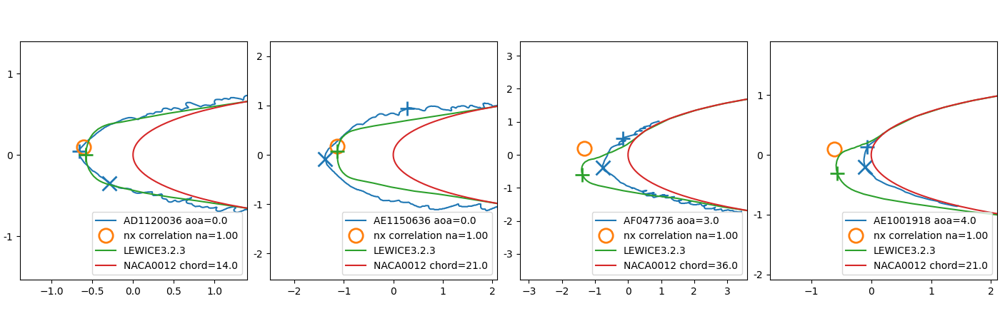
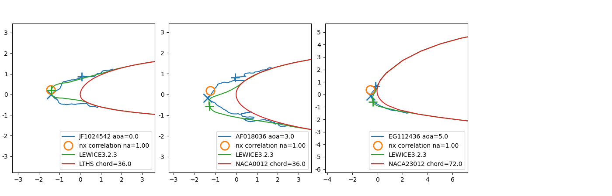


| Case     |aoa | na  |  hu  |theta | hx   |theta |hu_lew|theta| Comment|
|----------|----|-----|------|------|------|------|------|------|-------|
|HF1014336 | 6.0|0.108| 1.419| 126.7| 2.964| 104.4| 1.815| 138.8| LEWICE better|
|PG1088536 | 5.0|0.142| 0.263|  81.8| 0.335| 106.9| 0.201|  90.9| LEWICE better| 
|HF1026942 | 6.0|0.181| 1.648| 141.9| 1.500| 109.8| 1.894| 160.3| LEWICE better|
|HF1026842 | 6.0|0.181| 0.403| 121.2| 0.400| 109.8| 0.533| 137.9| better than LEWICE|
|EG113842  | 5.0|0.188| 3.043| 150.4| 1.677| 110.3| 1.850| 143.8| LEWICE better|
|PG1086136 | 5.0|0.222| 0.398| 100.7| 0.392| 112.9| 0.362|  86.3| debatable|
|AD1102736 | 0.0|0.276| 0.475|  86.4| 0.573| 116.9| 0.255|  88.9| better than LEWICE|
|JF1559    | 2.0|0.296| 1.376| 105.7| 0.291| 118.4| 0.165|  70.8| wrong tracing|
|AE170536  | 4.0|0.306| 0.954| 146.1| 0.615| 119.2| 0.736| 137.0| LEWICE better|
|AC1136136 | 0.0|0.392| 0.459| 112.1| 0.493| 125.7| 0.321|  98.8| better than LEWICE|
|IG1062836 | 5.0|0.435| 1.087| 130.8| 0.705| 128.9| 0.606| 228.5| better than LEWICE|
|IG1060236 | 5.0|0.435| 0.678| 156.9| 1.409| 128.9| 1.493| 212.8| LEWICE better|
|IG1058836 | 5.0|0.435| 0.057|  40.9| 0.313| 128.9| 0.230| 253.0| debatable|
|ED071136  | 2.0|0.544| 1.479| 179.3| 1.318| 137.1| 1.437| 163.1| LEWICE better|
|HF1010536 | 6.0|0.548| 2.285| 201.4| 2.943| 137.4| 2.845| 202.7| LEWICE better|
|HF1027836 | 6.0|0.562| 0.330| 211.8| 0.393| 138.4| 0.455| 228.8| LEWICE better|
|HF1011536 | 6.0|0.829| 3.402| 189.3| 3.166| 158.4| 2.930| 205.3| LEWICE better |
|AF1161936 | 0.0|0.995| 0.592|  71.7| 1.818| 170.9| 1.771| 163.0| better than LEWICE  |
|AE036936  | 4.0|1.000| 0.298| 103.3| 0.868| 171.3| 0.822| 197.5| LEWICE better|
|HF1027630 | 6.0|1.000| 1.008| 186.2| 0.893| 171.3| 0.948| 225.8| better than LEWICE|
|AD1120036 | 0.0|1.000| 0.659| 175.9| 0.615| 171.3| 0.578| 180.3| better than LEWICE |
|AE1150636 | 0.0|1.000| 0.467|  73.8| 1.155| 171.3| 1.132| 176.4| corrects hu|
|AF047736  | 3.0|1.000| 0.309| 107.8| 1.335| 171.3| 1.470| 203.4| debatable |
|AE1001918 | 4.0|1.000| 0.087| 115.1| 0.620| 171.3| 0.618| 208.8| wrong tracing|
|JF1024542 | 0.0|1.000| 0.406|  85.4| 1.436| 171.3| 1.408| 171.8| corrects hu|
|AF018036  | 3.0|1.000| 0.429|  93.3| 1.251| 171.3| 1.365| 203.6| corrects hu|
|EG112436  | 5.0|1.000| 0.175| 109.2| 0.530| 171.3| 0.600| 249.8| corrects hu |  

Except for case JF1599, where the wrong test ice tracing is likely to have been associated with the conditions, 
I judge the nx correlation results to be accurate or "conservative" 
(likely to yield too large of a performance penalty).  

## Notes about LEWICE and THICK   

LEWICE can calculate a leading edge initial freezing fraction. 
However, you will find that the LEWICE value do not always correspond well to values calculated using 
equation (10). 
The reasons for this are many and complex, 
and would require a dedicated post (if not several) to detail. 
A few reasons include a different leading edge heat transfer coefficient, 
and a transient component in the freezing calculation in LEWICE.  

The 'IceThicknessLEMin' values output by the LEWICE THICK utility were found to not be always accurate. 
This is also true for the values in the IceVal ThickUtilityData table.
The leading edge ice thickness is required to determine ne with equations (1) and (2). 
The [Geometric Analysis method]({filename}thicker.md) was used to determine the values herein.  

For nine of the 40 cases in NASA/CR-2005-213852 the minimum leading edge ice thickness 
determined by the geometric method differed by more than 10% for Iceval or THICK values, 
while the geometric method value agreed well with the Table 1 value. 
An example is shown below, where the Table 1 value was 2.16 cm (0.85 inch). 
THICK reports a leading edge minimum thickness value, but not a location, 
so the THICK value is illustrated as a displacement from the airfoil surface. 

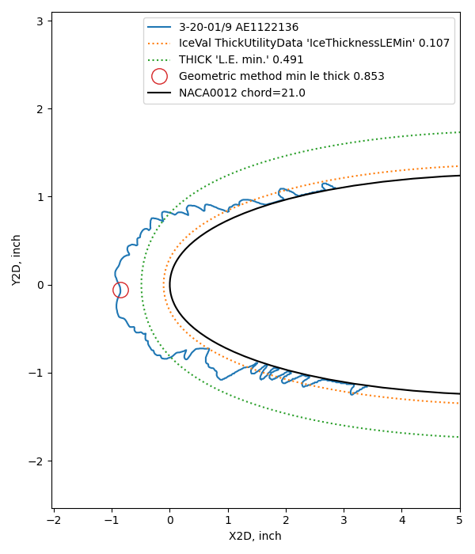  

## Conclusions  

The Messinger freezing leading edge fraction correlation from NASA/CR-2005-213852 is re-validated herein over 3332 experimental cases, 
in more detail than in NASA/CR-2005-213852 [^3]. 
 
The correlations developed herein are much simpler than using LEWICE or other Computational Fluid Dynamics model 
to determine horn height and location, and the correlations are as accurate!  

The ice horn angle and thickness from the correlations can be used to estimate aerodynamic effects
(see [Conclusions of the Ice Shapes and Their Effects thread]({filename}Conclusions%20of%20the%20Ice%20Shapes%20and%20Their%20Effects%20Thread.md)).  

One "only" had to run 3332 experimental cases on several airfoils at a wide variety of conditions 
to obtain the correlations.  

I view the correlations as largely fulfilling [Wilder's vision]({filename}wilder.md) of [leaving out the "and sweep" part]:    

> Use of these relationships allows the direct determination of ice shapes adjusted for
> any given icing and flight condition as well as for size ... of the airfoil  

## Related  

This post is part of the ["6000 Ice Shapes - the IceVal DatAssistant"]({filename}iceval.md) thread.  

# Notes  

[^1]: 
Wilder, Ramon W.: "Techniques used to determine Artificial Ice Shapes and Ice Shedding, Characteristics of Unprotected Airfoil Surfaces" in Anon., "Aircraft Ice Protection", the report of a symposium held April 28-30, 1969, by the FAA Flight Standards Service; Federal Aviation Administration, 800 Independence Ave., S.W., Washington, DC 20590. [apps.dtic.mil](https://apps.dtic.mil/sti/pdfs/AD0690469.pdf).  
[^2]: IceVal DatAssistant (LEW-18343-1)
Overview: 
This NASA-developed technology provides an improved mechanism for managing the 
large volume of data generated and utilized in performing icing research.  
[Note: the software is available only to US persons.]  
[software.nasa.gov](https://software.nasa.gov/software/LEW-18343-1)  
[^3]: 
Anderson, David N., and Jen-Ching Tsao. "Evaluation and Validation of the Messinger Freezing Fraction." 41st Aerospace Sciences Meeting and Exhibit. No. NASA/CR-2005-213852. 2005.  [ntrs](https://ntrs.nasa.gov/citations/20050215212)  
[^4]: 
Messinger, B. L.: Equilibrium Temperature of an Unheated Icing Surface as a Function of Airspeed. Preprint No. 342, Presented at I.A.S. Meeting, June 27-28, 1951.  
[^5]: 
William B. Wright and Adam Rutkowski, "A summary of validation results for LEWICE 2.0." 1999. [NASA/CR-208690](https://ntrs.nasa.gov/citations/19990021235).  
See also the companion [NASA/CR-1998-208687](https://ntrs.nasa.gov/citations/19990017993).  
