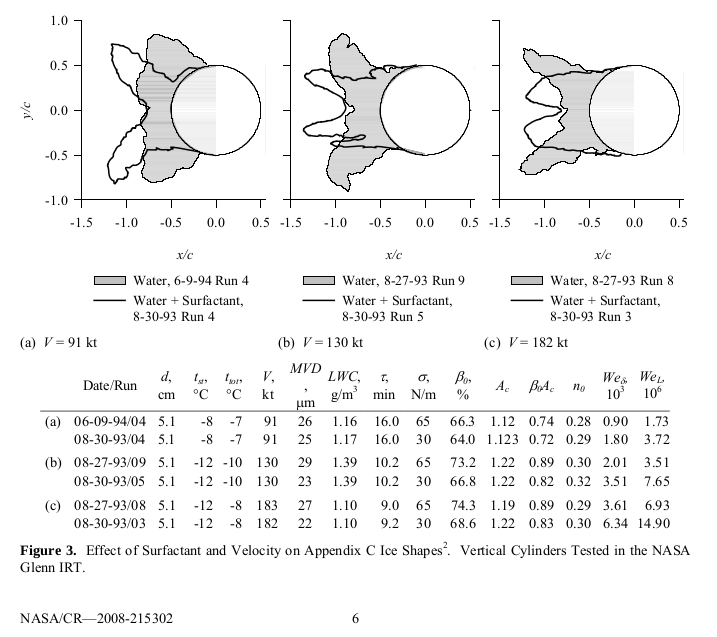
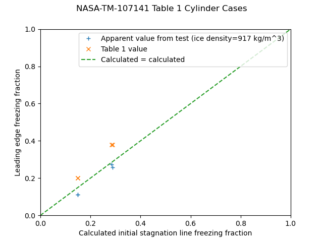
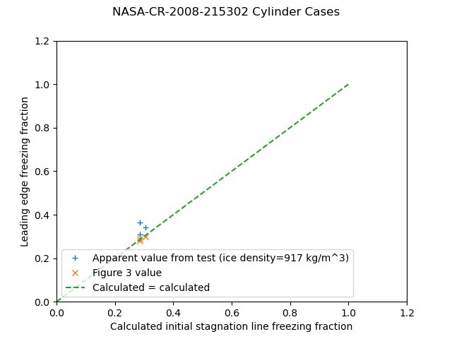

Title: Freezing Fractions
Status: draft  

Freezing fraction is difficult to measure experimentally. 
A procedure that has been used is to measure the leading edge ice thickness, 
and compare that to a calculated value. 
However, that values depends on an assumed ice density value. 
So, measurements have an unquantified uncertainty. 

Thus the validation of freezing fraction calculations is subject to that uncertainty. 

Example comparisons are given below. 

##Non-rotating cylinders

There are several sources of ice measurements on non-rotating cylinders. 

AEDC-TR-85-30

https://dspace.mit.edu/bitstream/handle/1721.1/49937/32257719-MIT.pdf?sequence=2 

  

NASA-TM-107141
https://ntrs.nasa.gov/api/citations/19960012178/downloads/19960012178.pdf 

  

NASA/CR—2008-215302  
Ice Shape Scaling for Aircraft in SLD Conditions
https://www.tc.faa.gov/its/worldpac/techrpt/ar0755.pdf 

  

The ice thickness at the leading edge was measured from the figure. 
From that, an ice growth rate can be calculated: 

    measured_ice_growth_rate = ice_thick / time

A rime ice grow rate can be calculated: 

    calculated_rime_ice_growth_rate = lwc/G_PER_KG * beta * u / ice_density
    
The ice density is assumed to be the bulk ice density, 917 kg/m^3. 
A Langmuir "D" drop size distribution was assumed to calculate the beta value. 

And an apparent freezing fraction value can be calculated: 

    n_apparent = measured_ice_growth_rate / calculated_rime_ice_growth_rate

The heat transfer relationship from NASA-TM-107141 was used:

    nu = 1.244 * re^0.4774

The file "messinger.py" was used to calculate the freezing fraction. 
The freezing fraction is evaluated at the initial cylinder diameter (only). 
The is no attempt to calculate changes during the ice growth, 
when the surface shape becomes non-cylindrical and the heat transfer 
and water catch rate may change.

For the AEDC Table 1, the reported and calculated freezing fraction values agree well, 
but the apparent freezing fraction values have scatter compared to the calculated values.  

  

For NASA-TM-107141, apparent freezing fraction values agree well with the calculated values, 
but the reported values do not. 
As the heat transfer relationship used came from NASA-TM-107141, 
it is not clear what the implementation differences of the calculation would be. 

  

For the NASA-CR-2008-215302, the values agree fairly well. 

  

##Airfoil leading edge approximated as a cylinder

NASA/CR-2005-213852
https://ntrs.nasa.gov/api/citations/20050215212/downloads/20050215212.pdf  

Treats the airfoil leading edge as a cylinder with a diameter equal to twice the leading edge radius of curvature. 

The freezing fraction values agree fairly well at higher values, 
but at lower values the scatter is greater than the +/-10% region shown. 

  

    Nu = 1.14 * Pr**0.4 * Re**0.5
    Nu = 0.994 * Re**0.5

NASA/CR—2004-212875

