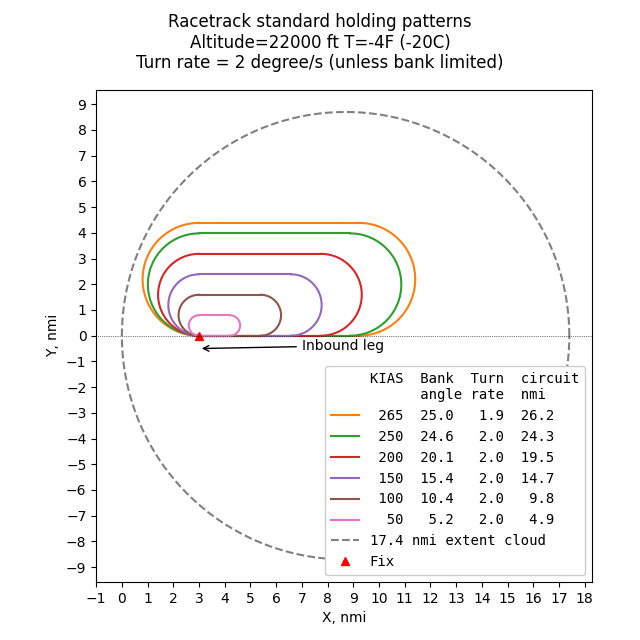
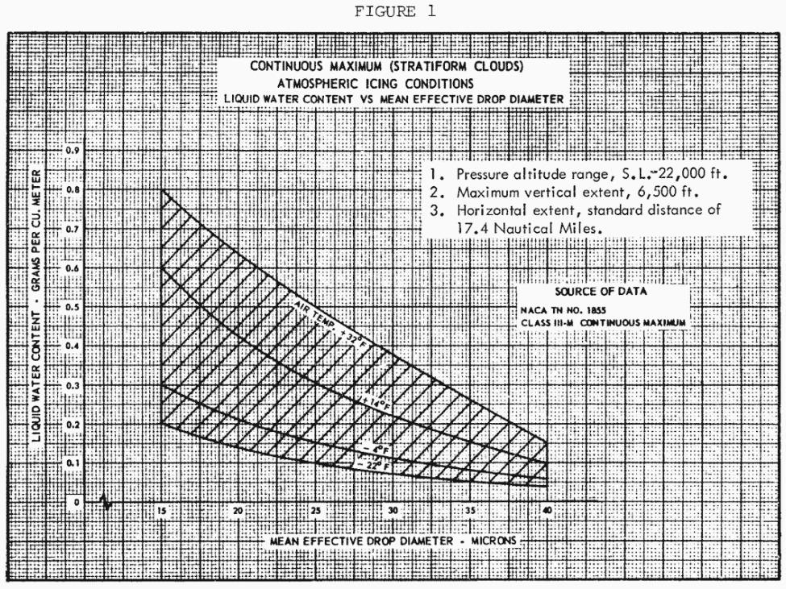
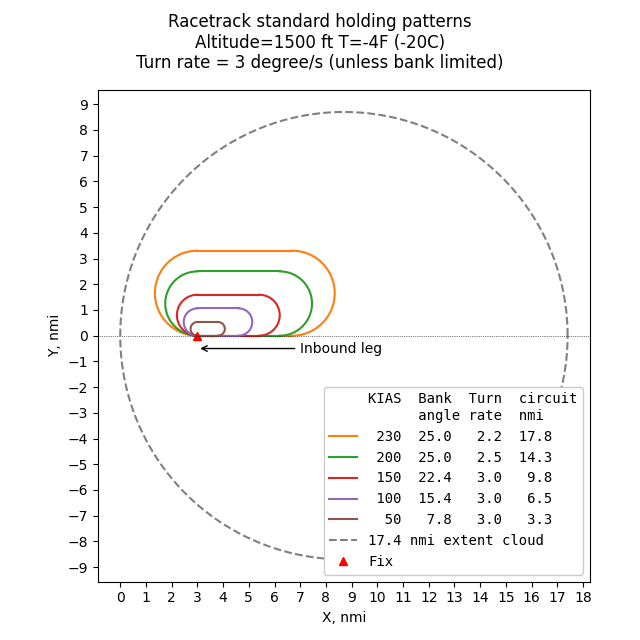

status: draft  
title: Analysis of Icing in Holding Patterns    
tags: AC20-73A, Appendix C  
date: 2026-08-13 12:00  

### _"You should assume the airplane remains in a rectangular “racetrack” pattern, with all turns made within the icing cloud."_  

  

## Summary   

"AIRCRAFT ICE PROTECTION" AC 20-73A [^1] discusses an aircraft "racetrack" holding pattern with a 45-minutes duration hold to be used for 
determining simulated ice shapes to be used in dry air flight test.  

Here, we compare the AC 20-73A holding pattern to standard holding patterns, detailed at [skybrary.aero](https://skybrary.aero/articles/holding-pattern) [^2].

Standard holding patterns fit well within a 17.4 nmi standard distance cloud diameter circle 
for Appendix C Continuous Maximum icing [^3].  

The angle of attack changes due to turning and while holding was found to be small, 
on the order of 10% maximum for a jet transport aircraft. 
The effect on angle of attack due to ice accretion during the holding was also found to be small.  
So, the use of a constant angle of attack for analyzing ice shapes is justified. 

However, for smaller airfoils, the effects may be larger.  

## The racetrack holding pattern  

### AC 20-73A description  

An FAA AC (Advisory Circular) is advisory material that describes an acceptable way
(but not the only way) to show compliance with regulations. 
However, if you propose to do something different, 
regulatory agencies may require much substantiating data from you. 

AC 20-73A defines a way to analyze icing exposures for extended time in holding.  

>
> 8.1 Compliance Means: Analysis.
> 
> ... 
> 
>8.2.2.6 Compliance Means: Dry Air Flight Test Safe-flight Evaluation with Simulated Ice Shapes.  
> 
>a. Airframe type certificate applicants may flight test their aircraft with simulated ice shapes
to show safe aircraft performance and handling qualities during flight into icing conditions. (See
section 6.3 of this AC.) Using simulated ice shapes will allow you to evaluate the aircraft’s
flying qualities in stable, dry air. It also allows you to evaluate the flying qualities without
melting, sublimation, shedding, and erosion of ice buildups, as would occur with natural ice
accretions. Also, dry-air flight testing of aircraft with simulated ice shapes facilitates
demonstration of compliance with the required regulations and results in significant decreases in
flight test costs, compared to flight testing in natural icing conditions.  
>
> ...
> 
> c. You should determine the effect of the 45-minute hold in continuous maximum icing
conditions of 14 CFR part 25, Appendix C. You should assume the airplane remains in a
rectangular “racetrack” pattern, with all turns made within the icing cloud. Therefore, you
should not use a horizontal extent correction for this analysis. 
> 
>...
>
> APPENDIX E. METEOROLOGICAL CONDITIONS  
> 
> ...
> 
> E.2 USING 14 CFR PARTS 25 AND 29, APPENDIX C.  
>
> ...
> 
>Another use is to estimate ice buildups on unprotected surfaces during a 45-minute hold. For the
45-minute hold discussed in section 8 of this AC, use the LWC from Figure 1 of 14 CFR part 25,
Appendix C at full value. Guidance for the 45-minute hold assumes the conservative case when
the holding pattern remains within 17.4 nm and the LWC is changed from that shown in Figure 1
of 14 CFR part 25, Appendix C [^3].  

The phrase 
>the LWC is changed from that shown in Figure 1  

is confusing to me, as it appears to contradict the prior statement of "use the LWC from Figure 1 ... at full value".  

I take it that 
>the LWC is <u>***un***</u>changed from that shown in Figure 1  

is what was intended.  

   
 
### Geometric tracks of standard holding patterns   

As explained at [skybrary.aero](https://skybrary.aero/articles/holding-pattern) [^2], 
a standard hold pattern assumes a turning rate of 3 degrees per second, 
completing a 180-degree turn in 1 minute ("rate one") for altitudes below 14000 ft., 
and 1.5 minutes for altitudes above 14000 ft. 
Straight leg sections connect the 180 degree turns at either end. 
The straight sections are typically 1 minute of travel long. 
Thus, the size of the track is determined by airspeed.

Bank angles are typically limited to 25 degrees. 
At low airspeed, the bank angle to achieve a rate one turn is less than 25 degrees. 
However, at approximately 160 KTAS, the turn rate is limited by bank angle (not turning speed), 
and at higher airspeed a turn rate of less than 3 degrees per second is required, 
and the 180-degree turn takes more than one minute.   

Allowed holding maximum airspeed changes with altitude. 
True airspeed (KTAS) also varies with altitude for constant KCAS or KIAS airspeed. 

Ambient static temperature also has a small effect on airspeed. 
A temperature of -4F (-20C) was selected for these examples to remain within 
the Appendix C, Figure 2 envelope for the altitudes of interest.  

  

Example holding pattern tracks for selected values of KIAS are shown below. 
For the plot below an arbitrary "fix" (reference) point, where the inbound turn is initiated, 
was selected within a 17.4 nmi diameter circle. 
The tracks are idealized, actual flight tracks may not always agree well with the ideal. 
For low altitudes, the smallest tracks are found, 
and they fit well inside a 17.4 nmi diameter circle.  

  

At higher altitudes, the largest tracks are found. These also fit well inside a 17.4 nmi diameter circle.  

  

Air traffic control may instruct pilots to use patterns different from the standard patterns above, 
due to several possible factors (often congestion on-ground or in-air near at the destination).  

### Angle of attach changes during holding  

With the idealized standard holding patterns above, about half the time is spent at a bank angle of zero, 
and about half spent at a bank angle for turning. 
To maintain a constant altitude at constant airspeed, a higher angle of attack is required while turning (and additional thrust).  

For the maximum bank angle of 25 degrees, about 10% more lift is required. 
If lift is proportional to angle of attack, this is about a 10% change in angle of attack for the clean wing case. 
For example, the angle of attack of 4 degrees in straight flight would change to 4.4 degrees while turning. 

The analysis of a holding condition in Wilder [^4] did not appear to consider changes in angle of attack due to turning. 
However, the effects are small, and it appears justified to not include them.  

Data for a commercial jet transport [^4] shows that the lift coefficient (CL) curve is approximately linear over the 
angle of attack (α) range considered:  

  

Also, the lift curve with ice is close to the lift curve without ice in this range. 
So, the change in angle of attack due to ice accretion is small during the long-duration icing encounter, 
smaller than the 10% change for turning. 
(The icing scenario used predated and was different from the current AC 20-73A scenario described above. 
One version is described in Wilder, another in AC 20-73A section R.4.1.) 
Changes in drag with ice are more noticeable.  

An analysis ["Running LEWICE version 3.2.3 for the IceVal cases"]({filename}comparisons_l32.md) 
found that changes in ice shapes due to angle of attack differences of 10% or higher 
had limited effect on the ice shape measured characteristics, 
the differences being comparable to the variation in ice shapes between repeated icing wind tunnel experiments.  

Smaller airfoils may have different lift characteristics with ice. 
The lift curve with ice may start departing from the clean lift curve at a moderate angle of attack, 
and there may be larger differences at an angle of attack approaching stall.  

If a large airfoil and a small airfoil travel at the same airspeed, 
the total water exposure (airspeed * LWC * time, typically in kg/m^2) will be the same. 
The ice shapes will be of roughly comparable dimensional height, but the ratio of ice height to chord will differ.

If we approximate an ice shape as the simple plate protuberances used in NACA-TR-446 [^5], 
effects of scale are evident. 
The use of NACA-TR-446 data for predicting lift with ice is a limited approximation, 
and actual test data with ice might differ, but it is useful for illustrating trends.   

A large airfoil may have an ice height to chord ratio of about 0.001, 
but a smaller one has a ratio of 0.005 to 0.0125. 
The effects on lift are more pronounced for protuberance height to chord ratio in the range of 0.005 to 0.0125.  

   

### Predicted maximum drag icing conditions in holding  

As the same Appendix C Continuous Maximum Icing environment is used as in ["Estimating Icing Conditions with Highest Drag"]({filename}conditions_cd.md), 
those results will apply for the holding analysis.  
The Cd due to ice will have a higher value for the longer duration holding case, 
but the same LWC-MVD-Altitude conditions will achieve the maximum. 
The maximum Cd conditions are a function of airspeed and chord length.  

Maximum drag conditions for 3 airspeed values and 5 chord lengths are shown below for the 17.4 nmi case:   

  

  

## Related  
 
This post is an addendum to the [Ice_Shapes and Their Effects_thread]({filename}ice_shapes_thread.md), 
and was written after 
[Conclusions of the Ice Shapes and Their Effects Thread]({filename}Conclusions%20of%20the%20Ice%20Shapes%20and%20Their%20Effects%20Thread.md). 
It refines and expands information from the thread. 
I may eventually edit "Conclusions of the Ice Shapes and Their Effect Thread" 
to incorporate this information.  

## Notes  

[^1]: Anon.: "Aircraft Ice Protection", FAA AC 20-73A, [faa.gov](https://www.faa.gov/documentLibrary/media/Advisory_Circular/AC_20-73A.pdf)  
[^2]: SKYbrary Aviation Safety. (December 20, 2022). Holding Pattern. Retrieved August 7, 2026, from [https://skybrary.aero/articles/holding-pattern](https://skybrary.aero/articles/holding-pattern)  
[^3]: Appendix C of the United States Chapter 14 Code of Federal Regulations Part 25 [ecfr.gov](https://www.ecfr.gov/current/title-14/chapter-I/subchapter-C/part-25/appendix-Appendix%20C%20to%20Part%2025)   
[^4]: Wilder, Ramon W.: "Techniques used to determine Artificial Ice Shapes and Ice Shedding, Characteristics of Unprotected Airfoil Surfaces" in Anon., "Aircraft Ice Protection", the report of a symposium held April 28-30, 1969, by the FAA Flight Standards Service; Federal Aviation Administration, 800 Independence Ave., S.W., Washington, DC 20590. [ntrl.ntis.gov](https://ntrl.ntis.gov/NTRL/dashboard/searchResults/titleDetail/AD690469.xhtml).  
[^5]: Jacobs, Eastman N.: Airfoil Section Characteristics as Affected by Protuberances. NACA-TR-446, 1932 [ntrs.nasa.gov](https://ntrs.nasa.gov/citations/19930091520).   
