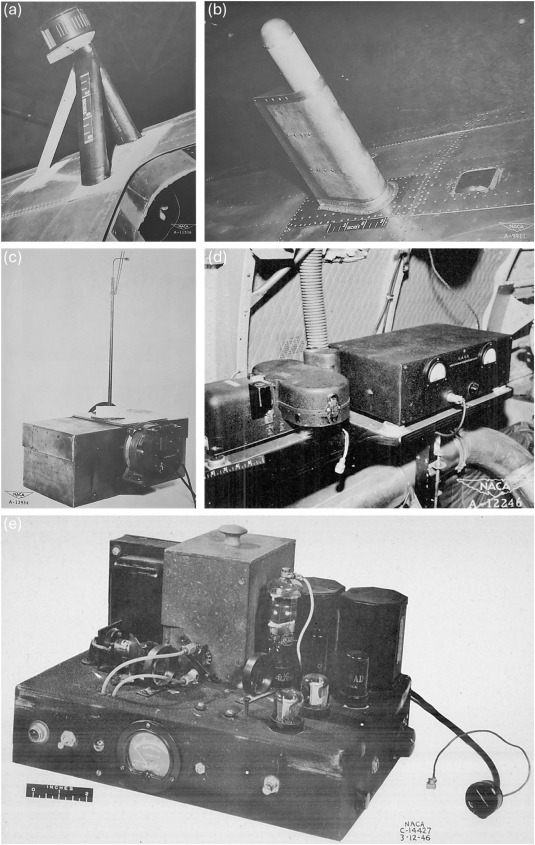

Title: "A review of ice detection technologies"      
Date: 2026-01-13 13:30  
tags: publications, ice detection, NACA   
rights: CC-BY-NC-SA 4.0

### _"These incidents underscore the urgent need for reliable, real-time ice detection systems to prevent dangerous icing conditions and enhance operational safety."_ [^1]  

  
Fig. 9. (a) (b) fixed cylinder, (c) Capillary collector, (d) rainbow recorder, (e) dew-point recorder.  
  
## Discussion  

I am proud to note the publication of the article "A review of ice detection technologies" 
in the journal "Progress in Aerospace Sciences" [link](https://www.sciencedirect.com/science/article/pii/S0376042125000843). 
I was a co-author with four others whom I thank (L. Maio, J. Moore, P. Potluri, C.K. Bosetti). 

I contributed largely to the section "Early meteorological instruments in flight". 
You may find more information on the topic in the ["Meteorological Instruments Thread"]({filename}/instruments.md).   

Kudos to the "Progress in Aerospace Sciences" for being an open access journal.  

## Notes:
[^1]:
L. Maio, J. Moore, D.E. Cook, P. Potluri, C.K. Bosetti,
A review of ice detection technologies,
Progress in Aerospace Sciences,
Volume 161,
2026,
101158,
ISSN 0376-0421,
[doi.org/10.1016/j.paerosci.2025.101158](https://doi.org/10.1016/j.paerosci.2025.101158).
[sciencedirect.com/science/article/pii/S0376042125000843](https://www.sciencedirect.com/science/article/pii/S0376042125000843)  
 
