title: Ice Shape Drag Correlations  
status: draft  
date: 2026-07-12 12:00
tags: ice shapes, drag

### _"No certain explanation for the poor repeatability of glaze ice shapes is available at this time."_  
_NASA-TM-83556._  

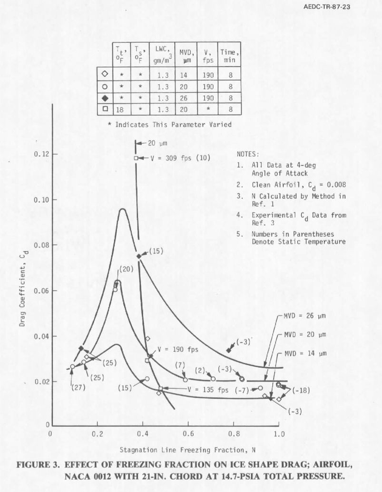
_Public Domain image from AEDC-TR-87-23._  

## Summary  

We have seen several attempts to correlate drag for an airfoil with icing conditions.  
Here, we will review prior correlations, and refine the methods to achieve a 
better, more widely applicable correlation.  

## Prior Correlations

One significant correlation is from NASA-TM-83556 [^1], 
that used test control parameters such as total temperature, LWC, and airspeed:  

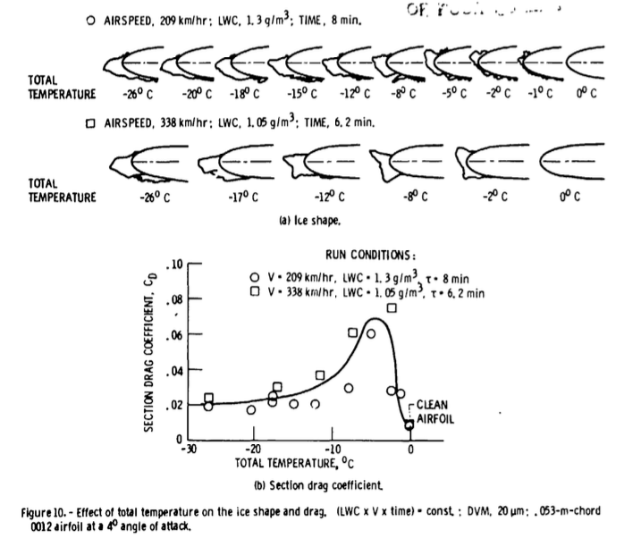  
_Public Domain image from NASA-TM-83556._  

Another is from AEDC-TR-87-23 [^2], 
which used the calculated leading edge freezing fraction (N):  

  
_Public Domain image from AEDC-TR-87-23._  

About the lines on Figure 3, AEDC-TR-87-23 states:

> The curves for these figures were drawn as the author
interpreted the data.

> The curves are similar in shape because of the functional dependency
of N on test conditions that affect the change in ice shape and, thus, Cd. Again, it depends
on which test conditions cause the value of N to change, thereby determining the influence
that N has on the value of Cd. 

> The freezing fraction lines seem to indicate
that Cd is reasonably insensitive to changes in static temperature when the freezing fraction,
N >= 0.7. They also indicate that a critical peak in Cd seems to occur when N ~= 0.3. These
observations may aid in the determination of critical design conditions for icing tests. These
are limited data. Additional data need to be collected to further substantiate these observations
and add resolution to the curve.
 
The primary purpose of AEDC-TR-87-23 was not necessarily to develop a universal drag correlation:  

> An investigation was conducted of the requirements for setting icing test conditions for
aircraft engine certification tests.  

However, within AEDC-TR-87-23 we will find that many of the necessary parts exist, 
particularly the use of dimensionless parameters such as freezing fraction, 
accumulation parameter, and water drop modified inertia parameter.  

## Experimental dataset  

Both NASA-TM-83556 and AEDC-TR-87-23 used the same dataset, from 
NASA-TM-83556. Table 1 from NASA-TM-83556 is shown below.  

>The test matrix is listed in table 1. The ice shape and resulting drag
coefficient depend upon at least the following: the airfoil shape and angle
of attack, the air temperature and velocity, and the LWC and DVM [MVD] of the cloud.
With that number of parameters, only a sparse matrix of conditions and repeat
conditions could be accomplished.  
> 
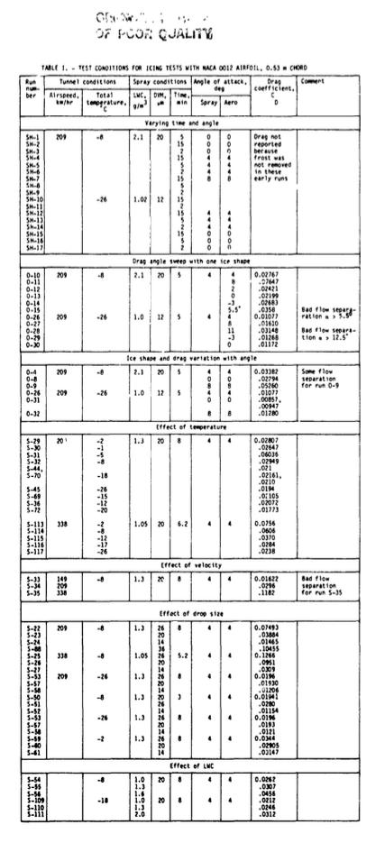  
_Public Domain image from NASA-TM-83556._  

AEDC-TR-87-23 lists only 35 of the 49 conditions in Table 1.  
The data table in AEDC rounds the temperature values to degrees Fahrenheit, and omits run names.   

There are minor discrepancies and errors in the data lists of each, 
and those were corrected for this analysis (included further below).  

## Evaluating correlations  

To evaluate the level of correspondence between 
the test points and correlation fit line, average relative difference (abbreviated below as rel.diff.) will be used:   

> rel.diff. = average(abs(fit-test)/test)

The Figure 10 correlation has fair correspondence to the selected datapoints shown in Figure 10. 
However, the correspondence to all 49 data points is not as good.   

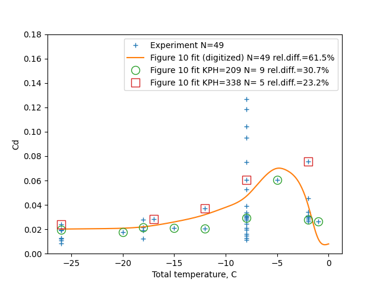  

To evaluate the AEDC-TR-87-23 Figure 3 correlation, the lines of constant drop size MVD are used. 
These correspond to constant lines of the dimensionless parameter water drop modified inertia parameter ko. 

To evaluate ko and other dimensionless parameters, the methods from 
[NASA/CR-2004-212875](https://icinganalysis.com/manual-of-scaling-methods.html)[^3] were used. 
The terminology differs slightly from AEDC, such as na versus N being used for leading edge freezing fraction. 
Ko is based on chord length in AEDC-TR-87-23, while it is based on leading edge diameter of curvature in NASA/CR-2004-212875.  

The lines for drop sizes 14, 20, and 26 correspond to ko values 
of 1, 1.7, and 2.6 respectively, based on leading edge diameter of curvature 
(there is a minor variation within each set due to temperature dependent properties of air). 
The drag difference due to ice can be separated out from total drag:  

> dCd_ice = Cd_total - Cd_clean

Cd_clean is available from NASA-TM-83556 Figure 3:  
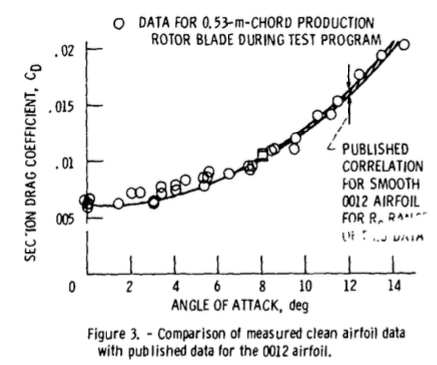  
_Public Domain image from NASA-TM-83556._  

AEDC-TR-87-23 Figure 5 indicates that ice drag is roughly proportional to the ko value, 
with apparent linear fits converging at the Cd_clean value of 0.008. 
Note that this figure uses ko based on chord length.  

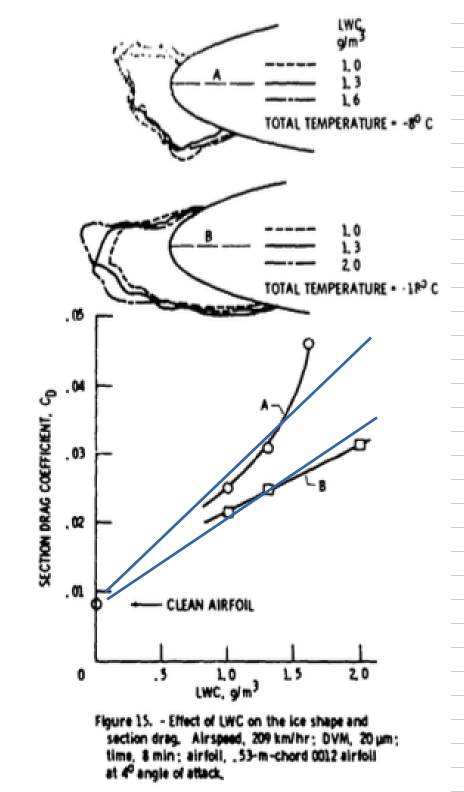  
_Composite image by Donald Cook._  

By linear interpolation, the 49 measured Cd values can be calculated with a relative difference 
of 37.2%, which is perhaps good enough to be useful for some applications.  

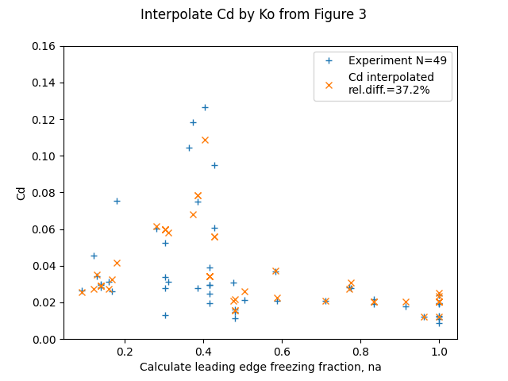  

## Improving the correlation  

However, we can do better by considering the effect of differing accumulation parameter 
values on ice drag.  

Figure 15 shows that the drag increase due to ice is approximately proportional
to the liquid water content.  

  
_Composite image by Donald Cook._  

This is generalized to the dimensionless accumulation parameter Ac in AEDC-TR-87-23.  

> Ac, The Accumulation Parameter - Ac is a water-catch term relating the LWC, V,
icing time, and collection efficiency terms to a rate of water catch for a particular
collection surface. It is not an ice collection term as no accounting has been made for
changes in the collection surface attributable to ice formation.  
> 
![aedcAcparam(images/nasa-tm-83556/aedcAcparam.png)  
_Public Domain image from AEDC-TR-87-23._  

[ρ_i is ice density, and c is chord length.]  

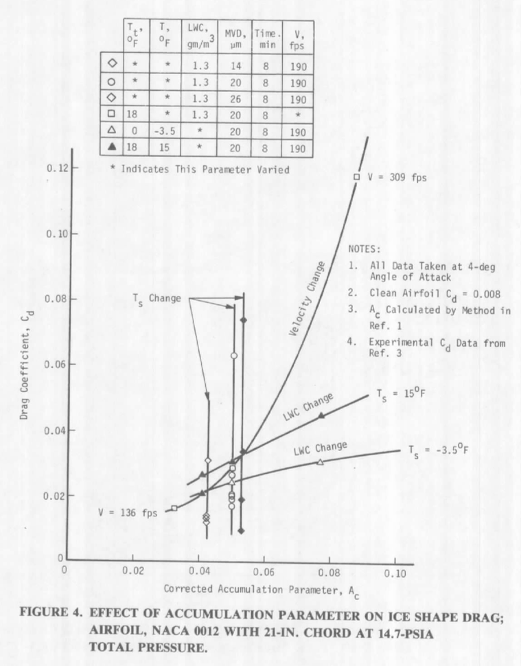  
_Public Domain image from AEDC-TR-87-23._  

For the "Velocity Change" line, other parameters, 
such as leading edge freezing fraction, 
also change as the Ac value changes, so it appears to deviate from the 
expected linear trend.  

We can fit data to a non-dimensionalized cd value:

> n_dcd_ice = delta_cd_ice / ac

A correlation is developed for n_dcd_ice from the data.  

More than half of the data (28 points out of 49 total) is at the value ko_le = 1.7 . 
I view this as the most accurate line, as it has the most points used to determine it. 
A correlation is developed for n_dcd_ice from the data. 
A smoothed spline fit was used to fit n_dcd_ice for ko_le=1.7: 

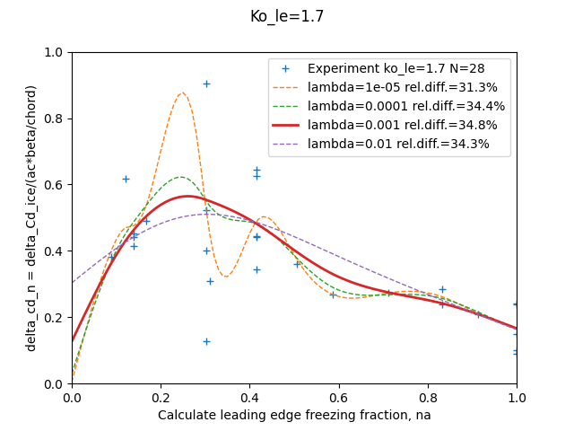  

The smoothing value lambda=0.001 was selected 
as a balance between not "too many" unexpected oscillations, 
retaining a peak Cd value, 
and minimizing the relative difference value.  

The n_dcd_ice fit may not be impressive by itself, 
but the Cd value may be recovered by:

> Cd = n_dcd_ice * ac + cd_clean  
 
The variation of the Cd value evaluated with these improvements is relatively small:  

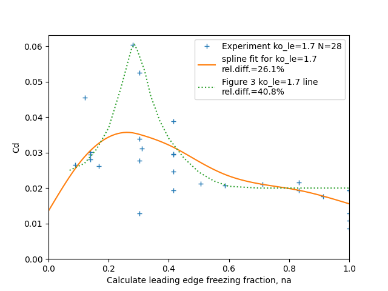  

The spline fit has a different shape than the line from Figure 3. 
The spline fit achieves a better overall fit, 
while the line from Figure 3 appear to have been intended to capture the largest Cd values.  

This was then used for conditions at other ko values by assuming 
a linear relationship: 

> n_dcd_ice = n_dcd_ice(ko=1.7) * (ko / 1.7)  

Together, the above establish Cd = f(na, ko_le, ac, aoa).  

The results show good correspondence to the 49 test values:  

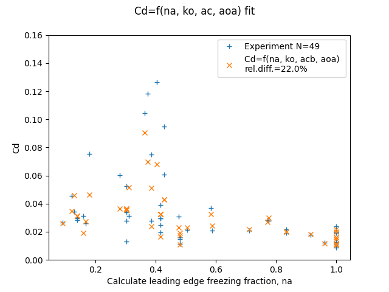  

A slightly better fit, that also nearly captures the largest Cd value, 
was also found:  
 
> n_dcd_ice = n_dcd_ice(ko=1.7) * (ko / 1.7)**1.3  
> 
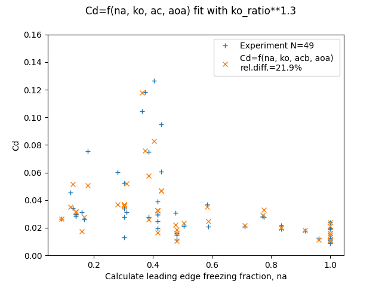  
## Conclusions  

The relative difference of 22% for the correlation is approaching the 16% experimental 
repeatability found in AEDC-TR-87-23. This indicates to me that there is a limited amount to be gained 
by higher-order or more complex correlations beyond those used above.  

The parameters na, ko, and ac are not completely independent of each other. 
Ko influences water catch efficiency beta, which influences Ac and na. 

I was surprised that a good correlation of drag could be achieved without 
reference to ice shape parameters. 
The selected dimensionless parameters appear to reflect whatever ice shape parameters 
are important to drag. 
The dimensionless parameters enable the sorting out of the confusing array of possible trends.  

AEDC-TR-87-23 considered other dimensionless parameters the Air Energy Diving Potential theta and 
the Water Droplet Energy Driving Potential phi. 
However, it was not necessary to include those in order to achieve a good correlation. 
Theta and phi are components in calculating na, 
and it appears that whatever information they could impart are already included 
in the set na, ko, ac, and aoa. 

Like every topic in icing, "Additional data needs to be collected":  

> Additional data needs to be collected to further substantiate these observations
and add resolution to the curve.  

Nearly half (22 of 49) of the cases were at T_total=-8C, leading to a cluster of points near na=0.3 . 
Perhaps the authors had prior experience and selected those conditions to be of particular interest. 
However, additional points at different conditions would help clarify where peak drag conditions occur and 
how high the peak drag is.  

Reynolds Number was not included in the correlation directly (it is a component of calculating na). 
Over the range of airspeed in this test there does not appear to be additional effects. 
However, over a broader range, Reynolds Number effects might be expected. 
Tests with larger and smaller airfoils and different air pressures could provide a wider range. 

## Related  

This post is an addendum to the [Ice_Shapes and Their Effects_thread]({filename}ice_shapes_thread.md), 
and was written after 
[Conclusions of the Ice Shapes and Their Effects Thread]({filename}Conclusions%20of%20the%20Ice%20Shapes%20and%20Their%20Effects%20Thread.md). 
It refines and expands information from the thread. 
I may eventually edit "Conclusions of the Ice Shapes and Their Effect Thread" 
to incorporate this information.  

A prior review: [AEDC-TR-87-23]({filename}aedc_tr_87_23.md)  

## Corrected Table 1  

In NASA-TN-83556 the sequence S-53, S-57, S-58 is repeated. 
The Figure 13 plot of the effect of drop size makes it clear that 
there was intended to be unique data for the second occurrence. 
Here, the values from Figure 13 F are used, denoted F26, F20, and F14 for the droplet sizes. 

Case O-26 was included twice. 
This is apparently not an error, but was done to make sequences of changes easier to read. 
Here, O-26 is included only once.  

Table1 (edited):  

'RN', 'KPH', 'TTC', 'LWC', 'MVD', 'Minutes', 'AOA', 'Cd',  
'O-10', 209, -8, 2.1, 20, 5, 4, 0.02767,                  
'O-26', 209, -26, 1.0, 20, 5, 4, 0.01077,                 
'O-4', 209, -8, 2.1, 20, 5, 4, 0.03382,                   
'O-8', 209, -8, 2.1, 20, 5, 0, 0.01294,                   
'O-9', 209, -8, 2.1, 20, 5, 0, 0.05260,                   
'O-31', 209, -26, 1.0, 20, 5, 0, 0.00857,                 
'O-32', 209, -26, 1.0, 20, 5, 8, 0.01280,                 
'S-29', 209, -2, 1.3, 20, 8, 4, 0.02807,                  
'S-30', 209, -1, 1.3, 20, 8, 4, 0.02647,                  
'S-31', 209, -5, 1.3, 20, 8, 4, 0.06036,                  
'S-32', 209, -8, 1.3, 20, 8, 4, 0.02949,                  
'S-44', 209, -18, 1.3, 20, 8, 4, 0.02161,                 
'S-45', 209, -26, 1.3, 20, 8, 4, 0.0194,                  
'S-69', 209, -15, 1.3, 20, 8, 4, 0.02105,                 
'S-36', 209, -12, 1.3, 20, 8, 4, 0.02072,                 
'S-72', 209, -20, 1.3, 20, 8, 4, 0.01773,                 
'S-113', 338, -2, 1.05, 20, 6.2, 4, 0.0756,               
'S-114', 338, -8, 1.05, 20, 6.2, 4, 0.0606,               
'S-115', 338, -12, 1.05, 20, 6.2, 4, 0.0370,              
'S-116', 338, -17, 1.05, 20, 6.2, 4, 0.0284,              
'S-117', 338, -26, 1.05, 20, 6.2, 4, 0.0238,              
'S-33', 149, -8, 1.3, 20, 8, 4, 0.01622,                  
'S-34', 209, -8, 1.3, 20, 8, 4, 0.0296,                   
'S-35', 338, -8, 1.3, 20, 8, 4, 0.1182,                   
'S-22', 209, -8, 1.3, 26, 8, 4, 0.07493,                  
'S-23', 209, -8, 1.3, 20, 8, 4, 0.03884,                  
'S-24', 209, -8, 1.3, 14, 8, 4, 0.01465,                  
'S-88', 209, -8, 1.3, 36, 8, 4, 0.10455,                  
'S-25', 338, -8, 1.05, 26, 6.2, 4, 0.1266,                
'S-26', 338, -8, 1.05, 20, 6.2, 4, 0.0951,                
'S-27', 338, -8, 1.05, 14, 6.2, 4, 0.0309,                
'S-53', 209, -26, 1.3, 26, 8, 4, 0.0196,                  
'S-57', 209, -26, 1.3, 20, 8, 4, 0.01930,                 
'S-58', 209, -26, 1.3, 14, 8, 4, 0.01206,                 
'S-50', 209, -8, 1.3, 20, 3, 4, 0.01941,                  
'S-51', 209, -8, 1.3, 26, 3, 4, 0.0280,                   
'S-52', 209, -8, 1.3, 14, 3, 4, 0.01154,                  
'F26', 209, -18, 1.3, 26, 8, 4, 0.028,                    
'F20', 209, -18, 1.3, 20, 8, 4, 0.0193,                   
'F14', 209, -18, 1.3, 14, 8, 4, 0.0121,                   
'S-59', 209, -2, 1.3, 26, 8, 4, 0.0344,                   
'S-60', 209, -2, 1.3, 20, 8, 4, 0.0295,                   
'S-61', 209, -2, 1.3, 14, 8, 4, 0.0314,                   
'S-54', 209, -2, 1., 20, 8, 4, 0.0262,                    
'S-55', 209, -2, 1.3, 20, 8, 4, 0.0301,                   
'S-56', 209, -2, 1.6, 20, 8, 4, 0.0456,                   
'S-109', 209, -8, 1.0, 20, 8, 4, 0.0212,                  
'S-110', 209, -8, 1.3, 20, 8, 4, 0.0246,                  
'S-111', 209, -8, 2, 20, 8, 4, 0.0312,                    

## Notes  

[^1]: Olsen, W., Shaw, J., and Newton, J. "Ice Shapes and the Resulting Drag Increase for a NACA 0012 Airfoil." NASA-TM-83556, January 1984. [ntrs.nasa.gov](https://ntrs.nasa.gov/citations/19850019527)  
[^2]: Bartlet, C. S.: "An Empirical Look at Tolerances in Setting Icing Test Conditions with Particular Application to Icing Similitude". AEDC-TR-87-23, DOT/FAA/CT-87-31, August, 1983. [apps.dtic.mil](https://apps.dtic.mil/sti/tr/pdf/ADA198941.pdf)  
[^3]: Anderson, David N.: Manual of scaling methods. No. E-14272, NASA/CR-2004-212875. 2004.  [ntrs.nasa.gov](https://ntrs.nasa.gov/citations/20040042486)  
