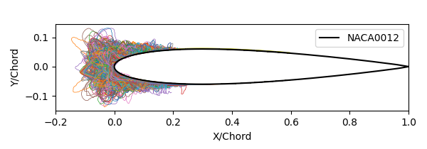

Title: 6000 Ice Shapes - the IceVal DatAssistant   
Date: 2026-05-14 9:00  
tags: LEWICE, ice shapes, NASA, IceVal

### _"As with any scientific endeavor, the foundation of icing research ... is the data acquired during experimental testing."_  
_NASA Report E-16236 [^1]._  
   

  
_
4132 ice shapes for the NACA0012 airfoil. 
_  

_[Yes, that is how it is spelled.]_  

The IceVal DatAssistant [^1], [^2] from NASA contains 6330 ice shapes from 
experiments in the NASA Icing Research Tunnel [^3] (3665 shape tracings) 
and from analysis with LEWICE [^4] (2965 ice shapes).  

Significant uses of the data were the LEWICE validation reports published in 
1998 [^5] [^6] and 2008 [^7], which established measures for the comparison of LEWICE analysis results 
to experimental data.  

These data are tremendous aids to researchers and developers of icing analysis codes 
and test methods. It has been 27 and 18 years since these were published (respectively), 
and we should celebrate that the utility of the data has held up well. 
However, 
given that an entire generation of workers in the field of aircraft ice protection may not be well-aware of the data, 
a review and re-examination of the data is warranted.  

While there is much here about 2D ice shapes measured in the IRT and from LEWICE, 
there are also more general icing topics such as 
how to characterize ice shapes, 
and the repeatability of test results that may be instructive for 
anyone in the aircraft icing community.  

Here, I will summarize the ice shape database, 
provide some of my experiences using it, 
and provide additional analysis of the data.  
 
- ## [A tour of the IceVal Database]({filename}datassistant.md)  
    ### _"... all publicly available IRT-generated experimental ice shapes with complete and verifiable conditions have now been compiled into one electronically-searchable database"_  

- ## [Challenges using IceVal]({filename}iceval_challenges.md)  
    ### _"No data is clean, but most is useful."_  

- ## [Overall comparison assessment of Experiment vs LEWICE]({filename}assessments.md)  
    ### _"It is possible for any (or all!) ... parameters to be incorrectly output."_  

- ## [A Geometric Analysis Method]({filename}thicker.md)  
    ### _"This demonstrates that the automated process cannot (yet) be substituted for good engineering judgment."_  

- ## [Running LEWICE version 3.2.3 for the IceVal cases]({filename}comparisons_l32.md)  
    ### _"The resulting analysis showed that LEWICE compared well to the available experimental data."_  

- ## [Swept Airfoil Cases in IceVal]({filename}sweep.md)
    ### _"Use of these relationships allows the direct determination of ice shapes adjusted for any given icing and flight condition as well as for size and sweep of the airfoil"_  
 
Possible future additions:  

 - Conclusions of the IceVal DatAssistant thread  

## Related   

It is recommended that readers review [Introduction to Variations]({filename}basics/intermediate_variance.md)  
 
## Notes:  

[^1]: 
Laurie Levinson and William Wright. "IceVal DatAssistant-An Interactive, Automated Icing Data Management System." 46th AIAA Aerospace Sciences Meeting and Exhibit. 2008.  
[NASA Report Number: E-16236](https://ntrs.nasa.gov/citations/20070031804)

[^2]: IceVal DatAssistant (LEW-18343-1)
"Overview: 
This NASA-developed technology provides an improved mechanism for managing the 
large volume of data generated and utilized in performing icing research."  
[Note: the software is available only to US persons.]  
[software.nasa.gov](https://software.nasa.gov/software/LEW-18343-1) 

[^3]: 
Emily N. Timko, Laura E. Hux, and Waldo J Lacosta, 
NASA Glenn Icing Research Tunnel: 2024 Cloud Calibration Procedure and Results 
[NASA/TM-20250003674](https://ntrs.nasa.gov/citations/20250003674)  

[^4]: 
William B. Wright, User's Manual for LEWICE Version 3.2 
[NASA/CR—2008-214255](https://ntrs.nasa.gov/citations/20080048307)  
The software is available at [software.nasa.gov](https://software.nasa.gov/software/LEW-18573-1)  

[^5]: 
William B. Wright, "A Summary of Validation Results for LEWICE 2.0", 37th Aerospace Sciences Meeting and Exhibit AIAA-99-0249, December 1998. 
[NASA/CR-1998-208687](https://ntrs.nasa.gov/citations/19990017993)  

[^6]:  
William B. Wright and Adam Rutkowski, "A summary of validation results for LEWICE 2.0." January 1999. 
[NASA/CR-208690](https://ntrs.nasa.gov/citations/19990021235)  

[^7]: 
Wright, William, Mark Potapczuk, and Laurie Levinson. "Comparison of LEWICE and GlennICE in the SLD Regime." 46th AIAA aerospace sciences meeting and exhibit. 2008.  
[NASA/CR-2008-215174](https://ntrs.nasa.gov/citations/20080041518)  
