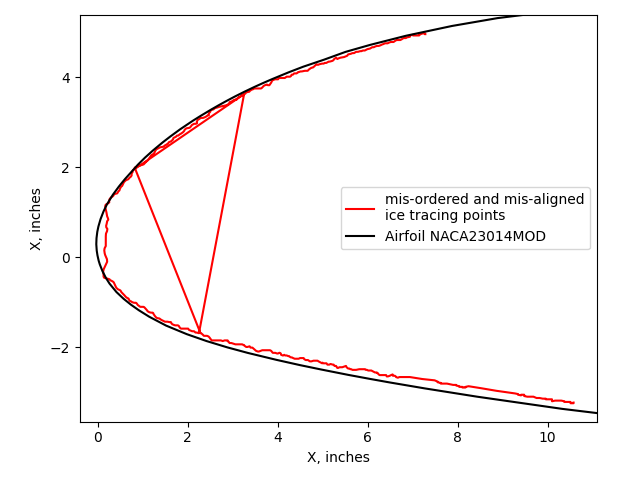
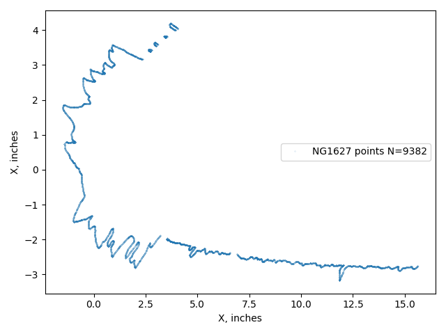
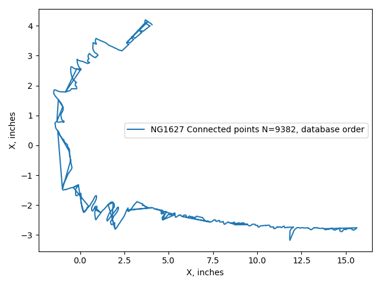
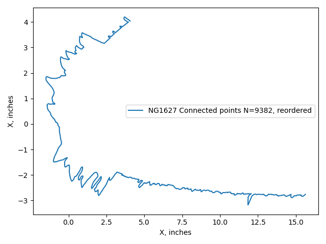
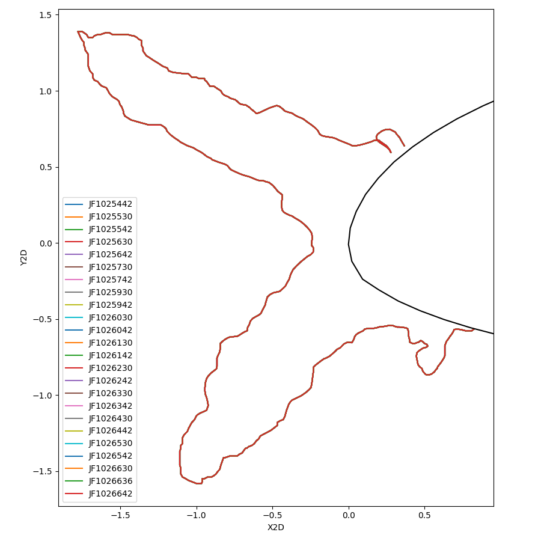
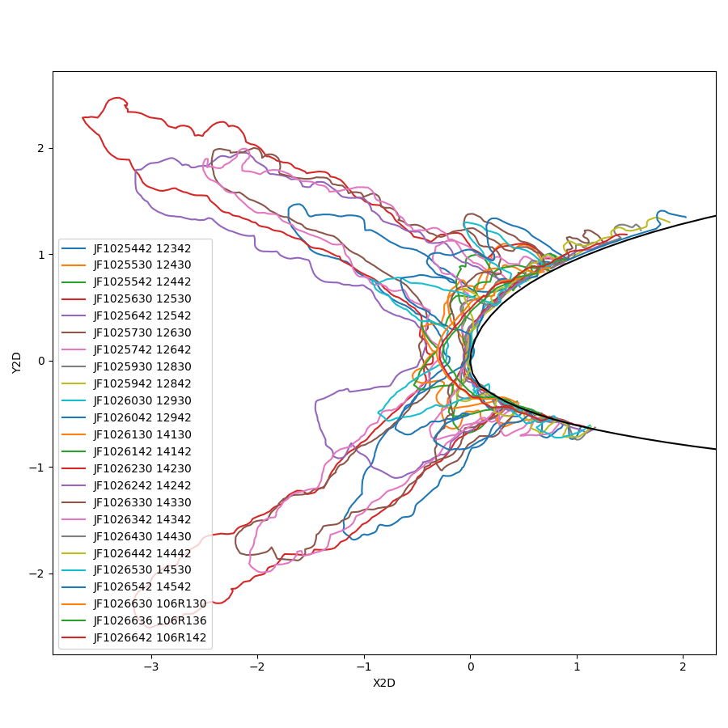
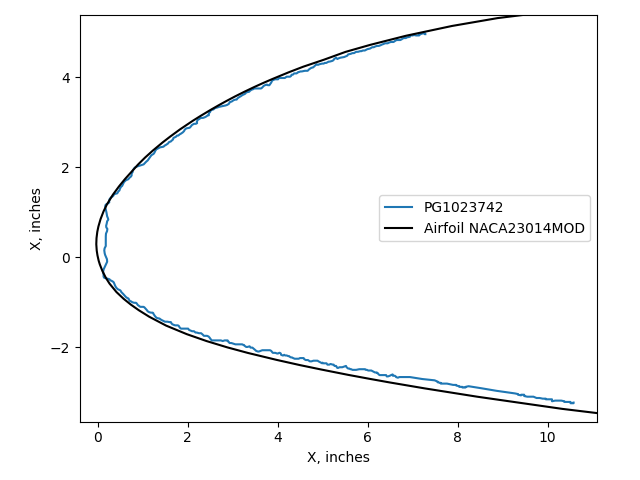
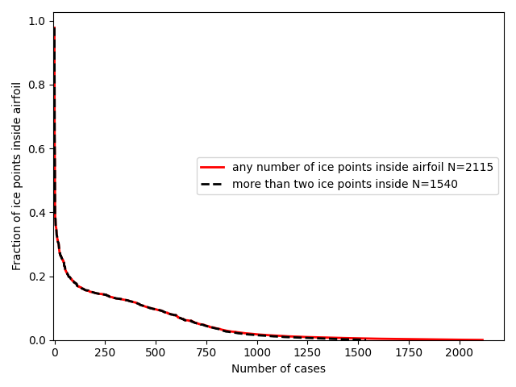

Title: Challenges Using the IceVal Database    
Date: 2026-05-18 11:00  
status: draft  
tags: LEWICE, ice shapes, NASA

### _"No data is clean, but most is useful."_  
_attributed to Dean Abbott._  

  
_<div style="text-align: center;">Ice shape tracing points that are mis-ordered and mis-aligned with the airfoil.</div>_  

## Introduction  

The IceVal database is a significant achievement that is still yielding dividends, decades later. 

The IceVal description [^1] discusses some of the challenges of assembling the database:

>While all of this data is available, in theory, for every test run, as a practical matter, this is often not the case.
Because the data is managed by the individual researcher, and much of it is stored in hardcopy form, locating a
specific data set may require a significant effort. Furthermore, because of differences in experimental technique
from one researcher to the next, the extent to which the relevant conditions have been explicitly documented can
vary widely. Moreover, since plans made prior to a test may change during the test based on interim results, it is not
uncommon to find conflicting information as to the actual conditions run, complicating interpretation of the data.

With every large data set I have worked with, it is necessary to clean and filter the data.  
The IceVal database is large (roughly 800 Megabytes). 
So, it is not surprising that some quirks and minor errors are found in the database. 
Fortunately, they can largely be addressed. 
Do not interpret the items listed below as negating the utility of the database. 

However, the challenge of mis-aligned ice tracings, described further below and noted since at least 2008, remains.  

The steps I used to clean and filter the data are discussed below.  

## Accessing the database  

The IceVal DatAssistant only runs on the Windows operating system.  

I installed it on a Windows 10 machine. 
The basic functions of the Graphical User Interface worked, 
but the export data to excel function did not. 
Perhaps there was a setting on my machine that interfered with the function, 
but I do not use Windows much anymore, so I moved on.  

Fortunately, the central Microsoft Access 2003 database file is accessible to other programs. 
I used the Python programming language with the Pandas library to read it on a MacBook machine.  

The use of Python at least partially addresses two areas mentioned in the "Known Issues" section of the IceVal DatAssistant description:  

> Known Issues / Future Work  
While the currently existing system has met all the existing system requirements, there are nevertheless areas of
future work which would ultimately result in an improved product. These include:  
> 
>>Migration to a higher capacity, more robust and/or public domain database, due to the limitations imposed
by the use of Microsoft Access;  
>> ...  
>>Incorporation of user-requested enhancements, such as the ability to overlay two user-selected images, or
the addition of selected fields to the database

Accessing the data with Python and Pandas is open source (kind-of like public domain, but with a permissive license). 
I believe that most potential users are more familiar with Python than database commands.  

Using Python also allows one to readily do things like overlay two user-selected images, 
which we will see examples of in this series.  

## Empty cells  

Many of the values in the IceVal database tables are empty. 
Depending on the context, an empty cell could mean several things. 
For example, in the LEWICE cases, the AOA value is usually a numerical value, sometimes zero. 
But in several cases it is an empty cell, which was interpreted as 0 
(this was verified by looking at the corresponding test case). 
Similarly, the IPSOn (ice protection) field is often empty, and is interpreted as 0 (not operating).  

## Differing airfoil definition points  

The database has a table "AirfoilCoordinates" which list points for most of the airfoils. 
When available for a given airfoil, this is the source that was used herein.  

Some airfoils were not included, such as the NACA0012. 
The NACA0012 coordinates were taken from a LEWICE input file.  

There are also airfoil coordinates in the database table IceShapeData. 
The points from Airfoil Coordinates generally have more points and are of higher quality than those from the IceShapeData table. 

A comparison of airfoil points for one case is shown below. 
The points from IceShapeData have wider spacing and show a variation 
where they are sometimes inside and sometimes outside the AirfoilCoordinates data.  

   

However, it appears that the IceShapeData airfoil points were used to determine ice height values in the database, 
as shown below. 
The upper horn point found in the database is 0.179 inch from the airfoil surface defined from IceShapeData, 
but is 0.173 inch from the airfoil surface determined from AirfoilCoordinates.  

  

In the LEWICE validation description [^2], 
the NACA23014MOD test article is described as tapered:  

>The first airfoil is a modified NACA230XX
series airfoil with a slight spanwise taper and sweep.
At the mid-span of the test section, the thickness is
14.5% chord and increases in thickness from the
floor to the ceiling of the test section. In this report, it
is listed as a modified NACA23014 airfoil, as the
thickness is closer to 14% at the lower end of the
model. This data was originally presented in references 17-20. 
The cross-section at the mid-span of
the test section is given in Figure 1. The database for
this airfoil is comprised of 62 IRT runs, of which 22
are repeats of previous conditions. Due to the spanwise variation of the model, 
only 8 tracings have
been digitized at off-centerline locations for a total of
70 ice shapes.

However, the airfoil sections for the NACA23014MOD in the IceVal "IceShapesData" table 
are all the same, despite different span locations. 
The airfoil given is presumably for the centerline, 36-inch span location. 
Not having a slightly different airfoil at other span location may account for a few of the 
ice tracings that appear to be inside the airfoil, 
as in case PG1023742 shown in the figure at the top of this post, and discussed further below.  

## Point order of ice shapes  

In some cases the order of the ice shape points from the database had to be reordered.  

An example case NG1627, which has the most ice tracing points (9382) of any in the database. 
If one plots the ice points from the database as a point cloud (points not connected) 
the result looks reasonable (there are so many points that the individual points are difficult to discern on this scale). 
Some in-situ ice scanning systems produce a point cloud (not a connected, ordered sequence of ice surface points).  

These points would be adequate for determining values such as 
maximum ice height and extent.  

  

The THICK utility requires a continuous ice surface as an input to have an accurate and consistent result. 
However, if one looks at the connected points as defining a surface, 
then it is evident that the points are not ordered, 
with many incongruous lines that indicate a break in the ordered sequence. 
If this surface is used to determine ice area then errors will result.  

  

By means of algorithms (and, in a few cases, adjustments by hand) a 
minimum distance path that connects all points can be determined. 
The difficulty of obtaining a solution is reduced by observing that the data are largely in ordered 
segments, with some gaps between the segments.  

The ordered ice points will provide an accurate ice area.  



In 3194 cases (of the total 6630 cases) the points had to be reordered.  

## Orientation of the horizontal stabilizer LTHS  

The ice shape tracings for the LTHS are often in the usual airplane orientation (suction side "down", or Y values below 0). 
However, some cases list the points in the other orientation (suction side "up"). 
This can make plots confusing, but also affects results from the THICK utility, 
which interprets the "upper" surface as having the greater Y value, 
and results between "upper" and "lower" surface can be confused.  

Here, the LTHS results are presented as suction side "up" 
(like the other airfoils, and the orientation used in [^3]), 
but one should be aware that it is a horizontal stabilizer.  

## Repeated use of identical ice shape tracings  

44 of the experimental ice tracings were mistakenly mapped to different test conditions or cut locations, 
some many times. This totals to 86 suspect uses.

For the LTHS airfoil, the same ice shape is mapped to 24 cases:  
 
  

These include different test conditions, varying mainly in the icing exposure time. 
While some of the repeated uses were for tracings at different cuts at the same test condition, 
it is not reasonable for them to all be identical. 
Two other ice shapes map to 14 and 11 LTHS conditions. 
 
Fortunately, there is an alternative source of data available for these cases. 
The LEWICE software distribution [^4] includes experimental tracings for many (but not all) of the 
test cases in the database. 
These can be mapped to the database cases through the "AltRunID" parameter. 
When corrected, the cases from above show a more believable level of variation.  

  

There area 41 more occurrences where an identical tracing was used twice. 
Some are for different cut locations for one test conditions, 
but several are for different test conditions. 
Unfortunately, these are not available in the LEWICE software distribution. 
The example below is a NACA0012 airfoil with differing test conditions, but the same ice shape:  

  

For the cases where no alternative information was available, 
they were left unchanged.  

## Value format consistency  

In many cases, the SpanLocation value is numerical (such as 36), 
but in some cases an inch symbol is included (36"). 
These were filtered to be all numerical values. 
Having a consistent basis is important to tasks such as finding all ice tracing at the 36-inch location.  

## Data entry errors   

In 68 cases, the LWC and MVD values were entered in the wrong position.  

For example:

```text
Case                    LWC     MVD
AE125036 (original)     20.0    0.55
AE125036 (corrected)    0.55    20.0
```

The original LWC and MVD values are outside the capabilities of the IRT. 
The corrected values are within the capabilities.  

Similarly, two cases were found where MVD and SprayTime values were swapped.  

It is possible that there are additional cases with swapped values, 
but if they are swapped, the values are in the IRT capability range and harder to detect.  

## Differing RunIDs between sources  

The IceVal database uses the RunID as a primary key to identify unique ice shapes. 
However, the nomenclature is different in different sources, 
complicating mapping between them.  

For example, the 2008 validation report [^5] has a figure for case 
"EG1285", which maps to case IF1285 in the database. 
Other cases mapped directly, such as case EG1351.  

The mapping to other sources, 
such as the 1999 validation report [^2]
The SLD icing test report [^3], or the LEWICE validation cases included in the LEWICE software distribution [^4], 
can be aided by the AltRunID column of the database. 
However, these are not always direct mappings, as additional characters may be interspersed. 
One has to verify prospective name matches by checking that the detailed run conditions match.  

## Ice shapes misaligned with the airfoil   

The LEWICE manual notes that ice shape tracings can be misaligned with the airfoil. 
This can result in some of the ice shape being inside the airfoil.  

>This error can possibly be fixed manually by shifting the experimental ice shape to match the airfoil... 
> 
>The problem with this procedure is that the translation chosen has no scientific basis - it just
makes the ice shape “fit” better. This problem arises since the reference locations used for 
digitizing the ice shapes may not be the same reference point used for defining the airfoil coordinates.  

For example, case PG1023742 has the ice shape nearly entirely inside the airfoil.  

  

Any ice measurement characterization of a misaligned ice shape is inaccurate, 
but to an unknown degree.  

There are 2096 cases with at least one ice point inside the airfoil. 
However, many of those cases have a small fraction of the total ice points inside 
the airfoil. Having two points insides of the airfoil, if they are the endpoints, 
might be a good thing, as a definitive end of the ice shape can be defined as the intersection 
with the airfoil surface.  

  

The cases with ice inside the airfoil are readily detected, 
and can be filtered out if desired. 

There are other potential mis-alignments that are harder to detect. 
There are several cases of "floating" ice shapes that do not have end points 
that touch the airfoil. 
These may be correct (except for missing a point or two near the airfoil surface to indicate the icing extent limits) 
or they may be misaligned.  

It does not appear that the published validation analysis filtered out the misaligned cases.  

## Related  

This post is part of the ["6000 Ice Shapes - the IceVal DatAssistant"]({filename}iceval.md) thread.  

## Notes  

[^1]: 
Levinson, Laurie, and William Wright. "IceVal DatAssistant-An Interactive, Automated Icing Data Management System." 46th AIAA Aerospace Sciences Meeting and Exhibit. 2008. [NASA Report Number: E-16236](https://ntrs.nasa.gov/citations/20070031804)  
The software is available at [software.nasa.gov](https://software.nasa.gov/software/LEW-18343-1)  

[^2]: 
William B. Wright and Adam Rutkowski, "A summary of validation results for LEWICE 2.0", 1999. [NASA/CR-208690](https://ntrs.nasa.gov/citations/19990021235).  

[^3]: 
Van Zante, Judith Foss. A Database of Supercooled Large Droplet Ice Accretions. [NASA/CR-2007-215020](https://ntrs.nasa.gov/citations/20070032808), 2007.   

[^4]: 
User's Manual for LEWICE Version 3.2 [NASA/CR—2008-214255](https://ntrs.nasa.gov/citations/20080048307)  
The software is available at [software.nasa.gov](https://software.nasa.gov/software/LEW-18573-1) 

[^5]: 
Wright, William, Mark Potapczuk, and Laurie Levinson. "Comparison of LEWICE and GlennICE in the SLD Regime." 46th AIAA aerospace sciences meeting and exhibit. 2008. [NASA/CR-2008-215174](https://ntrs.nasa.gov/citations/20080041518)  
