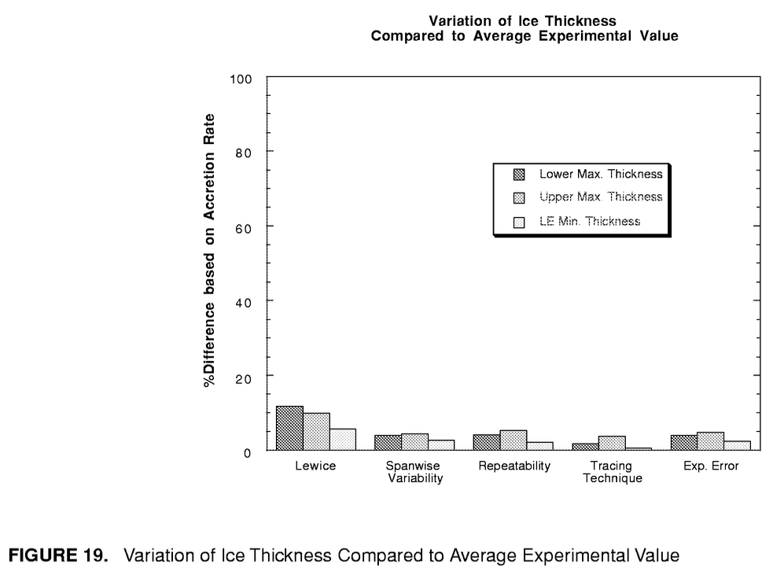

Title: Comparisons of Ice Shapes   
status: draft  
tags: LEWICE, ice shapes, NASA
rights: CC-BY-NC-SA 4.0

### _The results show that the predicted results ... are within the accuracy limits of the experimental data for the majority of cases._  

   

# Comparisons of Ice Shapes  

The LEWICE utility program THICK [^2] was used in validation reports [^1] and [^3] to determine 
ice shape measurements to use for comparisons.  

THICK reports the values:  

>Lower Icing Limit (x-value)  
Upper Icing Limit (x-value)  
Lower Icing Limit (wrap distance)  
Upper Icing Limit (wrap distance)   
Lower Surface Max. Thickness  
Leading Edge Min. Thickness  
Upper Surface Max. Thickness  
Lower Surface Ice Area  
Upper Surface Ice Area  
Total Ice Area  
x-value at lower max. thickness  
y-value at lower max. thickness  
x-value at upper max. thickness  
y-value at upper max. thickness  

  

For brevity, we will focus here on the upper horn height (only). 
The validation report notes that a non-dimensional height ratio was used.

>Where the ice shape
does have a glaze ice horn, the max. thickness does
give the horn thickness. In order to compare different
conditions with different chord lengths and accretion
conditions, the individual ice thicknesses were non-dimensionalized by the maximum accumulation thickness as given in Equation 3.

  

```text
maximum accumulation thickness = t_max = LWC Airspeed Time / ice_density

relative height difference = abs(thick_experiment - thick_lewice) / t_max

```


  

## Producing comparison values  


The LEWICE manual describes a file "total.xls" that includes comparisons values for all validation cases. 

> This spreadsheet, which
contains values for Version 2.0 as well as Version 3.0 and experimental data, has been put on the
distribution CD-ROM for LEWICE 3.0 and is named “total.xls”.  

Unfortunately, the current distribution of the LEWICE software does not include total.xls.  

The LEWICE manual also mentions "matrix.xls"

> LEWICE validation report spreadsheet “matrix.xls”  

that was apparently included in the validation data distribution at one time, 
but unfortunately was not included in the current IceVal DatAssistant distribution.  

It is noted that the values in matrix.xls do not always match those in total.txt. 

> The astute user will notice that
several of the quantitative values generated using this process do not agree with the values given
in the LEWICE validation report spreadsheet “matrix.xls”. This demonstrates that the automated process
[running THICK] cannot (yet) be substituted for good engineering judgment.  

To me, this implies that matrix.xls had adjustments to some values to correct THICK judgment errors. 
However, matrix.xls is not currently available to see what those adjustments might have been.  

The LEWICE utility program THICK was used to characterise ice shape features. 
These results are available in the IceVal database table ThickUtilityData. 
The features were then used to compare LEWICE ice shape results with experimental ice shapes for 
corresponding conditions.  

As "matrix.xls" was not available, 
the IceVal database was interrogated to determine values need to calculate the relative height difference.  

## Selecting comparison cases  

Presumably, every test case (N=3665) was used to determine the values in Figure 7.  

Not every test case has a corresponding LEWICE case. 
When matches are found, there are 3243 matching cases.  

  

Perhaps we are interested in only comparing the cases without ice protection active. 
This filters the matching cases down to 3134. 

  

As we saw earlier, a considerable number of cases had some ice tracing points inside the airfoil. 
If these are removed, there are 1724 cases remaining.  

  

For several cases, there was not an upper ice horn detected [we will discuss this more in an upcoming post]. 
If one considers these cases to be not applicable, there are 2468 matching cases of the original 3665.  


Combining all of the above filters, 1307 cases remain.  

  

The results with each of the data subsets above all produced an average non-dimensionalized 
upper horn variations of 20% or less, consistent with the validation report. 
Filtering out potentially mis-representative data had a surprisingly (to me) small effect on the overall result. 

The original (1997) validation report notes 842 cases were used. 
792 of those cases were found within the IceVal database
(changes in naming conventions make matching cases challenging). 

The original validation showed an approximately 10% variation in relative height difference. 
However, when values were calculated from the IceVal database, 
the variation was higher than 10%, and more comparable to the later (2008) validation report value of 20%. 

  


[^1:] 
Wright, William, Mark Potapczuk, and Laurie Levinson. "Comparison of LEWICE and GlennICE in the SLD Regime." 46th AIAA aerospace sciences meeting and exhibit. 2008.  
[NACA/CR-2008-215174](https://ntrs.nasa.gov/citations/20080041518)  

[^2:] 
User's Manual for LEWICE Version 3.2
NASA/CR—2008-214255 https://ntrs.nasa.gov/citations/20080048307  
The software is available at https://software.nasa.gov/software/LEW-18573-1

[^3:] 
Wright, William. "A summary of validation results for LEWICE 2.0." 37th Aerospace Sciences Meeting and Exhibit. 1998.  
[NASA/CR-208690](https://ntrs.nasa.gov/citations/19990021235).  
