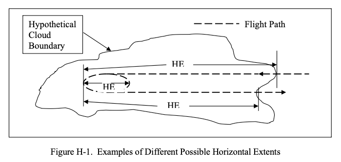

title: Seeking "Icing Information Notes"  
Date: 2026-09-27 12:00  
Tags: Appendix C, Dr. Jeck  

  
> _Although horizontal extent is a common term in the icing literature, it has not been defined anywhere.
Therefore, it is defined here in a way that is compatible with conventional usage._  

_Public Domain figure and text from DOT/FAA/AR-07/4, which are similar to one of the Notes. [^1]_  
 
## Summary  
 
Dr. Richard Jeck, retired from the FAA, passed away in January 2026. [^2]  

I am putting together a series on Dr. Jeck's works (He had over 60 technical publications, so this may take a while).  

Circa 1997, Jeck started circulating "Icing Information Notes" ["Notes"] [^3]:  

> "in response to requests from the field or to clarify known areas of confusion in the interpretation and application of icing data and technical literature."  
 
They were available on request.  

He apparently wrote them until 2012, and there appear to have been 
over 30 in total.  

I am seeking if anyone asked for and received one of the Notes.  

## History of the Notes  

A biography [^4] explains:  

> After Dr. Jeck transferred from NRL to the FAA Technical Center in 1990, he became known, informally, inside and outside of the FAA, as the expert on understanding the mysteries of the icing environment and the correct way to relate icing test data to Appendix C.  
>
> To clarify the proper procedure, Dr. Jeck prepared an informal, 5-page, "Icing Information Note" which pointed out the problems and gave examples of correct usage.  
>
> He began receiving letters, phone calls and e-mails asking many other questions about icing conditions.  
>
> In response, Dr. Jeck wrote more Icing Information Notes on other icing-related topics until there are now dozens of them designed to provide icing practitioners with ready references on the fundamentals. They were prepared in response to requests from the field, or to clarify known areas of confusion in the interpretation and application of icing data and the technical literature. There is even one Icing Information Note that explains the difference between the Russian and Western versions of Appendix C.  

An FAA document [^3] summarizes some of the Notes:  

> Icing Information Notes  
Several informal technical notes have been
written to provide practitioners in the field
of aircraft icing with clear, ready
references on some of the fundamentals.
These write-ups were prepared in response
to requests from the field or to clarify
known areas of confusion in the
interpretation and application of icing data
and technical literature. The information
notes available at this time are described
below.  
> 
> “Looking for Large MVD’s?”  
Tells
what to look for and what to expect when
searching for icing clouds with droplet
MVD’s in the range of 30 to 50 microns
during test flights.  
> 
> “Terminology for Droplet Size Measurements”  
> here are often
questions, errors, or confusion about
droplet size measurements, computations,
and terminology. Topics include:  
> Cloud  Droplet Basics,  
> Water Content of Clouds,  
> Engineering Significance of Droplet Sizes,  
> Substitutes for Dropsize Distributions (Mean or Average Diameter, Median-
Volume Diameter (MVD), Mean-Volume
Diameter, and Mean Effective Diameter), and  
> Cautions in Reading Icing Literature and Interpreting Dropsize Tables.  
> 
>“Answers to Questions about Low-Level Icing Conditions”  
> Answers the questions
“Are low-level icing conditions above a
high-elevation airport any different from
low-level icing conditions near sea level?”
and “Is the Continuous Maximum
Envelope (Fig. 1 of FAR 25, Appendix C)
really valid all the way down to ground
level or sea level?”  
> 
>“Legitimate (and Illegitimate!) Uses of the LWC Adjustment Curves in Appendix C of FARs 25 and 29” 
> There are often questions, errors, or confusion
about the legitimate use of the LWC
adjustment (F-factor) curves in Appendix
C. Topics include:  
> Proper Use of the F-factor Curves;  
> Converting Available LWC Averages to Equivalent Values Over 17.4 nmi or 2.6 nmi;  
> Judging the Adequacy of an Icing Exposure for Test or Certification Purposes;  
> and Acceptable Methods for Documenting, Comparing, and Extrapolating Test Exposures.  
> 
> “Method for Computing Condensable Water due to Expansion (Suction) Cooling in Turbine Engine Air Inlets”  
When air is drawn into turbine engine
inlets during low-speed (ground)
operations, the air can be cooled by as
much as 15oF (8oC) due to the air pressure
drop inside the inlet. If the outside air is
moist and the temperature drops below its
dew point during ingestion, then moisture
(and possibly ice) will condense in the
inlet. This note describes a method for
computing the mass (grams) of
condensable water per unit mass
(kilograms) of ingested outside air.  
> 
>“Summary of Some Current Practices in Selecting Design Values from the Icing Envelopes in Appendix C of FARs 25 and 29”  
> Questions arise periodically
on the significance, proper usage, and
interpretation of horizontal extent of icing
conditions represented by the design
envelopes in Appendix C of FARs 25 and 29.  
> Topics include: Selecting Exposure Distances,  
> Selecting Values of MVD, and
Special Considerations.  
> 
>Dr. Richard Jeck, AAR-421, (609)

However, I have not found them on any current FAA site, 
nor at archive.org.  

## References  

[^1]: Jeck, Richard K.: Advances in the Characterization of Supercooled Clouds for Aircraft Icing Applications. DOT/FAA/AR-07/4, Appendix C, November, 2008. [web.archive.org](https://web.archive.org/web/20161221102659/http://www.tc.faa.gov/its/worldpac/techrpt/ar074.pdf)  Note that there is a different pdf file at ntrl.nist, but that copy has blanks for some figures.  
[^2]: Obituary [loudounfuneralchapel.com](https://www.loudounfuneralchapel.com/obituaries/richard-jeck/obituary)  
[^3]: Anon., Research and Development Highlights 1997, FAA Airports and Safety R&D Division, ARR-400, William J. Hughes Technical Center [rosap.ntl.bts.gov](https://rosap.ntl.bts.gov/view/dot/33753/dot_33753_DS2.pdf)  
[^4]: A Recognition and Biography [24-7pressrelease.com](https://www.24-7pressrelease.com/press-release/457378/richard-jeck-presented-with-the-albert-nelson-marquis-lifetime-achievement-award-by-marquis-whos-who)  
