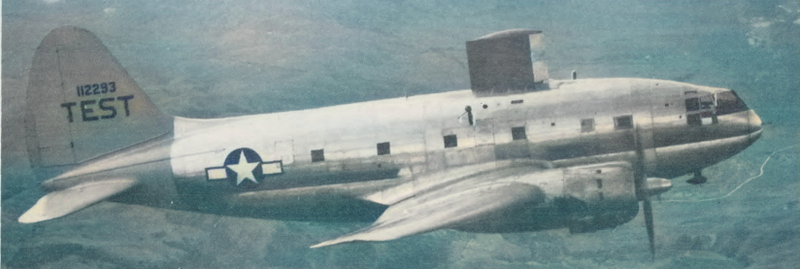

Title: Welcome  
Category: NACA
tags: introduction
URL:
save_as: index.html

> ###“If you want to go somewhere, it’s best to find someone who has already been there” Robert Kiyosaki

  

Many new aircraft icing problems aren’t new at all. 
Like excavating a lost city, many surprises, answers to problems, 
road maps, and confirmations can be found in the work of the National Advisory Committee for Aeronautics (NACA). 
This treasure trove of data can help you today. 

Why care about aircraft icing?  If ice forms on a plane during flight, it can hazardous. 
Engineers research the weather conditions aircraft will encounter and work to ensure that 
they can navigate them safely. 

##What you will find here

On this website, I make selected NACA publications easily accessible to you. 
I have read thousands of pages so that you do not have to.

I summarize each paper for you with:  
- a quote from the paper  
- a one-line summary  
- key points  
- the Abstract (in searchable text form, not just a pdf image)  

And more details:  
- a detailed discussion, including key figures  
- [executable Python code](https://github.com/icinganalysis/icinganalysis.github.io) (in some cases) to reproduce the results [^1]  
- how the publication got used, and where it is cited  
- where to find the publication (most, but not not all, are on the [NASA NTRS site](https://ntrs.nasa.gov))  
- the references the publication cited (in searchable text)  

Check back often, I am adding more articles regularly.

## The history of NACA icing publications

> ###"... Before attacking what appeared to be a new icing problem we should study the icing work of the 1940's and 50's." [^2]

The (United States) National Advisory Committee for Aeronautics (NACA) was formed in 1915, 
and operated until 1958, when it was replaced by the National Aeronautics and Space Administration (NASA). 
Several of the publications relate to aircraft icing and ice protection, 
and they were key to establishing safe aircraft design and operating procedures.

The NACA publications cover a wide range of aircraft icing topics. 
Reference [^2] lists 132 publications, in 16 categories of topics, from “Meteorology of Icing Clouds” to “Wing Ice Protection”. 

Some readers may interested in less technical, [more general histories]({filename}/more general info.md) 
of the NACA/NASA efforts to improve the safety of flight in icing conditions.

##The NACA publications on aircraft icing have an enduring legacy.

One indication of the contemporary importance of the NACA efforts was 
the National Aeronautic Association 1946 Collier Trophy award to Lewis Rodert of NACA 
“For his pioneering research and guidance in the development and practical application of a thermal ice prevention system for aircraft.” [^3]

The NACA publications were key to establishing the description of the icing weather used in aircraft design and certification, 
which are still current. 
The United States aircraft certification requirements still directly cite 
(circa 2021) NACA publications as the sources of data [^4].

As these are technical publications, some readers may be challenged by the science and technology discussed. 
[You may want to see ["A Gentle Introduction to Aircraft Icing"]({filename}a_gentle_introduction_to_aircraft_icing.md)]
Disclaimer: The NACA publications by themselves would not provide a complete, orderly, or current education in the field of aircraft icing. 
However, the publications have significantly contributed to several, more recent design resources:

- “Engineering Summary of Airframe Icing Technical Data”, 1963 [^5]  (half of the references are NACA publications)
- “Ice, Frost, and Rain Protection” (original publication 1969) [^6]  
- “The Aircraft Icing Handbook”, 1991 [^7]

The NACA publications have an advantage of being widely and freely available online at the NTRS [^8]. 
As works of the United States government, they are in the public domain, 
and not encumbered by copyright, and so may be freely excerpted from.

[I have worked in the field of aircraft ice protection for over 30 years]({filename}/donald-cook.md), 
and I have personally used many of the NACA publications. 
The prior generation of engineers that I worked with were well familiar with the NACA publications, 
and they formed the common language for discussion of icing challenges and solutions. 

The role of a common language has perhaps passed to “The Aircraft Icing Handbook” [^7], although that is getting dated.

[Side note: I shook hands with one of the NACA publications authors, Porter Perkins, circa 1993. 
That was my only direct link to the NACA era].

> ###"The collection of ice by the cylinders is similar to the collection of ice by airplane components." [^2]

##On to topic threads: 
###[Icing on Cylinders]({filename}/Icing on Cylinders.md)  
###[Icing Thermodynamics]({filename}/thermodynamics.md)

##Or see the [Blog](blog.html) (latest articles first)

##[Diversions]({filename}diversions.md) get into the post-NACA era

##Notes:
[^1]: [https://github.com/icinganalysis/icinganalysis.github.io](https://github.com/icinganalysis/icinganalysis.github.io)  
[^2]: ["Selected Bibilography of NACA-NASA Aircraft Icing Publications"]({filename}/The Historical Selected Bibliography of NACA-NASA Icing Publications.md)  
[^3]: [Collier Trophy Winners](https://naa.aero/awards/awards-and-trophies/collier-trophy/collier-1940-1949-winners/)  
[^4]: “Airworthiness Standards: Transport Category Airplanes”, CFR 14, Part 25, Appendix C, Washington, DC, 2021 [Appendix C](https://www.ecfr.gov/current/title-14/chapter-I/subchapter-C/part-25/appendix-Appendix%20C%20to%20Part%2025)  
[^5]: Bowden, D.T, et.al., “Engineering Summary of Airframe Icing Technical Data”, FAA Technical Report ADS-4, General Dynamics/Convair, San Diego, California, 1963 [ADS-4](https://apps.dtic.mil/sti/citations/AD0608865)  
[^6]: “Ice, Frost, and Rain Protection”, SAE Aerospace Applied Thermodynamics Manual, 1969  (regularly updated)  
[^7]: “Aircraft Icing Handbook, Volume I.” DOT/FAA/CT-88/8-1 (1991) https://apps.dtic.mil/sti/pdfs/ADA238039.pdf .  
Also note that there was a perhaps little known update in 1993 (that did not affect the pages of interest herein): https://apps.dtic.mil/sti/pdfs/ADA276499.pdf  
[^8]: [https://ntrs.nasa.gov/](https://ntrs.nasa.gov)  
(Note: I have not been able to find a few of the publications at the ntrs, but I have found most of the missing ones with more general internet searches)  

