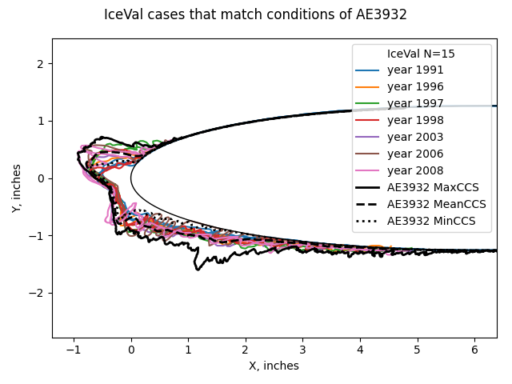
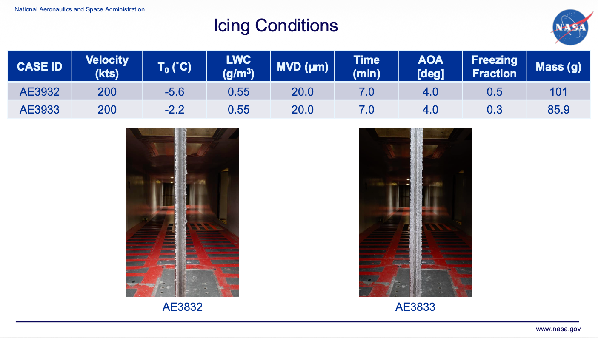
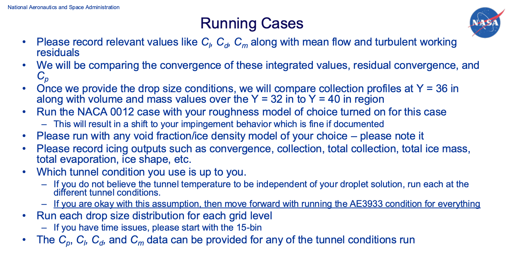
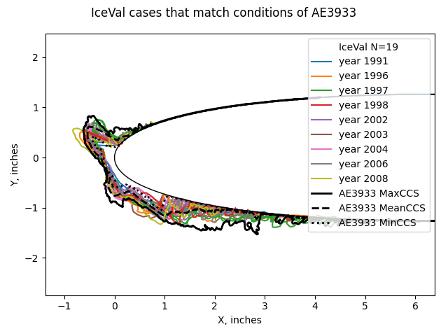
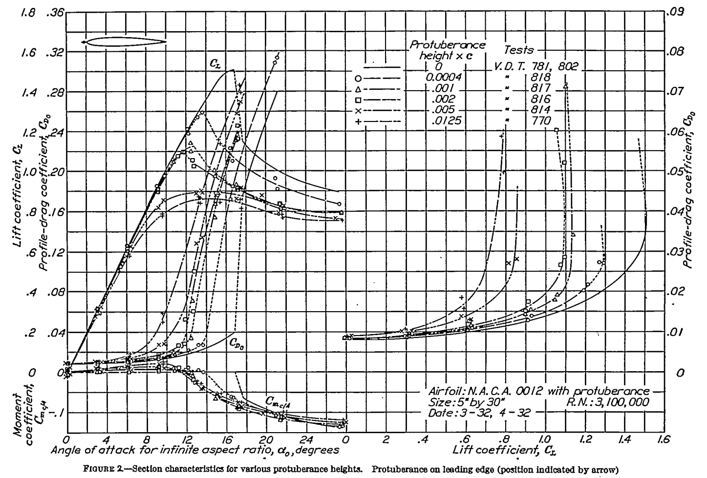

status: draft  
title: Predictions for the Third Ice Prediction Workshop Using Simple Methods  
tags: Ice Prediction Workshop, IPW, Ice Shapes, Icing Tunnel  
date: 2026-08-18 11:30  

### _"The main goal of these workshops is to assess state-of-the-art of icing prediction tools with 2D and 3D experimental data"_  

  

## Summary  

The series of Ice Prediction Workshops [^1] have the purposes:  

>The main goal of these workshops is to assess state-of-the-art of icing prediction tools with 2D and 3D experimental data. We aim to provide an impartial forum to evaluating the effectiveness of icing methods and to identify the areas needing additional research and development.  

Several organizations have sponsored and contributed to the workshops, including AIAA, NASA, SAE, academia, and industry.  

Two workshops have been completed. The third one "IPW-3" is scheduled for September 21-24, 2026.  

Predictions of Cd and Cl values are made for the cases in IPW-3.  

Recommendations for "the areas needing additional research and development" are made.   

## IPW-3    

IPW-3 has two major tasks. 
We will focus here on the second task, TFG-2.  

>
> The Ice Prediction Workshop is moving to the third round and has established two dedicated Technical Focus Groups (TFGs) to drive collaboration and technical progress in aircraft icing:  
> 
>- TFG–1: 3D Ice Shape Comparison  
>
> ...
>
>- TFG–2: Icing Code Verification and Validation  
>Led by Thomas Ozoroski, this group is working on improving comparisons between computational icing codes and experimental results. Using a 21-inch NACA 0012 airfoil, the team aims to demonstrate convergence of both CFD and icing solutions as part of a detailed verification and validation exercise. Computational grids are currently being generated, with distribution expected in July 2025.  

Two icing conditions were selected for detailed analysis.  

  

The data requested from participants is largely built around 3D CFD computations.  

The Cd, Cl, and Cm values were not measured in the icing tunnel tests that produce ice tracings for 
cases AE3932 and AE3933.  

Some of the requested values can be estimated with the 1D and manual tools that we have seen in 
"Blast from the Past: NACA Icing Publications".  

As the discussion here does not address several of the workshop objectives 
(such as quantifying the effects of solution convergence, the effects of different grids, the selection of turbulence models, and ice roughness), 
I do not plan to make a workshop presentation submission.  
 
### Ice Shapes  

The simple methods do not predict detailed ice shapes. 
To show the range of ice shapes for the selected conditions, 
we will use the IceVal Database 
[see ["6000 Ice Shapes - the IceVal DatAssistant"]({filename}iceval.md)].  

For the selected cases, there are several conditions matches in the IceVal Database. 
The NACA0012 airfoil with a 21-inch chord had hundreds of ice shape tracing made between 1991 and 2008. 
The selected cases AE3932 and AE3933 are not in the IceVal database, 
having apparently been run after 2008. 
Unfortunately, measurements of Cd and Cl were not included in the IceVal Database. 
Ice shape tracings are available, and illustrated the variability over test runs at nominally identical conditions.  

The ice shape tracings from IceVal for the tunnel centerline are similar, but not identical, 
to those from AE39332 and AE3933. 
A scanning method, rather than literal ice shape tracings, was used for AE39332 and AE3933. 
This produces a maximum cross section (Max CCS), a mean (Mean CCS), and a minimum (Min CCS). 
The IceVal ice shape tracings tend to fall between the Max CCS and the Min CCS.  

  

  

The tracings are color coded by year of test. 
There is a small tendency, though not unimodal, for ice height to increase with time. 
The tracings from the later years have maximum heights comparable to the Max CCS
This might be due to improvements in the calibration of icing tunnel.  

There may also be difference in the airfoil test article construction (IceVal does not list that detail).  

Hopefully, ice shape results from 2D and 3D methods will be within the Max CCS to Min CCS.  

### Ice Mass  

The mass of ice can be estimated from the correlations of water catch efficiency in the Aircraft Icing Handbook [^2].  

  
_Public Domain image._  

See ["Aircraft Icing Handbook Water Catch Examples"]({filename}basics/intermediate_water_catch_examples.md)
for a similar, detailed example.   

With the assumption that all impinging water becomes ice, the mass can be calculated.   

| case   | Mass of ice (test), g | Mass of ice (calculated), g |
|--------|-----------------------|-----------------------------|
| AE3932 | 101                   | 123                         |
| AE3933 | 85.9                  | 123                         |

### Estimate of Cd with ice  

For the Cd values, the method from ["Ice Shape Drag Correlations"]({filename}ice_shape_drag.md) was used. 
NASA-TM-83556 [^3] provides data from 49 icing tests for a 21-inch chord NACA0012 airfoil where the drag was measured. 
While the tests bound the selected cases AE3932 and AE3933, they do not directly match them.  

AEDC-TR-87-23 [^4] observed trends with the parameters 
leading edge freezing fraction, water drop modified acceleration, angle of attack, and water catch (n, Ko, AOA, Ac) 
that allow developing a general correlation. 
Using the general correlation:  

| case   | Cd with ice  |
|--------|--------------|
| AE3932 | 0.026        |
| AE3933 | 0.036        |

### Estimate of Cl with ice  

We will use NACA-TR-446 data [^5]. 
This measured the effect of small, flat plate protuberances perpendicular to the airfoil surface. 
This can approximate the effect of ice, although with an unquantified accuracy.  

For the selected cases, the maximum ice height is on the order of 1 inch near the leading edge. 
This yields an ice to chord ratio of about 0.050 .  
Figure 2 shows effects for ratios up to 0.0125, but not 0.050 . 
We will use the 0.0125 ratio as representative, but again at an unknown accuracy. 
Note that the 0.0125 and 0.005 lines have similar Cl_max values, 
perhaps indicating that the additional effects of larger protuberances is limited.  

_Public Domain image._  

At the nominal AOA=4, the difference between the clean and iced Cl values is very small. 
The Cl_max values, however, are notably different.  

The pixelated image is difficult to read when zoomed in, 
but here are the values that I read.

| case   | Cl clean | Cl with ice | Cl_max clean | Cl_max with ice |
|--------|----------|-------------|--------------|-----------------|
| AE3932 | 0.08     | 0.078       | 0.30         | 0.17            |
| AE3933 | 0.08     | 0.078       | 0.30         | 0.17            |

### Estimate of Cm with ice  

Figure 2 also has Cm values, but these are even more difficult to read than the Cl values. 
From what I can discern, the effects on Cm are small until Cl_max is approached.  

### Drop size distributions, ice density and ice roughness   

The effect of different drop size distributions would have little effect on these simple methods. 
The IceVal Database, NASA-TM-83556, and AEDC-TR-87-23 data were all from tests in the IRT, 
so the drop size distribution is "built-in".  

For the ice mass calculation, different distributions would have minor effects.  

Ice density is "built-in" the test data, but often the values were not reported.  

Ice roughness is "built-in" for the Cd data, 
although ice roughness values were not reported.  

## Conclusions  

The simple methods used herein can achieve answers in much less time than the 2D and 3D methods. 
As the key values were not measured in test (except for ice mass) 
the relative accuracy of these methods cannot be immediately assessed. 
Once participants report results for the workshop using 2D and 3D methods we can see how these simple methods compare with those values.  

For the workshop objective:  

> identify the areas needing additional research and development  

Measuring Cd and Cl with ice for more cases is an obvious need. 
Here, we had to interpolate with 46- and 94- [!] year old data to get values, 
as not much more detailed data has been published recently, 
and much of what has been published is for a specific airplane configuration 
(the [NASA Common Research Model with ice](https://commonresearchmodel.larc.nasa.gov/home-2/icing-research/)), 
not more generally applicable sectional data. 
If we are using Cd and Cl as comparison metrics, 
we should accurately know the experimental values.  

The IceVal database should be updated with more recent (after 2008) icing wind tunnel test data. 
Ideally, that would include measured Cd anc Cl values.  

I thank Thomas Ozoroski for commenting on a draft of this post. 
I subsequently edited the post, and any errors are mine.  

## Notes  

[^1]: Ice Prediction Workshop [icepredictionworkshop.wordpress.com](https://icepredictionworkshop.wordpress.com)  
[^2]: "Aircraft Icing Handbook Volume 1", DOT/FAA/CT-88/8-1 [ntrl.ntis.gov](https://ntrl.ntis.gov/NTRL/dashboard/searchResults/titleDetail/ADA238039.xhtml)  
[^3]: Olsen, W., Shaw, J., and Newton, J. "Ice Shapes and the Resulting Drag Increase for a NACA 0012 Airfoil." NASA-TM-83556, January 1984. [ntrs.nasa.gov](https://ntrs.nasa.gov/citations/19850019527)  
[^4]: Bartlet, C. S.: "An Empirical Look at Tolerances in Setting Icing Test Conditions with Particular Application to Icing Similitude". AEDC-TR-87-23, DOT/FAA/CT-87-31, August, 1983. [ntrl.ntis.gov](https://ntrl.ntis.gov/NTRL/dashboard/searchResults/titleDetail/ADA198941.xhtml)  
[^5]: Jacobs, Eastman N.: Airfoil Section Characteristics as Affected by Protuberances. NACA-TR-446, 1932 [ntrs.nasa.gov](https://ntrs.nasa.gov/citations/19930091520).  
