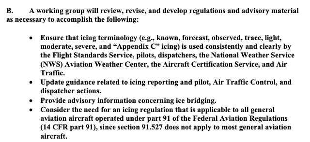
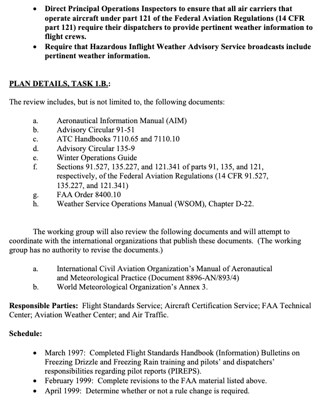

status: draft  
title: Aircraft Icing Intensities      
Date: 2026-09-20 12:00
tags: Dr. Jeck, Appendix C

### _"AN ENGINEERING-ENABLED (MEASURABLE! AND CALCULABLE!) ICING SEVERITY SCALE"_  
_Title from an outline of topics by Dr. Jeck._  

  
_Image from an Icing Information Note._  

## Introduction  

Dr. Jeck's "A History and Interpretation of Aircraft Icing Intensity Definitions and FAA Rules for Operating in Icing Conditions"
[^1] outlines the history in the US Code of Federal Regulations. 
Changes require a public comment period, so there was often debate (and on some occasions controversy). 
The definitions can affect which aircraft are certified perform Flight In Known Icing (FIKI), 
so there is great economic and practical interest to any changes.  

See [1969 Aircraft Ice Protection Report of Symposium]({filename}1969%20Aircraft%20Ice%20Protection%20Report%20of%20Symposium.md) 
for Dr. Jeck's summary of one controversial occasion in 1969.  

Dr. Jeck proposed a "universal curve" and made recommendations for changes as part of the The FAA Inflight Aircraft Icing Plan 
(discussed in ["Dr. Jeck's Works on Supercooled Large Drops"]({filename}jeck_sld.md)).  

## FAA Inflight Aircraft Icing Plan [^2] Task 1B  

Task 1B included examining ice intensity terminology (trace, light, moderate, severe):  

  

_Public Domain images._

The definitions at the time were:  

  
_Public Domain image from DOT/FAA/AR-01/91._  

## [Icing Information Note]({filename}treasure.md): "Proposal for Changing Icing Intensity Definitions"  

Dr. Jeck wrote this circa 1997. He proposed new definitions, and introduced a "universal curve".

>Proposal for Refining the Icing Intensity Definitions  
The Problem: Currently accepted icing intensity definitions are those which appear in the G
Aeronautical Information Manual (AIM). These definitions, which date from the 1960's, were
designed for reporting icing conditions in flight. In subsequent years, the definitions have come
to be criticized for several reasons:  
a) they are vague and subjective,  
b) icing is aircraft-dependent, and therefore it is not known how the intensity reported by
one airplane can be translated into intensities to be expected by other airplanes, and  
c) the definition for severe icing appears to be incompatible with the rules {FAR-91.527,
FAR-125.221, and FAR-135.227) under which flight is permitted in severe icing conditions.  
> 
>A Workable Solution-Refining the Definitions.  
> All of the above drawbacks can be overcome,
and a number of important benefits can result from re-defining the severity categories more
precisely.  

```text
Proposed New Icing Intensity Definitions

Intensity           Rate of Accumulation  

                    1/4-inch (6 mm) of ice accumulates
                    on a clean wing (or component of concern) in:  
                  
Trace               one hour or longer  

Light               15 to 60 minutes

Moderate            5 to 15 minutes 

Severe              5 minutes or less  
```

He also noted:  

>- Icing Rates are Easily Calculable  
> 
>This is probably the most far reaching aspect of the new proposal. 
> Although the buildup rate will differ from one airplane to another, 
> and even on the same airplane for different airspeeds and angles of attack, 
> the buildup rates can be easily calculated nowadays using available ice accretion codes such as NASA's LEWICE, 
> and others developed in the UK, Canada, France, Italy, and elsewhere. 
> The concern over accurately predicting large, complex ice shapes does not arise here 
> because only small (¼-inch) ice accretions on a clean surface are of interest.

>A number of LEWICE runs have been performed at the FAA Technical Center to study the feasibility of this approach. 
> The time to accumulate ¼-inch of ice on the leading edge of actual wings and tailplanes of a variety of airplanes 
> (large and small, slow and fast) have been calculated. 
> A major finding is that there is a universal curve which indicates the cloud water concentration (CWC, g/m ) 
> required for the onset of each intensity level (trace, light, moderate, or severe) for any aircraft, 
> depending only on the airspeed. That is, all aircraft wings, tailplanes,
and even common ice detector probes lie at specific (pre-calculable) positions along the same curve 
> relating CW to airspeed for the onset of a given icing intensity level.

>The implications of a universal curve are wide ranging, as exemplified by the following applications.  
• Frees the Weather Forecaster from Deciding Icing Severities.
Until now, weather forecasters have been forced to struggle with the terms trace,
light, moderate, and severe, even though they knew that the terms applied differently, 
> and in some unknown way, to different airplanes. 
> The best they have been able to do is to attempt to correlate pilot icing reports in some general way 
> with prevalent weather conditions. 
> There is some progress being made in forecasting liquid cloud water content (CWC) of cloudy regions of the sky, 
> but without some way to relate WCto individual aircraft response, little improvement in intensity forecasts can result. 
> These new icing intensity definitions relieve the forecaster from deciding the severity level. 
> Instead, forecasters can concentrate on better forecasting or reporting the location of clouds 
> and estimated WC's and leave the icing intensity determinations to the aviation community. 
> Once a CWC value is forecasted or reported, 
> the universal curves or a simple table can be used to easily determine what the icing intensity will be 
> for a specific airplane at a specific airspeed.  
...  
> 
>Satisfies Longstanding NTSB Recommendations.
>
>Among the recommendations issued in NTSB-SR-81-1 "Aircraft Icing Avoidance and Protection", were:  
"...evaluate individual aircraft performance in icing conditions..."  
>"...insure that the regulations are compatible with the definition of severe icing...in the Airman's Information Manual."  
>
>More recently, as a result of the "Roselawn" accident, the NTSB has recommended that the FAA 
> "Revise existing aircraft icing intensity reporting criteria and other FAA literature by including nomenclature related to 
> specific types and sizes of aircraft." The newly proposed definitions satisfy all of these recommendations.  
>
>It has long been realized that it is practically impossible to evaluate the performance of every individual airplane model 
> in all icing conditions and in all airplane configurations, flight attitudes, etc. 
> It would be unaffordable to conduct flight tests for all these conditions, 
> and presently it is not possible to adequately compute airplane performance for all the needed combinations either: 
> Therefore, there was little hope that the NTSB recommendation on performance could ever be accomplished. 
> Now, however, by shifting the focus to something that is possible-
> the calculation of and inflight measurement of simple ice buildup rates on a wing, for example, 
> a practical alternative to the original recommendation can be achieved. 
> The effect on performance of a given ice buildup rate can be established later as time and ability allow. 
> In the meantime, a workable and meaningful operational substitute for performance becomes available 
> in the proposed icing intensity definitions.  
>
>Concerning the recommendation for compatibility of definitions, 
> the problem disappears if the ambiguous, old definitions are replaced by the proposed definitions. 
> There is no reason to regard the old definitions as immutable and irreplaceable. 
> In fact, there is not even any evidence that the FARs were written with the current icing definitions in mind!
> The problem is that the FARs DO NOT SAY what they mean by light, moderate, and severe icing. 
> Therefore, it seems logical to propose a new set of definitions that eliminates prior problems 
> and finally improves on the ability to apply the definitions in a practical manner.

## AIAA-98-0094 [^3]  

The proposal above was soon followed by AIAA-98-0094 "A workable, aircraft-specific icing severity scheme", 
that added detail about the "universal curve". 
Larger, blunter surfaces were found to require a higher LWC value to achieve 1/4-inch ice in 5 minutes.  

  
_Public Domain image from DOT/FAA/AR-01/91 (which includes AIAA-98-0094 as an appendix)._  

## 2001 A History and Interpretation of Aircraft Icing Intensity Definitions and FAA Rules for Operating in Icing Conditions [^1]  

Dr. Jeck summarized the then current icing intensity definitions to inflight responses. 
They differed for different types of aircraft:  

  
  
_Public Domain images_.

## 2006 "Origins and Evolution of the Icing Intensity Definitions for Aircraft" [^4]  

This provided an icing effects table, and proposed intensity definitions.    

>3.3 Based on the Effects on the Aircraft  
An FAA-sponsored working group on icing
terminology was formed in 1998 to review the definitions
of all icing terms used in aviation and to recommend
new or modified definitions where suitable. This was in
response to Task 1-B of the 1997 FAA In-flight Aircraft
Icing Plan (Anon., 1997). It was proposed in that
working group that the pilot report (PIREP) format be
modified to include an item called a level-of-effect,
based on the effects the reportable icing encounter had
on the reporting aircraft. This four-level scheme (see
Table 6) nicely supplies a type of severity scale, which
is independent of, but complements the rate-of-
accretion intensity scale. That is, for each aircraft
model, each level-of-effect (or severity) category may
result from one or more of the icing rate categories, but
the correlation does not have to be known ahead of
time. In fact, such correlations may naturally become
apparent over time as PIREPS accumulate for each
type of aircraft.

  

>Notes [for Table 6]:  
>1. Speed: Loss of speed due to aircraft icing.
This is based on the indicated airspeed
which was being maintained prior to
encountering ice on aircraft and before
applying additional power to maintain
original airspeed.  
>2. Power: Additional power required to maintain
aircraft speed/performance that was being
maintained before encountering icing on
aircraft. Refers to primary power setting
parameter, i.e., torque, rpm, or manifold
pressure.  
>3. Climb: Estimated decay in rate of climb (ROC)
due to aircraft icing, example 10% loss in
ROC, 20% loss in ROC, or not able to
climb at normal climb speed with
maximum climb power applied.  
>4. Control: Effect of icing to aircraft control
inputs.  
Levels 1 and 2. No noticeable effect on
response to control input.  
Level 3. Aircraft is slow to respond to
control input. Aircraft may feel sluggish or
very sensitive in one or more axes.  
Level 4. Little or no response to control
input. Controls may feel unusually heavy
or unusually light.    
>5. Vibration/Buffet: May be felt as a general
airframe buffet or sensed through the
flight controls. It is not intended to refer
to unusual propeller vibration (for
airplanes so equipped) in icing
conditions
apparent over time as PIREPS accumulate for each
type of aircraft.

Note that the proposed Table 7 does not include a TRACE icing definition.  

  

## 2007 Icing Information Note: "Relating Aircraft Icing Intensities (Trace, Light, Moderate, and Heavy) to 14 CFR 25, Appendix C, Icing Certification Envelopes"   

This Icing Information Note adds more detail to the universal curve to relate 
icing intensity levels to Appendix C Liquid Water Content values.

  

There was also a presentation to the SAE of the same title, with largely the same content.  

## Conclusions  

The Aeronautical Information Manual [^5] has the current definition of icing intensity. 
It is occasionally revised, so check for the latest version before doing anything "official". 
Here are the definitions as of July 2026:   

> Intensity of icing:  
a. Trace− Ice becomes noticeable. The rate of accumulation is slightly greater than the rate of sublimation.
A representative accretion rate for reference purposes is less than ¼ inch (6 mm) per hour on the outer wing. The
pilot should consider exiting the icing conditions before they become worse.  
b. Light− The rate of ice accumulation requires occasional cycling of manual deicing systems to minimize
ice accretions on the airframe. A representative accretion rate for reference purposes is ¼ inch to 1 inch (0.6 to
2.5 cm) per hour on the unprotected part of the outer wing. The pilot should consider exiting the icing condition.  
c. Moderate− The rate of ice accumulation requires frequent cycling of manual deicing systems to minimize
ice accretions on the airframe. A representative accretion rate for reference purposes is 1 to 3 inches (2.5 to 7.5
cm) per hour on the unprotected part of the outer wing. The pilot should consider exiting the icing condition as
soon as possible.  
d. Severe− The rate of ice accumulation is such that ice protection systems fail to remove the accumulation
of ice and ice accumulates in locations not normally prone to icing, such as areas aft of protected surfaces and
any other areas identified by the manufacturer. A representative accretion rate for reference purposes is more than
3 inches (7.5 cm) per hour on the unprotected part of the outer wing. By regulation, immediate exit is required.  
Note:  
Severe icing is aircraft dependent, as are the other categories of icing intensity. Severe icing may occur at
any ice accumulation rate when the icing rate or ice accumulations exceed the tolerance of the aircraft.  

Several of Dr. Jeck's recommendations have been incorporated.  

Years of gathering data and persistence were required to change the 
icing intensity definitions.   

As for Dr. Jeck's proposal to further correlate the level of effect (Table 6) 
to the icing intensity levels, I do not know if this has been accomplished:

>In fact, such correlations may naturally become
apparent over time as PIREPS accumulate for each
type of aircraft.

## Related  

This is part of the series [28,000 Miles of Data: The Publications of Dr. Richard Jeck]({filename}jeck.md)  

## Notes  

[^1]: Richard K. Jeck: A History and Interpretation of Aircraft Icing Intensity Definitions and FAA Rules for Operating in Icing Conditions, DOT/FAA/AR-01/91, November 2001, [ntrl.ntis.gov](https://ntrl.ntis.gov/NTRL/dashboard/searchResults/titleDetail/ADA398952.xhtml)  

[^2]: FAA INFLIGHT AIRCRAFT ICING PLAN, April 1997, [faa.gov](https://www.faa.gov/sites/faa.gov/files/2022-11/FAA_Icing_Plan.pdf)  

[^3]: R. Jeck, "A workable, aircraft-specific icing severity scheme", January 1998, AIAA-98-0094, [doi.org](https://doi.org/10.2514/6.1998-94)  
A complete copy is also included as an appendix to DOT/FAA/AR-01/91 [ntrl.ntis.gov](https://ntrl.ntis.gov/NTRL/dashboard/searchResults/titleDetail/ADA398952.xhtml)  

[^4]: R. Jeck, Origins and Evolution of the Icing Intensity Definitions for Aircraft, AMS, Federal Aviation Administration Technical Center, Paper A 7, March 2006 [ams.confex.com](https://ams.confex.com/ams/pdfpapers/105941.pdf)  

[^5]: Aeronautical Information Manual, July 2026, 
[faa.gov](https://www.faa.gov/air_traffic/publications/media/AIM_Basic_w_Chg_1_and_2_and_3_dtd_7-9-26_FINAL.pdf)  
This is periodically revised, so check [www.faa.gov](https://www.faa.gov/air_traffic/publications/#manuals) for the latest version.  


