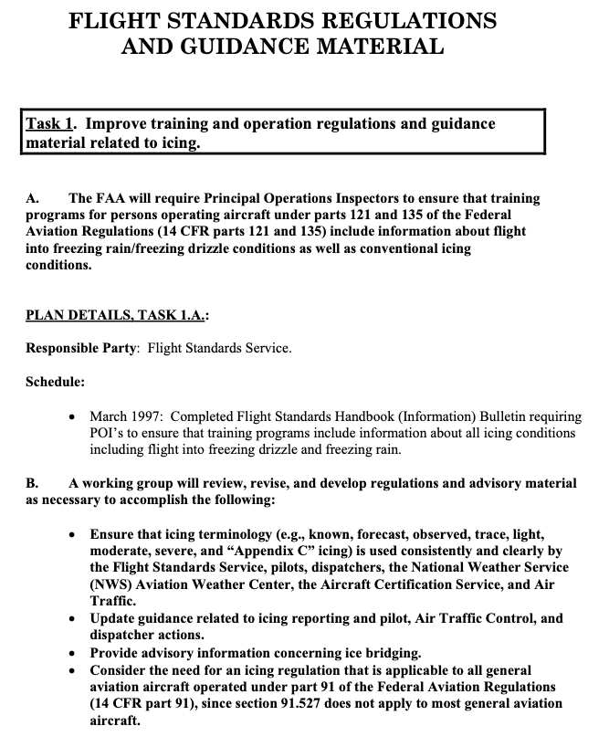
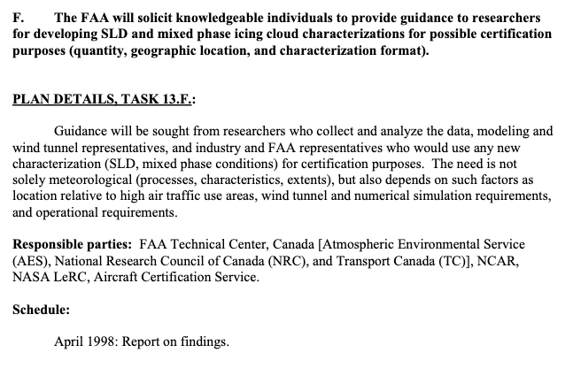

status: draft  
title: Dr. Jeck's Works on Supercooled Large Drops        
Date: 2026-10-03 12:00
tags: Dr. Jeck, SLD  

_"Very limited amounts of data are presently available for variables associated with ZR and ZL [SLD] conditions aloft."_  

  
_Public Domain figure from DOT/FAA/AR-09/45 ("FZDZ" or "ZL" is freezing drizzle, a form of supercooled large drops, SLD)._  

## A tragic accident leads to icing research  
 
In 1994 an accident occurred near Roselawn [^1], Indiana, USA, 
that was later attributed in part to Supercooled Large Drop icing (SLD, drop sizes large than those in 14 CFR Part 25 Appendix C) [^2]. 
This led to a multinational effort to better understand such 
icing conditions and their effects on aircraft. 
New regulations ("Appendix O") were published in 2014 [^2].  

The wikipedia article [^1] is an excellent summary of the event. 
One also will be well rewarded for studying the detailed National Transportation Safety Board reports [^3] [^4].  

## FAA Inflight Aircraft Icing Plan  

Airworthiness Directives and other interim measures were imposed soon after the accident 
which addressed immediate safety concerns. 
However, it was realized that more information was required to fully address SLD icing. 
A "FAA Inflight Aircraft Icing Plan" was developed in 1996 [^5] to coordinate research, technology development, and support regulatory development. 
Richard ("Dick") Jeck is noted as a contributor. 
Task 1 of the plan is shown in part below.  

  
_Public Domain image, partial listing of Task 1 of FAA Inflight Icing Plan._  

There are 13 tasks in the plan (numbered to 14, but #8 was "intentionally left blank").

Besides helping to author the plan, Dr. Jeck was a major contributor to Task 13:  

  
_Public Domain._   

## Assembling a SLD Database  

Jeck would assemble a Supercooled Large Drop Database in several steps.

Dr. Jeck had already gathered much measured inflight icing data. 
See ["28,000 Miles of Data: The Supercooled Cloud Database"] for a chronology. 
This gave him valuable contacts, experience in negotiating with diverse organizations, 
and a format for the database.  

The flight tests that would contribute to the later SCDB were already complete
(the latest test was in 1988), but the database apparently was not yet completely assembled.  

By 1996, Jeck had assembled data from several research organizations [^6], 
and had preliminary findings:  

>DEVELOPING NEW DESIGN CRITERIA AND TEST CONDITIONS FOR FREEZING RAIN
AND FREEZING DRIZZLE.  
Very limited amounts of data are presently available for variables associated with ZR and ZL
[freezing rain and freezing drizzle] conditions aloft. This means that any proposed design criteria can only be tentative for the time
being. It also means that attention should be focused first on developing necessary information
for the most important variables. The approach followed here has been to prioritize the variables
according to their importance to the design engineer. In this regard, three categories of design
criteria have been conceived. The most important variables and the most important aspects of
them are termed "first level" design criteria. Such variables would include RWC, air
temperature, and dropsize, at least. The most important aspects of them would be their extreme
values, and probably a representative or average value. At the moment, extreme values can only
be estimated, but representative values are easily obtainable from the available data. An example
of a possible presentation is shown in table 8, along with tentative design values obtained from
data presented earlier in this report.  

  
_Public Domain._  

Also included in Table 8 are the tables of "Representative LWC Distribution vs. Dropsize". 
These are "a new convention":  

>Finally, a new convention is proposed here for reporting and specifying water concentrations and
dropsizes for freezing rain and drizzle. The proposal is to divide the water concentrations into five
standardized dropsize intervals over the applicable dropsize ranges of 50 to 500 micrometer for drizzle and
0.5 to 4 mm for freezing rain. This is adequate resolution for aircraft icing purposes, and it
provides a more useful way to display, compare, and evaluate results than either the graphical
dropsize distributions or simple RWC and MVD values. The method is convenient for use with
natural ZR and ZL conditions, tanker and wet wind tunnel sprays, and computer simulations.

By 2001, 1993 miles of data in SLD had been accumulated [^7], 
with resulting updates to the summary values:  

  
_Public Domain._  

## Results from the SLD Database  

A multi-year, multinational effort collected data on SLD conditions measured in flight 
and characterized them in terms that are required for numerical analysis and comparison 
to icing wind tunnel test capabilities "Appendix X" in AR-09/10 [^8], 
written by seven authors, including Dr. Jeck.  

Figure 1 of Appendix X is similar in format to Appendix C, Figure 1, but rearranged 
[We will see Appendix C Figure rearranged in ["New Replacement Figures for 14 CFR-25, 29, Appendix C"]({filename}app_c_figures.md)]:  

  
_Public Domain._  

The broad drop size range of SLD distributions require detailed definitions to be adequately described.  
[There are additional figures for Freezing Rain definitions.]  

_Public Domain._  

These became the basis of the later-published "Appendix O" [^2].  

Dr. Jeck followed up with a detailed description of the "FAA Master SLD Database" [^9], 
which contained 4700 nmi of data. Ten international agencies had contributed data.   

  
_Public Domain._  

## Conclusions  

Dr. Jeck's new convention for drop size bin definitions was perpetuated in some form. 
AC 25-28 [^10] defines dropsize bins (that are different from those in DOT/FAA/AR-TN95/119).  

  
_Public Domain._  

The EASA SLD regulations are "harmonized" with the FAA regulations for the icing environment. 
However, the aircraft they apply to and the means of showing compliance have some differences 
("They are harmonized, except where they are not" a regulator once explained to me).  

- CS 25.1420 Supercooled large drop icing conditions [easa.europa.eu](https://www.easa.europa.eu/en/document-library/easy-access-rules/online-publications/easy-access-rules-large-aeroplanes-cs-25?page=45#_DxCrossRefBm548991035)  
- AMC 25.1420 Supercooled large drop icing conditions [easa.europa.eu](https://www.easa.europa.eu/en/document-library/easy-access-rules/online-publications/easy-access-rules-large-aeroplanes-cs-25?page=45#_DxCrossRefBm548991065)  

The time between the Roselawn accident (1994) to a detailed data report (2009) (over a decade)
illustrates the numerous logistic challenges to conducting research icing flight tests 
by multiple organizations, 
in then little-known, potentially hazardous flight conditions, and then assembling them 
into a unified database from which meaningful conclusions could be drawn.  

## Related  

This is part of the series [28,000 Miles of Data: The Publications of Dr. Richard Jeck]({filename}jeck.md)  

## Notes  

[^1]: American Eagle Flight 4184, October 31, 1994. [wikipedia.org](https://en.wikipedia.org/wiki/American_Eagle_Flight_4184)  
[^2]: 25.1420 Appendix O Supercooled large drop icing conditions [ecfr.gov](https://www.ecfr.gov/current/title-14/chapter-I/subchapter-C/part-25/subpart-F/subject-group-ECFR3f07132c2c2d01e/section-25.1420)  
[^3]: [NTSB AAR-96/01 – NTSB Aircraft Accident Report](https://www.ntsb.gov/investigations/AccidentReports/Reports/AAR9601.pdf)  
[^4]: [NTSB AAR-96/02 – Comments of Bureau Enquête-Accidents](https://www.ntsb.gov/investigations/AccidentReports/Reports/AAR9602.pdf)  
[^5]: FAA INFLIGHT AIRCRAFT ICING PLAN, April 1997, [faa.gov](https://www.faa.gov/sites/faa.gov/files/2022-11/FAA_Icing_Plan.pdf)  
[^6]: Richard K. Jeck: 
“Representative Values of Icing-Related Variables Aloft in Freezing Rain and Freezing
Drizzle,” 
FAA Technical Note DOT/FAA/AR-TN95/119 (March 1996), 
[ntrl.ntis.gov](https://ntrl.ntis.gov/NTRL/dashboard/searchResults/titleDetail/ADA307822.xhtml)  
[^7]: Richard Jeck: Summary of Progress on the Master Database of Supercooled Large Droplet (SLD) Icing Conditions
May 2001
DOT/FAA/AR-TN01/25
[ntrl.ntis.gov](https://ntrl.ntis.gov/NTRL/dashboard/searchResults/titleDetail/PB2003106892.xhtml)  
[^8]: Stewart Cober, Ben Bernstein, Richard Jeck, Eugene Hill, George Isaac, Jim Riley, and Anil Shah: 
Data and Analysis for the  Development of an Engineering  Standard for Supercooled Large Drop Conditions, 
DOT/FAA/AR-09/10, March 2009 [web.archive.org](https://web.archive.org/web/20161221110921/http://www.tc.faa.gov/its/worldpac/techrpt/ar0910.pdf)  
[^9]: Richard K. Jeck:
Models and Characteristics of Freezing Rain and Freezing Drizzle for Aircraft Icing Applications, 
January 2010, 
DOT/FAA/AR-09/45. 
[ntrl.ntis.gov](https://ntrl.ntis.gov/NTRL/dashboard/searchResults/titleDetail/PB2010107339.xhtml)  
[this is the "Jeck (2006) [FAA Master SLD Database: Description and Analyses] to be published in 2009" report referenced in AR-09/10]  
[The database is available by request from the FAA Technical Center, email me if you would like a more specific contact.]  
[^10]: Compliance of Transport Category Airplanes with Certification Requirements for Flight in Icing Conditions, October 10, 2014, AC 25-28. [faa.gov](https://www.faa.gov/documentLibrary/media/Advisory_Circular/AC_25-28.pdf)  

