title: Large Drop Icing Conditions in Icing Wind Tunnels  
Date: 2022-08-29 12:00  
category: icing tunnels  
tags: icing tunnel  

### _"effects are scaled appropriately between Appendix C and SLD conditions using the existing scaling methods"_  

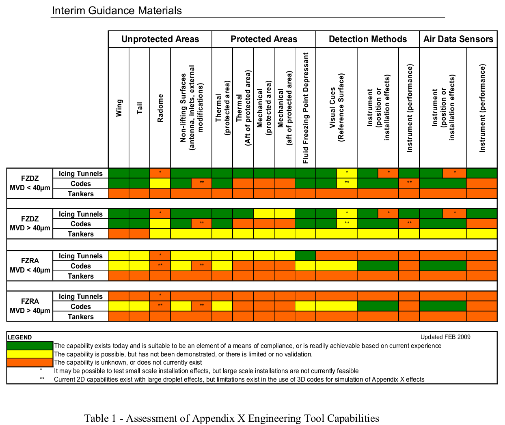  

## Summary  
Icing wind tunnel uses and challenges for large drop icing are discussed.  

## Key points  
1. Since 2014, supercooled large drop (SLD) icing has been part of (US) 14 CFR Part 25 icing regulations (Appendix O).  
2. Physics make current icing wind tunnels challenged to reproduce the freezing rain portion of Appendix O.  
3. For the "main" leading edge region ice shape, the standard test similarity calculations apply.  
4. Icing extent limits appear to have unexplained variability in test.  
5. Ice protection test similarity has not been addressed in detail for SLD conditions.  

## A Very Brief Description of Supercooled Large Drop (SLD) Icing Conditions  

I will keep this brief and focused on icing wind tunnels. 

For a more complete description of SLD icing, see Hu [^1]. 
While Appendix O [^2] is only 10 page long, 
AC 25-28 [^3] describing acceptable means of compliance is 89 pages long, 
and the Ice Protection Harmonization Working Group report [^4], 
that details the data behind Appendix O, is 559 pages long 
(and it is highly recommended for those who have the time to study it).  

In 2014, new icing certification requirements [^2] were published by the FAA
that included, for the first time, requirements for SLD icing conditions, 
in Appendix O (so theses are sometimes referred to as Appendix O conditions).
This was for Part 25, large transport airplanes.  

Four different drop size distributions were defined in Figures 2 and 5. 
In general, these are much broader than the Appendix C (assumed) Langmuir D distributions, 
and have a portion of the water in drop sizes greater than 100 micrometers.  

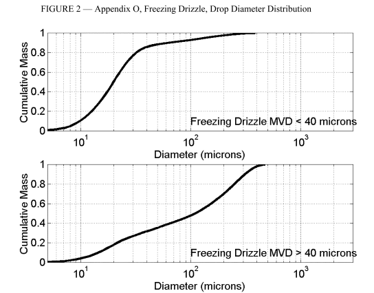  
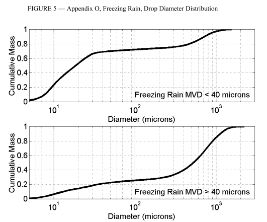  

Advisory Circular 25-28 [^3] provided (in 2014) "interim guidance" on
the use of icing wind tunnels for large drop size icing conditions. 
I am not aware of an update since then,
or how long the "interim" was anticipated to last,
so this appears to still be current guidance. 

For the freezing drizzle (abbreviated FZDZ) conditions, 
the guidance allows the use of icing wind tunnels for most purposes, 
as shown below in Table 1. 

For freezing rain (FZRA), only one use has been validated. 
The case is similar for the use of computing codes (few validated uses), 
so apparently one is left with only flight test in natural icing
SLD conditions as an option. 

  

[The "Appendix X" referred to in the table became Appendix O, 
after the table was produced in 2009.]

## Discussion

Several aspects of physics make similating SLD conditions challenging, 
particularly for freezing rain.   

### Water drop fall rates  

NACA-TN-712 [^5] identified this effect for large drop sizes. 
While small drops fall through the air at much less than 1 m/s, 
large drops can fall at speeds greater than 1 m/s (depending on size). 
For a large test facility, like the IRT, the transit time is 
on the order of 1 second, so the fall distance is non-trivial for large drops. 

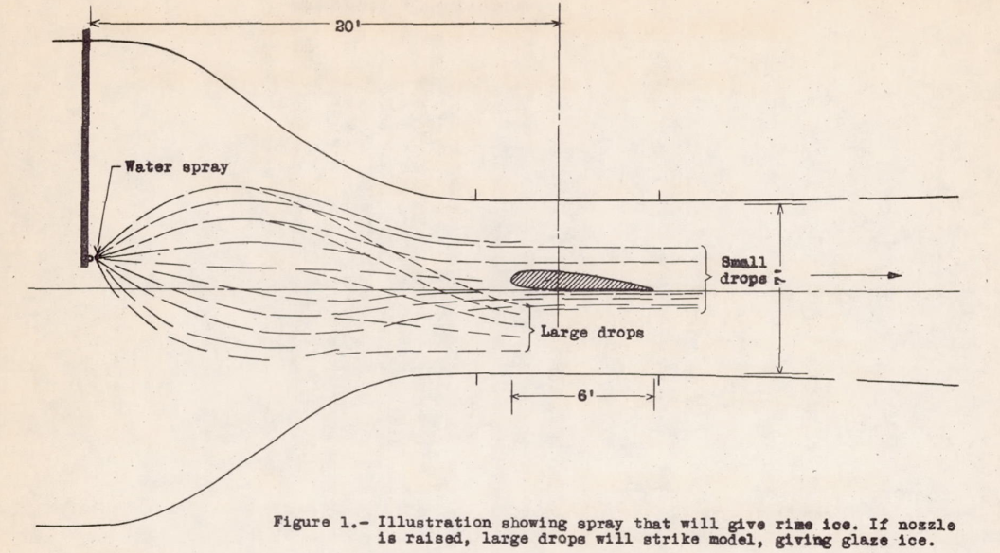  

Current test facilities have an array of nozzles, 
not a single nozzle as in NACA-TN-712.
However, the drops falling, combined with the contraction effect noted below, 
still leads to fewer large drops in the upper areas of the test section, 
and sorting of drop size vertically in the test section. 
 
### Water drop trajectory contraction  

Large drops the trajectories tend to contract in the bell mouth 
upstream of the constant area test section, and continue on that
contracting path. 
This concentrates the water over a small portion 
of the test section further downstream where test articles are typically installed. 
You can see 3D analysis examples in Orchard [^6] and Fallast [^7].  

For a freezing drizzle case (not freezing rain) in the NASA IRT [^8], we can see 
some contraction in the test section water concentration uniformity plots, 
and this would only get worse for freezing rain conditions.  
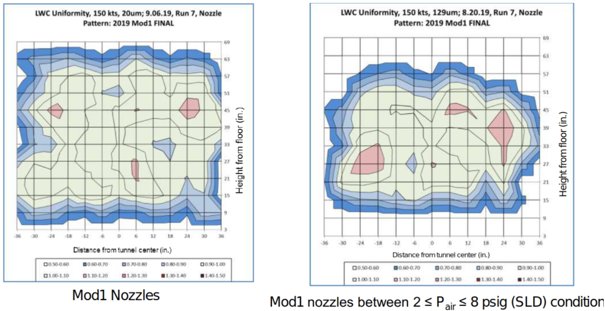  

However, Breitfuß [^9] describes a different, rotating nozzle design 
for the RTA Icing Wind Tunnel that apparently helps uniformity
in the test section for freezing rain conditions. 

### Water drop cooling rates  

As we saw in ["The AEDC 1-Dimensional Multi-Phase code (AEDC1DMP) and the iads1dmp"]({filename}aedc1dmp.md), 500 micrometer diameter drop size case, 
the larger drops do not reach equilibrium by the time 
they reach the test section.  

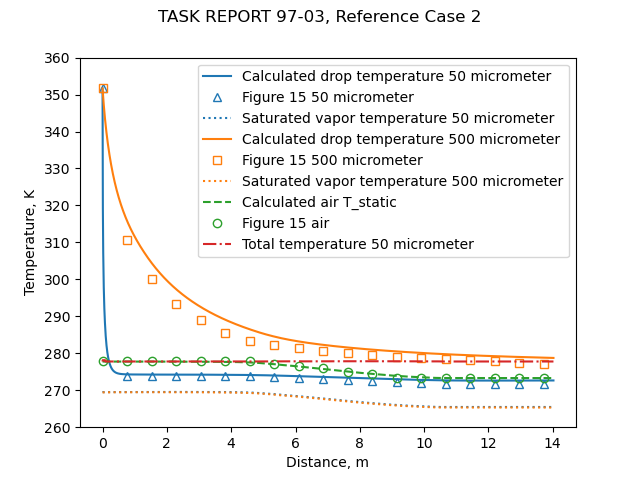  

If the drops are not cooled to near the equilibrium temperature, 
freezing rates will be affected.  
The effect may not be notable for the "main", forward ice shape, 
but areas further aft, where only large water drops impinge, 
may be more affected. 

The temperature of individual drops in transit is difficult to measure
to verify these results. 

Some attempts have been made to assess this effect by using varying initial temperatures 
of the water spray to (presumably) achieve different drop temperatures in the test section. 

### Scaling SLD test conditions  

NASA/CR-2008-215302 [^10] looked at scaling SLD conditions in the freezing drizzle size range (not freezing rain). 
One form of scaling considered was geometric scaling. 
A smaller test article would require smaller drop sizes than the reference case for similarity, 
so that conventional nozzles can produce the water spray, 
and the challenges of drop fall rates, trajectory contraction, 
and final drop temperature are alleviated. 

The tests showed good matches between scale and reference ice shapes.

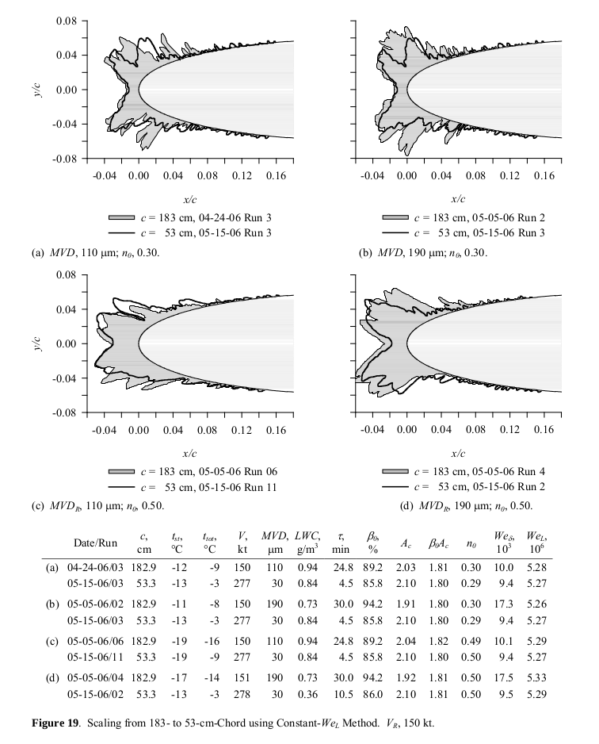  

It was found that that the same scaling methods used for smaller 
drops applied well to large drops:  
[Emphasis added]  
>Because the features of the main ice shape do not appear 
to be affected by drop size, it is safe to conclude
that, for models as large as 183-cm chord, drop sizes
from 30 to 190- μm MVD and velocities of 200 kt or
less, SLD main ice shapes are not subject to significant
differences in the effects of drop distortion and breakup
before impact or splashing of drops on impact compared 
with those in Appendix C. __This may mean that
these effects are scaled appropriately between Appendix C 
and SLD conditions using the existing scaling
methods. These conclusions may not apply to the
feather regions, where accretion mechanisms are not yet
understood. Fortunately, therefore, scaling methods that
have been found to be effective for Appendix C can
also be applied to at least the limited range of SLD
conditions included in this study.__ The currently recommended 
methods to scale model size, icing limit and
test conditions are outlined in the section 
Recommended Scaling Methods on p 27.

The recommended methods are very similar to those in 
[NASA/CR-2004-212875]({filename}NASA-CR-2004-212875.md) [^11], 
with the addition of this:  

>>3.&nbsp;Knowing V_s, find the scale MVD that satisfies the
equation β_o_s = β_o_r. If MVD_s so found is less than 25
μm, set MVD_s to a value between 25 and 30 μm. Although 
smaller scale MVDs may provide acceptable
scale ice shapes, the method used here has not yet been
tested for scale drop sizes below 25 μm. If the scale
MVD is outside the low end of the facility calibration
range, set MVD_s to 30 μm. Furthermore, if facility 
restrictions on MVD make it impractical to match βo exactly, 
scale MVD should be selected to gain as close a
match of βo as possible.

### Observed icing limits versus calculated impingement limits

NASA/CR-2008-215302 looked at the observed icing limits.  

>Icing Limits  
Icing limit data for NACA 0012 models with chords of
53.3 and 91.4 cm have been presented by Anderson and
Tsao [37]. These data showed a strong correlation with βo
only. Since then, additional icing limits have been recorded 
for models ranging from 26.7 to 182.9 cm. Icing
limits were established by noting the chord-wise position 
on the model at which ice accretion (in the form of
feathers) appeared to end. Ice shapes were traced once
at the span-wise centerline and again 2.5 cm above that
center (the models were mounted vertically in the IRT).
For each of these ice-shape profiles an icing limit was
estimated on both the upper and the lower surface. 
Because the models were mounted at 0° AOA, the upper- and 
lower-surface limits can reasonably be expected to
be the same, within some random variation. Values for
the two tracing locations should also vary little. 
Therefore, the four values of icing limit were averaged to
obtain a single limit for each test.   

>These average icing limits obtained over the period
2002 to 2006 are presented in Figure 16 normalized by
chord and plotted as a function of the stagnation collection 
efficiency. Data for each of the 5 chords tested are
given with a different symbol. The solid line represents
a simple least-squares curve fit through all of the data.
The fit was forced to pass through the origin. The data
scatter in location, x/c, about this line is typically ±0.05.
The results show a strong correlation with βo and an
independence of model size. Attempts to correlate the
data with either V or n_o were not successful.

>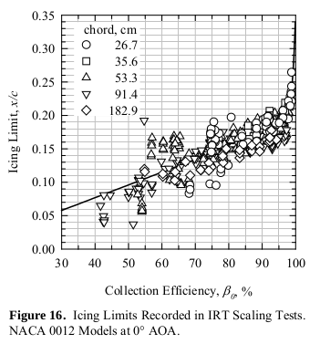  

Note the fairly large scatter in Figure 16. 
For example, at βo = 0.55, icing limit 
values of 0.05 to 0.20 x/c occur, with the 
curve fit line value of 0.10 x/c. 
This is a rather large tolerance for purposes of, 
for example, 
verifying the extent of an ice protection system. 

When we add LEWICE 2D impingement analysis to figure 16, 
the correspondence to the observed icing limits is limited. 
A Langmuir D drop size distribution was used, 
and the initial (ice-free) surface impingement limits are plotted. 
The leading edge beta value calculated differed slightly 
between the LEWICE 2D calculation and the leading edge cylinder value, 
which was apparently what was plotted, 
and so the impingement limit values plotted with 
beta cylinder values match slightly better 
(or match less poorly). 

>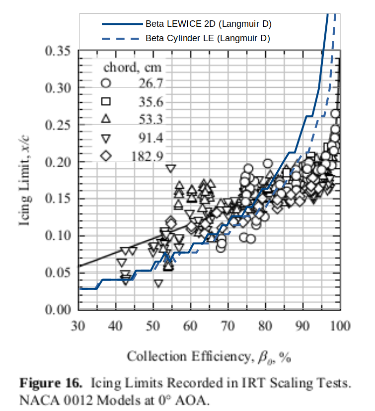  

### Bimodal drop size distributions  

Potapczuk [^12] looked at using two sets of nozzles (bimodal) to better represent 
the SLD drop size distributions, and found:   

>Results from this study have indicated the following trends.  
>- Ice shapes from bimodal distributions and from monomodal
distributions having the same icing conditions (i.e. air velocity,
air temperature, LWC, MVD) result in very similar main ice
shapes.
>- Mass and volume measurements indicate that the bimodal ice
shapes have more mass and volume than their monomodal pairs.
>- It appears from examination of photographs and from subsequent
analysis with LEWICE that the additional mass may be
contained in the region aft of the main ice shape where large
scale ice roughness is found.
>- The bimodal condition also appears to have somewhat larger
icing impingement limits which also may contribute to the
discrepancies in mass and volume.
>- Current methods for measuring ice shape in these areas aft of the
main ice shape are not well developed nor are methods for
establishing icing limits along the span of the airfoil or wing.

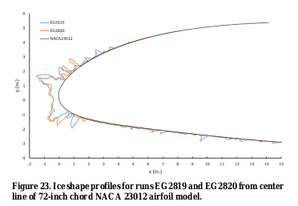  
[EG2819 bimodal, EG2820 monomodal]  

Note also the last trend mentioned on establishing icing limits. 

### Ice protection system icing tunnel testing in SLD  

As we saw in AIAA-2017-3927, the water catch rate is generally scaled down 
between altitude reference conditions and near sea level test conditons. 

However, the large drop conditions that a facility can produce may require a 
fairly high LWC value. 
In Figure 23 above, the LWC values were fairly high (1.64 g/m^3). 
The freezing drizzle definitions LWC values, however, are fairly low (up to 0.44 g/m^3):   
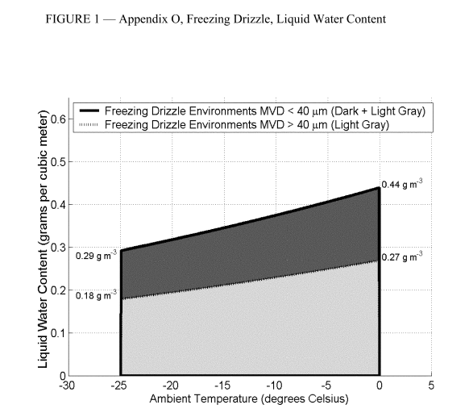  

This leads to challenges. 
If one tests at a higher LWC and the resulting water exposure rate than the reference 
condition, the results may be "conservative", 
in that the test water exposure rate is too high 
(by a factor of 3 or 4 in the example above). 
This may lead to a test result of runback ice, where 
if the system was in better representative conditions 
the result might be no runback. 
One might characterize this as "overly conservative", or not representative. 

There is also the uncertainty on icing limits mentioned above. 
A component of ice protection testing is verifying 
that an adequate extent is protected, and how to deal with the 
uncertainty of test results is a challenge. 

### Do the aft "feathers" have much of an effect?  

Insana [^13] looked at the effects of digitized ice shapes, 
obtained at reference and scaled SLD conditions. 
Aerodynamic effects were measured to determine the degree of similarity between ice shapes
[see also [AEDC-TR-87-23, "An Empirical Look at Tolerances in Setting Icing Test Conditions with Particular Application to Icing Similitude"]({filename}aedc_tr_87_23.md)].

For one case, the feathers (or other detail differences) have some effect, 
but for a low Reynolds number (300,000) test.  

The ice shapes were digitized from the test cases in NASA/CR-2008-215302 figure 18. 
For the 1.83 m chord, the icing test Reynolds number was about 6,000,000. 
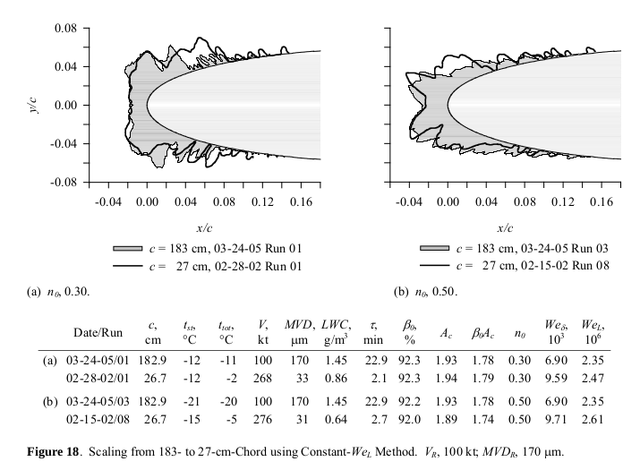  

The digitized ice shapes were 3D printed on to a small chord model, and 
tested in an atmospheric wind tunnel. 

The drag was measurably different between the full scale and scaled ice shapes
(a LEWICE ice shape was also included).  
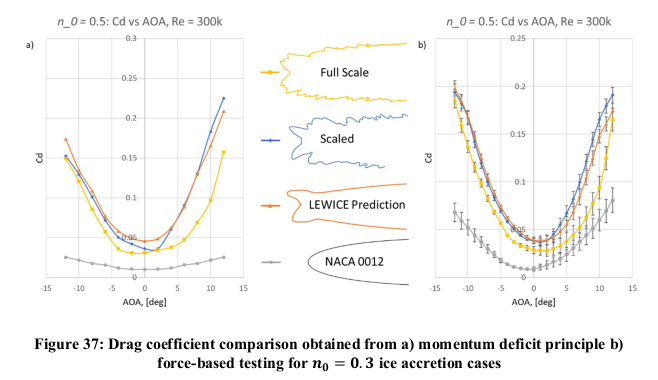  

At higher angles of attack, the lift was different.  
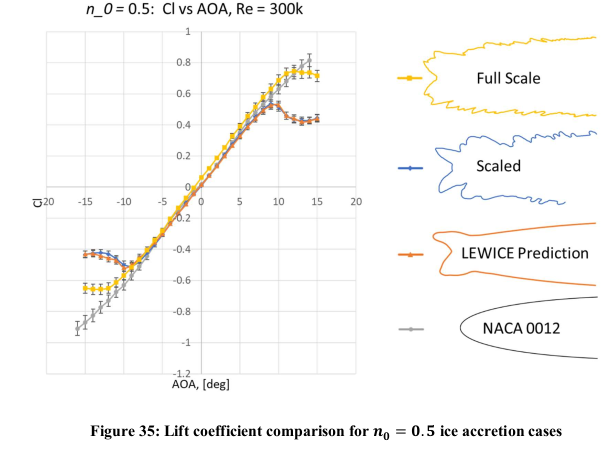  

However, note that the effects of the scaled shape are more detrimental 
than for the full scale: the drag values are higher for the scaled case, 
and the maximum lift value is reached at a lower angle of attack for scaled than for full scale, 
and the post-stall lift is lower for the scaled case. 
So, the scaled case may be viewed as "conservative". 

From the conclusions:  
>This agreement between the full-scale and the scaled ice shape was not observed in the
n = 0.5 cases. The similar lower horn geometries of the scaled and full-scale ice shapes produced
similar flow physics at negative angles of attack. However, this was not the case at positive angles
of attack, where the geometric variation of the upper horns caused the aerodynamics between the
scaled and full-scale ice shapes to vary. The scaled ice shape also showed earlier stall at both
positive and negative angles of attack, therefore, not preserving the aerodynamic penalty of early
stall. Overall, the scaled ice shape collected with a n = 0.5 was uncharacteristic of the
corresponding full-scale collected ice shape.  
The difference in the evaluation of the scaled and full-scale ice shapes for the SLD
conditions evaluated in this research show inconsistency in the ability of the Anderson and Tsao
[1] recommended ice shape scaling method to reproduce an ice shape aerodynamically
characteristic of the full-scale ice accretion in SLD icing conditions. Therefore, it can be concluded
that the ice accretion generated by the scaling method does not deliver the same aerodynamic effect
as the full-scale ice shape. Rather, the results suggest a possible stagnation freezing fraction
constraint for the scaling method’s use in SLD conditions, as this was the primary icing collection
parameter difference between the ice shapes collected with a n = 0.3 and n = 0.5. The results
also expressed the necessity for better preservation of the feather region ice accretion geometry and
frontal horn height, as these provided the largest deviations in the aerodynamics of the different ice
shapes. This along with the inconsistency of the scaling method to produce an ice shape that
preserved the associated aerodynamics with the full-scale ice accretion between the two stagnation
freezing fraction cases suggest the necessity of further refinement of the recommended ice shape
scaling method for SLD conditions.

(The [1] above is reference [^11] herein.)

As things often occur in icing research, "more data is needed". 
I would feel more confident about the conclusions if there were more test cases, 
and if the aerodynamic effects could be measured at a more representative Reynolds number. 

## Conclusions  

"More data is needed" for SLD icing testing, 
particularly for freezing rain conditions and ice protection testing. 
Recent developments such as Breitfuß [^9] provide hope for an improvement of the 
AC 25-28 Table 1 "interim guidance" assessment from above of using icing wind tunnel tests 
for all SLD conditions.  
 
## Notes

[^1]: 
Hu, Tao, et al. "Study on airworthiness problems of operating in supercooled large drops icing conditions for transport category airplanes." Procedia Engineering 80 (2014): 467-478. 
[sciencedirect.com](https://www.sciencedirect.com/science/article/pii/S1877705814011989)  
[^2]: [Airplane and Engine Certification Requirements in Supercooled Large Drop, Mixed Phase, and Ice Crystal Icing Conditions](https://www.federalregister.gov/documents/2014/11/04/2014-25789/airplane-and-engine-certification-requirements-in-supercooled-large-drop-mixed-phase-and-ice-crystal), Federal Register, 2014  
[^3]: [AC 25-28 - Compliance of Transport Category Airplanes with Certification Requirements for Flight in Icing Conditions](https://www.faa.gov/regulations_policies/advisory_circulars/index.cfm/go/document.information/documentID/1019691), 2014.    
[^4]: [Ice Protection Harmonization Working Group. "Task 2 Working group report on supercooled large droplet rulemaking."](https://www.faa.gov/regulations_policies/rulemaking/committees/documents/media/TAEiphT2-12081997.pdf)  submitted to the Transport Airplane Engine Issues Group (2009).   
[^5]: Rodert, Lewis A.: A Preliminary Study of the Prevention of Ice on Aircraft by use of Engine Exhaust Heat. NACA-TN-712, 1939. [ntrs.nasa.gov](https://ntrs.nasa.gov/citations/19930081464)  
[^6]: Orchard, David M., Krzysztof Szilder, and Craig R. Davison. "Design of an icing wind tunnel contraction for supercooled large drop conditions." AIAA 2018-3185, 2018 Atmospheric and Space Environments Conference. 2018. [researchgate.net](https://www.researchgate.net/profile/David-Orchard-6/publication/325963669_Design_of_an_Icing_Wind_Tunnel_Contraction_for_Supercooled_Large_Drop_Conditions/links/5c644b9f92851c48a9d242cb/Design-of-an-Icing-Wind-Tunnel-Contraction-for-Supercooled-Large-Drop-Conditions.pdf)   
[^7]: Fallast, A., et al. "Kinetic and thermal simulation of water droplets in icing wind tunnels." CEAS Aeronautical Journal 13.1 (2022): 181-198. [link.springer.com](https://link.springer.com/content/pdf/10.1007/s13272-021-00558-y.pdf)  
[^8]: Timko, Emily N., et al. NASA Glenn Icing Research Tunnel: 2019 Cloud Calibration Procedure and Results. No. E-19889. 2021.  [ntrs.nasa.gov](https://ntrs.nasa.gov/citations/20205002688).  
[^9]: Breitfuß, W., Wannemacher, M., Knöbl, F., and Ferschitz, H., “Aerodynamic Comparison of Freezing Rain and Freezing
Drizzle Conditions at the RTA Icing Wind Tunnel,” SAE Technical Paper 2019-01-2023, 2019, doi:10.4271/2019-01-2023.  
[^10]: Anderson, David N., and Tsao, Jen-Ching. Ice shape scaling for aircraft in SLD conditions. No. NASA/CR-2008-215302. 2008. [ntrs.nasa.gov](https://ntrs.nasa.gov/citations/20080043617)  
[^11]: Anderson, David N.: Manual of scaling methods. No. E-14272, NASA/CR-2004-212875. 2004.  [ntrs.nasa.gov](https://ntrs.nasa.gov/api/citations/20040042486)   
[^12]: 
Potapczuk, Mark G., and Jen-Ching Tsao. "The Influence of SLD Drop Size Distributions on Ice Accretion in the NASA Icing Research Tunnel." International Conference on Icing of Aircraft, Engines, and Structures. No. GRC-E-DAA-TN68067. 2019. [ntrs](https://ntrs.nasa.gov/citations/20190027173)   
[^13]: 
Insana, Eric: "Low Reynolds Number Experimental Aerodynamic Verification of Scaled and LEWICE Simulated Ice Accretions in SLD Conditions." Thesis, University of Dayton, August 2020. [ohiolink.edu](https://etd.ohiolink.edu/apexprod/rws_etd/send_file/send?accession=dayton1597082782224451&disposition=inline)      
