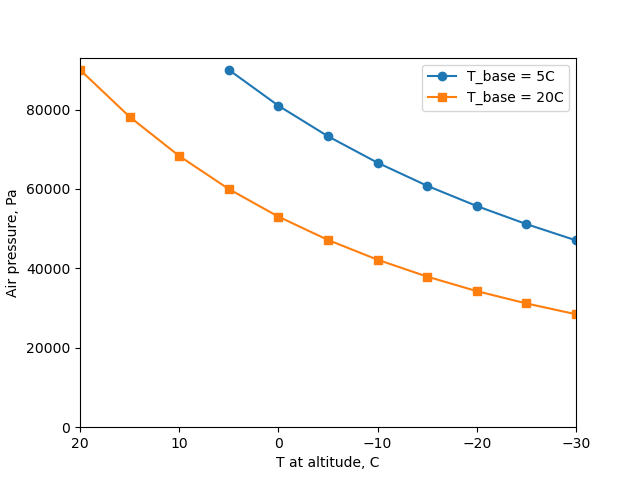
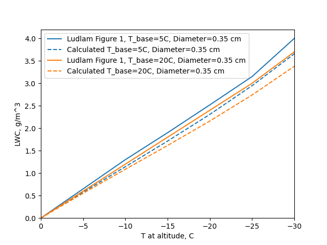
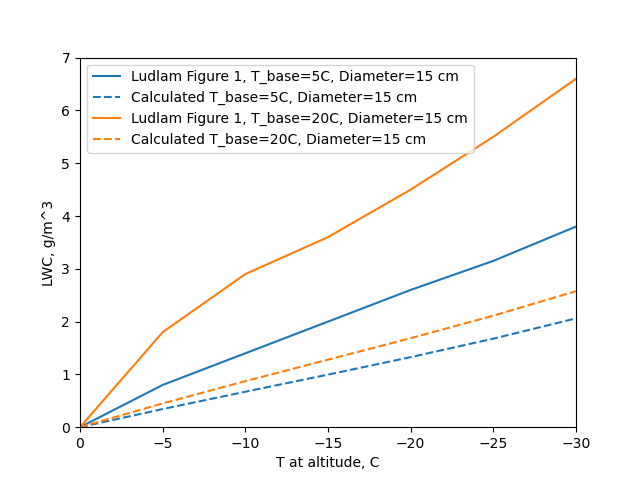
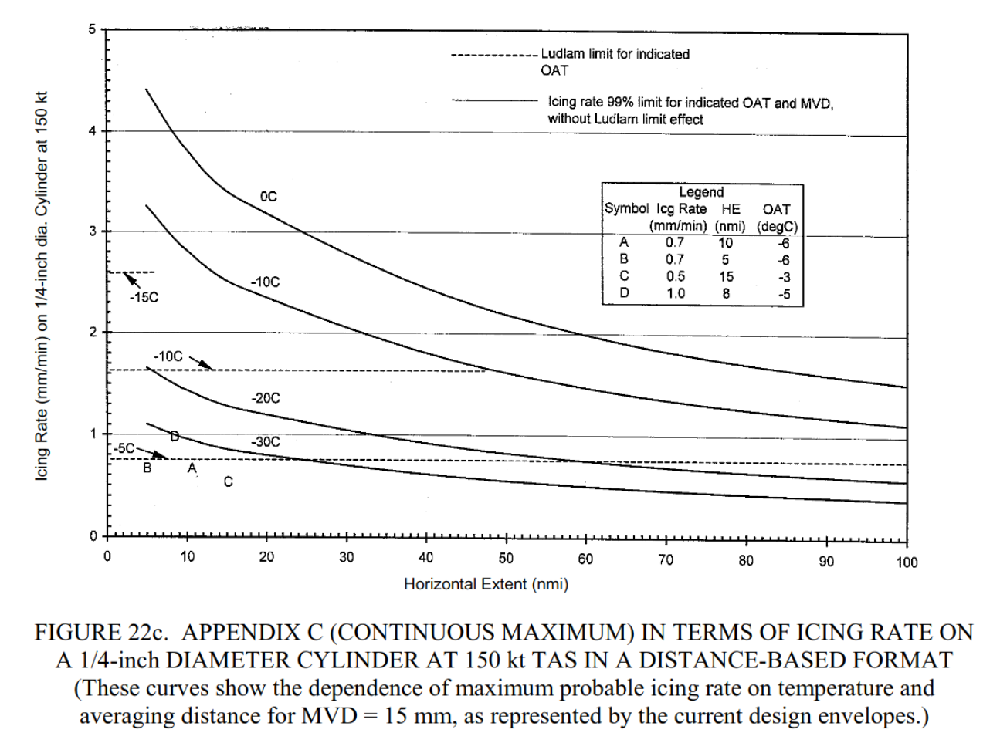
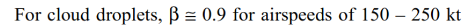
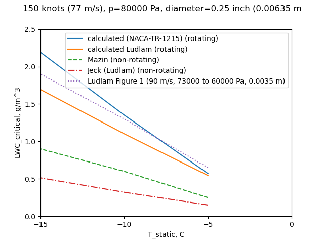

Title: template  
Category: NACA  
tags: thermodynamics   
status: draft

> ###_"The rotating-cylinder technique of determining water content and drop-size distribution cannot therefore be used without consideration of the heat economy"_  

#F. H. Ludlam, "The Heat Economy of a Rimed Cylinder" [^1]
or 
##"A confusion of Ludlam Limits"

##Summary
Various "Ludlam Limits" have been implemented, but they produce different results.  

##Key points  
1. Calculations are laid out for finding the "critical" LWC where not all available water freezes on a cylinder. 
2. Values of critical LWC were presented. 
3. The critical LWC is often termed the "Ludlam limit", although Ludlam did not use that term. 
4. Various "Ludlam Limits" have been implemented, but they produce different results. 

##Abstract

> A method is described for calculating the surface temperature of a slender cylinder 
which is moved through a supercooled cloud and becomes covered with rime ice. 
When the surface temperature reaches 0°C the ice formation proceeds at the maximum possible rate; 
the associated liquid-water content of the cloud is calculated 
and found to be usually less than the maximum theoretical value inside a deep cumulus cloud. 
The rotating-cylinder technique of determining water content and drop-size distribution 
cannot therefore be used without consideration of the heat economy, 
and may otherwise lead to large underestimates of water concentration in severe icing conditions. 
    
##Discussion

The "heat economy" is, in more recent terminology, the thermodynamic heat balance of ice forming on a cylinder. 

Most of the components we have seen some version of before.

A brief summary of the equations used was presented, 
but there are either errors or there where addition equations not listed that were used to 
produce the published results. 
As such (and due to copyright) I will not reproduce them here. 

Heat transfer due to convection: 

Heat transfer coefficients were determined with laminar flow, and turbulent flow, correlations for a smooth cylinder. 
Reynolds number (100000) was used to select between the two. 
The entire surface of the cylinder is considered to be available for convection. 

The heat calculated is H = hc * (t_surface - t_ambient)

The effect of viscous heating is not included. 
As the analysis is for a rotating cylinder, 
perhaps the viscous heating was thought to average out to zero over the entire surface. 

Heat transfer due to evaporation:

The entire surface of the cylinder is considered to be available for evaporation. 
A mass transfer coefficient was presented, k_evap = Nusselt * Dv / d_cylinder, 
where Dv is the diffusitivy of water vapor in air. 
This differs from the k_w term from [NACA-TR-831]({filename}NACA-TR-831.md) [^2].
I believe that this is an area where what Ludlam implemented is different from what Ludlam described.  

Heat transfer due to water impingement: 

The rate of water impingement was calculated. 
The heat due to water impingement is water_rate * cp_water * (_surface - t_ambient). 
This is similar to other sources, except that the kinetic heating 
due to the impingement of water drops was not included 
(this is typically a relatively small term). 

Heat due to water freezing:

The heat due to water freezing is H = water_rate * latent_heat_of_freezing. 
Some other sources include the fact that a small portion of the water has evaporated, 
leaving a slightly reduced amount of water available to freeze. 

The terms are evaluated as a surface temperature of 0C, 
the warmest temperature at which ice can form. 

H_freezing = H_convection + H_evaporation + H_impingement

By successive approximation, 
the LWC value where the equation is satisfied can be found 
(the non-linear terms, particularly vapor pressure, prevent direct solution).

###Comparisions

This often cited work has been used in many places, but, alas, with varying results. 

A python implementation was made (file "ludlam.py" at [^3]). 
The python implementation was intended to be as straight-forward as possible. 
Differences from Ludlam are:
- evaporation calculation  

Ludlam did not include the air pressures, so those were calculated 
using the wet_air to dry_air relationship from NACA-TR-831.

The results for a 0.35 cm diameter cylinder compare well.

 

However, the results for a 15 cm diameter cylinder did not compare well.

 
There will be more discussion of the large cylinder results 
when we get to the review of NACA-TR-1215 [^4]
([NACA-TR-1215]({filename}NACA-TR-1215.md) was reviewed in the Cylinders thread, and will be reviewed again in the Thermodynamics thread). 
 
We will now compare analysis for a 0.25 inch (6.35 mm) diameter cylinder. 
 
A cylinder that has been studied in detail is the 0.25 inch (6.35 mm) diameter 
sensing head of the "Rosemount" ice detector
(Rosemount being the original name of the company that produces it). 
This cylinder does not rotate. 

Studies that use the term "Ludlam Limit" include Mazin [^5], et al., and Jeck [^6]. 

Mazin cited Ludlam, and provided details of the implementation. 
Areas where Mazin is different:  
- heat transfer coefficients  
- evaporation calculation  
- evaporation and convection are confined to the impingement area  
- evaporation reduces the water available for freezing  
- viscous and kinetic heating are included  

Jeck cited Ludlam, but did not provide details of the implementation. 
Jeck presented results as "Ludlam limit" icing rates on the cylinder, 
as shown in Figure 22c below, 

 

which may readily be converted to an LWC value using the continuity equation. 

> 
> LWC = thick_growth_rate / ice_density / (beta * airspeed)  [with unit conversions]

NACA-TR-1215 cites Ludlam, and includes a "critical" LWC value. 
Differences include:
- evaporation calculation  
- evaporation reduces the water available for freezing 
- a heat transfer coefficient that includes surface roughness  

A case from Ludlam Figure 1 is similar, but not identical to the comparison case selected. 

Industrious readers may find several more "Ludlam limit" examples, 
but these are enough to make a point.

###The various "Ludlam limit" methods produce significantly different results. 

 

For Mazin, the most important difference is that the area for evaporation and convection is 
confined to the impingement area, which for most cases for this small cylinder
is the front half. 
This largely explains why the Mazin LWC results are about 1/2 of the python implementation, 
which allows evaporation and convection over the entire surface. 
 
I speculate that Jeck attempted to use Ludlam's published evaporation coefficient
which may explain some of the differences. 

We will compare cylinder test data 
when we get to the review of NACA-TR-1215 in the Thermodynamics thread, 
which might help sort out the more useful analysis methods. 

##Conclusions 

Ludlam was quite correct in noting that rotating cylinders 
may not freeze all of the impinging water in some cases. 

However, it is not clear how some of the values in Ludlam's Figure 1 were derived. 

Various implementations of "Ludlam limit" in the literature produce significantly different results. 

Whenever someone mentions a "Ludlam limit", be sure to ask "Which one?"

##Citations

Ludlam cites 11 publications:

- Dolozell, A. C., Cunningham, R. J., and Katz, R. E.: . Bull. Amer. Met. Soc., 17, 1946, p. 261  
- Fishenden, M., and Saunders, O. A.: An Introduction to Heat Transfer. Oxford University Press, 1950, p. 130.  
- Frossling, Nils: Uber die Verdiinstung Fallender Tropfen. Gerl. Beitr. Geophys., Bd. 52, Heft 1/2, 1938, pp. 170-216.  
- Karve, C. S.: . Proc. Indiand Acad. Sci., A, 16, 1938, p. 103.  
- Kramers, H.: . Physica, Hague, 12, 1946, p. 61.  
- Langmuir, Irving, and Blodgett, Katherine B.: A Mathematical Investigation of Water Droplet Trajectories. Tech. Rep. No. 5418, Air Materiel Command, AAF, Feb. 19, 1946. (Contract No. W-33-038-ac-9151 with General Electric Co.)  
- Lewis, William, and Hoecker, Walter H., Jr.: Observations of Icing Conditions Encountered in Flight During 1948. NACA-TN-1904, 1949.  
- Ludlam, F. H.: . Quart. Jour. Roy. Meteorological Soc., vol. 76, Oct. 1950. p. 52.  
- Ludlam, F. H.: . Quart. Jour. Roy. Meteorological Soc., vol. 77, Oct. 1951. p. 402.  
- Powell, R. W.: . Trans Inst. Chem. Eng., 18, 1940, p. 36.  

Ludlam is cited by 3 publications in the NACA Icing Publications Database [^7]:

- Lewis, William, and Bergrun, Norman R.: A Probability Analysis of the Meteorological Factors Conducive to Aircraft Icing in the United States. NACA-TN-2738, 1952.  
- Brun, Rinaldo J., Lewis, William, Perkins, Porter J., and Serafini, John S.: Impingement of Cloud Droplets and Procedure for Measuring Liquid-Water Content and Droplet Sizes in Supercooled Clouds by Rotating Multicylinder Method. NACA-TR-1215, 1955. (Supersedes NACA TN’s 2903, 2904, and NACA-RM-E53D23)  
- Lewis, William, and Perkins, Porter J.: A Flight Evaluation and Analysis of the Effect of Icing Conditions on the PG-2 Airship. NACA-TN-4220, 1958.  

An online search found that Ludlam is cited 106 times in the literature [^8].  

##Notes:  
[^1]: 
Ludlam, F. H.: The Heat Economy of a Rimed Cylinder. Quart. Jour. Roy. Meteorological Soc., vol. 77, no.334., Oct. 1951.  
[^2]: Hardy, J. K.: An Analysis of the Dissipation of Heat in Conditions of Icing from a Section of the Wing of the C-46 Airplane. NACA-TR-831, 1945. (Formerly NACA-ARR-4I11a.)  
[^3]: [https://github.com/icinganalysis/icinganalysis.github.io](https://github.com/icinganalysis/icinganalysis.github.io)  
[^4]:
Brun, Rinaldo J., Lewis, William, Perkins, Porter J., and Serafini, John S.: Impingement of Cloud Droplets and Procedure for Measuring Liquid-Water Content and Droplet Sizes in Supercooled Clouds by Rotating Multicylinder Method. NACA-TR-1215, 1955. (Supersedes NACA TN’s 2903, 2904, and NACA-RM-E53D23)  
[^5]: 
Mazin, I. P., A. V. Korolev, A. Heymsfield, G. A. Isaac, and S. G. Cober, 2001: Thermodynamics of Icing Cylinder for Measurements of Liquid Water Content in Supercooled Clouds. J. Atmospheric Ocean. Technol., 18, 543-558  
I also recommend Mazin, I. P., 1957: The Physical Principles of Aircraft Icing (in Russian). Gidrometeoizdat, 120 pp  
This is a candidate for "The Greatest Thing That You (Probably) Have Never Read"  
A translation to English is available at [DTIC](https://apps.dtic.mil/sti/pdfs/ADA083374.pdf)  
[^6]: 
Jeck, Richard K., Icing Design Envelopes (14 CFR Parts 25 and 29, Appendix C) Converted to a Distance-Based Format, DOT/FAA/AR-00/30, April, 2002.  
[^7]: 
[NACA Icing Publications Database]({filename}naca icing publications database.md)  
[^8]: 
https://scholar.google.com/scholar?hl=en&as_sdt=0%2C48&q=The+Heat+Economy+of+a+Rimed+Cylinder&btnG=  

