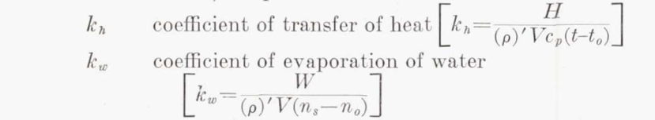
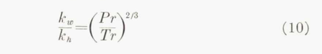
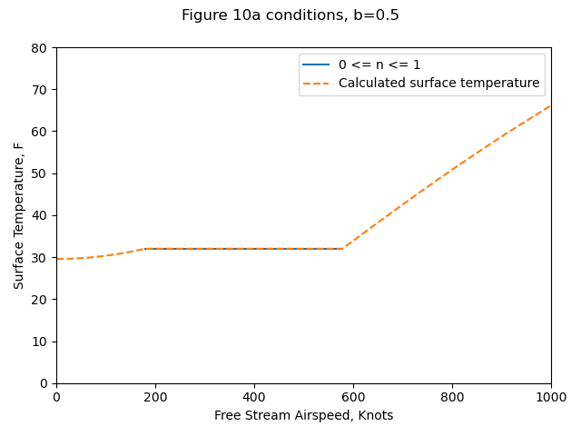
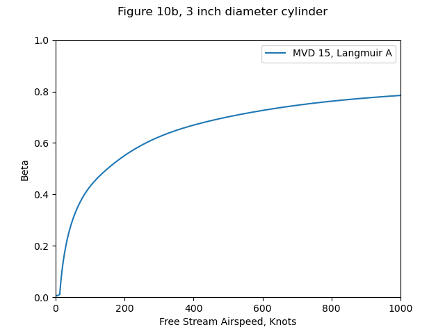
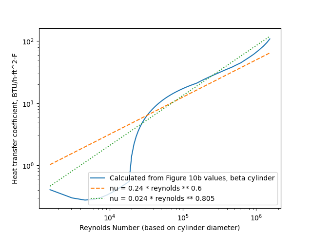
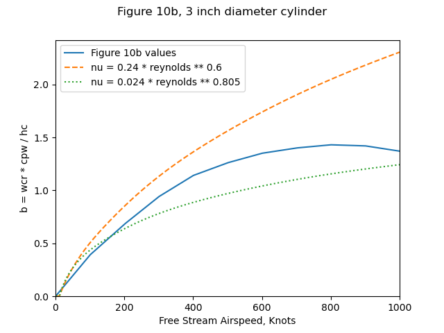
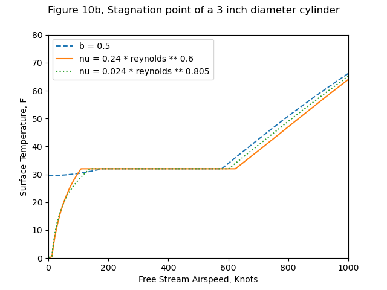
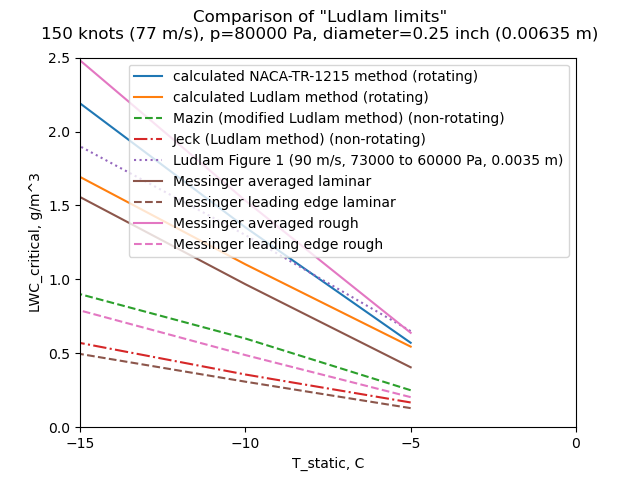

Title: Messinger  
Category: NACA  
tags: thermodynamics  

> ###_""freezing-fraction" denotes the proportion of the impinging liquid which freezes in the impingement region"_  

#B. L. Messinger, "Equilibrium Temperature of an Unheated Icing Surface as a Function of Airspeed" [^1] 

.](images/messinger/Figure1.png) 
> Modes of energy transfer for an unheated airfoil in icing conditions. 

##Summary 
The term "freezing fraction" is defined 

##Key points

1. Heat balance equations for a wet surface are presented.  
2. The term "freezing fraction" is defined  
3. Example calculations are provided  
4. Icing wind tunnel test data is provided  

##Abstract

> The thermal analysis of a heated surface in icing conditions has
been extensively treated in the literature. Except for the work
of Tribus, however, little has been done on the analysis of an
unheated icing surface. This latter analysis is significant in the
design of cyclic thermal deicing systems that are attractive for
small high-speed aircraft for which thermal anti-icing requirements 
have become severe.
In this paper, a complete analysis of the temperature of an
unheated surface in icing conditions is presented for the several
significant regimes (i.e., less than 32°F, at 32°F, and above
32°F.) as a function of air speed, altitude, ambient temperature,
and liquid water content.
The results are presented in graphical form and permit the
rapid determination of surface temperature for a wide range of
variables. Curves are presented to determine the speeds beyond
which no ice accretion will occur. Curves are also presented to
indicate the surface temperature and the rate of ice sublimation
which takes place when an ice-covered surface emerges into clear
air.
One significant result of this study is the introduction of a new
basic variable referred to as the "freezing-fraction," which denotes 
the proportion of the impinging liquid which freezes in the
impingement region. The fact that some of the liquid does not
freeze in the impingement region tends to explain the observed
variation in ice formation shape with temperature, speed, and
water catch.
New test data obtained at Mt. Washington, N.H., for stagnation-point 
surface temperatures of an unheated plastic cylinder in
natural and artificial icing conditions are included in the Appendix. 
These data substantiate the validity of the assumptions
made in the theoretical analysis.
    
##Discussion

This paper is one of the most cited aircraft icing publication in the literature 
and merits close study. 

I am reviewing publication the [Thermodynamics thread]({filename}thermodynamics.md) in order of publication. 
I am counting this as published in 1951, as some NACA publications (such as NACA-TN-2861) 
cite a pre-print of this publication. The journal publication was in 1953. 

In a footnote, Messinger credits for the term "freezing fraction":  
>The author is indebted to M. M. Friedlander for assistance
in preparation of the curves and to P. J. Valentine for suggestions
relative to the "freezing fraction" concept. Both are members of
the Thermodynamics Group at Lockheed Aircraft Corporation.

###Symbols  
The paper used its own nomenclature. 
I will attempt to standardize (mostly) to the nomenclature of "Manual of Scaling Methods" [^2]. 

Description| symbol | Messinger symbol
---|---|---
air specific heat at constant pressure | cp | ca
unit system gravitation factor | gc = 1 kg-m/(N-s^2) | g, "gravitational constant, 32.2 ft./sec.^2 or lbs. per slug"
heat transfer coefficient| hc| f
ambient static pressure | p | B, ambient absolute pressure
mass flux rate of water (mass/unit_area/time) | mw | Rw
mass flux rate of evaporation (mass/unit_area/time) | me | Rwe
evaporation fraction | m | m
freezing fraction | n | n
ambient water vapor pressure | pv | p∞
surface water vapor pressure | pvs | psw
heat transfer (loss) by convection | qc | qc
heat transfer (loss) by evaporation | qe | qe
heat transfer (gain) by freezing | qf | qf
heat transfer (gain) by kinetic heating from drops | qk | qk
heat transfer (gain) by viscous heating | qv | qv
heat transfer (loss) by warming drops | qw | qw
recovery factor | r | r
ambient air static temperature| ta | t∞
surface temperature | ts | tse
latent heat of evaporation | Le | Le
latent heat of freezing | Lf | Lf
free stream airspeed | u | V

Calculations here will be in SI units, with the exceptions of:  
- LWC, g/m^3  
- drop diameter, micrometer   

###Heat balance for a surface at 32F (0C)

A heat balance is detailed for a wet surface at 32F.

Several heat transfer components are defined. 

    qc = hc * (ts - ta) 
    
    qe = 2.9 * Le * fc * (psw - p∞) / B  [Messinger nomenclature]  

In a footnote, Messinger says of the value 2.9 in qe equation:  
> The constant 2.90 is an empirical factor relating mass transfer
to convection heat transfer. In reference 1 this constant appears
erroneously as being equal to 2.29 because of a numerical error
in the derivation. Also, to be completely accurate, the values of
Pm and B should be replaced by their corresponding local values
just outside the boundary layer. Thus the areas of low static
pressure promote increased evaporation and high static pressure
areas suppress evaporation. The magnitude of this effect is 
considered negligible in this paper.

[NACA-TR-831]({filename}NACA-TR-831) [^3] discusses the related ratio kw/kh:

>  
>Coefficient of evaporation.—There is some uncertainty as
to the correct value of the ratio of kw. to kh, owing to 
uncertainty in the value of the coefficient of diffusion of water
vapor in air. When the flow is laminar  
>  
>When the flow is turbulent, the ratio is more nearly unity;
the value may be found by substitution in Karman's equation 
(reference 7). Taylor's number Tr is the ratio of the
diffusivity of momentum to that of any substance or heat.
Prandtl's number Pr is Taylor's number in the particular
case of heat, when the diffusivity is k/(ρ)'cp.
Values for the diffusivity of water vapor in air are few
and scattered. The most reliable is considered to be 0.22
centimeter squared per second at 0°C. (reference 8). With
this value, equation (10) gives kw/kh =1.12. 

The ratio (Pr/Tr)**(2/3) is fairly constant over the range of conditions of interest, 
so it is often in post-NACA literature taken as the constant value 1.12. 

To get Messingers value of 2.9:  

    ratio of molecular masses, water to air = 0.622  
    cp_air = 0.24 BTU/lbm-F  
    2.9 = 0.622 / 0.24 * 1.12  

So, the 2.9 factor is not just empirical, 
it is founded in the ideal gas law and boundary layer analogies. 

More generally, for any unit system: 

    kw = kh / cp * (Pr/Tr)**(2/3) (if using vapor concentration difference)  
    he = hc * 0.622 / P / cp * (Pr/Tr)**(2/3)  (if using vapor pressure difference)

So, 

    qe = Le * hc * 0.622 / p / cp * (Pr/Tr)**(2/3) * (pvs - pv)  [standard nomenclature]  
    qe = Le * hc * 0.622 / p / cp * 1.12 * (pvs - pv)  [constant factor (Pr/Tr)**(2/3)]  
    qe = Le * hc * 0.7 / cp * (pvs - pv) / p  [regrouped]  
    
    qw = mw * cpw * (ts - ta) 
    
    qf = Lf * n * mw

Note that all of the impinging water mw is considered to freeze (evaporation is not included). 

    qv = fc * (r * V**2 / 2 / g / J /cp)  [Messinger nomenclature]  

In SI units, this simplifies to: 

    qv = hc * (r * u**2 / 2 / cpw) 

Similarly,

    qk = mw * (u**2 / 2)

###When ts=32F and 0 <= n <= 1

(For brevity, we will cover only this case, consult the paper for other cases such as ts<32F, ts>32F).

Equating the sum of the "gain" terms to the sum of the "loss" terms:

    qf + qv + qk = qc + qe + qw

    (Lf * n * mw) + (hc * (r * u**2 / 2 / cp)) + (mw * (u**2 / 2))  
    = (hc * (ts - ta)) + (Le * hc * 0.7 / cp * (pvs - pv) / p) + (mw * cpw * (ts - ta)) 

The equation may be regrouped to solve for the freezing fraction, n.

Terms are defined to aid graphical solutions. 

>"By introducing the dimensionless ratio b = Rw*cw/fc"  

    b = mw * cpw / hc

>"and three new groupings of the variables—namely,"
    
    θ'1, θ'2, θ'3  
    
>"For any given altitude θ'1 is a function only of b as
shown in Fig. 5, and θ'2 can be plotted in two steps as
indicated in Figs. 6 and 7,"

Unfortunately, Figure 6 is for 20,000 ft. altitude (only), 
and it is not clear how the reader would get solutions 
graphically for other altitudes. 

###Results

Most of the results are in the form of surface temperature "as a function of airspeed",
as in Figure 10. 

> Although each of these plots of ts versus air speed is
shown for constant values of b, it should be noted that b
will vary somewhat with speed as indicated above. It
has been suggested by J. P . Lewis, one of the coauthors
of references 2, 6, and 9, that, since Figs. 9, 10, and 12
do not present a realistic picture of the true variation
of surface temperature with air speed, it would be desirable 
to construct these curves for constant values of
liquid water content as would be the case in actual icing
flight. Unfortunately, it is only possible to construct
such a plot for a given location on a given configuration
of aerodynamic body. In order to illustrate the differences 
between the general plot using b as the independent 
parameter and a specific plot using liquid water
content as the independent parameter, Fig. 10a has
been prepared based on the stagnation region of a 3-in.
diameter cylinder.

Figure 10a conditions: altitude = 10,000 ft., T= 0F.

The python implementation (file messinger.py [^4]) reproduces Figure 10a results well. 

  
(Yes, 1000 knots is kind-of high, but that is the range that Messinger used.) 

Source              |Ts@V=0, F|V@n=0, knots|V@n=1, knots|Ts@V=1000, F
--------------------|---------|------------|------------|------------
Messinger Figure 10a|28.2     |185         |587         |66          
Calculated (Python) |30       |179         |576         |66.1        

Figure 10b includes the variation of b with airspeed. 
However, it did not include the water drop catch efficiency beta values, 
or the heat transfer coefficients assumed for the cylinder. 

So, we will use the Langmuir and Blodgett [^5] relationships to get beta values.  
 

We will used the heat transfer coefficients relationships from [Ludlam]({filename}ludlam.md) [^6]. 

 

The heat transfer relations result in b values that bound the Figure 10b values.  
 

The resulting surface temperatures with either heat transfer relationship 
match Figure 10b values (not shown) well.  
 

###"Datum" temperature

Messinger has comments about the "datum temperature" from 
[NACA-ARR-5G13]({filename}NACA-ARR-5G13.md) [^7]:

> An examination of the above equation indicates that
this parameter might be more aptly named the "dynamic 
wet bulb temperature" rather than "datum temperature." 
Since it does not include terms to account
for the sensible heating of the impinging droplets or
the release of the latent heat of fusion, it cannot represent 
the true equilibrium temperature of an unheated
icing surface or even the temperature of a surface that
is wetted by an above-freezing-temperature cloud. 

Messinger continues: 

>The convection loss term is presented as  
qc = fc*(ts-tok)  
which would indicate that the difference between surface 
temperature and wet bulb temperature is the controlling 
potential. This is obviously contrary to the
definition of the conductance.

There is more in that vein, so this marks the beginning of the end of 
the use of "datum" temperature. 

##Conclusions

>At least some ice can collect on an unheated surface
in normal low-temperature icing conditions at speeds
up to about 600 knots (690 m.p.h.).  

>High rates of water catch tend to maintain an unheated 
icing surface at 32°F over a wide range of
speeds, but, except at the high speed end, a 32°F surface 
temperature does not signify an ice-free surface.  

>Surface temperatures predicted by the "datum temperature"
or "wet adiabatic" method of analysis are
lower in the low-speed range and slightly higher in the
high-speed range than are obtained by the methods developed 
in this paper.  

>Once an unheated surface has been allowed to collect
ice, the period required to remove it by sublimation
alone is long. It is of the order of 5 hours for 1/4 in.
of ice at an air speed of 500 knots at 30,000 ft. and
N.A.C.A. standard ambient temperature.  
    
Many times in my career I have been asked "Won't the ice just sublimate away?" 
Well, yes, if you are very patient. 

>The air speed required to attain a 32°F ice surface
temperature in clear air at 30,000 ft. and at N.A.C.A.
standard temperature is about 850 knots. Beyond
this speed, melting and evaporation occur.  

>There are few reliable experimental data available
which would permit checking the accuracy of the results 
developed analytically in this paper. Such data,
obtained in natural icing conditions, would be valuable
for establishing the validity of the various foregoing
assumptions (see Appendix).

We now have another "Ludam-ish limit" to add to our collection. 
We calc calculate what LWC "critical" value results in a freezing fraction 
of 1 for the 0.25 inch diameter cylinder we saw in the review of Ludlam. 

The Reynolds is too low to be turbulent for a smooth surface, 
but we will consider the rough surface correlation from [NACA-TR-1215]({filename}NACA-TR-1215.md) [^8]. 
We will also consider just the stagnation point, as Messinger did, 
and also an "averaged" value, 
spreading out the impingement over the entire surface of the cylinder. 

 

As Messinger wrote: 

    "... data, obtained in natural icing conditions, would be valuable
    for establishing the validity of the various foregoing assumptions"
    
##Appendix 

Messinger added an appendix with test data.

> One phase of this test program
included a series of surface temperature measurements
on an unheated Lucite cylinder, which had a 3.75-in.
outside diameter and a 1/8-in. wall thickness and was
approximately 12 in. long. Surface thermocouple
readings were obtained at the forward stagnation
point, as well as at the 100° and 180° positions.
The principal purpose of recording these cylinder
temperatures was to obtain experimental data with
which to check the validity of the theoretical analysis
presented in the subject paper.  
The test facility used for this investigation consisted
of a duct attached to the inlet of a radial-flow jet engine. 
This duct, having a cross-sectional area of approximately 
3 sq.ft., acted as a small icing wind tunnel
by induction of the ambient icing cloud conditions that
prevail at the top of Mt. Washington during the winter
months of the year. By this means, the natural icing
conditions which flow over the mountain top at velocities 
ranging from about 30 to 90 m.p.h. are accelerated
in this tunnel to about 250 m.p.h.

The python program "messinger.py" was used to predict the stagnation-line surface temperature and freezing fraction "n". 
The external heat transfer relationship used was:

    nu = 0.24 * reynolds ** 0.6

Calculated values agree well with the Messinger Table 1 values, 
especially considering that we had to infer the water catch efficiency and heat transfer coefficients. 

Run |Airspeed, mph|LWC  |Water drop diameter, micrometer |T_static, F|Messinger calculated n|Python calculated n|Measured T_surface, F|Calculated T_surface, F
----|-------------|-----|----|-----------|----------------------|-------------------|---------------------|-----------------------
1   |244          |0.64 |6.8 |3.8        |1                     |1.00               |31                   |31.4                   
2-A |252          |0.7  |9.7 |1.8        |0.65                  |0.67               |34                   |32.0                   
2-B |252          |2    |7.6 |1.8        |0.402                 |0.42               |31                   |32.0                   
2-C |252          |0.26 |10.5|1.8        |1                     |1.00               |27                   |26.5                   
3   |235          |1.1  |8.5 |6.9        |0.46                  |0.49               |33                   |32.0                   
4   |226          |0.32 |12  |-0.9       |1                     |1.00               |25                   |27.3                   
5   |227          |0.27 |20.7|1.7        |0.9                   |0.89               |30                   |32.0                   
6-A |221          |0.27 |9.8 |2.9        |1                     |1.00               |22                   |24.1                   
6-B |207          |0.27 |10  |3.8        |1                     |1.00               |21                   |23.8                   
7   |220          |0.5  |18.2|4.6        |0.535                 |0.57               |32                   |32.0                   
8   |210          |0.81 |17.1|14.8       |0.237                 |0.27               |33                   |32.0                   
9   |238          |0.7  |16.4|8.8        |0.35                  |0.38               |33                   |32.0                   
10  |234          |0.16 |13.8|0.2        |1                     |1.00               |20                   |21.0                   
11  |228          |0.43 |13.2|17.2       |0.282                 |0.38               |31                   |32.0                   
12-A|243          |0.17 |8.9 |-1.6       |1                     |1.00               |16                   |16.0                   
12-B|243          |0.145|10  |-2.9       |1                     |1.00               |18                   |14.7                   
13  |238          |0.34 |13  |4.5        |0.83                  |0.88               |31                   |32.0                   
14  |232          |0.34 |16  |12.3       |0.475                 |0.54               |32                   |32.0                   

Ludlam wrote "These data substantiate the validity of the assumptions made in the theoretical analysis." 
The data substantiate the surface temperatures calculated, 
but the freezing fractions were not measured. 
We will have to look at data from the post-NACA era for freezing fraction measurements. 

##Citations

Messinger cites 9 publications:

- Tribus, Myron: Intermittent Heating for Protection In Aircraft Icing. (Thesis submitted in partial satisfaction of requirements for Ph.D. degree in engineering.) Univ. of Calif., Dept. of Engr., 1949.  
- Lewis, James P., and Bowden, Dean T.: Preliminary Investigation of Cyclic De-Icing of an Airfoil Using an External Electric Heater. NACA-RM-E51J30, 1952.  
- Hardy, J. K.: An Analysis of the Dissipation of Heat in Conditions of Icing from a Section of the Wing of the C-46 Airplane. NACA-TR-831, 1945. (Formerly NACA-ARR-4I11a.)  
- Hardy, J. K.: Kinetic Temperature of Wet Surfaces A Method of Calculating the Amount of Alcohol Required to Prevent Ice, and the Derivation of the Psychrometric Equation. NACA-ARR-5G13, 1945  
- Hardy, J. K.: Protection of Aircraft Against Ice. Rep. No. S.M.E. 3380, British R.A.E., July 1946.  
- Hacker, Paul T., Dorsch, Robert G., Gelder, Thomas F., Lewis, James P., Chandler, H. C., Jr., and Koutz, Stanley L.: Ice Protection for Turbojet Transport Airplane. S.M.F. Fund Paper No. FF-1, Presented at I.A.S. Fifth Annual Flight Propulsion Meeting, March 24, 1950.  
- Lewis, William: Meteorological Factors in the Design and Operation of Thermal Ice Protection Equipment for High Speed, High Altitude Transport Airplanes. Part 7 of a Compilation of the Paper Presented at NACA "Conference on Some Problems of Aircraft Operation", October 9 and 10, 1950.  
- Neel, Carr B., Jr., Bergrun, Norman R., Jukoff, David, and Schlaff, Bernard A.: The Calculation of the Heat Required for Wing Thermal Ice Prevention in Specified Icing Conditions. NACA-TN-1472, 1947.  
- Gelder, Thomas F., and Lewis, James P.: Comparison of Heat Transfer from Airfoil in Natural and Simulated Icing Conditions. NACA-TN-2480, 1951.  

Messiger is cited, surprisingly, only once by publications in the NACA Icing Publications Database [^9]:

- Callaghan, Edmund E., and Serafini, John S.: Analytical Investigation of Icing Limit for Diamond Shaped Airfoil in Transonic and Supersonic Flow. NACA-TN-2861, 1953.

The single citation is surprising, as this paper is a close second to Langmuir and Blodgett [^5]
for the most cited aircraft icing publication in the literature with 740 citations [^10]
(the positions change from time to time, as either paper is often cited by new publications).

###Related

Messinger made a presentation at the [1969 Aircraft Ice Protection Symposium]({filename}1969 Aircraft Ice Protection Report of Symposium.md). 

Messinger taught workshops on aircraft icing at the University of Michigan. 
I saw material from them them many years ago, 
but I do not have a copy and I have not found it online. 

##Notes: 

[^1]: 
Messinger, B. L.: Equilibrium Temperature of an Unheated Icing Surface as a Function of Airspeed. Preprint No. 342, Presented at I.A.S. Meeting, June 27-28, 1951.  
[^2]: 
Anderson, David N.: Manual of Scaling Methods. NASA/CR-2004-212875, March 2004. https://ntrs.nasa.gov/citations/20040042486    
[^3]: 
Hardy, J. K.: An Analysis of the Dissipation of Heat in Conditions of Icing from a Section of the Wing of the C-46 Airplane. NACA-TR-831, 1945. (Formerly NACA-ARR-4I11a.)  
[^4]: [https://github.com/icinganalysis/icinganalysis.github.io](https://github.com/icinganalysis/icinganalysis.github.io)   
[^5]:
Langmuir, Irving, and Blodgett, Katherine B.: A Mathematical Investigation of Water Droplet Trajectories. Tech. Rep. No. 5418, Air Materiel Command, AAF, Feb. 19, 1946. (Contract No. W-33-038-ac-9151 with General Electric Co.)  
[^6]: 
Ludlam, F. H.: The Heat Economy of a Rimed Cylinder. Quart. Jour. Roy. Meteorological Soc., vol. 77, no.334., Oct. 1951.  
[^7]: Hardy, J. K.: Kinetic Temperature of Wet Surfaces A Method of Calculating the Amount of Alcohol Required to Prevent Ice, and the Derivation of the Psychrometric Equation. NACA-ARR-5G13, 1945  
[^8]:
Brun, Rinaldo J., Lewis, William, Perkins, Porter J., and Serafini, John S.: Impingement of Cloud Droplets and Procedure for Measuring Liquid-Water Content and Droplet Sizes in Supercooled Clouds by Rotating Multicylinder Method. NACA-TR-1215, 1955. (Supersedes NACA TN’s 2903, 2904, and NACA-RM-E53D23)  
[^9]: 
[NACA Icing Publications Database]({filename}naca icing publications database.md)  
[^10]:  
https://scholar.google.com/scholar?hl=en&as_sdt=0%2C48&q=Equilibrium+Temperature+of+an+Unheated+Icing+Surface+as+a+Function+of+Airspeed&btnG=  

