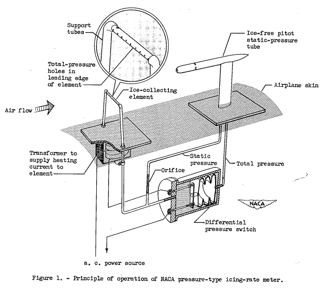
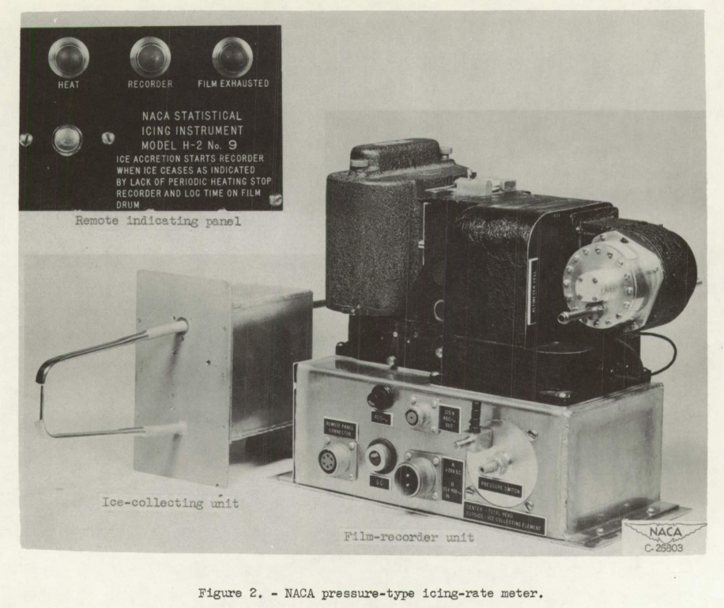
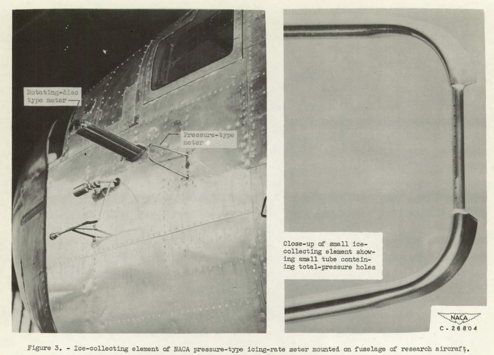
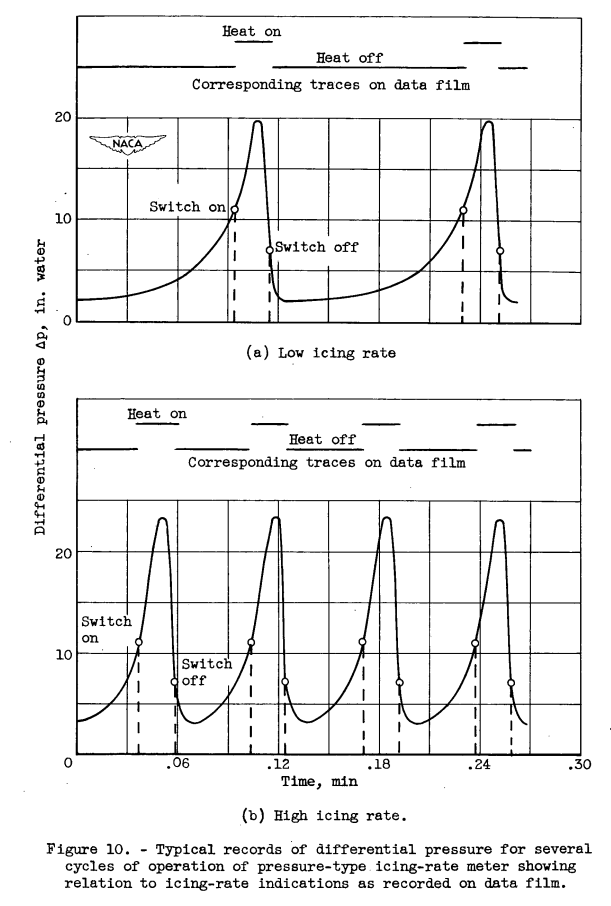
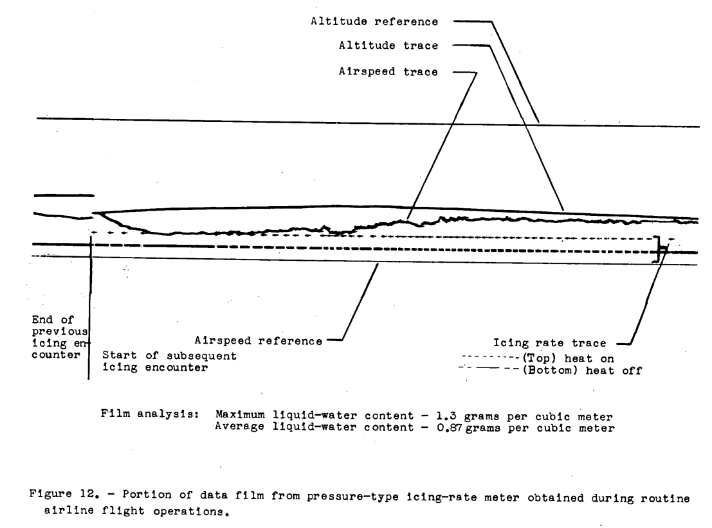

Title: NACA-RM-E51E16  
Date: 2023-01-03 12:00  
Category: NACA  
tags: instruments  

### _"A measure of the concentration of liquid water in a supercooled cloud is of considerable value in determining the severity of aircraft icing conditions"_  

# "A Simplified Instrument for Recording and Indicating Frequency and Intensity of Icing Conditions Encountered in Flight"  
[^1] 

## Summary  

An instrument for automatically recording the occurrence of icing and liquid water content values is described.  

## Key Points  

1. The instrument relied on the plugging of holes exposed to icing, which made a measurable pressure difference.  
2. The instrument was cyclically deiced with electric heating.  
3. Data was recorded on film that was later processed.  
4. The instrument was used on numerous flights.  

## Abstract  

>An instrument for recording and indicating the frequency and
intensity of aircraft icing conditions has been developed by the NACA
Lewis laboratory to obtain statistical icing data over world-wide air
routes during routine airline operations. An accumulation of data of
this type is needed to provide pertinent meteorological information
necessary for the optimum design of ice-protection systems.
The operation of the instrument is based on the creation of a
differential pressure between an ice-free total-pressure system and a
total-pressure system in which small total-pressure holes vented to
static pressure are allowed to plug with ice accretion. At a fixed
value of ice accretion, the differential pressure operates an electrical 
heater that de-ices the total-pressure holes. The resulting
cyclic process varies with the intensity of the icing and serves as a
measure of the icing rate. The simplicity of this operating principle
permits automatic operation upon encountering an icing condition, and
relative freedom from maintenance and operating problems. The complete 
unit weighs only 18 pounds. Icing rate, airspeed, and altitude
hours of continuous are recorded on photographic film providing
data. Visual indications of the icing intensity are made available
to the pilot by periodic flashing of a light on the instrument panel.  
>
>The indications of icing rate from the instrument were calibrated
against the rotating-disk type of icing-rate meter. Recorded values
of icing rate and airspeed provide a means of obtaining values of
cloud liquid-water content based on the multicylinder method for
measuring supercooled cloud quantities.

## Discussion  

The publication is succinct, 
and the online version has good quality scanned images.  
I will let it tell its story with selected extracts.  

>OPERATING PRINCIPLE
The instrument operates on differential pressure created when
small total-pressure holes plug with ice accretions, as illustrated in
the sketch of figure 1. The small total-pressure holes in the ice-collecting 
element, which are vented to static pressure through a
small orifice, are balanced against a nonvented, ice-free total
pressure in a differential pressure switch. When these small total-pressure 
holes plug from ice accretion, the pressure in the corresponding side 
of the pressure switch approaches static by bleeding
through the static orifice and a differential pressure is created
between the iced and ice-free systems. Continuous operation is
obtained by allowing the differential-pressure switch to energize
an electric heater that de-ices the ice-plugged total-pressure
holes. The pressures in the two systems then tend to equalize, opening
the pressure switch and allowing the cycle to be repeated. The heat-off 
time of this cyclic process is used as a measure of the period of
time required to plug the holes. This period is a function of the rate
at which ice accumulates on the element containing the holes because
the amount of ice accretion required for plugging is a constant value.
The duration of the heat-off period is calibrated against a measured
icing rate in order to obtain a measure of icing rate from the heat-off 
period. The rate of icing thus measured is a function of cloud
liquid-water content and air velocity. In order to obtain cloud
liquid-water content, the air velocity is measured simultaneously with
the heat-off or icing period.  
  

>An NACA flight-type film recorder is used to record continuously
the duration of the heat-off or icing period, the heat-on or de-icing
period, the indicated airspeed, and the altitude. The recorder is
semiautomatic in that the initial plugging starts the recorder, which
operates continuously until turned off manually after an icing encounter. 
The recorder may be supplemented with a remote panel equipped
with indicating lights that can be installed in the pilots' compartment
for visual indications of the icing intensity and the operation of the
recorder during flight. An icing encounter is indicated by periodic
flashing of a light parallel with the heating circuit; thus, the time
between flashes can be used as an indication of the icing intensity.
Another light on this panel indicates the operation of the recorder,
and a third light indicates when the recording film is exhausted.  
  

>The ice-collecting unit (close-up in fig. 3) is a "U"-shape tubular
construction with 10 small total-pressure holes (0.014-in. diain.)
drilled in the side of a small phosphor-bronze tube(0.100-in. diam.)
attached at the bottom of the "U". The multiple number of holes is
considered necessary to prevent erratic plugging from large droplets or
foreign material. The larger tubes of nickel alloy at the sides of the
"U" support this small tube about 6 inches from a brass plate that
fastens to the skin of the aircraft. Figure 3 shows this unit mounted
on the left side of the fuselage ahead of the propeller plane of a
twin-engine research aircraft. The "U"-shape unit is mounted normal to
the air stream with the total-pressure holes in the small tube on the
upstream side.  
  

>The pressure-type meter was calibrated in the tunnel for rate of
Icing by varying the liquid-water content and the velocity of the air
stream. Both meters were mounted so that the ice-collecting elements
were within 2 Inches of each other to assure the same icing conditions
for both instruments. The results of this calibration (fig. 7) show
that the icing period or heat-off time varies between 0.21 to 0.07 minute 
(13 to 4 sec) for an icing-rate range of 0.055 to 0.22 inch per
minute (3 to 13 in./hr). The variation of slope of the calibration
curve provides the greatest reading accuracy at the low icing rates,
but the accuracy decreases as the icing rate becomes greater to a
point where the icing period becomes almost insensitive to large changes
of icing rate. The maximum limit of operation occurs at the point where
the heat must stay on continuously to keep the total-pressure holes ice-free. 
The reading error varies from ±2 percent at the low icing rate to
±20 percent at the measurable high icing rates. The reading accuracy of
the disk-type meter varies between 12 percent at the low icing rate to
±6 percent at the high icing rate, thus providing a total maximum error
in the calibration of about ±14 percent at the low icing rates to
±26 percent at the high icing rates. No effects of air temperature on
the icing-rate calibration were noted between 0° and 20° F.  
  

>The differential-pressure records shown in figure 10 were taken
at both a high and low icing rate to show the variation in the
differential-pressure changes at each condition and the resulting
traces that are recorded on the standard data film. The length of the
heat-off line can be used as a direct measure of the icing rate
provided the speed of the film travel is known. The heat-on or de-icing 
period does not change appreciably with icing rate but is
affected more by air temperature and velocity.  
  

>TYPICAL DATA
After the development and calibration of the instrument, arrangements 
were made to install several of these units on commercial airliners. 
Part of a typical data film obtained from an icing condition
encountered during a routine airline flight is shown in figure 12.
Airspeed, altitude, icing rate, and duration of the icing condition
can be obtained from this record. With notations by the pilot of
time, data, temperature, and geographic location, this record gives
sufficient information for a complete meteorological analysis of the
particular icing encounter. Values of liquid-water content can be
obtained from the icing rate said airspeed records using the calibration
previously, described. Each film roll usually contains several encounters 
in sequence, which must be correlated with the pilot's log.  
  

## Conclusions  

>An instrument for recording and indicating the frequency and
intensity of aircraft icing conditions has been developed by the NACA
Lewis laboratory for obtaining statistical icing data over world-wide
air routes from routine airline operations. The instrument operates on
differential pressure created when small total-pressure holes in a
static-pressure vented system, which is balanced against an ice-free
total-pressure system, are allowed to plug with ice accretions.  
>
>The features that make the instrument desirable for use during
routine airline operations are: (1) simplicity of operation,
(2) freedom from maintenance and operating problems, (3) automatic
operation upon encountering an icing condition, (4) visual indications
of icing intensity available to the pilot, (5) total weight of
18 pounds, and (6) continuous recorded data. Recorded values of icing
rate and airspeed provide a means of calculating cloud liquid-water
content based on the multicylinder method for measuring supercooled
cloud quantities.  

The instrument was later used, and described in NASA TM 83564 [^4],
as the "Pressure-type Icing Rate and Accretion Meter (PIRAM)".  
<!--(see [Porter Perkins Ice Shapes and Ice Protection]({filename}Porter%20Perkins%20Ice%20Shapes%20and%20Ice%20Protection.md)),-->

The instrument was used to survey icing conditions along commercial airline routes [^2], [^3]. 
Data from hundreds of flights where measured. 
However, this seemingly valuable data saw surprisingly limited use, 
something that we will soon look at in the 
"Conclusions of the Meteorological Instruments Thread". 

## Citations  

NACA-RM-E51E16 cites three publications.  

- Vonnegut, B., Cunningham, R. M., and Katz, R. E.: Instruments for Measuring Atmospheric Factors Related to Ice Formation on Airplanes. De-Icing Res. Lab., Dept. Meteorology, M.I.T., April 1946.  
- Clark, Victor F.: The Multicylinder Method. The Mount Washington Monthly Res. Bull., vol. II, no. 6, June 1946.  
- Langmuir, Irving, and Blodgett, Katherine B.: A Mathematical Investigation of Water Droplet Trajectories. Tech. Rep. No. 5418, Air Materiel Command, AAF, Feb. 19, 1946. (Contract No. W-33-038-ac-9151 with General Electric Co.)  

NACA-RM-E51E16 is cited by 10 publications in the NACA Icing Publications Database [^5]:  

- Brun, Rinaldo J., Serafini, John S., and Moshos, George J.: Impingement of Water Droplets on an NACA 651-212 Airfoil at an Angle of Attack of 4°. NACA-RM-E52B12, 1952. [ntrs.nasa.gov](https://ntrs.nasa.gov/citations/19810068679)  
- Perkins, Porter J.: Preliminary Survey of Icing Conditions Measured During Routine Transcontinental Airline Operation. NACA-RM-E52J06, 1952. [ntrs.nasa.gov](https://ntrs.nasa.gov/citations/19810068855)
- Gray, Vernon H., and von Glahn, Uwe H.: Effect of Ice and Frost Formations on Drag of NACA 651-212 Airfoil for Various Modes of Thermal Ice Protection. NACA-TN-2962, 1953. [ntrs.nasa.gov](https://ntrs.nasa.gov/citations/19810068586)  
- Dorsch, Robert G., and Brun, Rinaldo J.: Variation of Local Liquid-Water Concentration about an Ellipsoid of Fineness Ratio 5 Moving in a Droplet Field. NACA-TN-3153, 1954. [ntrs.nasa.gov](https://ntrs.nasa.gov/citations/19810068690)  
- Neel, Carr B., Jr.: A Heated-Wire Liquid-Water-Content Instrument and Results of Initial Flight Tests in Icing Conditions. NACA-RM-A54I23, 1955. [ntrs.nasa.gov](https://ntrs.nasa.gov/citations/19810068734)  
- Perkins, Porter J.: Statistical Survey of Icing Data Measured on Scheduled Airline Flights over the United States and Canada from November 1951 to June 1952. NACA-RM-E55F28a, 1955. [ntrs.nasa.gov](https://ntrs.nasa.gov/citations/19930088875)
- Bowden, Dean T.: Effect of Pneumatic De-Icers and Ice Formations on Aerodynamic Characteristics of an Airfoil. NACA-TN-3564, 1956. [ntrs.nasa.gov](https://ntrs.nasa.gov/citations/19930084294)  
- Hacker, Paul T.: An Oil-Stream Photomicrographic Aeroscope for Obtaining Cloud Liquid-Water Content and Droplet Size Distribution in Flight. NACA-TN-3592, 1956. [ntrs.nasa.gov](https://ntrs.nasa.gov/citations/19810068735)  
- Gray, Vernon H., and von Glahn, Uwe H.: Aerodynamic Effects Caused by Icing of an Unswept NACA 65A004 Airfoil. NACA-TN-4155, 1958. [ntrs.nasa.gov](https://ntrs.nasa.gov/citations/19810068589)  
- Perkins, Porter J.: Icing Frequencies Experienced During Climb and Descent by Fighter-Interceptor Aircraft. NACA-TN-4314, 1958. [ntrs.nasa.gov](https://ntrs.nasa.gov/citations/19810068857)  

An online search found NACA-RM-E51E16 cited by 18 publications [^6].  

##Notes

[^1]: Perkins, Porter J., McCullough, Stuart, and Lewis, Ralph D.: A Simplified Instrument for Recording and Indicating Frequency and Intensity of Icing Conditions Encountered in Flight. NACA-RM-E51E16, 1951. [ntrs.nasa.gov](https://ntrs.nasa.gov/citations/19810068729)  
[^2]: Perkins, Porter J.: Preliminary Survey of Icing Conditions Measured During Routine Transcontinental Airline Operation. NACA-RM-E52J06, 1952. [ntrs.nasa.gov](https://ntrs.nasa.gov/citations/19810068855)
[^3]: Perkins, Porter J.: Statistical Survey of Icing Data Measured on Scheduled Airline Flights over the United States and Canada from November 1951 to June 1952. NACA-RM-E55F28a, 1955. [ntrs.nasa.gov](https://ntrs.nasa.gov/citations/19930088875)
[^4]: Ranaudo, R., J.; Mikkelsen, K. L.; McKnight, R. C. and Perkins, P. J. Jr., "Performance Degradation of a Typical Twin Engine Commuter Type Aircraft in Measured Natural Icing Conditions," NASA TM 83564 and AIAA-84-0179, 1984. [ntrs.nasa.gov](https://ntrs.nasa.gov/citations/19840005105)  
[^5]: [NACA Icing Publications Database]({filename}naca%20icing%20publications%20database.md)  
[^6]: [scholar.google.com](https://scholar.google.com/scholar?hl=en&as_sdt=0%2C48&q=NACA-RM-E51E16&btnG=)     
