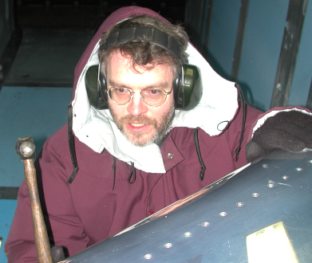

title: One Year Review  
Category: NACA  
status: draft  

###_"... Before attacking what appeared to be a new icing problem we should study the icing work of the 1940's and 50's."_ [^1]  

#One year of "Blast from the Past: NACA Icing Publications"  

  
_[Making delicate adjustments in an icing wind tunnel.]_  

I made 50+ posts in the past 12 months.   

I am thankful for the continuing level of interest shown in the topic.  

##Progress on the 132 NACA Icing Publications  

I set out to review the 132 publications in the 
["Selected Bibilography of NACA-NASA Aircraft Icing Publications"]({filename}/The Historical Selected Bibliography of NACA-NASA Icing Publications.md).  

Out of 132 publications, 
I wrote 33 reviews.   
[links to the reviews are included in the link above.]  

There is still a long way to go!    

Some areas have had more coverage than others:  

- Meteorology of Icing Clouds  
    2 out of 14  
- Fundamental Properties of Water  
    2 out of 7 (NACA-TN-3024 reviewed twice)  
- Meteorological Instruments  
    10 out of 15 (NACA-RM-A9C09 reviewed twice)  
- Impingement of Cloud Droplets  
    5 out of 25 (NACA-TR-1215 reviewed twice)  
- Propeller Ice Protection  
    0 out of 11  
- Induction System Ice Protection  
    0 out of 3  
- Wing Ice Protection  
    3 out of 13  
- Performance Penalties  
    6 out of 8  
- Windshield Ice Protection  
    0 out of 2  
- Cooling Fan Ice Protection  
    0 out of 1  
- Radome Ice Protection  
    0 out of 2  
- Antenna icing  
    0 out of 2  
- Inlet and Vent Icing Protection  
    0 out of 1  
- Jet Penetration  
    0 out of 5  
- Heat Transfer  
    4 out of 7  
- Miscellaneous  
    2 out of 8    
    
##Other icing publications reviews  
    
Some of my former managers might have told me I was "off message"
for not getting more of the 132 publications covered, 
but I have also reviewed some important, contemporary publications.  

The review of ["Mathematical Investigation of Water Droplet Trajectories"]({filename}Mathematical Investigation of Water Droplet Trajectories.md) 
covered one of the most cited icing publications of all time, 
and spawned five more reviews to cover Langmuir's work in more detail.  
>- [A Detailed Comparison of Water Drop Impingement Calculations]({filename}A Detailed Comparison of NACA-TN-779 and Mathematical Investigation of Water Droplet Trajectories.md)  
>- [A Langmuir B drop size distribution is (almost) a normal distribution]({filename}A Langmuir B distribution is almost a normal distribution.md)  
>- [Super-Cooled Water Droplets in Rising Currents of Cold Saturated Air]({filename}Langmuir Rising Currents.md)  
>- [Implementation of cylinder impingement correlations in Python]({filename}Implementation of cylinder impingement correlations in Python.md)  
>- [Implementation of multicylinder calculations in Python]({filename}Implementation of multicylinders cylinders.md)  

The review of [B. L. Messinger, "Equilibrium Temperature of an Unheated Icing Surface as a Function of Airspeed"]({filename}messinger.md) 
covered one of the most cited icing publications of all time 
(and was the most viewed of my posts, with 4000+ views).  

Four topic threads had Conclusions posts that summarized the thread, 
and traced uses to the current era.  
>- [Conclusions of the Icing on Cylinders Thread]({filename}cylinder_thread_wrap_up.md)  
>- [Conclusions of the Thermodynamics Thread]({filename}thermodynamics_thread_wrap_up.md)  
>- [Conclusions of the Ice Shapes and Their Effects Thread]({filename}conclusions_of_the_ice_shapes_thread.md)  
>- [Conclusions of the Meteorological Instruments Thread]({filename}conclusions_of_the_instruments_thread.md)  

The [Icing Wind Tunnel Test Thread]({filename}icing_wind_tunnel_test.md) 
covered something that the 132 publications did not directly include, 
the NACA-era Lewis Icing Research Tunnel (IRT) and other tunnels, and their uses. 
This included 11 reviews, several from the post-NACA era.  

The [Water drop evaporation thread]({filename}water_drop_evaporation_thread.md) 
had four reviews, but only one from the 132 NACA icing publications.   

The [Diversions]({filename}diversions.md) had three reviews of post-NACA publications.  
>- [The Greatest Thing That You Have (Probably) Never Read: AC 00-6A]({filename}ac00-6a.md)  
>- [The Greatest Thing That You Have (Probably) Never Read: 1969 Aircraft Ice Protection Report of Symposium]({filename}1969 Aircraft Ice Protection Report of Symposium.md)   
>- [The Greatest Thing That You Have (Probably) Never Read: Wilder, Ramon W.: "Techniques used to determine Artificial Ice Shapes and Ice Shedding, Characteristics of Unprotected Airfoil Surfaces"]({filename}wilder.md)    

Three of the 132 NACA icing publications were reviewed twice (in different threads).  

I also took of three months off during the year 
(a "vacation" from this hobby; 
when one is retired one can do that).  

So, I view 33 reviews as about the most that is sustainable 
when "working" at a hobby level.  

##The Future  

I am not sure that I will ever cover all 132 publications, 
but I do plan to continue this year.  

I have a few criteria for what to review:  

1. Am I interested now?   
2. Is this on the list of things I wish that I had known earlier in my career?  
3. Is there enough material for a topic "thread"?  

And there are "bonus points" for good images.  

There are many worthy publications that may not pass through the criteria above.  

Candidates for future topic threads include:  

- Ice Protection Systems    
- Ice Protection Tests  
- Meteorology of Icing Clouds
- The University of Michigan 1953 Airplane Icing Information Course    

And I am open to suggestions.  
    
##Notes  

[^1]: ["Selected Bibilography of NACA-NASA Aircraft Icing Publications"]({filename}/The Historical Selected Bibliography of NACA-NASA Icing Publications.md)  
