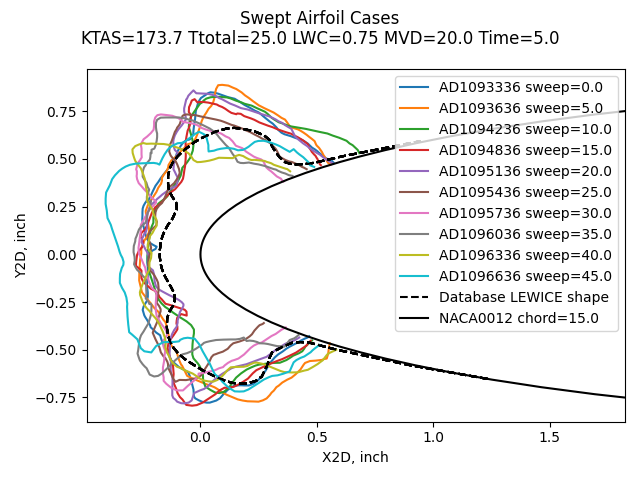
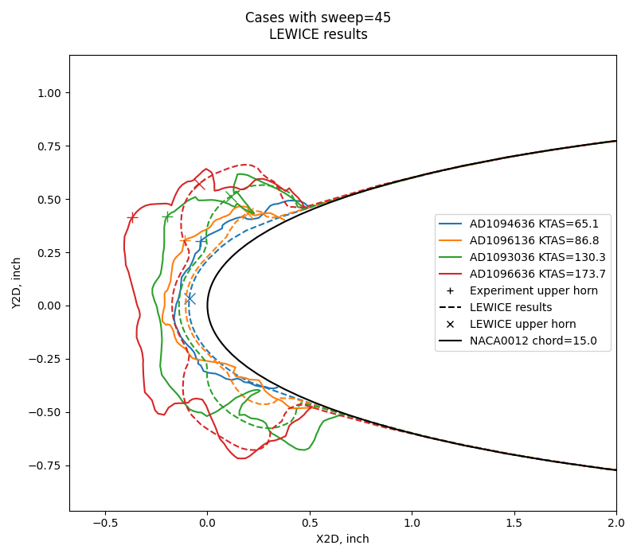
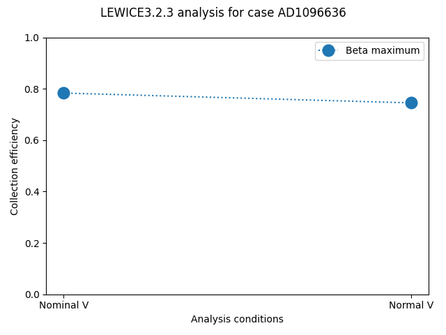
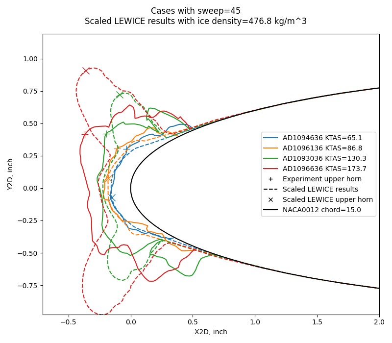
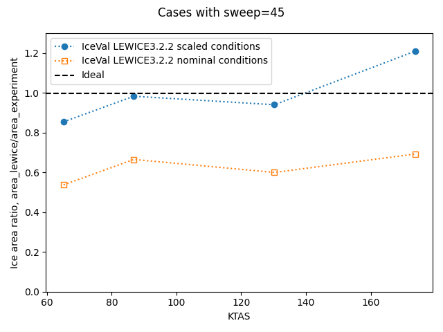
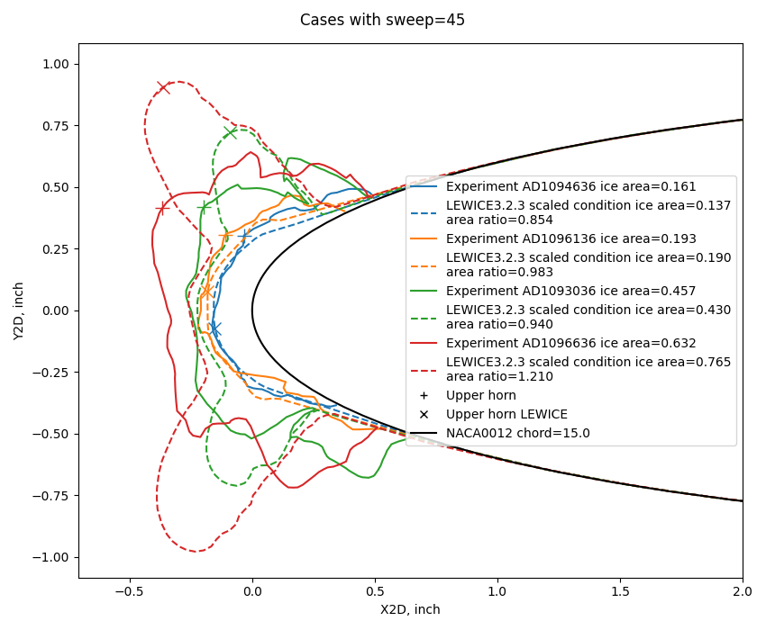
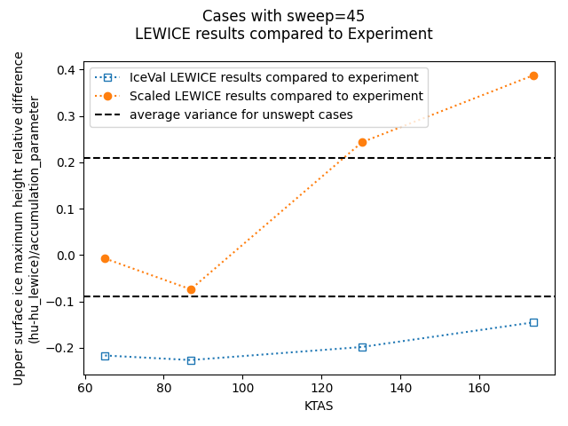
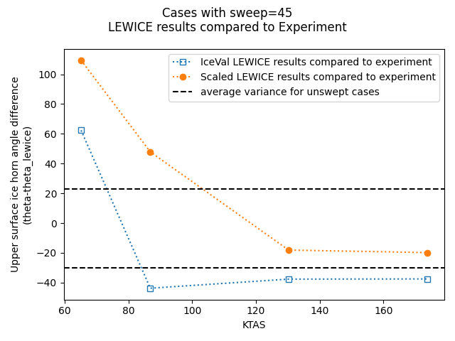

title: Swept Airfoil Cases in IceVal  
Date: 2026-05-18 12:00  
status: draft  
tags: LEWICE, ice shapes, NASA, IceVal

### _"Use of these relationships allows the direct determination of ice shapes adjusted for any given icing and flight condition as well as for size and sweep of the airfoil"_ [^1]  

<p style="font-size:50px;color:red">DRAFT</p>

   
_<div style="text-align: center;">Experimental ice shapes compared to a LEWICE analysis.</div>_  

## Summary  

There are 41 swept airfoil cases in the IceVal database [^2].  

LEWICE analysis for these cases tends to produce ice shapes that are consistently too small
compared to experiment.  

Empirically derived adjustments to the inputs to LEWICE are discussed that improve the ice shape match by some measures.  

The analysis of ice shapes on swept wing is an area of ongoing research.  

## Introduction  

The quote at the top from Wilder briefly describes the
the empirically based analytical method he described in [^1]. 
However, it is not directly applicable to airfoils other than the ones he considered, 
which had dozens of icing tunnel ice shapes tests each. 
For more details on Wilder's method, see [Wilder]({filename}wilder.md).  

LEWICE [^3], and other codes, 
offer potentially more widely applicable methods of ice shape prediction in swept airfoils.  

In the IceVal database, there are 41 cases with wing leading edge sweep values other than zero, 
ranging from 5 to 45 degrees. They were all for the NACA0012 airfoil with a 15-inch chord. 
All used LWC=0.75 g/m^3, MVD=20, and Ttotal=25F, and all but one case used a icing spray time of 5 minutes. 
Four airspeeds were included in the range of conditions.  

Here are the conditions at the highest airspeed (173.7 KTAS):  

  

The same LEWICE shape corresponds to each experimental shape, 
as all conditions are the same except for sweep, 
and LEWICE has no input for leading edge sweep that could result in a different ice shape.   

For the 45-degree sweep cases, the four different airspeed values result in different ice shapes. 
The LEWICE results do not appear to be particularly close to the experimental results. 
The ice cross-section area is noticeably smaller for LEWICE than for the experimental results.  

  

## 2D water catch approximations for swept wings  

There have been methods to account for sweep in 2D analysis. 
One of the earliest was NACA-TN-2931 [^4]. 
A cylinder that was swept relative to the airstream was analyzed 
by decomposing the velocity vector into normal and tangential components, 
and the normal velocity was used for impingement analysis.  

  
_Public Domain image from NACA-TN-2931._  

It was realized that streamlines might not follow the idealized, normal path.  

  
_Public Domain image from NACA-TN-2931._  

Wilder described a method for accounting for sweep in calculating water catch rates 
in a form of the continuity equation:  

>Thus, a theoretical ice shape for rime ice can be estimated by calculating
the local water catch for various positions in the impingement area by:
```text
w_beta = 0.38 * beta * V * cos(sweep) * w           (2)

where 
      beta = local water catch efficiency
      V = airspeed, knots
      sweep = airfoil sweep angle
      w = cloud liquid water content, g/m^3
```

Note that mathematically it does not matter if we consider the terms to be either 
"(V * cos(sweep)) * LWC" or "V * (cos(sweep) * LWC)", the product is the same. 
Conceptually, the first alternative uses the normal velocity, 
while the second one uses an adjusted LWC value.  

The LEWICE runs in the IceVal database used the nominal airspeed and LWC values, 
so the water catch rates.

Conveniently, LEWICE has airspeed and LWC as inputs, 
so we can select one or the other to adjust.

It is desirable to not adjust the input velocity, 
as this changes the aero-thermodynamic state 
(total temperature relative to static temperature, and other factors). 

The LWC value can be adjusted, as it is the impingement rate (w_beta in (2) above) 
that matters for the aero-thermodynamic state and similarity, 
not the individual components of the equation. 

The effect on the water catch efficiency is small between results using the nominal
airspeed and the normal airspeed for the 45 degree sweep case at the highest airspeed 
were assessed using LEWICE3.2.3:  

  

That the difference is that small is expected, as may be seen from a Beta curve in the Aircraft Icing Handbook [^5] for the NACA0012 airfoil:  

  
 
Ko is the droplet acceleration parameter, and is roughly proportional to V^1/3.  

  

A 29% reduction in airspeed for using a normal velocity translates to ~10% reduction in Ko, 
and a resulting ~5% difference in Beta. 
Thus, the difference in Beta values was tacitly treated as a trivial effect in Wilder.  

The two beta values for the nominal V and normal V are essentially bounding values of 
the reasonable, expected range. 
So, little to no error results from either assumption for determining water catch efficiency. 

The water catch rate is the product of Beta, airspeed, and LWC that we saw above in Wilder's equation (2). 
If the nominal airspeed and LWC values are used, like in the IceVal LEWICE values, 
the rate is higher than either of the values considered above 
(Nominal V with Scaled LWC, Normal V with nominal LWC). 
As noted above, it is preferred to adjust LWC, so that is the approach used here.
(There are similar results if we look at Em and total water catch rates, 
but for brevity those are not detailed here.)  

The use in IceVal of the nominal V and LWC values results in a higher (too high, by about 29%) 
water catch rate than the two methods discussed above.  

When the LWC scaling is implemented, the results do not appear to be improved.  

  

However, there is another effect, apparent ice density, 
that we will look at next.  


## Apparent Ice Density  

A second important factor is apparent ice density. 
For unswept airfoil cases, the LEWICE results averaged to 
reasonable ice height variations from experiment using the nominal ice density value of 917 g/m^3. 
However, this is not the case for swept airfoils. 
As we saw above, the maximum ice heights were consistently too small.  

Ice formed on a swept wing leading edge commonly has a "scalloped" or "lobster tail" appearance, 
with many internal voids.  

  

_Public Domain image from AD690469 [^1]._  

For unswept cases in the IceVal database, 
LEWICE did a good job of matching ice area, with an 18% average difference from experiment [^6]:  

  
_Public Domain image from ._  

However, as seen above, for the swept cases the LEWICE area is visibly less than the experimental area. 

The apparent ice density can be used to account for this.  

If an outermost 2D profile is traced around the ice shape, 
the apparent area will be greater than that actually occupied by ice. 
If the ice mass is measured, the apparent ice density can be calculated: 

```text
apparent ice density = mass of ice / (profile area * span length)
```

To match the ice area between experiment and analysis for swept cases, 
it is often necessary to adjust the ice density used in the analysis. 
This is an approach used by some of the Ice Prediction Workshop presentations [^7], 
for either 2D or 3D codes.  

The ice accretion analysis is a thermodynamic balance that calculates the mass rate of formation of ice. 
That is turned into an ice thickness with an assumed ice density equal to the bulk ice density of 917 kg/m^3. 
If a lower ice density is used, the ice thickness and area is increased. 

LEWICE does not have an input for ice density, the default 917 value is hard-coded in. 
To implement an apparent ice density, the icing simulation time is increased 
proportionally to the density ratio.  

```text
simulation time = spray time * 917 kg/m^3 / (apparent ice density)
```

The "scaled" method here implements the LWC adjustment noted above and the 
time scaling by apparent ice density.  

Adjusting simulation time does not alter the instantaneous thermodynamic state. 
However, there are side effects in LEWICE of using adjusted time. 
The calculated number of time steps (LEWICE manual equation 2) 
are increased relative to nominal conditions. 
This has an effect on the final ice shape. 
The reported total mass is larger than nominal by the density ratio, 
as LEWICE uses the 917 kg/m^3 ice density internally.  

The IceVal database does not list a measured ice mass for these cases. 
For the cases with a 45 degree sweep, apparent ice densities were assumed.
LEWICE was run in the multi-time step ice shape mode (ITIMFL=1).
By iteration it was found that an apparent ice density of 476.8 kg/m^3 
averaged out to an ice area match for the four cases.  

  

For the ice shape appearance, the thinner, lower airspeed cases are a good match; 
the other two cases less so.  
  

The apparent mixed results are also reflected in the ice height comparisons and 
horn angle comparisons.  

  

  

## Conclusions  

While the sample size is small (four cases at 45 degree sweep), 
it is perhaps expected that two of the four points are outside the expected variance of all 
IceVal cases (3000+) 
for these two measures as any other four randomly selected cases might have a similar result. 

I view the scaled method as useful, 
as it is at worst conservative for horn heights, 
and does not result in ice shapes that are noticeably too thin as with the analysis using nominal conditions.  

An obvious draw-back is that you need empirical data to base the adjustments on. 
In the IPW presentations and my own experience several values have been used, 
and the best fit values vary by airfoil and sweep values, often not in an intuitive way. 
That said, the 476.8 kg/m^3 value used here is in the range of values I have seen used, 
and not a notable outlier.   

Ice shapes in swept airfoils continues to be actively investigated as part of the 
Ice Prediction Workshop [^7].  

## Related  

This post is part of the ["6000 Ice Shapes - the IceVal DatAssistant"]({filename}iceval.md) thread.  

## Notes  

[^1]: Wilder, Ramon W.: "Techniques used to determine Artificial Ice Shapes and Ice Shedding, Characteristics of Unprotected Airfoil Surfaces" in Anon., "Aircraft Ice Protection", the report of a symposium held April 28-30, 1969, by the FAA Flight Standards Service; Federal Aviation Administration, 800 Independence Ave., S.W., Washington, DC 20590. [apps.dtic.mil](https://apps.dtic.mil/sti/pdfs/AD0690469.pdf).  
[^2]: Levinson, Laurie, and William Wright. "IceVal DatAssistant-An Interactive, Automated Icing Data Management System." 46th AIAA Aerospace Sciences Meeting and Exhibit. 2008. [NASA Report Number: E-16236](https://ntrs.nasa.gov/citations/20070031804)   
The software is available at [software.nasa.gov](https://software.nasa.gov/software/LEW-18343-1)   
[^3]: William B. Wright, User's Manual for LEWICE Version 3.2 
[NASA/CR—2008-214255](https://ntrs.nasa.gov/citations/20080048307)  
The software is available at [software.nasa.gov](https://software.nasa.gov/software/LEW-18573-1)  
[^4]: Dorsch, Robert G., and Brun, Rinaldo J.: A Method for Determining Cloud-Droplet Impingement on Swept Wings. NACA-TN-2931, 1953. [ntrs.nasa.gov](https://ntrs.nasa.gov/citations/19810068687)  
[^5]: “Aircraft Icing Handbook Volume 1.” DOT/FAA/CT-88/8-1 (1991) [apps.dtic.mil](https://apps.dtic.mil/sti/pdfs/ADA238039.pdf).  
Also note that there was a perhaps little known update in 1993 (that did not affect the pages of interest herein): [apps.dtic.mil](https://apps.dtic.mil/sti/pdfs/ADA276499.pdf).  
[^6]: Wright, William, Mark Potapczuk, and Laurie Levinson. "Comparison of LEWICE and GlennICE in the SLD Regime." 46th AIAA aerospace sciences meeting and exhibit. 2008. [NACA/CR-2008-215174](https://ntrs.nasa.gov/citations/20080041518)  
[^7]: 
[Ice Prediction Workshop](https://icepredictionworkshop.wordpress.com) "The main goal of these workshops is to assess state-of-the-art of icing prediction tools with 2D and 3D experimental data. We aim to provide an impartial forum to evaluating the effectiveness of icing methods and to identify the areas needing additional research and development."  
 


