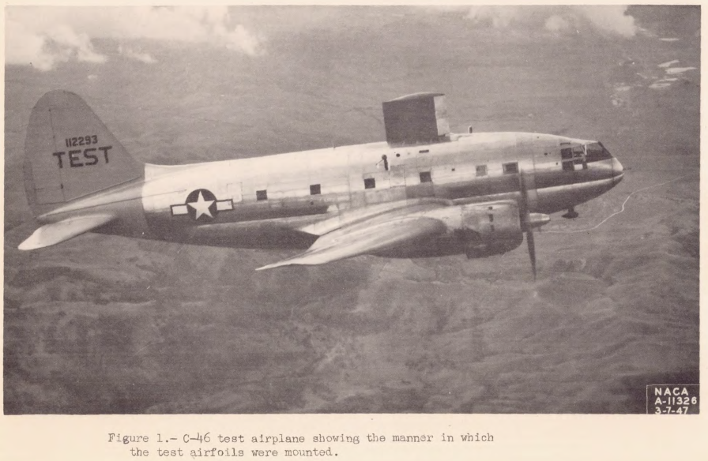
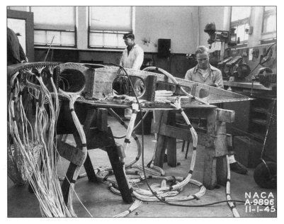
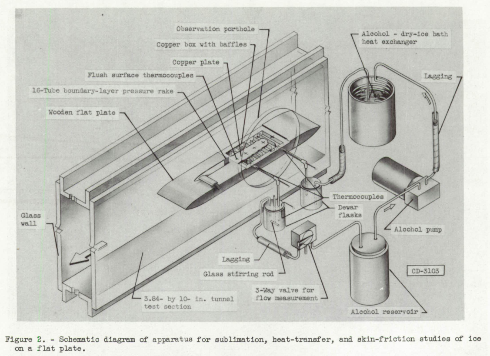

Title: Icing Thermodynamics   
Category: NACA  
tags: thermodynamics  

#Icing Thermodynamics Thread 

This thread will focus on the use of thermodynamic heat and mass balance for icing and ice protection calculations. 

There may be some overlap with ice protection systems, 
but the systems will not be detailed herein.  

###NACA-ARR-5G13, [Kinetic Temperature of Wet Surfaces A Method of Calculating the Amount of Alcohol Required to Prevent Ice, and the Derivation of the Psychrometric Equation."]({filename}NACA-ARR-5G13.md) 
> Psychrometric equations are presented to calculate the thermal effects of 
evaporation from wet surfaces.  

###NACA-TR-831, [An Analysis of the Dissipation of Heat in Conditions of Icing from a Section of the Wing of the C-46 Airplane]({filename}NACA-TR-831.md) 
> Two dimensional heat balance equations for ice protection are detailed.  

###NACA-TN-1472, [The Calculation of the Heat Required for Wing Thermal Ice Prevention in Specified Icing Conditions]({filename}NACA-TN-1472.md)
> Natural icing flight tests with an instrumented test airfoil are compared to 2D thermodynamic calculations.  

###[Ludlam, F. H.: The Heat Economy of a Rimed Cylinder]({filename}ludlam.md)   
> Various "Ludlam Limits" have been implemented, but they produce different results.  

###[Messinger, B. L.: “Equilibrium Temperature of an Unheated Icing Surface as a Function of Airspeed”]({filename}messinger.md)  
> The term "freezing fraction" is defined.  

###NACA-TN-2799, [Simple Graphical Solution of Heat Transfer and Evaporation from Surface Heated to Prevent Icing]({filename}NACA-TN-2799.md)  
> Simplified ice protection equations allow graphical solutions.  

<!--
###[NACA-TN-2861, Analytical Investigation of Icing Limit for Diamond Shaped Airfoil in Transonic and Supersonic Flow]({filename}NACA-TN-2914.md), and
###[NACA-TN-2914, A Method for Rapid Determination of the Icing Limit of a Body in Terms of the Stream Conditions]({filename}NACA-TN-2914.md)
> The warmest ambient temperature at which ice can accumulate is calculated.  
-->
##Publications to review:  

Callaghan, Edmund E., and Serafini, John S.: A Method for Rapid Determination of the Icing Limit of a Body in Terms of the Stream Conditions. NACA-TN-2914, 1953.  
> The warmest ambient temperature at which ice can accumulate is calculated.  

Fraser, D., Rusk, C. K., and Baxter, D.: Thermodynamic Limitations of Ice Accretion Instruments, 1953. 
> The term "freezing fraction" is defined (but probably not the one that you expected).  

Lowell, Herman H.: Maximum Evaporation Rates of Water Droplets Approaching Obstacles the Atmosphere under Icing Conditions. NACA-TN-3024, 1953. 
> Less that 1% of drops evaporate approaching an obstacle for most cases. 

Callaghan, Edmund E.: Analogy Between Mass and Heat Transfer with Turbulent Flow. NACA-TN-3045, 1953. 
> A detailed analysis of what the ratio of heat transfer to mass transfer might be. 

 

Coles, Willard D., and Ruggeri, Robert S.: Experimental Investigation of Sublimation of Ice at Subsonic and Supersonic Speeds and its Relation to Heat Transfer. NACA-TN-3104, 1954. 
> Sublimation rates at Mach 1.3 are measured. 

 

Brun, Rinaldo J., Lewis, William, Perkins, Porter J., and Serafini, John S.: Impingement of Cloud Droplets and Procedure for Measuring Liquid-Water Content and Droplet Sizes in Supercooled Clouds by Rotating Multicylinder Method. NACA-TR-1215, 1955. (Supersedes NACA TN’s 2903, 2904, and NACA-RM-E53D23)  

Coles, Willard D.: Icing Limit and Wet-Surface Temperature Variation for Two Airfoil Shapes under Simulate High-Speed Flight Conditions. NACA-TN-3396, 1955. 

Bowden, D. T., Gensemer, A. E., and Speen, C. A.: Engineering Summary of Airframe Icing Technical Data. Federal Aviation Agency, FAA-ADS-4, 1964. 

