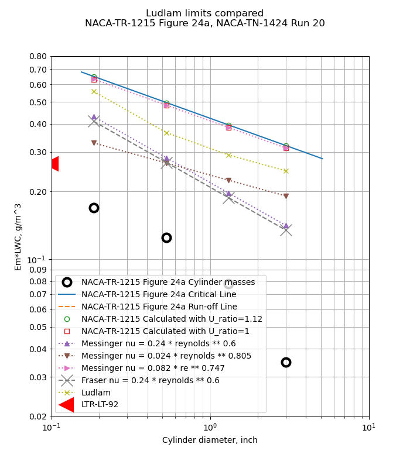
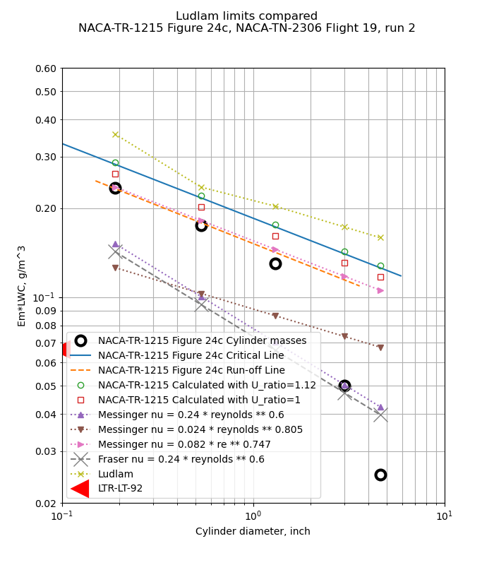

Title: Conclusions of the Icing Thermodynamics Thread   
Category: NACA  
tags: thermodynamics  
status: draft  

.](images/messinger/Figure1.png) 
> Figure 1. Modes of energy transfer for an unheated airfoil in icing conditions. [^1]

#Conclusions of the Icing Thermodynamics Thread 

##Summary  
Data from the post-NACA era are used to resolve open questions 

##Key points
1. The Icing Thermodynamics thread is summarized
2. Post-NACA era data is used to resolve some open questions.
3. NACA era data that are still used today are summarized

##Discussion

###Review of the Icing Thermodynamics thread so far

In the Icing Thermodynamics thread, we saw:

- Calculations of wet surface temperatures [NACA-ARR-5G13]({filename}NACA-ARR-5G13.md)  
- Two dimensional heated surface equations for ice protection [NACA-TR-381]({filename}NACA-TR-381.md)  
- Comparisons of natural icing flight data to 2D ice protection calculations [NACA-TN-1472]({filename}NACA-TN-1472.md)
- The "Ludlam limit" for freezing all water impinging [Ludlam, F. H.: The Heat Economy of a Rimed Cylinder]({filename}ludlam.md)  
- The term "freezing fraction" defined [Messinger, B. L.: Equilibrium Temperature of an Unheated Icing Surface as a Function of Airspeed]({filename}messinger.md)  
- Graphical solutions of ice protection equations [Simple Graphical Solution of Heat Transfer and Evaporation from Surface Heated to Prevent Icing]({filename}NACA-TN-2799.md)  
- The warmest ambient temperature at which ice can accumulate [NACA-TN-2861]({filename}NACA-TN-2914.md), and [NACA-TN-2914]({filename}NACA-TN-2914.md)  
- Evidence for "Ludlam limits" for icing instruments [Fraser, D.: Thermodynamic Limitations of Ice Accretion Instruments]({filename}Fraser.md)  
- Less that 1% of water drops evaporate approaching an obstacle [NACA-TN-3024]({filename}NACA-TN-3024.md)  
- Detailed analysis of the ratio of heat transfer to mass transfer [NACA-TN-3045]({filename}NACA-TN-3045.md)  
- Measurements of sublimation rates at Mach 1.3 [NACA-TN-3104]({filename}NACA-TN-3104.md)  
- Measurements and analysis of the "Ludlam limit" for rotating cylinders [NACA-TR-1215]({filename}NACA-TR-1215.md)  
- Experimental verification of the warmest temperature at which ice can accumulate [NACA-TN-3396]({filename}NACA-TN-3396.md)  
- A summary of the NACA-era thermodynamics [FAA-ADS-4](FAA-ADS-4.md)  

And several programs in the Python programming language are available to reproduce the results in several cases [^2]. 

##Open questions

We will look at some data from the post-NACA era to help resolve these questions. 

1. Which of the various "Ludlam limits" is most accurate? 
2. Do calculated freezing fractions correspond to observed values? 

Rotating

  

  

  

  

##Conclusions  

###Influential authors

There was a notable shift in influence from the NACA-era to the post-NACA era. 

J. K. Hardy's publications were highly influential in the NACA-era. 
He either authored or is cited by 10 of the 14 publications in the thread. 
However, Hardy is not often cited in recent publications. 

Messinger's publication [^1] is highly influential in the post-NACA era, 
and is still cited in recent literature, 
but was cited only once in the thread. 
Messinger cited three of Hardy's publications 
and acknowledge Hardy's contributions in the text. 
Perhaps we may view Hardy as still having influence, 
but one layer down in the citations. 

One thing that is common to the NACA-era and the post-NACA era 
is the influence of Langmuir. 
Six of the 14 publications in the thread cite Langmuir. 
Langmuir is still cited in recent publications. 

NACA-ARR-5G13 cites 7 references.

- Hardy, J. K., and Mann, G.: Prediction of the Rate of Formation of Ice, and the Rate of Heating Necessary to Prevent Ice. TN No. Acre. 1010, R. A. E., Aug. 1942. 
- Hardy, J. K.: An Analysis of the Dissipation of Heat in Conditions of Icing from a Section of the Wing of the C-46 Airplane. NACA-TR-831, 1945. (Formerly NACA-ARR-4I11a.) 
- Anon.: Note on Kinetic Heating with Particular Reference to Conditions of Icing. Tech. Note No. 674, R.A.E., June 1942. (NACA Reprint October 1942) 
- Goldstein, S.: Modern Developments in Fluid Dynamics. The Clarendon Press, Oxford, 1938. 
- Squire, H. B.: Heat Transfer Calculation for Aerofoils. NACA-MRR-3E29 (R. A. E., Aero 1783), 1943. 
- Brooks, Donald B.: Psychometric Charts for High and Low Pressures, Misc. Pub. M146, Nat. Bur. of Standards, Jan. 18, 1938. 
- Kimball, Leo B.: Icing Tests of Aircraft-Engine Induction Systems. NACA-WR-W-97, Jan. 1943. 

NACA-TR-831 cites 14 references: 

- Jones, Alun R., and Spies, Ray J., Jr.: An Investigation of a Thermal Ice-Prevention System for a C-46 Cargo Airplane, III - Description of Thermal Ice-Prevention Equipment for Wings, Empennage, and Windshield. NACA-ARR-5A03b, 1945.
- Hardy, J. K., and Mann, G.: Prediction of the Rate of Formation of Ice, and the Rate of Heating Necessary to Prevent Ice. TN No. Acre. 1010, R. A. E., Aug. 1942.
- Hales, K. C., and Mann, G.: Investigation of Wing De-icing By Means of Hot Air. TN No. S. M. E. 255, R. A. E., July 1944.
- Hardy, J. K.: Measurement of Free Water in Cloud Under Conditions of Icing. NACA-ARR-4I11, 1944.
- Ditton Laboratory Staff: Hot Air De-icing — Heat Transfer in the Double Skin. TN No. S. M. E. 208, R. A. E., Jan. 1944.
- Anon.: Note on Kinetic Heating with Particular Reference to Conditions of Icing. Tech. Note No. 674, R.A.E., June 1942. (NACA Reprint October 1942)
- Goldstein, S.: Modern Developments in Fluid Dynamics. The Clarendon Press, Oxford, 1938.
- Dorsey, N. Ernest: Properties of Ordinary Water-Substance. Reinhold Pub. Corp. (New York), 1940.
- Hardy, J. K., Hales, K. C., and Mann, G.: Rate of Catch of Supercooled Water on Aerofoils and Cylinders in Flight Under Conditions of Icing. TN No. S. M. E. 207, R. A. E., Jan. 1944.
- Squire, H. B.: Heat Transfer Calculation for Aerofoils. NACA-MRR-3E29 (R. A. E., Aero 1783), 1943.
- Neel, Carr B., Jr.: An Investigation of a Thermal Ice-Prevention System for a C-46 Cargo Airplane, I— Analysis of the Thermal Design for Wings, Empennage, and Windshield. NACA-ARR-A503, 1945.
- Allen, H. J., and Look, Bonne C.: A Method for Calculating Heat Transfer in the Laminar Flow Region of Bodies. NACA-TR-764, 1943.
- Martinelli, R. C., Guibert, A. G., Morrin, E. H., and Boelter, L. M. K.: An Investigation of Aircraft Heaters, VIII - A Simplified Method for the Calculation of the Unit Thermal Conductance over Wings. NACA-WR-W-14, Mar. 1943.
- Selna, James, Neel, Carr B., Jr., and Zeiller, E. Lewis: An Investigation of a Thermal Ice-Prevention System for a C-46 Cargo Airplane, IV - Results of Flight Tests in Dry-Air and Natural-Icing Conditions. NACA-ARR-5A03c, 1945.

NACA-TN-1472 cites 26 publications:

- Rodert, Lewis A., Clousing, Lawrence A., and McAvoy, William H.: Recent Flight Research on Ice Prevention. NACA-ARR, Jan. 1942.
- Neel, Carr B., Jr., and Jones, Alun R.: Flight Tests of Thermal Ice-Prevention Equipment in the XB-24F Airplane. NACA-WR-A-7, Oct. 1943.
- Look, Bonne C.: Flight Tests of the Thermal Ice-Prevention Equipment on the B-17F Airplane. NACA-ARR-4B02, 1944.
- Selna, James, Neel, Carr B., Jr., and Zeiller, E. Lewis: An Investigation of a Thermal Ice-Prevention System for a C-46 Cargo Airplane, IV - Results of Flight Tests in Dry-Air and Natural-Icing Conditions. NACA-ARR-5A03c, 1945.
- Hardy, J. K.: Protection of Aircraft Against Ice. Rep. No. S.M.E. 3380, British R.A.E., July 1946.
- Hardy, J. K.: An Analysis of the Dissipation of Heat in Conditions of Icing from a Section of the Wing of the C-46 Airplane. NACA-TR-831, 1945. (Formerly NACA-ARR-4I11a.)
- Hardy, J. K.: Measurement of Free Water in Cloud Under Conditions of Icing. NACA-ARR-4I11, 1944.
- Lewis, William: Icing Properties of Noncyclonic Winter Stratus Clouds. NACA-TN-1391, 1947.
- Lewis, William: Icing Zones in a Warm Front System with General Precipitation. NACA-TN-1392, 1947.
- Bowers, R. D., ed.: Icing Report by the University of California, Fiscal Year 1946. AAF Tech. Rep. 5529, Section VI, Nov. 6, 1946. (Issued as Boelter's Rep., Univ. of Calif., Dept. of Eng., Aug. 1, 1946.)
- Bowers, R. D., ed.: Basic Icing Research by General Electric Company, Fiscal Year 1946. AAF Tech. Rep. 5539, Sec. 3, Jan. 1947.
- Tribus, Myron, and Tessman, J. R.: Report on the Development and Application of Heated Wings. AAF TR 4972, Add. I, Jan. 1946. (Available from Office of Technical Services, U. S. Department of Commerce as PB No. 18122.)
- Lewis, William: A Flight Investigation of the Meteorological Conditions Conducive to the Formation of Ice on Airplanes. NACA-TN-1393, 1947.
- Lewis, William, Kline, Dwight B., and Steinmetz, Charles P.: A Further Investigation of the Meteorological Conditions Conducive to Aircraft Icing. NACA-TN-1424, 1947.
- Bergrun, Norman R.: A Method for Numerically Calculating the Area and Distribution of Water Impingement on the Leading Edge of an Airfoil in a Cloud. NACA-TN-1397, 1947.
- Glauert, Muriel: A Method of Constructing the Paths of Raindrops of Different Diameters Moving in the Neighbourhood of (1) a Circular Cylinder, (2) an Aerofoil, Placed in a Uniform Stream of Air; and a Determination of the Rate of Deposit of the Drops on the Surface and the Percentage of Drops Caught. R. & M. No. 2025, British A.R.C., 1940.
- Langmuir, Irving, and Blodgett, Katherine B.: A Mathematical Investigation of Water Droplet Trajectories. Tech. Rep. No. 5418, Air Materiel Command, AAF, Feb. 19, 1946. (Contract No. W-33-038-ac-9151 with General Electric Co.)
- Frick, Charles W., Jr., and McCullough, George B.: A Method for Determining the Rate of Heat Transfer from a Wing or Streamline Body. NACA-WR-A-40, Dec. 1942.
- Boelter, L. M. K., Grossman, L. M., Martinelli, R. C., and Morrin, E. H.: An Investigation of Aircraft Heaters, Part XIX - Comparison of Several Methods of Calculating Heat Losses from Airfoils. NACA-TN-1453, University of California, 1947.
- Jones, Alun R., and Spies, Ray J., Jr.: An Investigation of a Thermal Ice-Prevention System for a C-46 Cargo Airplane, III - Description of Thermal Ice-Prevention Equipment for Wings, Empennage, and Windshield. NACA-ARR-5A03b, 1945.
- Jones, Alun R., Holdaway, George H., and Steinmetz, Charles P.: A Method for Calculating the Heat Required for Windshield Thermal Ice Prevention Based on Extensive Flight Tests in Natural—Icing Conditions. NACA-TN-1434, 1947.
- Jacobs, Eastman N., Ward, Kenneth P., and Pinkerton, Robert M.: The Characteristics of 78 Related Airfoil Sections from Tests in the Variable—Density Wind Tunnel. NACA-TR-460, 1933.
- Frick, Charles W., Jr., and McCullough, George B.: Tests of a Heated Low—Drag Airfoil. NACA-ACR-244, Dec. 1942.
- Abbott, Ira H., von Doenhoff, Albert E., and Stivers, Louis S., Jr.: Summary of Airfoil Data. NACA-TR-824, Mar. 1945.
- Gardner, Tracy B.: Investigation of Runback. Air Materiel Command Ice Research Base Rep. No. IRB 46-36-1F, July 1946.
- Neel, Carr B., Jr.: An Investigation of a Thermal Ice-Prevention System for a C-46 Cargo Airplane, I— Analysis of the Thermal Design for Wings, Empennage, and Windshield. NACA-ARR-A503, 1945.

Ludlam cites 11 publications:

- Dolozell, A. C., Cunningham, R. J., and Katz, R. E.: . Bull. Amer. Met. Soc., 17, 1946, p. 261  
- Fishenden, M., and Saunders, O. A.: An Introduction to Heat Transfer. Oxford University Press, 1950, p. 130.  
- Frossling, Nils: Uber die Verdiinstung Fallender Tropfen. Gerl. Beitr. Geophys., Bd. 52, Heft 1/2, 1938, pp. 170-216.  
- Karve, C. S.: . Proc. Indiand Acad. Sci., A, 16, 1938, p. 103.  
- Kramers, H.: . Physica, Hague, 12, 1946, p. 61.  
- Langmuir, Irving, and Blodgett, Katherine B.: A Mathematical Investigation of Water Droplet Trajectories. Tech. Rep. No. 5418, Air Materiel Command, AAF, Feb. 19, 1946. (Contract No. W-33-038-ac-9151 with General Electric Co.)  
- Lewis, William, and Hoecker, Walter H., Jr.: Observations of Icing Conditions Encountered in Flight During 1948. NACA-TN-1904, 1949.  
- Ludlam, F. H.: . Quart. Jour. Roy. Meteorological Soc., vol. 76, Oct. 1950. p. 52.  
- Ludlam, F. H.: . Quart. Jour. Roy. Meteorological Soc., vol. 77, Oct. 1951. p. 402.  
- Powell, R. W.: . Trans Inst. Chem. Eng., 18, 1940, p. 36.  

Messinger cites 9 publications:

- Tribus, Myron: Intermittent Heating for Protection In Aircraft Icing. (Thesis submitted in partial satisfaction of requirements for Ph.D. degree in engineering.) Univ. of Calif., Dept. of Engr., 1949.  
- Lewis, James P., and Bowden, Dean T.: Preliminary Investigation of Cyclic De-Icing of an Airfoil Using an External Electric Heater. NACA-RM-E51J30, 1952.  
- Hardy, J. K.: An Analysis of the Dissipation of Heat in Conditions of Icing from a Section of the Wing of the C-46 Airplane. NACA-TR-831, 1945. (Formerly NACA-ARR-4I11a.)  
- Hardy, J. K.: Kinetic Temperature of Wet Surfaces A Method of Calculating the Amount of Alcohol Required to Prevent Ice, and the Derivation of the Psychrometric Equation. NACA-ARR-5G13, 1945  
- Hardy, J. K.: Protection of Aircraft Against Ice. Rep. No. S.M.E. 3380, British R.A.E., July 1946.  
- Hacker, Paul T., Dorsch, Robert G., Gelder, Thomas F., Lewis, James P., Chandler, H. C., Jr., and Koutz, Stanley L.: Ice Protection for Turbojet Transport Airplane. S.M.F. Fund Paper No. FF-1, Presented at I.A.S. Fifth Annual Flight Propulsion Meeting, March 24, 1950.  
- Lewis, William: Meteorological Factors in the Design and Operation of Thermal Ice Protection Equipment for High Speed, High Altitude Transport Airplanes. Part 7 of a Compilation of the Paper Presented at NACA "Conference on Some Problems of Aircraft Operation", October 9 and 10, 1950.  
- Neel, Carr B., Jr., Bergrun, Norman R., Jukoff, David, and Schlaff, Bernard A.: The Calculation of the Heat Required for Wing Thermal Ice Prevention in Specified Icing Conditions. NACA-TN-1472, 1947.  
- Gelder, Thomas F., and Lewis, James P.: Comparison of Heat Transfer from Airfoil in Natural and Simulated Icing Conditions. NACA-TN-2480, 1951.  

NACA-TN-2799 cites 12 publications:

- Neel, Carr B., Jr., Bergrun, Norman R., Jukoff, David, and Schlaff, Bernard A.: The Calculation of the Heat Required for Wing Thermal Ice Prevention in Specified Icing Conditions. NACA-TN-1472, 1947.  
- Hardy, J. K.: Kinetic Temperature of Wet Surfaces A Method of Calculating the Amount of Alcohol Required to Prevent Ice, and the Derivation of the Psychrometric Equation. NACA-ARR-5G13, 1945  
- Gelder, Thomas F., and Lewis, James P.: Comparison of Heat Transfer from Airfoil in Natural and Simulated Icing Conditions. NACA-TN-2480, 1951.  
- Gray, Vernon H., and Campbell, B. G.: A Method for Estimating Heat Requirements for Ice Prevention on Gas-Heated Hollow Propeller Blades. NACA-TN-1494, 1947.  
- Brunt, David: Physical and Dynamical Meteorology. Univ. Press (Cambridge), 2nd ed., 2nd reprint, Chap. III, 1944, pp. 49-68.  
- Boelter, L. M. K., Martinelli, R. C., Romie, F. E., and Morrin, E. H.: An Investigation of Aircraft Heaters, Part XVIII - A Design Manual for Exhaust Gas and Air Heat Exchangers. NACA-ARR-5A06, 1945.  
- Boelter, L. M. K., Grossman, L. M., Martinelli, R. C., and Morrin, E. H.: An Investigation of Aircraft Heaters, Part XIX - Comparison of Several Methods of Calculating Heat Losses from Airfoils. NACA-TN-1453, University of California, 1947.  
- Johnson, H. A., and Rubesin, M. W.: Aerodynamic Heating and Convective Heat Transfer - Summary of Literature Survey. Trans. ASME, vol. 71, no. 5, July 1949, pp. 447-456.  
- Frick, Charles W., Jr., and McCullough, George B.: A Method for Determining the Rate of Heat Transfer from a Wing or Streamline Body. NACA-WR-A-40, Dec. 1942.  
- Scherrer, Richard: The Effects of Aerodynamic Heating and Heat Transfer on the Surface Temperature of a Body of Revolution in Steady Supersonic Flight. NACA-TR-917, 1948. (Formerly NACA-TN-1300.)  
- Drexel, Roger E., and McAdams, William H.: Heat-Transfer Coefficients for Air Flowing in Round Tubes, In Rectangular Ducts, and around Finned Cylinders. NACA-ARR-4F28, 1945.  
- Lowdermilk, Warren H., and Grele, Milton D.: Influence of Tube-Entrance Configuration on Average Heat-Transfer Coefficients and Friction Factors for Air Flowing in an Inconel Tube. NACA-RM-E50E23, 1950.  

NACA-TN-2861 cites 11 publications: 

- Hardy, J. K.: Kinetic Temperature of Wet Surfaces A Method of Calculating the Amount of Alcohol Required to Prevent Ice, and the Derivation of the Psychrometric Equation. NACA-ARR-5G13, 1945  
- Messinger, B. L.: Equilibrium Temperature of an Unheated Icing Surface as a Function of Airspeed. Preprint No. 342, Presented at I.A.S. Meeting, June 27-28, 1951.  
- Gelder, Thomas F., Lewis, James P., and Koutz, Stanley L.: Icing Protection for a Turbojet Transport Airplane: Heating Requirements, Methods of Protection, and Performance Penalties. NACA-TN-2866, 1953.  
- Schaefer, Vincent J.: The Production of Clouds Containing Supercooled Water Droplets or Ice Crystals Under Laboratory Conditions. Bull. Am. Meteorological Soc., vol. 29, no. 4, April 1948, pp. 175-182.  
- Dorsch, Robert G., and Hacker, Paul T.: Photomicrographic Investigation of Spontaneous Freezing Temperatures of Supercooled Water Droplets. NACA-TN-2142, 1950.  
- Cole, Julian D.: Drag of a Finite Wedge at High Subsonic Speeds. Jour. Math. Phys., vol. 30, no. 2, July 1951, pp. 79-93.  
- Bryson, Arthur Earl, Jr.: An Experimental Investigation of Transonic Flow Past Two-Dimensional Wedge and Circular-Arc Sections Using a Mach-Zehnder Interferometer. NACA-TN-2560, 1951.  
- Vincenti, Walter G., and Wagoner, Cleo B.: Transonic Flow Past a Wedge Profile with Detached Bow Wave - General Analytical Method and Final Calculated Resuts. NACA-TN-2339, 1951.  
- Vincenti, Walter G., and Wagoner, Cleo B.: Transonic Flow Past a Wedge Profile with Detached Bow Wave - Details of Analysis. NACA-TN-2588, 1951.  
- Moeckel, W. E., and Connors, J. F.: Charts for the Determination of Supersonic Flow Against Inclined Planes and Axially Air Symmetric Cones. NACA-TN-1373, 1947.  
- Diehl, Walter Stuart: Standard Atmosphere - Tables and Data. NACA-TR-218, 1925.  

NACA-TN-2914 cites 10 publications:

- Callaghan, Edmund E., and Serafini, John S.: Analytical Investigation of Icing Limit for Diamond Shaped Airfoil in Transonic and Supersonic Flow. NACA-TN-2861, 1953.  
- Hardy, J. K.: Kinetic Temperature of Wet Surfaces A Method of Calculating the Amount of Alcohol Required to Prevent Ice, and the Derivation of the Psychrometric Equation. NACA-ARR-5G13, 1945  
- Schaefer, Vincent J.: The Production of Clouds Containing Supercooled Water Droplets or Ice Crystals Under Laboratory Conditions. Bull. Am. Meteorological Soc., vol. 29, no. 4, April 1948, pp. 175-182.  
- Dorsch, Robert G., and Hacker, Paul T.: Photomicrographic Investigation of Spontaneous Freezing Temperatures of Supercooled Water Droplets. NACA-TN-2142, 1950.  
- Abbott, Ira H., von Doenhoff, Albert E., and Stivers, Louis S., Jr.: Summary of Airfoil Data. NACA-TR-824, Mar. 1945.  
- Theodorsen, Theodore, and Garrick, I. E.: General Potential Theory of Arbitrary Wing Sections. NACA-TR-452, 1933.  
- Allen, H. J.: A Simplified Method for the Calculation of Airfoil Pressure Distribution. NACA-TN-708, 1939.  
- Jones, Robert T., and Cohen, Doris: A Graphical Method of Determining Pressure Distribution in Two-Dimensional Flow. NACA-TR-722, 1941.  
- Kaplan, Carl: Potential Flow about Elongated Bodies of Revolution. NACA-TR-516, 1935.  
- Bryson, Arthur Earl, Jr.: An Experimental Investigation of Transonic Flow Past Two-Dimensional Wedge and Circular-Arc Sections Using a Mach-Zehnder Interferometer. NACA-TN-2560, 1951.  

Fraser cites 6 publications: 
Ludlam, F. H . : "The heat economy of a rimed cylinder." Quarterly Journal Royal Met. Soc., V. 77, No. 334, pp. 663-666, Oct. 1951.
Fraser, D., Pettit, K. G., and Bowler, E. H . : "Criteria for the design, assessment and control of icing protection systems." Inst, of Aero. Sciences Preprint No. 369 (1952)
Pettit, K. G.: "Nephelometric instrumentation for aircraft icing research." N.R.C. Report MD-33 (1950).
Internal communication from the N.A.E. Engine Testing Laboratory, Feb., 1952.
Neel, C. B., and Steinmetz, C. P . : "The calculated and measured performance characteristics of a heated-wire liquid-water-content meter for measuring icing severity." NACA-TN-2615 (1952).
Langmuir, I., and Blodgett, K. B.: " A mathematicalinvestigation of water droplet trajectories." A.A.F. Tech. Report 5418 (1946).

NACA-TN-3024 cites 16 publications:  

- Guibert, A. G., Janssen, E., and Robbins, W. M.: Determination of Rate, Area, and Distribution of Impingement of Waterdrops on Various Airfoils from Trajectories Obtained on the Differential Analyzer. NACA-RM-9A05, 1949.  
- Bergrun, Norman R.: A Method for Numerically Calculating the Area and Distribution of Water Impingement on the Leading Edge of an Airfoil in a Cloud. NACA-TN-1397, 1947.  
- Langmuir, Irving, and Blodgett, Katherine B.: A Mathematical Investigation of Water Droplet Trajectories. Tech. Rep. No. 5418, Air Materiel Command, AAF, Feb. 19, 1946. (Contract No. W-33-038-ac-9151 with General Electric Co.)  
- Hardy, J. K.: Evaporation of Drops of Liquid. Rep. No. Mech. Eng. 1, British R.A.E., Mar. 1947.  
- Langmuir, Irving: The Cooling of Cylinders by Fog Moving at High Velocities. General Electric Co., Mar. 1945.  
- Schmidt, Ernst, and Wenner, Karl: Heat Transfer over the Circumference of a Heated Cylinder in Transverse Flow. NACA-TM-1050, 1943.  
- Frossling, Nils: Uber die Verdiinstung Fallender Tropfen. Gerl. Beitr. Geophys., Bd. 52, Heft 1/2, 1938, pp. 170-216.  
- Homann, F. (D. C. Ipsen, trans.): The Effect of High Viscosity on the Flow Around a Cylinder and Around a Sphere. Rep. No. RE-150-88, Inst. Eng. Res., Univ. Calif., Berkeley (Calif.), July 17, 1951. (Contract NAw-6004.)  
- Kaplan, Carl: The Flow of a Compressible Fluid Past a Sphere. NACA-TN-762, 1940.  
- Goff, John A., and Gratch, Serge: The Saturation Pressure of Water below 600 C. Rep. No. 4546, Thermodynamics Research Lab., Univ. of Pennsylvania, Jan. 1948. (Navy contract NObs-2477.)  
- Williams, Glenn Carber: Heat Transfer, Mass Transfer, and Friction for Spheres. SC. D. Thesis, M.I.T., 1942.  
- Ingebo, Robert D.: Vaporization Rates and Heat-Transfer Coefficients for Pure Liquid Drops. NACA-TN-2368, 1951.  
- Boelter, L. M. K., Cherry, V. H., Johnson, H. A., and Martinelli, R. C.: Heat Transfer Notes. Univ. Calif. Press (Berkeley and Los Angeles), 1948.  
- Dorsey, N. Ernest: Properties of Ordinary Water-Substance. Reinhold Pub. Corp. (New York), 1940.  
- Carslaw, H. S., and Jaeger, J. C.: Conduction of Heat in Solids. Clarendon Press (Oxford), 1947.  
- Jakob, Max: Heat Transfer. Vol. I. John Wiley & Sons, Inc., 1949.  

NACA-TN-3045

Callaghan, Edmund E., and Serafini, John S.: Analytical Investigation of Icing Limit for Diamond Shaped Airfoil in Transonic and Supersonic Flow. NACA-TN-2861, 1953.
Donaldson, Coleman duP.: On the Form of the Turbulent Skin-Friction Law and Its Extension to Compressible Flows. NACA-TN-2692, 1952.
Goldstein, S.: Modern Developments in Fluid Dynamics. The Clarendon Press, Oxford, 1938.
Eckert, E. R. G.: Introduction to the Transfer of Heat and Mass. McGraw-Hill Book Co., Inc., 1950.
von Kármán, Th.: Turbulence and Skin Friction. Jour. Aero. Sci., vol. 1, no. 1, Jan. 1934, pp. 1-20.

NACA-TR-1215
Glauert, Muriel: A Method of Constructing the Paths of Raindrops of Different Diameters Moving in the Neighbourhood of (1) a Circular Cylinder, (2) an Aerofoil, Placed in a Uniform Stream of Air; and a Determination of the Rate of Deposit of the Drops on the Surface and the Percentage of Drops Caught. R. & M. No. 2025, British A.R.C., 1940.
Ranz, W. E.: The Impaction of Aerosol Particles on Cylindrical and Spherical Collectors. Tech. Rep. No. 3, Eng. Exp. Station, Univ. Ill., March 31, 1951. (Contract No. AT(30-3)-28, U.S. Atomic Energy Commission.)
Langmuir, Irving, and Blodgett, Katherine B.: A Mathematical Investigation of Water Droplet Trajectories. Tech. Rep. No. 5418, Air Materiel Command, AAF, Feb. 19, 1946. (Contract No. W-33-038-ac-9151 with General Electric Co.)
Brun, Edmond, Caron, Robert, et Vasseur, Marcel: Introduction a l'etude de la Mecanique des Suspensions. G. R. A. Rapport Tech. No. 15, Recherches Aeronautiques (Paris), 1945.
Kantrowitz, Arthur: Aerodynamic Heating and the Deflection of Drops by an Obstacle in an Air Stream in Relation to Aircraft Icing. NACA-TN-779, 1940.
Dorsch, Robert G., Brun, Rinaldo J., and Gregg, John L.: Impingement of Water Droplets on an Ellipsoid with Fineness Ratio 5 in Axisymmetric Flow. NACA-TN-3099, 1954.
Brun, Rinaldo J., and Dorsch, Robert G.: Impingement of Water Droplets on an Ellipsoid with Fineness Ratio 10 in Axisymmetric Flow. NACA-TN-3147, 1954.
Dorsch, Robert G., and Brun, Rinaldo J.: Variation of Local Liquid-Water Concentration about an Ellipsoid of Fineness Ratio 5 Moving in a Droplet Field. NACA-TN-3153, 1954.
Hacker, Paul T., Brun, Rinaldo J., and Boyd, Bemrose: Impingement of Droplets in 90° Elbows with Potential Flow. NACA-TN-2999, 1953.
Bergrun, Norman R.: A Method for Numerically Calculating the Area and Distribution of Water Impingement on the Leading Edge of an Airfoil in a Cloud. NACA-TN-1397, 1947.
Bergrun, Norman R.: An Empirically Derived Basis for Calculating the Area, Rate, and Distribution of Water-Drop Impingement on Airfoils. NACA-TR-1107, 1952.
Brun, Rinaldo J., Gallagher, Helen M., and Vogt, Dorothea E.: Impingement of Water Droplets on NACA 651-208 and 651-212 Airfoils at 4° Angle of Attack. NACA-TN-2952, 1953.
Brun, Rinaldo J., Gallagher, Helen M., and Vogt, Dorothea E.: Impingement of Water Droplets on NACA 65A004 Airfoil and Effect of Change in Airfoil Thickness from 12 to 4 Percent at 4° Angle of Attack. NACA-TN-3047, 1953.
Brun, Rinaldo J., Gallagher, Helen M., and Vogt, Dorothea E.: Impingement of Water Droplets on NACA 65A004 Airfoil at 8° Angle of Attack. NACA-TN-3155, 1954.
Dorsch, Robert G., and Brun, Rinaldo J.: A Method for Determining Cloud-Droplet Impingement on Swept Wings. NACA-TN-2931, 1953.
Clark, Victor F.: The Multicylinder Method. The Mount Washington Monthly Res. Bull., vol. II, no. 6, June 1946.
Ludlam, F. H.: The Heat Economy of a Rimed Cylinder. Quart. Jour. Roy. Meteorological Soc., vol. 77, no.334., Oct. 1951.
Fraser, D., Rush, C. K., and Baxter, D. C.: Thermodynamic Limitations of Ice Accretion Instruments. Nat. Aero. Establishment, Ottawa (Canada), LR-32, Aug. 22, 1952.
Wien, W., and Harms, F., eds.: Handbuch der Experimentalphysik. Teil 4, Bd. 4, Akademische Verdagsgesellschaft M.B.H. (Leipzig), 1932.
Glauert, H.: The Elements of Aerofoil and Airscrew Theory. The Macmillan Co. (New York), 1944.
Lowell, Herman H.: Maximum Evaporation Rates of Water Droplets Approaching Obstacles the Atmosphere under Icing Conditions. NACA-TN-3024, 1953
Brun, Rinaldo J., and Mergler, Harry W.: Impingement of Water Droplets on a Cylinder in an Incompressible Flow Field and Evaluation of Rotating Multicylinder Method for Measurement of Droplet-Size Distribution, Volume-Median Droplet Size, and Liquid-Water Content in Clouds. NACA-TN-2904, 1953.
Eser, F. (N. Flint, Trans.): On the Flow of Compressible Fluids Past Solid Bodies at Subsonic Velocity. Luftfabrtforschung, vol. 20, no. 7, July 20, 1943, pp. 220-230. R.T.P. Translation No. 2056, Ministry Aircraft Prod. (British).
Neel, Carr B., Jr., Bergrun, Norman R., Jukoff, David, and Schlaff, Bernard A.: The Calculation of the Heat Required for Wing Thermal Ice Prevention in Specified Icing Conditions. NACA-TN-1472, 1947.
Howell, Wallace E.: Comparison of Three Multicylinder Icing Meters and Critique of Multicylinder Method. NACA-TN-2708, 1952.
Clark, Victor F.: Conditions for Run-Off and Blow-Off of Catch on Multicylinder Icing Meter. Tech. Rep. No. 5676, Air Materiel Command, U. S. Air Force, June 22, 1948, pp. 190-218.
Jahnke, Eugen, and Emde, Fritz: Tables of Functions. Dover Pub., 4th ed., 1945.
Dropkin, David: The Deviation of the Actual Wet-Bulb Temperatures from the Temperature of Adiabatic Saturation. Bull. No. 23, Eng. Exp. Station, Cornell University, July 1936.
Hardy, J. K.: Measurement of Free Water in Cloud Under Conditions of Icing. NACA-ARR-4I11, 1944.
Callaghan, Edmund E., and Serafini, John S.: Analytical Investigation of Icing Limit for Diamond Shaped Airfoil in Transonic and Supersonic Flow. NACA-TN-2861, 1953.
McAdams, William H.: Heat Transmission. McGraw-Hill Book Co., Inc., 1942.
Jakob, Max: Heat Transfer. Vol. I. John Wiley & Sons, Inc., 1949.
Lewis, William, Kline, Dwight B., and Steinmetz, Charles P.: A Further Investigation of the Meteorological Conditions Conducive to Aircraft Icing. NACA-TN-1424, 1947.
Johnson, H. A., and Rubesin, M. W.: Aerodynamic Heating and Convective Heat Transfer - Summary of Literature Survey. Trans. ASME, vol. 71, no. 5, July 1949, pp. 447-456.
Kline, Dwight B., and Walker, Joseph A.: Meteorological Analysis of Icing Conditions Encountered in Low-Altitude Stratiform Clouds. NACA-TN-2306, 1951.
Lewis, William, and Hoecker, Walter H., Jr.: Observations of Icing Conditions Encountered in Flight During 1948. NACA-TN-1904, 1949.

NACA-TN-3104

Hacker, Paul T., and Dorsch, Robert G.: A Summary of Meteorological Conditions Associated with Aircraft Icing and a Proposed Method of Selecting Design Criterions for Ice-Protection Equipment. NACA-TN-2569, 1951.
Colburn, Allan P.: A Method of Correlating Forced Convection Heat Transfer Data and a Comparison with Fluid Friction. Trans. Am. Inst. Chem. Eng., vol. XXIX, 1933, pp. 174-210.
Chilton, T. H., and Colburn, Allan P.: Mass Transfer (Absorption) Coefficients. Ind. and Eng. Chem., vol. 26, no. 11, Nov. 1934, pp. 1183-1187.
Baines, W. D.: A Literature Survey of Boundary-Layer Development on Smooth and Rough Surfaces at Zero Pressure Gradient. Iowa Inst. Hydraulic Res., Univ. Iowa, 1951. (Office Naval Res. Contract N8-onr-500.)
Hardy, J. K.: Kinetic Temperature of Wet Surfaces A Method of Calculating the Amount of Alcohol Required to Prevent Ice, and the Derivation of the Psychrometric Equation. NACA-ARR-5G13, 1945
Boelter, L. M. K., Cherry, V. H., Johnson, H. A., and Martinelli, R. C.: Heat Transfer Notes. Univ. Calif. Press (Berkeley), 1946, p. XVI-36.
Callaghan, Edmund E.: Analogy Between Mass and Heat Transfer with Turbulent Flow. NACA-TN-3045, 1953.
Tucker, Maurice: Approximate Turbulent Boundary-Layer Development in Plane Compressible Flow Along Thermally Insulated Surfaces with Application to Supersonic-Tunnel Contour Correction. NACA-TN-2045, 1950.
McAdams, William H.: Heat Transmission. McGraw-Hill Book Co., Inc., 1942.
Eckert, E. R. G.: Introduction to the Transfer of Heat and Mass. First ed., McGraw-Hill Book Co., Inc., 1950, P. 117.
Marvin, C. F.: Psychrometric Tables for Obtaining the Vapor Pressure, Relative Humidity, and Temperature of the Dew Point. W.B. No. 235, Weather Bur., U.S. Dept. Commerce, 1941.

NACA-TN-3396

Callaghan, Edmund E., and Serafini, John S.: Analytical Investigation of Icing Limit for Diamond Shaped Airfoil in Transonic and Supersonic Flow. NACA-TN-2861, 1953.
Callaghan, Edmund E., and Serafini, John S.: A Method for Rapid Determination of the Icing Limit of a Body in Terms of the Stream Conditions. NACA-TN-2914, 1953.
Hardy, J. K.: Kinetic Temperature of Wet Surfaces A Method of Calculating the Amount of Alcohol Required to Prevent Ice, and the Derivation of the Psychrometric Equation. NACA-ARR-5G13, 1945
Callaghan, Edmund E.: Analogy Between Mass and Heat Transfer with Turbulent Flow. NACA-TN-3045, 1953.
Coles, Willard D., and Ruggeri, Robert S.: Experimental Investigation of Sublimation of Ice at Subsonic and Supersonic Speeds and its Relation to Heat Transfer. NACA-TN-3104, 1954.
Nukiyama, Shiro, and Tanasawa, Yasushi (E.Hope,trans.): Experiments on the Atomizations of Liquids in an Airstream. Rep. No. 4, The Influence of the Characteristics of the Liquids on the Diameter of the Atomized Droplets. Defence Res. Board, Dept. Nat. Defence, Ottawa (Canada), Maar. 18, 1950. (Translated from Trans. Soc. Mech. Eng. (Japan), vol. 5, no. 18, Feb. 1939, pp. 68-75.)
Kaye, Joseph: Survaey of Friction Coefficients, Recovery Factors, and Heat-Transfer Coefficients in Supersonic Flow. Tech. Rep. No. 6418-5, Dept. Mech. Eng. and Div. Ind. Cooperation, M.I.T., Oct. 1, 1953. (Office Naval Res. Contrac N5ori-07805, NR-061-028, D.I.C. Proj. No. 6418.)
Lowell, Herman H.: Maximum Evaporation Rates of Water Droplets Approaching Obstacles the Atmosphere under Icing Conditions. NACA-TN-3024, 1953  

##Notes: 
 
[^1]: 
Messinger, B. L.: Equilibrium Temperature of an Unheated Icing Surface as a Function of Airspeed. Preprint No. 342, Presented at I.A.S. Meeting, June 27-28, 1951.  
[^2]: [https://github.com/icinganalysis/icinganalysis.github.io](https://github.com/icinganalysis/icinganalysis.github.io)   
