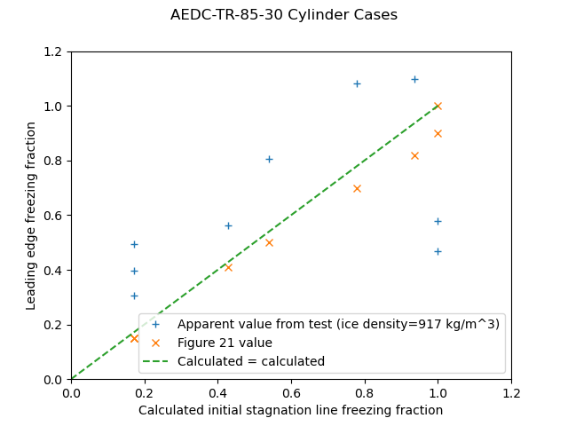
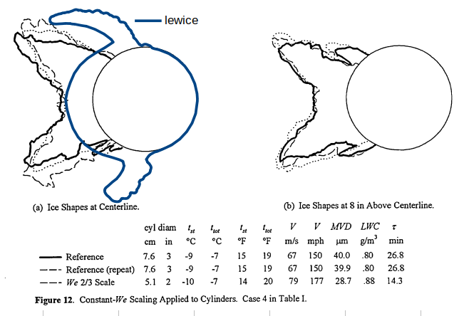

Title: Conclusions of the Icing Thermodynamics Thread   
Category: NACA  
tags: thermodynamics  
status: draft  

.](images/messinger/Figure1.png) 
> Figure 1. Modes of energy transfer for an unheated airfoil in icing conditions. [^1]

#Conclusions of the Icing Thermodynamics Thread 

##Summary  
Data from the post-NACA era are used to resolve open questions 

##Key points
1. The Icing Thermodynamics thread is summarized
2. Post-NACA era data is used to resolve some open questions.
3. NACA era data that are still used today are summarized

##Discussion

###Review of the Icing Thermodynamics thread so far

In the Icing Thermodynamics thread, we saw:

- Calculations of wet surface temperatures [NACA-ARR-5G13]({filename}NACA-ARR-5G13.md)  
- Two dimensional heated surface equations for ice protection [NACA-TR-381]({filename}NACA-TR-381.md)  
- Comparisons of natural icing flight data to 2D ice protection calculations [NACA-TN-1472]({filename}NACA-TN-1472.md)  
- The "Ludlam limit" for freezing all water impinging [Ludlam, F. H.: The Heat Economy of a Rimed Cylinder]({filename}ludlam.md)  
- The term "freezing fraction" defined [Messinger, B. L.: Equilibrium Temperature of an Unheated Icing Surface as a Function of Airspeed]({filename}messinger.md)  
- Graphical solutions of ice protection equations [Simple Graphical Solution of Heat Transfer and Evaporation from Surface Heated to Prevent Icing]({filename}NACA-TN-2799.md)  
- The warmest ambient temperature at which ice can accumulate [NACA-TN-2861]({filename}NACA-TN-2914.md), and [NACA-TN-2914]({filename}NACA-TN-2914.md)  
- Evidence for "Ludlam limits" for icing instruments [Fraser, D.: Thermodynamic Limitations of Ice Accretion Instruments]({filename}Fraser.md)  
- Less that 1% of water drops evaporate approaching an obstacle [NACA-TN-3024]({filename}NACA-TN-3024.md)  
- Detailed analysis of the ratio of heat transfer to mass transfer [NACA-TN-3045]({filename}NACA-TN-3045.md)  
- Measurements of sublimation rates at Mach 1.3 [NACA-TN-3104]({filename}NACA-TN-3104.md)  
- Measurements and analysis of the "Ludlam limit" for rotating cylinders [NACA-TR-1215]({filename}NACA-TR-1215.md)  
- Experimental verification of the warmest temperature at which ice can accumulate [NACA-TN-3396]({filename}NACA-TN-3396.md)  
- A distillation of the NACA-era thermodynamics to one control volume [FAA-ADS-4](FAA-ADS-4.md)  

And programs in the Python programming language are available to reproduce the results in several cases [^2].  
- naca_arr_5g13.py  
- naca_tn_1472.py
- ludlam.py  
- messinger.py  
- naca_tn_2799.py  
- naca_tn_2914.py  
- fraser.py  
- naca_tr_1215_find_critical_line.py  
- ads4.py  

Readers may also be interested in the prior [Icing on Cylinders thread]({filename}Icing on Cylinders.md)  

##Open questions

We will look at some data from the post-NACA era to help resolve these questions. 

1. Do calculated freezing fractions correspond to observed values? 
2. Are the water drop evaporation estimates in NACA-TN-3024 accurate? 

##Freezing fractions 

###Rotating cylinders

We saw in [NACA-TR-1215]({filename}NACA-TR-1215.md) good correspondence between flight test 
ice mass and calculated ice mass. 

It appears that there were two essential elements of an analysis to well match the flight test rotating cylinder freezing rate values:
1. Evaporation and convection occur on the entire surface of the cylinder.  
2. A roughness-enhanced heat transfer relationship (nu = 0.024 * re^0.747)  

However, in [Fraser, D.: Thermodynamic Limitations of Ice Accretion Instruments]({filename}Fraser.md), 
the correspondence was not as good for icing tunnel test data. 
This is an area for further investigation. 

###Use of LEWICE for rotating cylnders

While LEWICE is a [well validate tool for airfoils](https://ntrs.nasa.gov/citations/19990021235), 
as noted in ["NACA Publications on Aircraft Icing Cylinders"](images/cylinder_thread_wrap_up/SAE presentation Cook.pdf), 
the use of LEWICE for rotating cylinders is not recommended. 

The NACA-TR-1215 flight cases were run with LEWICE. 
LEWICE was run in two modes. 
One mode started at the clean cylinder diameter, 
and used the automatic time step method determine the number of ice shape iterations. 
This resulted in 6 to 19 steps, depending on the condition and cylinder size. 
The other mode started at the reported average ice cylinder diameter, 
and took a single, 1 second long time step to get an ice growth rate for the cylindrical surface. 

LEWICE results had fair to poor agreement for the rotating cylinder flight test data. 

  

  

  

###Non-rotating cylinders

The theoretical value "freezing fraction" does have some correspondence to measured test values. 

I use the term "correspondence" because while quantitative comparisons can be made, 
there are assumptions in both the test values and the analysis values. 

Freezing fraction is difficult to measure experimentally. 
To illustrate, an experimental measurement of "freezing fraction" 
is typically made by running an icing case in an icing wind tunnel, 
measuring the leading edge ice thickness, 
and calculating an apparent stagnation line ice mass growth rate based on an assumed ice density.  
This is compared to a calculated ice mass growth rate base on all the ice freezing where it impinges, 
which is dependent on the accuracy of the impingement efficiency calculation 
and the measured tunnel airspeed, liquid water content, 
and the measured or assumed drop size distribution. 

We have seen analytical ice mass rate calculations several times, including Messinger [^1]. 
However, the calculated values are dependent again 
on the measured tunnel airspeed, liquid water content, and drop size distribution, 
and an assumed tunnel test section humidity of 100%, 
as well as the calculated impingement efficiency and heat transfer coefficients, 
which we have seen can vary on the order of +/-25% in [NACA-TN-1472]({filename}NACA-TN-1472.md) [^3]. 
And the analytical values usually are determined for the initial condition of the 
surface without ice, and do not account for changes in the surface as ice accumulates. 

Even with the factors noted above, many cases compare surprisingly (to me, at least) well. 

There are several sources of ice measurements on non-rotating cylinders. 

[AEDC-TR-85-30](https://dspace.mit.edu/bitstream/handle/1721.1/49937/32257719-MIT.pdf?sequence=2) 

  

[NASA-TM-107141](https://ntrs.nasa.gov/api/citations/19960012178/downloads/19960012178.pdf) 

  

[NASA/CR—2008-215302](https://www.tc.faa.gov/its/worldpac/techrpt/ar0755.pdf)  

  

The ice thickness at the leading edge was measured from the figures. 
From that, an ice growth rate can be calculated: 

    measured_ice_growth_rate = ice_thick / time

A rime ice grow rate can be calculated: 

    calculated_rime_ice_growth_rate = lwc/G_PER_KG * beta * u / ice_density
    
The ice density is assumed to be the bulk ice density, 917 kg/m^3. 
A Langmuir "D" drop size distribution was assumed to calculate the beta value. 

And an apparent freezing fraction value can be calculated: 

    n_apparent = measured_ice_growth_rate / calculated_rime_ice_growth_rate

The heat transfer relationship from NASA-TM-107141 was used:

    nu = 1.244 * re^0.4774

The file "messinger.py" was used to calculate the freezing fraction. 
The freezing fraction is evaluated at the initial cylinder diameter (only). 
The is no attempt to calculate changes during the ice growth, 
when the surface shape becomes non-cylindrical and the heat transfer 
and water catch rate may change.

For the AEDC Table 1, the reported and calculated freezing fraction values agree well, 
but the apparent freezing fraction values have scatter compared to the calculated values.  

  

For NASA-TM-107141, apparent freezing fraction values agree well with the calculated values, 
but the reported values do not. 
As the heat transfer relationship used came from NASA-TM-107141, 
it is not clear what the implementation differences of the calculation would be. 

  

For the NASA-CR-2008-215302, the values agree fairly well. 

  

###LEWICE analysis of cylinders 

For non-rotating cylinders, the results with LEWICE are mixed. 

One case had good agreement at the stagnation line, but varying agreement elsewhere: 

  

Another case did not agree well at the stagnation line, with varying agreement elsewhere.

  

Unfortunately, the mass values were not recorded in NASA-TM-107141. 

###Airfoil leading edge approximated as a cylinder

[NASA/CR-2005-213852](https://ntrs.nasa.gov/api/citations/20050215212/downloads/20050215212.pdf)  

This treats the airfoil leading edge as a cylinder with a diameter equal to twice the leading edge radius of curvature. 

The freezing fraction values agree well at higher values, 
but at lower values the scatter is greater than the +/-10% region shown. 

  

I view this as validation of Uwe von Glahn's assertion that 
**"The collection of ice by the cylinders is similar to the collection of ice by airplane components"** [^4] from 1955,
but it took 50 years to get the measured data. 

##Water drop evaporation  

I will defer the evaluation of this to a future post in [Diversions]({filename}pages/diversions.md), 
"Let's Build a 1D Water Drop Motion Simulation". 
We will put together several pieces from the NACA-era to implement this, 
similar to [NACA-TN-3024]({filename}NACA-TN-3024.md), 
but without the equilibrium assumption.  
We require post-NACA era data to validate the model. 
Once we have a water drop motion simulation, 
we can can get the differential airspeed values 
needed to calculate the water drop heat and mass transfer. 

For now, I will say that [NACA-TN-3024]({filename}NACA-TN-3024.md) 
is correct in the conclusion that less than 1% of the water mass evaporates, 
but the details of how one gets there are different. 

##Conclusions  

###Influential authors

There was a notable shift in influence from the NACA-era to the post-NACA era. 

J. K. Hardy's publications were highly influential in the NACA-era. 
He either authored or is cited by 10 of the 14 publications in the Thermodynamics thread. 
However, Hardy is not often cited in recent publications. 
Not being included from the references of ADS-4 (where Hardy's datum temperature was described but not credited) 
may have had an influence on that. 

The validation of Hardy's equations to the limits of the test methods available at the time in 
[NACA-TN-3024]({filename}NACA-TN-3024.md) 
(runback ice testing is challenging, especially at Mach 1.35) 
is a "lost gem" (rarely cited) and a
crowning achievement of the NACA-era, in my view. 

Messinger's publication [^1] is highly influential in the post-NACA era, 
and is still cited frequently in recent literature, 
but was cited only once in the NACA publications. 
Messinger cited three of Hardy's publications 
and acknowledge Hardy's contributions in the text. 
Perhaps we may view Hardy as still having influence, 
but one layer down in the citations. 

Messinger's model and "extended" Messinger models still are used extensively. 
The original publication lacked features such as surface pressure variations that
some extended models add. 

One thing that is common to the NACA-era and the post-NACA era 
is the influence of Langmuir and Blodgett [^5]. 
Six of the 14 publications in the Thermodynamics thread cite Langmuir and Blodgett. 
Recent publications frequently cite Langmuir and Blodgett. 

##Notes: 
 
[^1]: 
Messinger, B. L.: Equilibrium Temperature of an Unheated Icing Surface as a Function of Airspeed. Preprint No. 342, Presented at I.A.S. Meeting, June 27-28, 1951.  
[^2]: [https://github.com/icinganalysis/icinganalysis.github.io](https://github.com/icinganalysis/icinganalysis.github.io)   
[^3]: 
Neel, Carr B., Jr., Bergrun, Norman R., Jukoff, David, and Schlaff, Bernard A.: The Calculation of the Heat Required for Wing Thermal Ice Prevention in Specified Icing Conditions. NACA-TN-1472, 1947.  
[^4]: 
von Glahn, Uwe H.: The Icing Problem, presented at Ottawa AGARD Conference. AG 19/P9, June 10-17 1955, reprinted in Selected Bibliography of NACA-NASA Aircraft Icing Publications, NASA-TM-81651, August, 1981  I could not locate this on the NTRS. It is available at (https://core.ac.uk/reader/42858720) (circa November, 2021)  
[^5]:
Langmuir, Irving, and Blodgett, Katherine B.: "Mathematical Investigation of Water Droplet Trajectories". Report. No. RL-224, January 1945, in "The Collected Works of Irving Langmuir", Vol. 10, 1961.  

