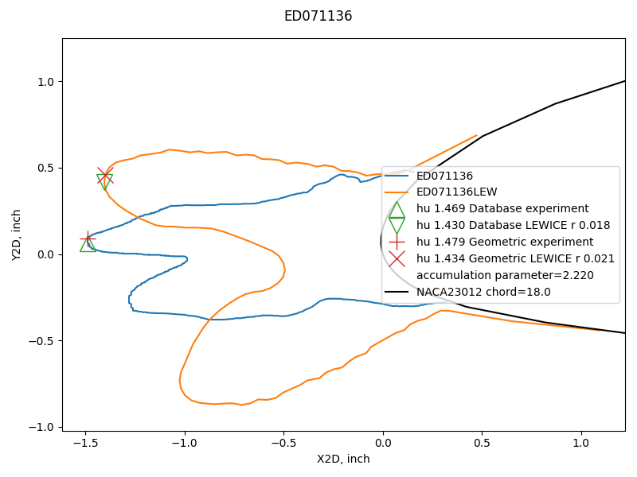
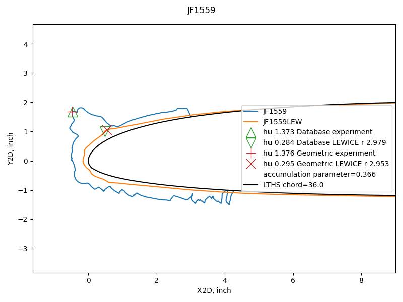
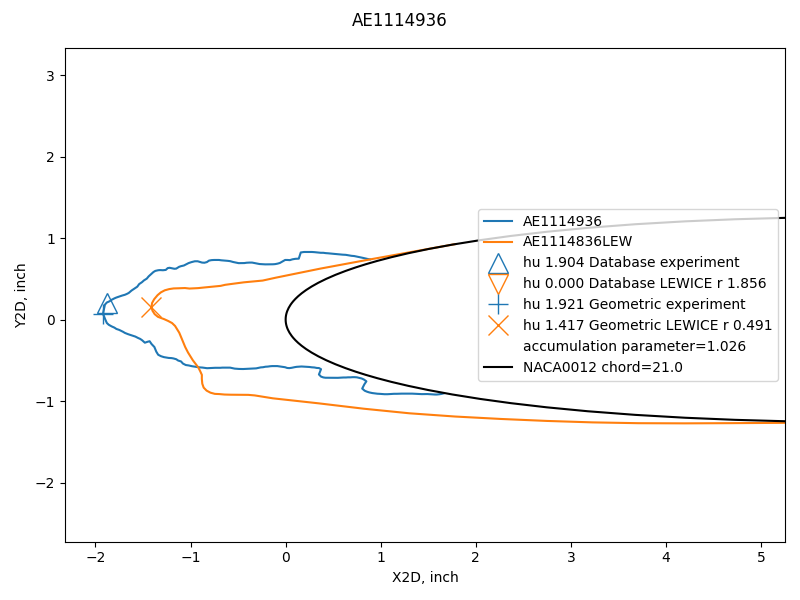
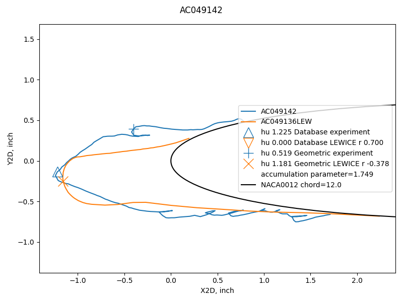

Title: A Geometric Analysis Method   
status: draft  
tags: LEWICE, ice shapes, NASA

DRAFT

### _"This demonstrates that the automated process cannot (yet) be substituted for good engineering judgment."_  
_From the LEWICE manual. [^1]_  

  
_
A case where two methods detected similar upper surface ice horns.
_  

## Summary  

Reviewing 6000+ ice shape assessments to verify that they agree with engineering judgement is a daunting task. 
Even with professionalism and due-diligence, debatable results may be missed. 
So, there is motivation to automate the process as much as possible.  

Here, I describe a step toward that goal. 
It is a work in progress, not a completed product.  

## Using the IceVal database to validate an assessment method  
 
The IceVal database will be used here to validate a different comparison assessment method. 
This is one of the uses envisioned when compiling the database [^2]:  
 
>... by compiling a comprehensive database consisting of
a standardized, reliable data set, and combining that with an easy-to-use graphical user interface (GUI), providing
quick and easy access to the data, a number of present and future enhancements to both products and processes
become possible:  
...
>5) New and/or improved analytical methods  
The foundation of all scientific inquiry is data; and, certainly, a key factor in the increased pace of
scientific progress in recent times is the improved access and data processing capabilities provided by
computers. In a similar manner, the consolidation of the experimental icing data, combined with the ease
of access and data processing capabilities provided by the IceVal GUI, will facilitate the process of
performing statistical analyses or other scientific investigations that might ultimately lead to new and/or
improved methods in the icing research field.

## Description of the geometric analysis method  

As we saw in "Overall comparison assessments between experiment and LEWICE", the ice shape measurements from THICK 
differed from those in the database, 
which had several values adjusted manually from THICK results by using engineering judgement. 
Some individual cases had debatable results with values from either database or THICK.  

To address this, an independent geometric evaluation was performed. 
The Python library Scipy was used to represent the airfoil as a spline surface. 
The height of each ice point was calculated by finding by iteration the distance to the closest point on the 
airfoil surface.  

Values are, on average, very similar for maximum ice thickness between 
values from the database and the geometric analysis.  

  

## Horn selection   

Prominent maximum local thickness locations are found by the Python library scipy.signal.find_peaks function 
as potential horn locations. 
Candidate horns that are very close to another horn are filtered out. 
The selection method will always have a horn at the maximum ice thickness location. 
A second horn will be found if there is a horn that is at least 25% as thick as the maximum ice thickness. 
Preference is give to a horn that is on the opposite side of the airfoil leading edge Y values, 
but the next thickest horn is selected if none such is available. 
Horns are designated as "upper" and "lower" by the Y value, 
even if both are on one side of the airfoil leading edge Y value.

## Overall assessments with the geometric analysis method   

Preliminary results are promising with the geometric analysis.  

Both the average values and the variance are smaller for the geometric analysis vs
the database values. 

  

The value of +/-15% variation is better than the +/-20% value in Figure 7 of the LEWICE validation report [^3].  

If we filter out the cases from the database where no upper horn is detected, 
the comparison values appear to be better. 
This indicates that much of the improvement with the geometric method is due 
to not missing more than 600 ice horns in cases from the database.

  

The differences in horn location as measured by horn angle is improved 
using the geometric analysis. 
Note that for cases where there is no upper horn detected there is no angle difference that can be calculated, 
leaving hundreds of database cases unmeasured and unexplained.   

## Examples of individual cases compared  

We will examine several of the individual cases where there were small and large differences between the 
geometric analysis and the database values.  

Here an the example seen previously in ["A Tour of the IceVal DatAssistant"]({filename}datassistant.md)" 
with the geometric analysis added, 
where there is a good comparison of horn height.  

  

Here is a case from the right side of the overall thickness comparison chart above, 
where neither method had a close comparison value between experiment and analysis. 
The reason is that there is indeed a large difference between experiment and analysis, 
and either method accurately reflects this.  
  

Here is a case where the geometric method had more accurate comparison 
between experiment and analysis
(noted as "r" in the legend line for the LEWICE result). 
The database did not indicate an upper horn for the LEWICE case, 
and the geometric analysis selected an accurate upper horn point. 
There are several more similar examples (not shown).  
  

Here is a case where neither the database nor the geometric method had a good result, 
but for different reasons. 
The database does not indicate an upper horn for the LEWICE case. 
The geometric method indicates an upper horn, but in a debatable location.  
  

While there are several individual cases where either or both methods have debatable results, 
the overall comparisons are quantitively better with the geometric analysis method. 
From the overall comparisons noted above, 
it is evident that horn detection and selection have a major role in this.  

## Further development of the geometric analysis methods  

While the preliminary results are encouraging, 
the examples above show where there are debatable results. 
I hope to reduce that number, without greatly complicating the calculation. 

The scipy.signals.find_peaks function has many settings that I have not explored 
(I have only used the default settings). These may better screen candidate horn peaks for 
prominence (which is the name of one of the settings).

There are parts of the horn selection logic that I would like to generalize further. 
For example, number of ice points is used as part of the horn candidate spacing selection, 
and I would like to make that purely geometric. 
I feel that that would be more widely applicable to other cases that are not in the database. 

I have tried adding other information, such as stagnation point location or angle of attack, to the logic. 
So far, it has not uniformly improved the results. Also, it adds complexity. 
The database does not contain stagnation point information, so I used LEWICE to calculate it. 
I do not want to add complexity unless it is truly merited. 
One of the advantages of THICK is the simplicity of the inputs. 

Many ice shapes are not similar to the assumed template of a glaze ice shape with just two 
prominent horns, or a rime ice shape with one horn. 
So, it is possible that horn identification will always be to some extent a matter of 
opinion and engineering judgement.  

So far, I have not found a case of a false-negative with the geometric analysis, 
where the relative difference value indicates a good match, 
but detailed review shows that not to be the case. 
However, I have not yet reviewed all 6000+ ice shapes analyzed with the method. 

## Related  

This post is part of the ["6000 Ice Shapes - the IceVal DatAssistant"]({filename}iceval.md) thread.  

## Notes  

[^1]: 
User's Manual for LEWICE Version 3.2
[NASA/CR—2008-214255](https://ntrs.nasa.gov/citations/20080048307)  
The software is available at [software.nasa.gov](https://software.nasa.gov/software/LEW-18573-1)   

[^2]: 
Levinson, Laurie, and William Wright. "IceVal DatAssistant-An Interactive, Automated Icing Data Management System." 46th AIAA Aerospace Sciences Meeting and Exhibit. 2008. [NASA Report Number: E-16236](https://ntrs.nasa.gov/citations/20070031804)  
The software is available at [software.nasa.gov](https://software.nasa.gov/software/LEW-18343-1)  

[^3]: 
William B. Wright and Adam Rutkowski, "A summary of validation results for LEWICE 2.0." 37th Aerospace Sciences Meeting and Exhibit. 1998. [NASA/CR-208690](https://ntrs.nasa.gov/citations/19990021235).  
