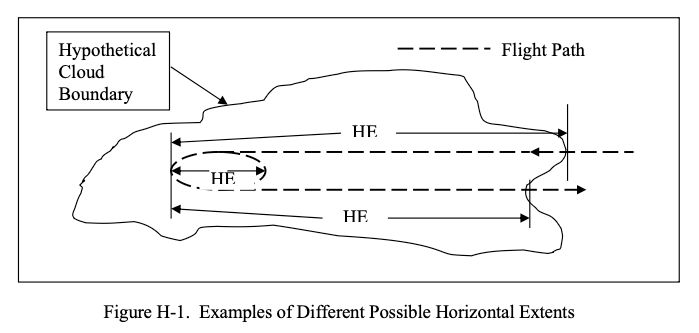

status: draft  
title: "Icing Information Notes"  
Date: 2026-09-26 12:00
tags: Jeck, Appendix C

### _"A Treasure Trove"_  

  
> _Although horizontal extent is a common term in the icing literature, it has not been defined anywhere.
Therefore, it is defined here in a way that is compatible with conventional usage._  

_Public Domain figure and text from DOT/FAA/AR-07/4. [^1]_

## Summary  
 
Perhaps the best summary of Dr. Jeck's works is a summary that he wrote himself.  

In 2018 Dr. Richard Jeck, retired from the FAA, sent via private email a collection of his "Icing Information Notes" ["Notes"], 
which one reader dubbed "A Treasure Trove".  

I believe that this is one of the last communications on the technical topic that Dr. Jeck had, 
and the Notes may summarize what he viewed as some of the most important and useful of his decades of works.  

## History of the Notes  

A biography [^2] explains:  

> After Dr. Jeck transferred from NRL to the FAA Technical Center in 1990, he became known, informally, inside and outside of the FAA, as the expert on understanding the mysteries of the icing environment and the correct way to relate icing test data to Appendix C.  
>
> To clarify the proper procedure, Dr. Jeck prepared an informal, 5-page, "Icing Information Note" which pointed out the problems and gave examples of correct usage.  
>
> He began receiving letters, phone calls and e-mails asking many other questions about icing conditions.  
>
> In response, Dr. Jeck wrote more Icing Information Notes on other icing-related topics until there are now dozens of them designed to provide icing practitioners with ready references on the fundamentals. They were prepared in response to requests from the field, or to clarify known areas of confusion in the interpretation and application of icing data and the technical literature. There is even one Icing Information Note that explains the difference between the Russian and Western versions of Appendix C.  

It appears that circa 1997 the notes were available upon request. 
An FAA document [^2] summarizes some of the Notes:  

> Icing Information Notes  
Several informal technical notes have been
written to provide practitioners in the field
of aircraft icing with clear, ready
references on some of the fundamentals.
These write-ups were prepared in response
to requests from the field or to clarify
known areas of confusion in the
interpretation and application of icing data
and technical literature. The information
notes available at this time are described
below.  
> 
> “Looking for Large MVD’s?”  
Tells
what to look for and what to expect when
searching for icing clouds with droplet
MVD’s in the range of 30 to 50 microns
during test flights.  
> 
> “Terminology for Droplet Size Measurements”  
> here are often
questions, errors, or confusion about
droplet size measurements, computations,
and terminology. Topics include: Cloud
Droplet Basics, Water Content of Clouds,
Engineering Significance of Droplet Sizes,
Substitutes for Dropsize Distributions
(Mean or Average Diameter, Median-
Volume Diameter (MVD), Mean-Volume
Diameter, and Mean Effective Diameter),
and Cautions in Reading Icing Literature
and Interpreting Dropsize Tables.  
> 
>“Answers to Questions about Low-Level Icing Conditions”  
> Answers the questions
“Are low-level icing conditions above a
high-elevation airport any different from
low-level icing conditions near sea level?”
and “Is the Continuous Maximum
Envelope (Fig. 1 of FAR 25, Appendix C)
really valid all the way down to ground
level or sea level?”  
> 
>“Legitimate (and Illegitimate!) Uses of the LWC Adjustment Curves in Appendix C of FARs 25 and 29” 
> There are often questions, errors, or confusion
about the legitimate use of the LWC
adjustment (F-factor) curves in Appendix
C. Topics include:  
> Proper Use of the F-factor Curves;  
> Converting Available LWC Averages to Equivalent Values Over 17.4 nmi or 2.6 nmi;  
> Judging the Adequacy of an Icing Exposure for Test or Certification Purposes;  
> and Acceptable Methods for Documenting, Comparing, and Extrapolating Test Exposures.  
> 
> “Method for Computing Condensable Water due to Expansion (Suction) Cooling in Turbine Engine Air Inlets”  
When air is drawn into turbine engine
inlets during low-speed (ground)
operations, the air can be cooled by as
much as 15oF (8oC) due to the air pressure
drop inside the inlet. If the outside air is
moist and the temperature drops below its
dew point during ingestion, then moisture
(and possibly ice) will condense in the
inlet. This note describes a method for
computing the mass (grams) of
condensable water per unit mass
(kilograms) of ingested outside air.  
> 
>“Summary of Some Current Practices in Selecting Design Values from the Icing Envelopes in Appendix C of FARs 25 and 29”  
> Questions arise periodically
on the significance, proper usage, and
interpretation of horizontal extent of icing
conditions represented by the design
envelopes in Appendix C of FARs 25 and 29.  
> Topics include: Selecting Exposure Distances,  
> Selecting Values of MVD, and
Special Considerations.  
> 
>Dr. Richard Jeck, AAR-421, (609)

However, I have not found them on any current FAA site, 
nor at archive.org.  

## A proposed SAE Aerospace Information Report (AIR)  

Dr. Jeck proposed that the SAE AC9C Aircraft Icing Technology Committee would be interested in publishing the Notes. 
I reviewed the Notes as part of the committee work. 
It gave me an excellent opportunity to become more familiar with Dr. Jeck's work. 

The committee elected not to pursue publishing them at the time, due to committee work load, 
and that some of the material was covered in Jeck's published works.  

## Titles of the Notes  

The Notes themselves are generally concise (less than 10 pages) summaries of topics, often in a question and answer format.  

The figure H-1 and text at the top of this post (while not from a Note) give the flavor of many of them: 
state a problem (that few may have realized or addressed before), and then give a concise technical solution. 

Later in this series, we will see an appendix to DOT/FAA/AR-07/4 that is an expansion of the note "New Replacement Figures for 14 CFR-25,29, Appendix C".  

A partial listing of Notes titles (with year, if noted):  

```text
ABBREVIATIONS AND ACRONYMS  
TABLE OF CONTENTS  
Origins of the FAR-25, Appendix C, Design Envelopes    
Relationships of FAA Advisory Circulars to 14 CFR-25/29, Appendix C in the Selection of Variables for the Design of Ice Protection Equipment for Aircraft (1995)  
Summary of Some Current Practices in Selecting Design Values from the Icing Envelopes in 14 CFR-25,29, Appendix C (2007)  
Legitimate (and Illegitimate!) Uses of the LWC Adjustment Curves in 14 CFR-25,29, Appendix C (2004)  
Some Answers to ALPA's Position Paper and Airline Pilot Magazine articles on Inflight Icing (1995)  
New Replacement Figures for 14 CFR-25,29, Appendix C (2005)  
Other Ways to Characterize the Icing Atmosphere (a complete copy of AIAA-94-0482)  
APPLYING THE ICING ATMOSPHERE DATABASE  
The Upper and Lower Temperature Limits for Aircraft Icing (2004)  
Cloud Layer Statistics Applications (2008)  
Looking for Large MVD's? (1997)  
PROPOSAL FOR CHANGING the ICING INTENSITY DEFINITIONS  
A workable, aircraft-specific icing severity scheme (a complete copy of AIAA-98-0094)  
Origins and Evolution of the Icing Intensity Definitions for Aircraft (a complete copy of an American Meteorological Society paper) (2006)  
The Revised Icing Intensity Definitions (2012)  
Relating Aircraft Icing Intensities (Trace, Light, Moderate, and Heavy) to 14 CFR-25,29, Appendix C, Icing Certification Envelopes (2007)  
Relating Aircraft Icing Intensities (Trace, Light, Moderate, and Heavy) to 14 CFR-25,29, Appendix C, Icing Certification Envelopes (Presentation to the SAE)  
Supporting Data for New Altitude-Limited SLWC Envelopes (2017)   
A Chronology of FAA Icing Regulations and Guidance for Rotorcraft (2015)  
Calibration and Use of Goodrich Model 0871FA Ice Detectors in Icing Wind Tunnels (a complete copy of Journal of Aircraft article) (2007)  
Making Icing Tests Simpler and Less Expensive (a complete copy of SAE 2003-01-2126)  
Rating Icing Exposures in Terms of Intensity (2017)  
Answers to Questions Regarding Low Level Icing Conditions (1996)  
```

## Jeck's draft of a summary of his works?  

The "TABLE OF CONTENTS" is an outline that the subsequent Notes only approximately follow. 
These appear to be a combination of topics he had been asked about, 
and a course of study that Jeck thought those in aircraft icing should know. 
It may be a draft of how he would organize a summary of his works.  

```text
TABLE OF CONTENTS  
(Apr-04-2017)

REFERENCES
Applicable Documents
Related Publications
Definitions
Symbols

1. ALL ABOUT APPENDIX C
   (of Title 14, Code of Federal Regulations, Parts 25 and 29)  
   
    1.1 Origins of Appendix C
    1.2 General Understanding and Use of Appendix C
        1.2.1 Are LWC Envelopes 99% or 99.9% of Maximum Possible LWC?
    1.3 Cloud Water Content (CWC, LWC or SLWC)?
    1.4 Horizontal Extent (HE), Exposure Distance (ED) or Averaging Distance (AD)?
    1.5 Vertical Extent of Icing Cloud Conditions
    1.6 F-Factor
    1.7 Cloud Drop Sizes
        1.7.1 Drop Size Terminology (MED, MVD, MMD, etc.)
        1.7.2 Cloud Dropsizes
        1.7.3 When Dropsize Matters
        1.7.4 Looking for Large MVDs?
    1.7.5 Langmuir Dropsize Distributions
    1.7.6 What to do When Dropsize Measurements are Unavailable
    1.7.7 Why the Russian Appendix C Differs from the U.S./European (Western) Appendix C
    1.7.8 Outside Air Temperature (OAT)
    1.7.9 Upper and Lower Temperature Limits to Aircraft Icing
1.8 Altitude Limited Envelopes for Rotorcraft
    1.8.1 Icing Conditions below 3 km (10,000 Ft)
    1.8.2 Vertical Distribution (Extent) of Icing Cloud Layers
    1.8.3 Modernized Appendix C-The Beauty & Benefits of Digitized Figures
1.9 Controversy-Complaints about Appendix C.
Newly-Proposed Solutions
2. ALTERNATE, MORE VERSATILE FORMATS FOR APPENDIX C
    2.1 Appendix C Envelopes in terms of LWC vs HE
    2.2 Appendix C Envelopes in terms of any other LWC-related variable
3. NEW DATA-FINDINGS FROM 28,000 NMI OF IN-FLIGHT ICING CLOUD DATA
4. RETURNING TO AN ENGINEERING-ENABLED (MEASURABLE! AND CALCULABLE!) ICING SEVERITY SCALE
5. INSTRUMENTATION AND ADVICE FOR MEASUREMENTS IN ICING CLOUDS
    5.1 The Need for Standard Procedures for Processing and Presenting Icing Cloud Data For Test and Certification Flights  
```

## Often cited publications in the Notes  

In the Notes, Jeck cited some of his publications several times each:  

- A new database of supercooled cloud variables for altitudes up to 10,000 feet AGL and the implications for low altitude aircraft icing. US Department of Transportation Rep." Transportation Rep. DOT/FAA/CT-83/21 137 (1983). [ntrs.nasa.gov](https://ntrs.nasa.gov/api/citations/19860002276/downloads/19860002276.pdf)  
- A History and Interpretation of Aircraft Icing Intensity Definitions and FAA Rules for Operating in Icing Conditions. DOT/FAA/AR-01/91, November 2001. [ntrl.ntis.gov](https://ntrl.ntis.gov/NTRL/dashboard/searchResults/titleDetail/ADA398952.xhtml)  
- A workable, aircraft-specific icing severity scheme, 36th AIAA Aerospace Sciences Meeting and Exhibit, AIAA 1998-94 [arc.aiaa.org](https://arc.aiaa.org/doi/abs/10.2514/6.1998-94)  
- Icing Design Envelopes (14 CFR Parts 25 and 29, Appendix C) Converted to a Distance-Based Format, DOT/FAA/AR-00/30, April, 2002. [ntrl.ntis.gov](https://ntrl.ntis.gov/NTRL/dashboard/searchResults/titleDetail/PB2002107034.xhtml)  
- Origins and Evolution of the Icing Intensity Definitions for Aircraft, AMS, Federal Aviation Administration Technical Center, Paper A 7, March 2006 [ams.confex.com](https://ams.confex.com/ams/pdfpapers/105941.pdf)  
- Calibration and Use of Goodrich Model 0871FA Ice Detectors in Icing Wind Tunnels. J. Aircr., 44, 300–309, January 2007, [arc.aiaa.org](https://arc.aiaa.org/doi/10.2514/1.23543)  
- Advances in the Characterization of Supercooled Clouds for Aircraft Icing Applications. DOT/FAA/AR-07/4, Appendix C, November, 2008. [web.archive.org](https://web.archive.org/web/20161221102659/http://www.tc.faa.gov/its/worldpac/techrpt/ar074.pdf)  Note that there is a different pdf file at ntrl.nist, but that copy has blanks for some figures.  

I take this as indicating that he thought these were particularly important and useful.  

I am surprised that Dr. Jeck's works on supercooled large drop (SLD) icing got little mention. 
Perhaps he felt that his contributions to the Inflight Icing Plan Task 9 report DOT/FAA/AR-09/10 [^8], 
of which he was a co-author, adequately summarized his work and results.  

## NACA-era publications cited in Notes  

These have been reviewed previously:  

- [TN-1393]({filename}NACA-TN-1393.md),  Lewis, William: A Flight Investigation of the Meteorological Conditions Conducive to the Formation of Ice on Airplanes. NACA-TN-1393, 1947. [ntrs.nasa.gov](https://ntrs.nasa.gov/citations/19930082038)  
- [TN-1424]({filename}NACA-TN-1424.md),  Lewis, William, Kline, Dwight B., and Steinmetz, Charles P.: A Further Investigation of the Meteorological Conditions Conducive to Aircraft Icing. NACA-TN-1424, 1947. [ntrs.nasa.gov](https://ntrs.nasa.gov/citations/19810068854)  
- [TN-1793]({filename}NACA-TN-1793.md),  Kline, Dwight B.: Investigation of Meteorological Conditions Associated with Aircraft Icing in Layer-Type Clouds for 1947-48 Winter. NACA-TN-1793, 1949. [ntrs.nasa.gov](https://ntrs.nasa.gov/citations/19930082468)  
- [TN-1855]({filename}NACA-TN-1855.md),  Jones, Alun R., and Lewis, William: Recommended Values of Meteorological Factors to be Considered in the Design of Aircraft Ice-Prevention Equipment. NACA-TN-1855, 1949. [ntrs.nasa.gov](https://ntrs.nasa.gov/citations/19930082528)  
- [TN-1904]({filename}NACA-TN-1904.md),  Lewis, William, and Hoecker, Walter H., Jr.: Observations of Icing Conditions Encountered in Flight During 1948. NACA-TN-1904, 1949. [ntrs.nasa.gov](https://ntrs.nasa.gov/citations/19810068853)  
- [TN-2569]({filename}NACA-TN-2569.md),  Hacker, Paul T., and Dorsch, Robert G.: A Summary of Meteorological Conditions Associated with Aircraft Icing and a Proposed Method of Selecting Design Criterions for Ice-Protection Equipment. NACA-TN-2569, 1951. [ntrs.nasa.gov](https://ntrs.nasa.gov/citations/19810068848)  
- [TN-2738]({filename}NACA-TN-2738.md),  HLewis, William, and Bergrun, Norman R.: A Probability Analysis of the Meteorological Factors Conducive to Aircraft Icing in the United States. NACA-TN-2738, 1952. [ntrs.nasa.gov](https://ntrs.nasa.gov/citations/19810068847)  
- [Messinger]({filename}messinger.md), Messinger, B. L.: Equilibrium Temperature of an Unheated Icing Surface as a Function of Airspeed. Preprint No. 342, Presented at I.A.S. Meeting, June 27-28, 1951. [semanticscholar.org](https://www.semanticscholar.org/paper/Equilibrium-Temperature-of-an-Unheated-Icing-as-a-Messinger/250270d1126b8462a81cdca144b0dbcf044f7c53)    
- [Meteorology publications by Porter Perkins]({filename}perkins meteorology.md),  Summary of Statistical Icing Cloud Data Measured Over United States and North Atlantic, Pacific, and Arctic Oceans During Routine Aircraft Operations. NASA Memo 1-19-59E, 1959. [archive.org](https://archive.org/details/nasa_techdoc_19810068860/page/n9/mode/2up)  

## References  

[^1]: Jeck, Richard K.: Advances in the Characterization of Supercooled Clouds for Aircraft Icing Applications. DOT/FAA/AR-07/4, Appendix C, November, 2008. [web.archive.org](https://web.archive.org/web/20161221102659/http://www.tc.faa.gov/its/worldpac/techrpt/ar074.pdf)  Note that there is a different pdf file at ntrl.nist, but that copy has blanks for some figures.  
[^2]: A Recognition and Biography [24-7pressrelease.com](https://www.24-7pressrelease.com/press-release/457378/richard-jeck-presented-with-the-albert-nelson-marquis-lifetime-achievement-award-by-marquis-whos-who)  
[^3]: Anon., Research and Development Highlights 1997, FAA Airports and Safety R&D Division, ARR-400, William J. Hughes Technical Center [rosap.ntl.bts.gov](https://rosap.ntl.bts.gov/view/dot/33753/dot_33753_DS2.pdf)  
