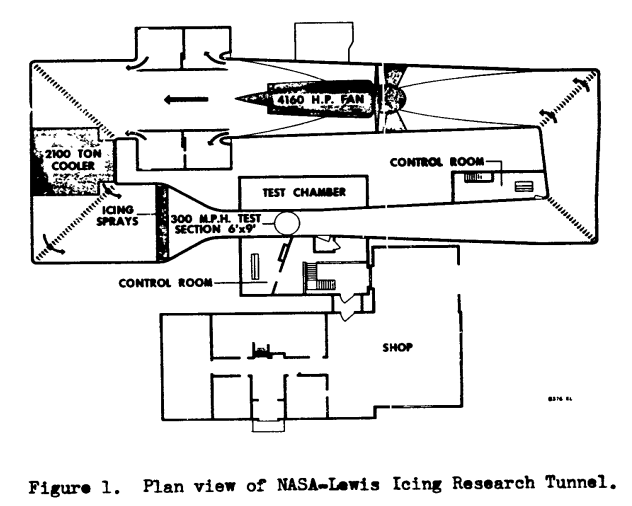
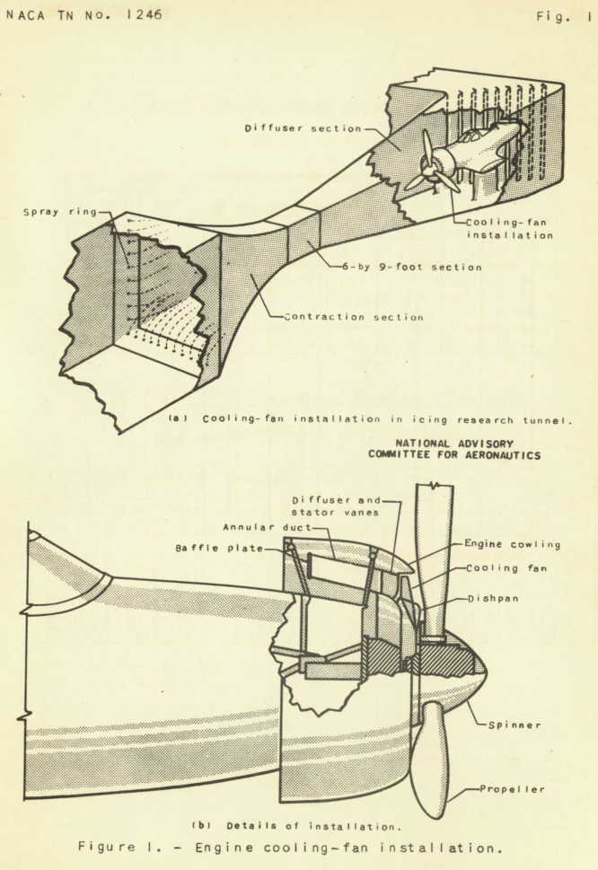
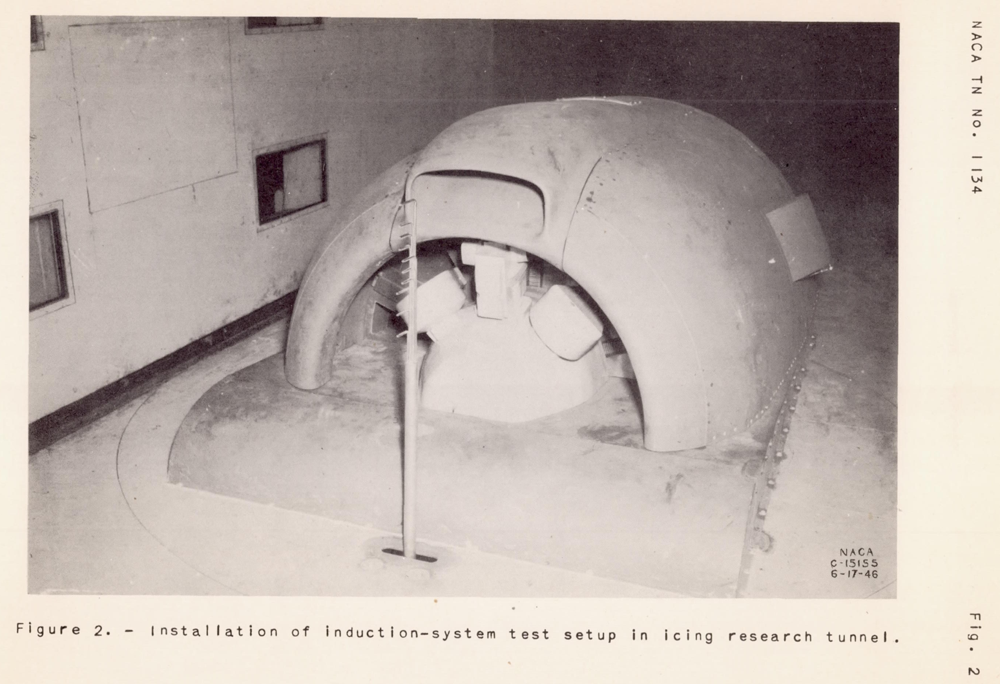
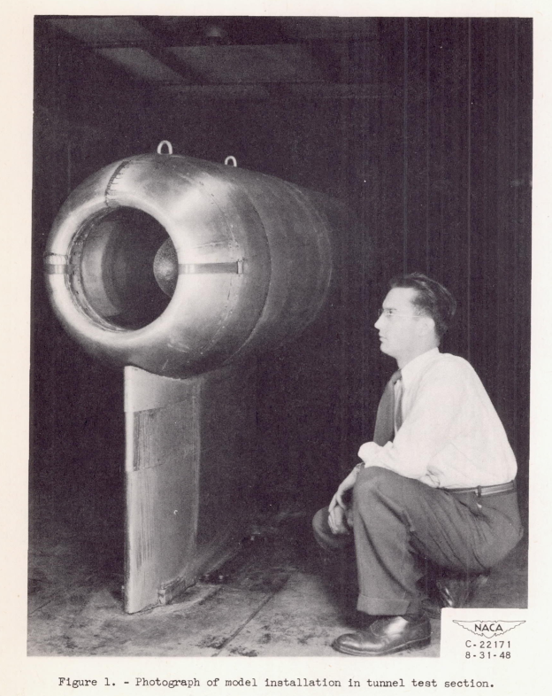
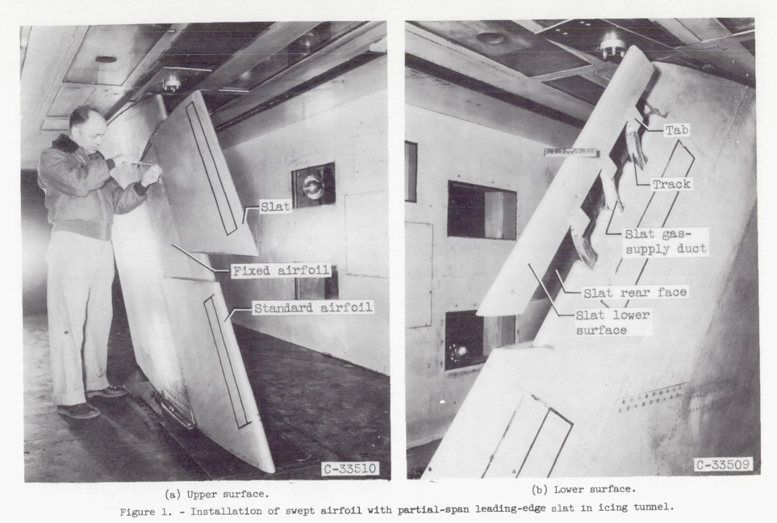
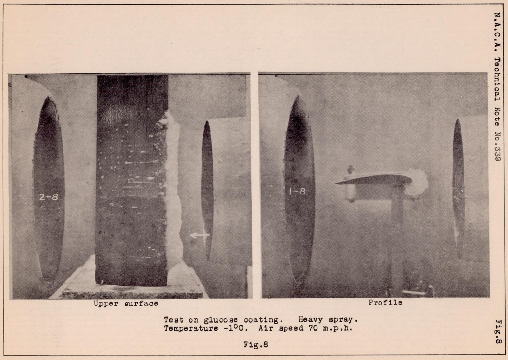

title: Uses of NACA-Era Icing Wind Tunnels  
Date: 2022-07-20 12:00  
category: icing tunnels  
tags: icing tunnel  

### _"Icing wind tunnels can simulate natural icing with water-spray and refrigeration systems ... to permit safe, convenient and relatively inexpensive testing."_ [^1]  

  
_How much of a P-39 can one fit into an icing wind tunnel?_  

## Summary  
A wide variety of test articles were used in the NACA-era Icing Research Tunnel (IRT)  

## Key Points  
1. 37 publications were found describing the use of the IRT.  
2. A wide variety of test articles were used in the NACA-era Icing Research Tunnel  

## Discussion  

Readers are encouraged to see ["We Freeze to Please": A History of NASA's Icing Research Tunnel and the Quest for Flight Safety](https://ntrs.nasa.gov/citations/20020066162), 
which includes information from NACA-era internal memos and interviews that I have not seen published elsewhere. 

There were five icing wind tunnels used by NACA. 
The majority of the tests were performed in the Icing Research Tunnel (IRT) as NACA Lewis. 
The four other tunnels are briefly described in the "Other icing wind tunnel tests" section below. 

I found 37 NACA publications [^2] that discuss use of the NACA Icing Research Tunnel. 
Four more publications discuss the use of other icing wind tunnels. 

A wide variety of test articles were used.
These included (detailed further below):  
- A large portion of a P-39 airplane  
- engine nacelles  
- inlet and engine components
- icing instruments  
- radomes  
- several airfoils, including some with ice protection  
- cylinders  

Test purposes were varied. 
Purposes included:  
- ice shapes on unprotected components  
- efficacy of ice protection systems  
- limiting water ingestion and ice in inlets  
- calibrating icing instruments  
- ice prevention coatings  
- ice on propellers  
- impingement efficiency measurement (with the dye tracer method)  
- measure the aerodynamic effects of ice on airfoil sections  

Many tests were with full scale test articles 
(although, due to tunnel size limitations, sometimes limited span wing sections). 
Some were with scaled down test articles, 
and one with a scaled up test article (NACA-RM-E50H29, "The increased size was required to provide for
adequate instrumentation and is in accordance with current design trends")

The IRT has a turntable (vertical, floor and ceiling), which many test articles used. 
Some were floor mounted, and others had special purpose mounts.  

The nominal test section was used in most tests.  
However, some test articles were mounted in the upstream converging section or downstream expansion section. 

### Selected images  

  
_from 1969 Aircraft Ice Protection Report of Symposium [^3]_  

  

  

  
_from NACA-RM-E9E12_  

  
_from NACA-RM-E53J30_  

  

### Test Articles in the NACA IRT  

_(In approximate chronological order)_  
Note that while NACA-RM-E50K10 was published in 1951, 
it contains data from a test conducted in 1945. 

| Publication                               | Test Article                                                              | Scale Ratio                             | Portion      | Mount                                                                                                  |
|-------------------------------------------|---------------------------------------------------------------------------|-----------------------------------------|--------------|--------------------------------------------------------------------------------------------------------|
| NACA-RM-E50K10a                           | pneumatic deicer on a 42-inch chord airfoil                               | 1                                       | section      | From ceiling of contraction                                                                            |
| NACA-TN-1134                              | engine nacelle with carburetor inlet scoop                                | 1                                       | half (upper) | floor                                                                                                  |
| NACA-TN-1246                              | engine nacelle with cooling fan                                           | 1                                       | full         | pedestal from floor of settling chamber                                                                |
| NACA-TN-1520                              | modified fuselage with propeller                                          | 1                                       | full         | pedestal mount from floor of settling chamber                                                          |
| NACA-TN-1691                              | modified fuselage with propeller                                          | 11:15 reduced prop diameter             | full         | pedestal mount from floor of settling chamber                                                          |
| NACA-TN-1586 NACA-TN-1587 NACA-TN-1588    | modified fuselage with propeller                                          | 1                                       | full         | pedestal mount from floor of settling chamber                                                          |
| NACA-RM-E8A27 NACA-RM-E8A28 NACA-RM-E8A29 | engine nacelle                                                            | 0.5                                     | full         | pedestal                                                                                               |
| NACA-RM-E9EO6                             | cascade vanes                                                             | 0.67                                    | 2D section   | pedestal from floor                                                                                    |
| NACA-RM-E9E12                             | engine nacelle                                                            | 0.67                                    | full         | pedestal from floor                                                                                    |
| NACA-TN-1789                              | scoop on 8-foot chord airfoil                                             | 1                                       | section      | vertical floor to ceiling                                                                              |
| NACA-RM-E50I08                            | cascade vanes                                                             | Full                                    | 2D section   | pedestal from floor                                                                                    |
| NACA-RM-E50E03                            | engine nacelle                                                            | not stated                              | full         | pedestal from floor                                                                                    |
| NACA-RM-E50H29                            | cascade vanes                                                             | 2:1                                     | 2D section   | pedestal from floor                                                                                    |
| NACA-TN-2480                              | 8-foot chord airfoil                                                      | 1                                       | section      | vertical floor to ceiling                                                                              |
| NACA-RM-E51E16                            | NACA pressure-type icing-rate meter and rotating disc instrument          | 1                                       | full         | not stated                                                                                             |
| NACA-RM-E51B12                            | cascade vanes                                                             | Full                                    | 2D section   | pedestal from floor                                                                                    |
| NACA-RM-E51J29                            | 8-foot chord airfoil with internal gas heating                            | 1                                       | section      | vertical floor to ceiling (turn-table)                                                                 |
| NACA-RM-E51J30                            | 8-foot chord airfoil with external electric heating                       | 1                                       | section      | vertical floor to ceiling (turn-table)                                                                 |
| NACA-RM-E53C27                            | 8-foot chord airfoil with internal gas heating                            | 1                                       | section      | vertical floor to ceiling (turn-table)                                                                 |
| NACA-TN-2962                              | 8-foot chord airfoil with internal gas heating                            | 1                                       | section      | vertical floor to ceiling (turn-table)                                                                 |
| NACA-RM-E53E07                            | induction-system air-scoop assembly incorporating a flush alternate inlet | 1                                       | full         | pedestal from floor                                                                                    |
| NACA-RM-E52J31                            | radome                                                                    | 1                                       | full         | pedestal from floor                                                                                    |
| NACA-RM-E53C26                            | 82-inch chord swept airfoil with external electric deicers                | 1                                       | section      | vertical floor to ceiling (turn-table)                                                                 |
| NACA-RM-E53J30                            | 6.9-foot chord swept airfoil with internal heating                        | 1                                       | section      | vertical floor to ceiling (turn-table)                                                                 |
| NACA-RM-E54I03                            | swept airfoil                                                             | 1                                       | half         | wall turn-table                                                                                        |
| NACA-TN-3338                              | 2 and 6 inch diameter cylinders                                           | 1                                       | end plates   | pedestal from ceiling elevator                                                                         |
| NACA-TN-3564                              | 87-inch chord airfoil with pneumatic deicer                               | 1                                       | section      | vertical floor to ceiling (turn-table)                                                                 |
| NACA-TN-3839                              | several different airfoils                                                | 1                                       | section      | vertical floor to ceiling (turn-table)                                                                 |
| NACA-RM-E56B23                            | 6.9-foot chord swept airfoil with internal heating                        | 1                                       | section      | vertical floor to ceiling (turn-table)                                                                 |
| NACA-RM-E56E11                            | different airfoil models                                                  | full scale leading edge, aft truncation | section      | vertical floor to ceiling (turn-table)                                                                 |
| NACA-TN-4155                              | 6-foot chord airfoil                                                      | 1                                       | section      | "cantilevered from the tunnel balance frame by a mounting plate attached to the bottom of the airfoil" |
| NACA-RM-E57G09                            | supersonic nose inlet                                                     | 1                                       | full         | pedestal from floor                                                                                    |
| NACA-TN-4268                              | supersonic nose inlet                                                     | 1                                       | full         | pedestal from floor                                                                                    |

### Other icing wind tunnel tests  

| Publication                                                                                                                               | Test Article                                      | Scale Ratio | Portion | Mount                  | Location                                               |
|-------------------------------------------------------------------------------------------------------------------------------------------|---------------------------------------------------|-------------|---------|------------------------|--------------------------------------------------------|
| [NACA-TN-339]({filename}NACA-TN-339.md)                                                                                                   | ice prevention coatings on a 3-inch chord airfoil | not stated  | section | not stated             | Refrigerated Wind Tunnel, Langley, Virginia            |
| NACA-TN-712 [Calibration of NACA Icing Tunnels]({filename}calibration_of_naca_icing_tunnels.md)                                           | anti-icing on a 72-inch chord airfoil             | 1           | section | not stated             | 7-foot by 10-foot tunnel, Langley, Virginia            |
| NACA-TN-2615 [Heated Probes]({filename}Heated%20Probes.md)                                                                                | hot wire instrument                               | 1           | full    | not stated             | Constructed test facility, Moffett Field, California   |
| [NACA-TN-3104]({filename}NACA-TN-3104.md)   [NACA-TN-3143]({filename}NACA-TN-3143.md)   [NACA-TN-3396]({filename}NACA-TN-3396.md) | 6-inch chord airfoil                              | not stated  | section | full span wall-to-wall | 3.84-inch by 10-inch Transonic tunnel NACA Lewis, Ohio |

A 12-inch by 12-inch tunnel is mentioned in "The Icing Problem" [^4], but I have not found where it was used.  

## References  

- von Glahn, Uwe H., and Renner, Clark E.: Development of a Protected Air Scoop for the Reduction of Induction-System Icing. NACA-TN-1134, 1946.  
- Lewis, James P.: Wind-Tunnel Investigation of Icing of an Engine Cooling-Fan Installation. NACA-TN-1246 [ntrs.nasa.gov](https://ntrs.nasa.gov/citations/19810068633), 1947.
- Lewis, James P.: De-Icing Effectiveness of External Electric Heaters for Propeller Blades. NACA-TN-1520, 1948.  
- Lewis, James P., and Stevens, Howard C., Jr.: Icing and De-Icing of a Propeller with Internal Blade Heaters. NACA-TN-1691, 1948.  
- Mulholland, Donald R., and Perkins, Porter J.: Investigation of Effectiveness of Air-Heating a Hollow Steel Propeller for Protection against Icing, I - Unpartitioned Blades. NACA-TN-1586, 1948. [ntrs.nasa.gov](https://ntrs.nasa.gov/citations/19810068619)
- Mulholland, Donald R., and Perkins, Porter J.: Investigation of Effectiveness of Air-Heating a Hollow Steel Propeller for Protection against Icing, III - 25-Percent Partitioned Blades. NACA-TN-1588, 1948.  
- Perkins, Porter J., and Mulholland, Donald R.: Investigation of Effectiveness of Air-Heating a Hollow Steel Propeller for Protection against Icing, II- 50-Percent Partitioned Blades. NACA-TN-1587, 1948.  
- von Glahn, Uwe H.: Ice Protection of Turbojet Engines by Inertia Separation of Water, I - Alternate-Duct System. NACA-RM-E8A27, 1948.  
- von Glahn, Uwe H.: Ice Protection of Turbojet Engines by Inertia Separation of Water, II - Single-Offset-Duct System. NACA-RM-E8A28, 1948.  
- von Glahn, Uwe H.: Ice Protection of Turbojet Engines by Inertia Separation of Water, III - Annular Submerged Inlets. NACA-RM-E8A29, 1948.  
- Dallas, Thomas, and Ellisman, Carl: Analysis and Preliminary Investigation of Eddy-Current Heating for Icing Protection of Axial-Flow-Compressor Blades. NACA-RM-E9EO6, 1949.  
- Ruggeri, Robert S., and Callaghan, Edmund E.: Experimental Investigation of Hot-Gas Bleedback for Ice Protection of Turbojet Engines, III - Nacelle with Short Straight Air Inlet. NACA-RM-E9E12, 1949.  
- Ruggeri, Robert S., von Glahn, Uwe H., and Rollin, Vern G.: Investigation of Aerodynamic and Icing Characteristics of Recessed Fuel-Vent Configurations. NACA-TN-1789, 1949.  
- Gray, Vernon H., and Bowden, Dean T.: Icing Characteristics and Anti-Icing Heat Requirements for Hollow and Internally Modified Gas-Heated Inlet Guide Vanes. NACA-RM-E50I08, 1950. [ntrs.nasa.gov](https://ntrs.nasa.gov/citations/19810068630)  
- von Glahn, Uwe H., and Blatz, Robert E.: Investigation of Aerodynamic and Icing Characteristics of Water-Inertia-Separation Inlets for Turbojet Engines. NACA-RM-E50E03, 1950.  
- von Glahn, Uwe H., Callaghan, Edmund E., and Gray, Vernon H.: NACA Investigations of Icing-Protection Systems for Turbojet-Engine Installations. NACA-RM-E51B12, 1951. [ntrs.nasa.gov](https://ntrs.nasa.gov/citations/19810068631)- Gelder, Thomas F., and Lewis, James P.: Comparison of Heat Transfer from Airfoil in Natural and Simulated Icing Conditions. NACA-TN-2480, 1951.  
- Gowan, W. H., Jr., and Mulholland, D. R.: Effectiveness of Thermal-Pneumatic Airfoil-Ice-Protection System. NACA-RM-E50K10a, 1951.  
- Perkins, Porter J., McCullough, Stuart, and Lewis, Ralph D.: A Simplified Instrument for Recording and Indicating Frequency and Intensity of Icing Conditions Encountered in Flight. NACA-RM-E51E16, 1951 [ntrs.nasa.gov](https://ntrs.nasa.gov/citations/19810068729).  
- von Glahn, Uwe H., Callaghan, Edmund E., and Gray, Vernon H.: NACA Investigations of Icing-Protection Systems for Turbojet-Engine Installations. NACA-RM-E51B12, 1951. [ntrs.nasa.gov](https://ntrs.nasa.gov/citations/19810068631)
- Gray, Vernon H., Bowden, Dean T., and von Glahn, Uwe H.: Preliminary Results of Cyclical De-icing of a Gas-Heated Airfoil. NACA-RM-E51J29, 1952  
- Lewis, James P., and Bowden, Dean T.: Preliminary Investigation of Cyclic De-Icing of an Airfoil Using an External Electric Heater. NACA-RM-E51J30, 1952.  
- Neel, Carr B., Jr., and Steinmetz, Charles P.: The Calculated and Measured Performance Characteristics of a Heated-Wire Liquid-Water-Content Meter for Measuring Icing Severity. NACA-TN-2615, 1952.  
- Gray, Vernon H., and Bowden, Dean T.: Comparison of Several Methods of Cyclic De-Icing of a Gas-Heated Airfoil. NACA-RM-E53C27, 1953. [ntrs.nasa.gov](https://ntrs.nasa.gov/citations/19810068601)  
- Gray, Vernon H., and von Glahn, Uwe H.: Effect of Ice and Frost Formations on Drag of NACA 651_212 Airfoil for Various Modes of Thermal Ice Protection. NACA-TN-2962, 1953.  
- Lewis, James P.: Investigation of Aerodynamic and Icing Characteristics of Flush Alternate-Inlet Induction-Systems Air Scoop. NACA-RM-E53E07, 1953.  
- Lewis, James P., and Blade, Robert J.: Experimental Investigation of Radome Icing and Icing Protection. NACA-RM-E52J31, 1953.  
- Ruggeri, Robert S.: De-Icing and Runback Characteristics of Three Cyclic Electric, External Deicing Boots Employing Chordwise Shedding. NACA-RM-E53C26, 1953.  
- von Glahn, Uwe H., and Gray, Vernon H.: Effect of Ice Formations on Section Drag of Swept NACA 63A-009 Airfoil with Partial-Span Leading-Edge Slat for Various Modes of Thermal Ice Protection. NACA-RM-E53J30, 1954.  
- Bowden, Dean T.: Investigation of Porous Gas-Heated Leading-Edge Section for Icing Protection of a Delta Wing. NACA-RM-E54I03, 1955.  
- von Glahn, Uwe H., Gelder, Thomas F., and Smyers, William H., Jr.: A Dye-Tracer Technique for Experimentally Obtaining Impingement Characteristics of Arbitrary Bodies and a Method for Determining Droplet Size Distribution. NACA-TN-3338, 1955.  
- Coles, Willard D.: Icing Limit and Wet-Surface Temperature Variation for Two Airfoil Shapes under Simulated High-Speed Flight Conditions. NACA-TN-3396, 1955.  
- Bowden, Dean T.: Effect of Pneumatic De-Icers and Ice Formations on Aerodynamic Characteristics of an Airfoil. NACA-TN-3564, 1956.  
- Gelder, Thomas F., Smyers, William H., Jr., and von Glahn, Uwe H.: Experimental Droplet Impingement on Several Two-Dimensional Airfoils with Thickness Ratios of 6 to 16 Percent. NACA-TN-3839, 1956.  
- Gray, Vernon H., and von Glahn, Uwe H.: Heat Requirements for Ice Protection of a Cyclically Gas-Heated, 36 Swept Airfoil with Partial-Span Leading-Edge Slat. NACA-RM-E56B23, 1956.  [ntrs.nasa.gov](https://ntrs.nasa.gov/citations/19930089163)  
- von Glahn, Uwe H.: Use of Truncated Flapped Airfoils for Impingement and Icing Tests of Full-Scale Leading-Edge Sections. NACA-RM-E56E11, 1956.  
- Gray, Vernon H., and von Glahn, Uwe H.: Aerodynamic Effects Caused by Icing of an Unswept NACA 65A004 Airfoil. NACA-TN-4155, 1958 [ntrs.nasa.gov](https://ntrs.nasa.gov/citations/19810068589).  
- Gelder, Thomas F.: Total Pressure Distortion and Recovery of Supersonic Nose Inlet with Conical Centerbody in Subsonic Icing Conditions. NACA-RM-E57G09, 1957. [ntrs.nasa.gov](https://ntrs.nasa.gov/citations/19930093764)  
- Gelder, Thomas F.: Droplet Impingement and Ingestion by Supersonic Nose Inlet in Subsonic Tunnel Conditions. NACA-TN-4268, 1958.  

## Related  

The icing water spray calibration of the IRT will be discussed in the next post 
in the [Icing Wind Tunnel Test thread]({filename}Icing Wind Tunnel Test Thread.md).  

## Notes  

[^1]: Anderson, David N.: Manual of scaling methods. No. E-14272, NASA/CR-2004-212875. 2004.  [ntrs.nasa.gov](https://ntrs.nasa.gov/api/citations/20040042486)   
[^2]: All the NACA publications mentioned may be found at [ntrs.nasa.gov](https://ntrs.nasa.gov)  
[^3]:
Anon., "Aircraft Ice Protection", the report of a symposium held April 28-30, 1969, by the FAA Flight Standards Service;  Federal Aviation Administration, 800 Independence Ave., S.W., Washington, DC 20590. I could not find this on the NTRS or on the FAA site. It is available at [DTIC](https://apps.dtic.mil/sti/pdfs/AD0690469.pdf).  
[^4]: von Glahn, Uwe H.: The Icing Problem, presented at Ottawa AGARD Conference. AG 19/P9, June 10-17 1955. [ntrs.nasa.gov](https://ntrs.nasa.gov/citations/19700070487) [also reprinted in NASA-TM-81651, but there the reproduction quality is poor.]      
