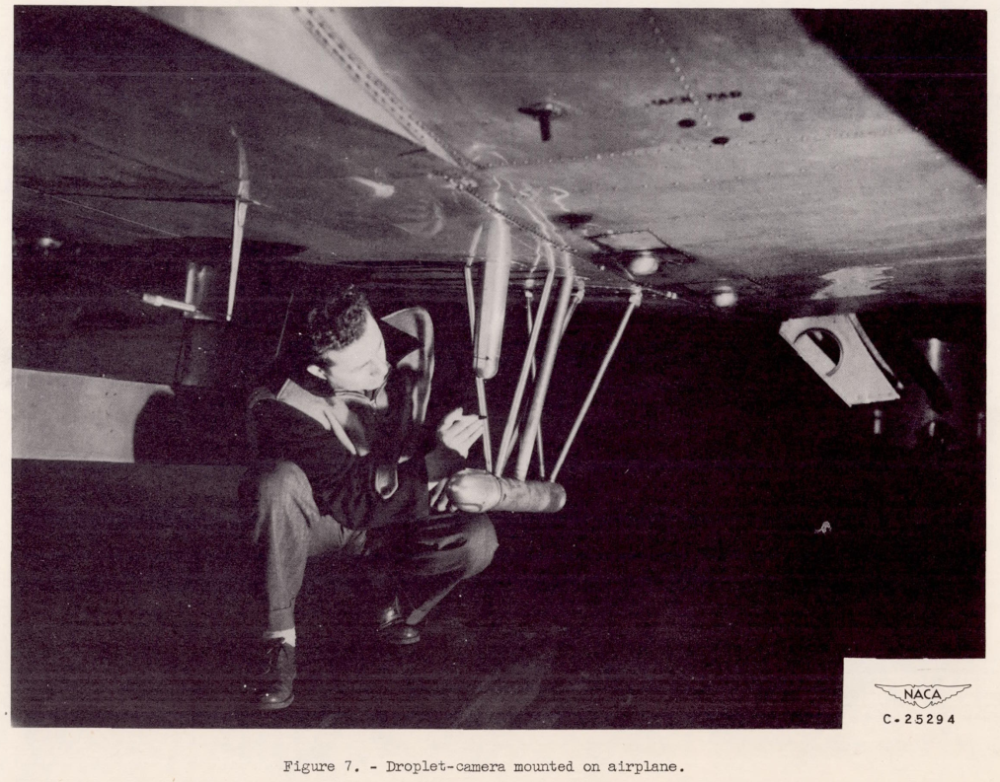
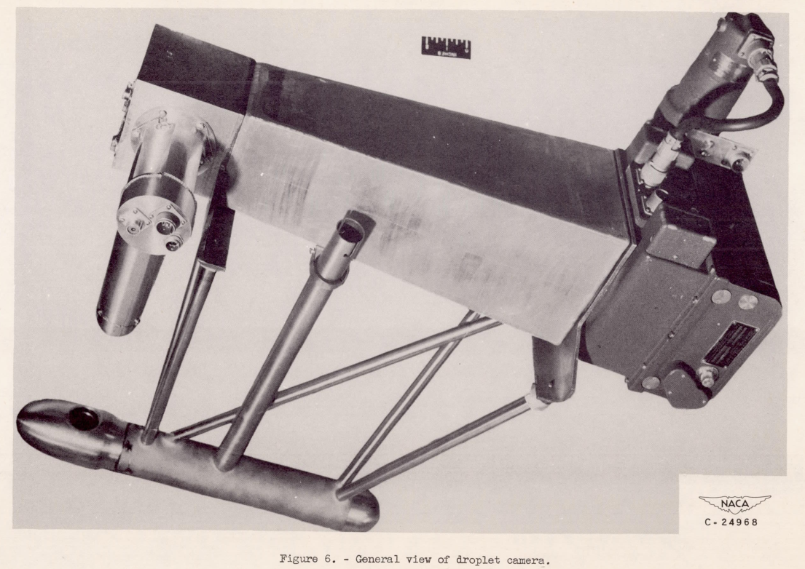
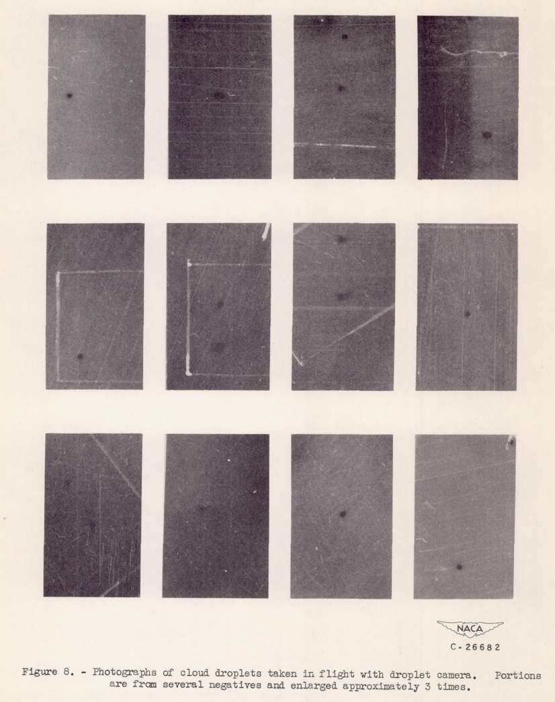
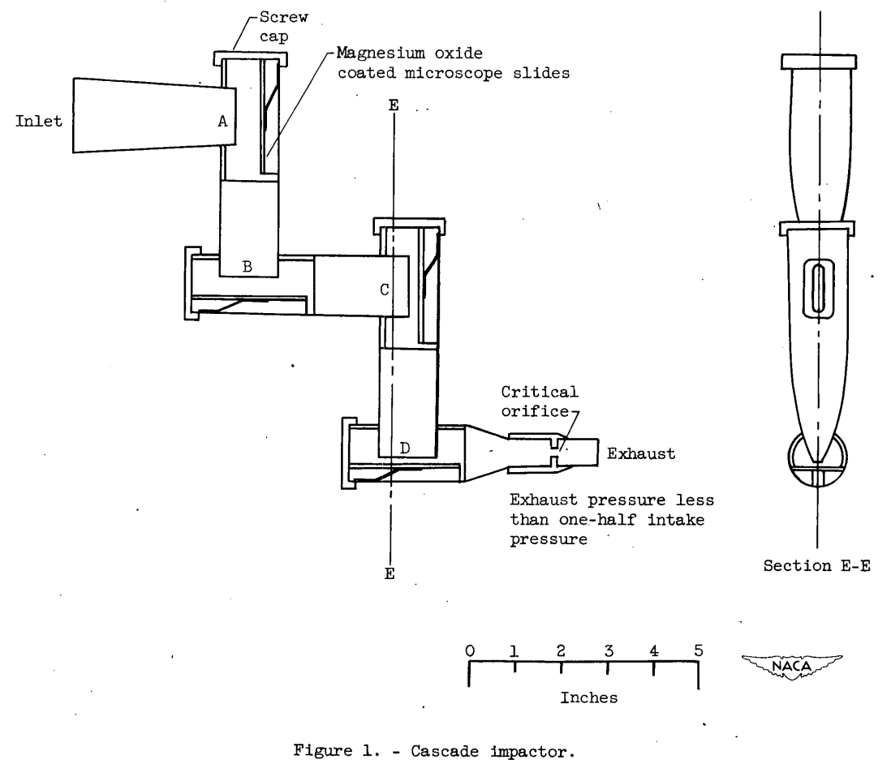
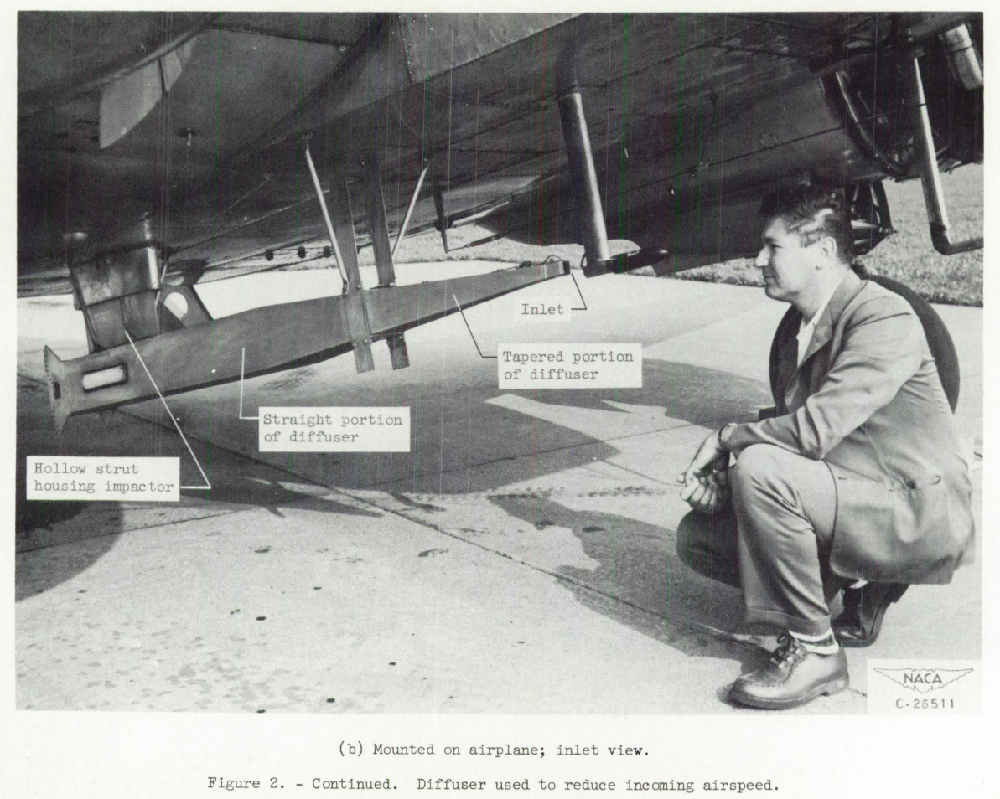
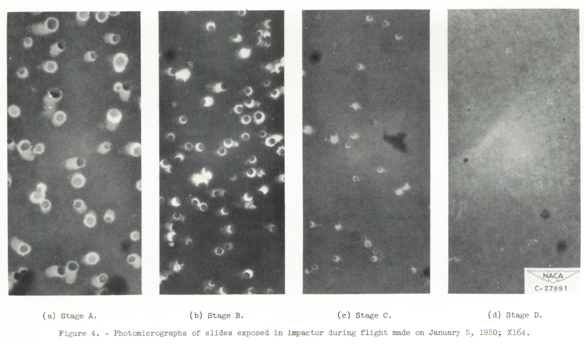
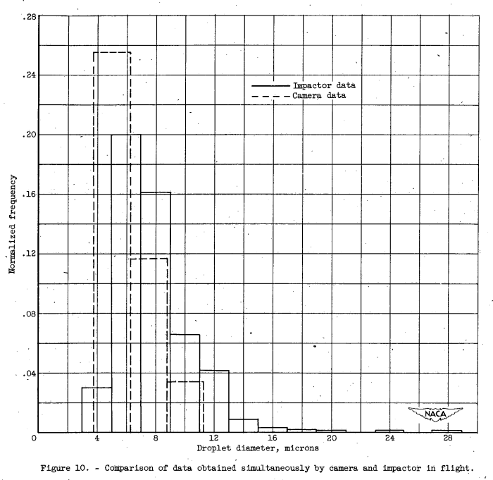
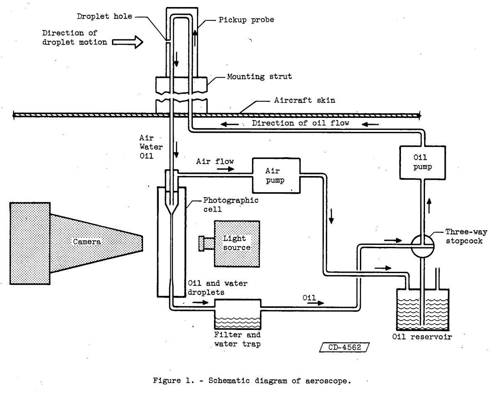
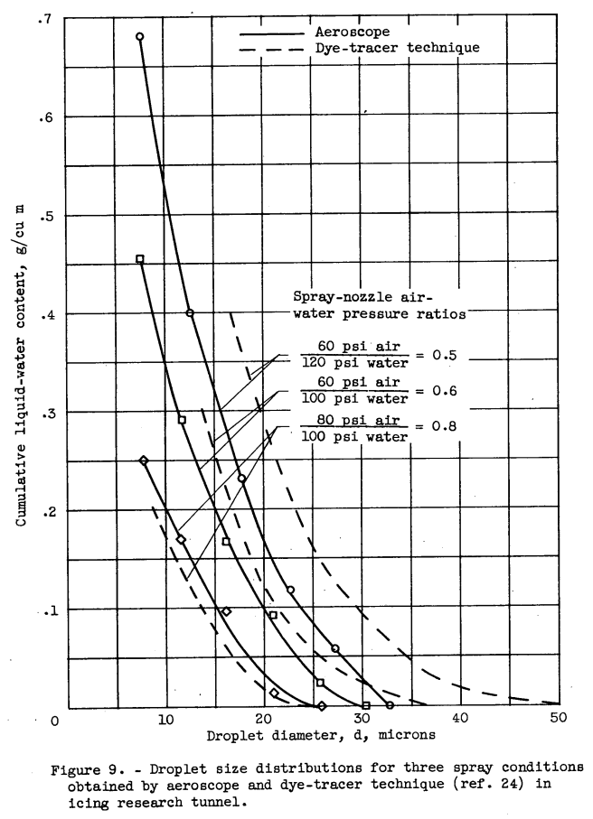

title: Water Drop Imaging  
Date: 2022-12-04 12:00  
Category: NACA  
tags: instruments, water drops  

### _"it is necessary to measure the sizes of the droplets within the clouds."_ [^1]  

# NACA-RM-E50K01a, "Flight Camera for Photographing Cloud Droplets in Natural Suspension in the Atmosphere"    
# NACA-RM-E51G05, "Adaptation of a Cascade Impactor to Flight Measurement of Droplet Size in Clouds"  
# NACA-TN-3592, "An Oil-Stream Photomicrographic Aeroscope for Obtaining Cloud Liquid-Water Content and Droplet Size Distribution in Flight"  

## Summary  

Three strategies were explored for water drop imaging.  
In NACA-RM-E50K01a, a telephoto arrangement allowed imaging water drops in situ.  
In NACA-RM-E51G05, water drops were put through a particle size sorting cascade, impacting on slides, and imaged.  
In NACA-TN-3592, water drops were captured in an oil stream exposed to the ambient flow, and then imaged.  

## Key Points  
1. Three methods for obtaining images of water drops are discussed.  
2. Images of enough water drops allowed the calculation of the drop size distribution.  
3. These instruments had limited influence in the NACA-era.  

## Abstract  

NACA-RM-E50K01a:  
>A camera designed for use in flight has been developed by the NACA
Lewis laboratory to photograph cloud droplets in their natural suspension 
in the atmosphere. A magnification of 32 times is employed to
distinguish for measurement purposes all sizes of droplets greater
than 5 microns in diameter. Photographs can be taken at flight speeds
up to 150 miles per hour at 5-second intervals. A field area of 0.025
square inch is photographed on 7-inch-width roll film accommodating
40 exposures on an 18-foot length. Flight tests conducted in cumulus
clouds have shown that approximate droplet-size distribution studies
can be obtained and that studies of the microstructure and physics of
clouds can be made with the camera.  

NACA-RM-E51G05:  
>A cascade impactor, an instrument for obtaining: the size distribution 
of droplets borne in a low-velocity air stream, was adapted for
flight cloud droplet-size studies. The air containing the droplets was
slowed down from flight speed. by a diffuser to the inlet-air velocity
of the impactor.  
The droplets that enter the impactor impinge on four slides coated
with magnesium oxide. Each slide catches a different size range. The
relation between the size of droplet impressions and the droplet size
was evaluated so that the droplet-size distributions may be found from
these slides. The magnesium oxide coating provides a permanent record.
of the droplet impression that is not affected by droplet evaporation
after the droplets have impinged.

NACA-TN-3592:  
>An airborne cloud aeroscope by which droplet size, size distribution, 
and liquid-water content of clouds can be determined has been developed 
and tested in flight and in wind tunnels with water sprays. In
this aeroscope the cloud droplets are continuously captured in a stream
of oil, which is then photographed by a photomicrographic camera. The
droplet size and size distribution can be determined directly from the
photographs. With the droplet size distribution known, the liquid-water
content of the cloud can be computed from the geometry of the aeroscope,
the airspeed, and the oil-flow rate.  
The aeroscope has the following features: Data are obtained semi-automatically, 
and permanent data are taken in the form of photographs.
A single picture usually contains a sufficient number of droplets to establish 
the droplet size distribution. Cloud droplets are continuously
captured in the stream of oil, but pictures are taken at intervals. The
aeroscope can be operated in icing and non-icing conditions. Because of
mixing of oil in the instrument, the droplet-distribution patterns and
liquid-water content values from a single picture are exponentially
weighted average values over a path length of about 3/4 mile at 150 miles
per hour.
The liquid-water contents, volume-median diameters, and distribution
patterns obtained on test flights and in the Lewis icing tunnel are similar 
to previously published data.

## Discussion    

All three methods above were implemented for flight tests in natural icing conditions.  

Related methods are the sooted slide (see [NACA-RM-A9C09]({filename}NACA-RM-A9C09_instruments.md)) and the oiled slide on which water drops are captured. 
However, these methods do not have an integral camera 
(the slides are manually moved to a microscope for processing or photography). 
These methods are discussed further in Langmuir's "Rising currents ..." [^4], 
and are not detailed herein.  

The figures in each of the publications provides an overview of each method. 

### NACA-RM-E50K01a Flight Camera  

  
_Figure 7 from NACA-RM-E50K01a_  

  
_Figure 6 from NACA-RM-E50K01a_  

  
_Figure 8 from NACA-RM-E50K01a_

### NACA-RM-E51G05 Cascade Impactor  

  
_Figure 1 from NACA-RM-E51G05_  

  
_Figure 2 from NACA-RM-E51G05_  

  
_Figure 4 from NACA-RM-E51G05_  

  
_Figure 10 from NACA-RM-E51G05_  

### NACA-TN-3592 Oil-Stream  

  
_Figure 1 from NACA-TN-3592_  

  
_Figure 3 from NACA-TN-3592_  

  
_Figure 8 from NACA-TN-3592_  

  
_Figure 9 from NACA-TN-3592_  

## Conclusions  

NACA-RM-E50K01a: 
>A camera designed for use in flight has been developed by the
NACA Lewis laboratory to photograph cloud droplets in their natural
suspension in the atmosphere. All sizes of droplets above 5-micron
diameter can be measured from the droplet images on the film. A shadow-graph 
technique is employed with an optical system providing a magnification 
of 32 times. A field area of 0.025 square inch is photographed
on 7-inch-width roll film accommodating 40 exposures on an 18-foot
length. Photographs can be taken at flight speeds up to 150 miles per
hour at 5-second intervals.
Experiments conducted with the camera in flight and in the laboratory 
have provided the following results:  
>1. Cloud droplet-size distribution studies are possible provided
a large number of photographs are used.
>2. The photographs provide a means of studying the microstructure
of clouds and the physical phenomena involved in cloud development and
dissipation.
>3. Images of ice crystals and snow flakes can be distinguished
from each other and from liquid droplets.

NACA-RM-E51G05:  
>From the experience gained with the present impactor-diffuser combination, 
the diffuser as used in its present form apparently is the factor that 
determines the upper limit of proper droplet-size distribution measurement. 
Droplet trajectory computations showed that the
present diffuser causes an appreciable loss of droplets greater than 30 
microns because the cloud droplets in the diffuser suffer gravitational settling. 
The length of the diffuser section could be shortened
by about 30 percent so that droplets as large as 100 microns would not
have settled out appreciably by the time the end of the diffuser section
has been reached. Furthermore, the length of the straight section
should be decreased so that the mouth of the impactor is as close to the
end of the tapered diffuser section as possible. The impactor in turn
must be modified to adapt it to the higher diffuser velocity.

NACA-TN-3592:  
>Determination of droplet size and liquid-water content with the aeroscope 
described herein is a direct procedure; therefore, data obtained by
it are probably more reliable than those obtained by indirect methods such
as rotating cylinders. The probable random error in liquid-water content
measurement is estimated to be ±8 percent. The aeroscope concentrates the
droplets from a small volume of cloud into a much smaller volume of oil
to such an extent that one picture usually contains enough droplets to
establish a distribution. Because of mixing in the air-separator chamber
the liquid-water content and droplet size distributions arrived at from
a single picture are average values over a sample path length of approximately 
3/4 mile. Values of liquid-water content and droplet size obtained
on test flights are similar to values obtained by other methods. The aeroscope 
may be operated at any altitude and temperature and over a large
range of airspeeds.  
The test model of the aeroscope occupies about 6 cubic feet and
weighs about 100 pounds. These values could be greatly reduced in future
designs, since little attention was paid to weight and volume in the design 
of the test model. The test model of the aeroscope is semiautomatic
in that pictures are taken automatically by the use of an intervalometer.
The aeroscope could be made more fully automatic by photographing on the
same film as the droplets an instrument panel containing a clock, air-speed 
indicator, altimeter, and temperature indicator.

Results from these instruments agreed approximately with other instruments, 
and yielded something close to the expected normal or Langmuir drop size distributions
(see ["A Langmuir B distribution is (almost) a normal distribution"]({filename}A Langmuir B distribution is almost a normal distribution.md)). 

Water drop photography had only limited contributions to icing research in the NACA-era. 

I believe the challenges noted in [NACA-RM-A9C09]({filename}NACA-RM-A9C09_instruments.md) hampered wider use:
>Disadvantages.-  
>1. A large number of photographs are required.  
>2. Evaluation of the data is very lengthy and tedious.  
>3. The photographic equipment is somewhat bulky.  

The method would benefit in the post-NACA era from laser light illumination 
and computer processing of the water drop images. 

I do not know of further development of the cascade impactor or oil stream methods. 

##Citations  

NACA-RM-E50K01a cites two publications:   
- Elliott, H. W.: Cloud Droplet Camera. Rep. No. MI-701, Div. Mech. Eng., 6220 F-24l, Nat. Res. Labs. (Ottawa), Dec. 26, 1947.  
- Young, Allen E., McCullough, Stuart, and Smith, Richard L.: Power Unit for High-Intensity Light Source. NACA-RM-E50K27, July, 1951.  

NACA-RM-E51G05  cites six publications:   
- Langmuir, Irving, and Blodgett, Katherine B.: A Mathematical Investigation of Water Droplet Trajectories. Tech. Rep. No. 5418, Air Materiel Command, AAF, Feb. 19, 1946. (Contract No. W-33-038-ac-9151 with General Electric Co.)  
- Clark, Victor F.: The Multicylinder Method. The Mount Washington Monthly Res. Bull., vol. II, no. 6, June 1946.  
- May, K. R.: The Cascade Impactor: An Instrument for Sampling Coarse Aerosols. Jour. Sd. Instruments, vol. XXII, no. 10, Oct. 1945, pp. 187-195.  
- May, K. R.: The Measurement of Airborne Droplets by the Magnesium Oxide Method. Jour. Sc Instruments, vol. XXVII, no. 5, May 1950, pp. 128-130.  
- Vonnegut, B., Cunningham, R. M., and Katz, R. E.: Report on Instruments for Measuring Atmospheric Factors Related to Ice Formation on Airplanes. Tech. Rep. 5519, Air Materiel Command, AAF, Aug. 13, 1946. (Contract No. W-33-038-ac-5443.)  
- McCullough, Stuart, and Perkins, Porter J.: Flight Camera for Photographing Cloud Droplets in Natural Suspension in the Atmosphere. NACA-RM-E50K01a, 1951.  

NACA-TN-3592 cites 26 publications:   
- Langmuir, Irving, and Blodgett, Katherine B.: A Mathematical Investigation of Water Droplet Trajectories. Tech. Rep. No. 5418, Air Materiel Command, AAF, Feb. 19, 1946. (Contract No. W-33-038-ac-9151 with General Electric Co.)  
- Brun, Rinaldo J., and Mergler, Harry W.: Impingement of Water Droplets on a Cylinder in an Incompressible Flow Field and Evaluation of Rotating Multicylinder Method for Measurement of Droplet-Size Distribution, Volume-Median Droplet Size, and Liquid-Water Content in Clouds. NACA-TN-2904, 1953 [ntrs.nasa.gov](https://ntrs.nasa.gov/citations/19930083606).   
- Lewis, William, Perkins, Porter J., and Brun, Rinaldo J.: Procedure for Measuring Liquid-Water Content and Droplet Sizes in Super-cooled Clouds by Rotating Multicylinder Method. NACA-RM-E53D23, 1953.  
- Pettit, K. G.: Nephelometric Instrumentation for Aircraft Icing Research. Rep. No. MD-33, National Res. Council of Canada (Ottawa), Aug. 1950.  
- Brun, Rinaldo J., Levine, Joseph, and Kleinknecht, Kenneth S.: An Instrument Employing a Coronal Discharge for the Determination of Droplet-Size Distribution in Clouds. NACA-TN-2458, 1951.  
- McCullough, Stuart, and Perkins, Porter J.: Flight Camera for Photographing Cloud Droplets in Natural Suspension in the Atmosphere. NACA-RM-E50K01a, 1951.  
- Elliott, H. W.: Cloud Droplet Camera. Rep. No. MI-701, Div. Mech. Eng., 6220 F-24l, Nat. Res. Labs. (Ottawa), Dec. 26, 1947.  
- Bigg, F. J., and Abel, G. C.: Note on Sampling and Photographing Cloud Droplets in Flight. Tech. Note No. Mech. Eng. 156, British R.A.E., Sept. 1953.  
- Vonnegut, B., Cunningham, R. M., and Katz, R. E.: Report on Instruments for Measuring Atmospheric Factors Related to Ice Formation on Airplanes. Tech. Rep. 5519, Air Materiel Command, AAF, Aug. 13, 1946. (Contract No. W-33-038-ac-5443.)  
- Houghton, H. G., and Radford, W. H.: On the Measurement of Drop Size and Liquid Water Content in Pogs and Clouds. Papers in Phys. Oceanography and Meteorology, publ. by M.I.T. and Woods Hole Oceanographic Inst., Cambridge and Woods Hole (Mass.), vol. VI, no. 4, Nov. 1938, pp. 5-31.  
- Bowers, R. D., ed.: Basic Icing Research by General Electric Company, Fiscal Year 1946. AAF Tech. Rep. 5539, Sec. 3, Jan. 1947.  
- Jones, Alun R., and Lewis, William: A Review of Instruments Developed for the Measurement of the Meteorological Factors Conducive to Aircraft Icing. NACA-RM-A9C09, 1949 [ntrs.nasa.gov](https://ntrs.nasa.gov/citations/19810068733).  
- Pettit, K. G.: On the Measurement of the Properties of Supercooled Clouds. Rep. No. NAE 1954, Quarterly Bull. Apr. 1 - June 30, 1954, Nat. Aero. Establishment, Ottawa (Canada).  
- Neel, Carr B., Jr.: A Heated-Wire Liquid-Water-Content Instrument and Results of Initial Flight Tests in Icing Conditions. NACA-RM-A54I23, 1955.  
- Levine, Joseph, and Kleinknecht, Kenneth S.: Adaptation of a Cascade Impactor to Flight Measurement of Droplet Size in Clouds. NACA-RM-E51G05, 1951.  
- Baxter, D. C.: A Review of Radiation Scattering Methods for Measuring Cloud Droplet Size. Rep. No. MD-40, Nat. Res. Council of Canada (Ottawa), Apr. 1954.  
- Johnson, John C., Eldridge, Ralph G., and Terrell, James R..: An Improved Infrared Transmissometer for Cloud Drop Sizing. Sd. Rep. No. 4, Dept. Meteorology, M.I.T., July 1954. (Contract No. AF19 (122)-245.)  
- Perkins, Porter J., McCullough, Stuart, and Lewis, Ralph D.: A Simplified Instrument for Recording and Indicating Frequency and Intensity of Icing Conditions Encountered in Flight. NACA-RM-E51E16, 1951 [ntrs.nasa.gov](https://ntrs.nasa.gov/citations/19810068729).  
- Kline, Dwight B.: Investigation of Meteorological Conditions Associated with Aircraft Icing in Layer-Type Clouds for 1947-48 Winter. NACA-TN-1793, 1949. [ntrs.nasa.gov](https://ntrs.nasa.gov/citations/19930082468)
- Lewis, William, and Hoecker, Walter H., Jr.: Observations of Icing Conditions Encountered in Flight During 1948. NACA-TN-1904, 1949. [ntrs.nasa.gov](https://ntrs.nasa.gov/citations/19810068853)
- Lewis, William, Kline, Dwight B., and Steinmetz, Charles P.: A Further Investigation of the Meteorological Conditions Conducive to Aircraft Icing. NACA-TN-1424, 1947. [ntrs.nasa.gov](https://ntrs.nasa.gov/citations/19810068854)
- Kline, Dwight B., and Walker, Joseph A.: Meteorological Analysis of Icing Conditions Encountered in Low-Altitude Stratiform Clouds. NACA-TN-2306, 1951. [ntrs.nasa.gov](https://ntrs.nasa.gov/citations/19810068851)
- Lewis, William: A Flight Investigation of the Meteorological Conditions Conducive to the Formation of Ice on Airplanes. NACA-TN-1393, 1947. [ntrs.nasa.gov](https://ntrs.nasa.gov/citations/19930082038)
- von Glahn, Uwe H., Gelder, Thomas F., and Smyers, William H., Jr.: A Dye-Tracer Technique for Experimentally Obtaining Impingement Characteristics of Arbitrary Bodies and a Method for Determining Droplet Size Distribution. NACA-TN-3338, 1955.  
- Fraser, D., Rush, C. K., and Baxter, D. C.: Thermodynamic Limitations of Ice Accretion Instruments. Nat. Aero. Establishment, Ottawa (Canada), LR-32, Aug. 22, 1952.  
- Rupe, Jack H.: Critical Impact Velocities of Water Droplets as a Problem in Injector-Spray Sampling. Prog. Rep. No. 4-80, Jet Prop. Lab., C.I.T., Sept. 29, 1950.  

NACA-RM-E50K01a is cited by two publications in the NACA Icing Publications Database [^5]:   
- Levine, Joseph, and Kleinknecht, Kenneth S.: Adaptation of a Cascade Impactor to Flight Measurement of Droplet Size in Clouds. NACA-RM-E51G05, 1951.  
- Dorsch, Robert G., and Brun, Rinaldo J.: Variation of Local Liquid-Water Concentration about an Ellipsoid of Fineness Ratio 5 Moving in a Droplet Field. NACA-TN-3153, 1954. [ntrs.nasa.gov](https://ntrs.nasa.gov/citations/19810068690)  

An online search found NACA-RM-E50K01a cited 19 times [^6].

NACA-RM-E51G05  is cited by one publication in the NACA Icing Publications Database [^5]:   

- Hacker, Paul T.: An Oil-Stream Photomicrographic Aeroscope for Obtaining Cloud Liquid-Water Content and Droplet Size Distribution in Flight. NACA-TN-3592, 1956.  

An online search found NACA-RM-E51G05 cited 5 times [^7].

NACA-TN-3592 is cited by three publications in the NACA Icing Publications Database [^5]:   
  
- Brun, Rinaldo J., and Vogt, Dorothea E.: Impingement of Cloud Droplets on 36_5-Percent-Thick Joukowski Airfoil at Zero Angle of Attack and Discussion of Use as Cloud Measuring Instrument in Dye-Tracer Technique. NACA-TN-4035, 1957.  
- Brun, Rinaldo J., and Vogt, Dorothea E.: Impingement of Cloud Droplets on 36_5-Percent-Thick Joukowski Airfoil at Zero Angle of Attack and Discussion of Use as Cloud Measuring Instrument in Dye-Tracer Technique. NACA-TN-4035, 1957.
- Perkins, Porter J., Summary of Statistical Icing Cloud Data Measured over United States and North Atlantic, Pacific, and Artict Oceans during Routine Aircraft Operations. NASA-Memo-1-19-59E, January, 1959. https://archive.org/details/nasa_techdoc_19810068860/page/n9/mode/2up   
  
An online search found NACA-TN-3592 cited 6 times [^8].

## Notes  

[^1]: McCullough, Stuart, and Perkins, Porter J.: Flight Camera for Photographing Cloud Droplets in Natural Suspension in the Atmosphere. NACA-RM-E50K01a, 1951  [ntrs.nasa.gov](https://ntrs.nasa.gov/citations/19930086460).  
[^2]: Levine, Joseph, and Kleinknecht, Kenneth S.: Adaptation of a Cascade Impactor to Flight Measurement of Droplet Size in Clouds. NACA-RM-E51G05, 1951[ntrs.nasa.gov](https://ntrs.nasa.gov/citations/19810068731).  
[^3]: Hacker, Paul T.: An Oil-Stream Photomicrographic Aeroscope for Obtaining Cloud Liquid-Water Content and Droplet Size Distribution in Flight. NACA-TN-3592, 1956 [ntrs.nasa.gov](https://ntrs.nasa.gov/citations/19810068735).  
[^4]: Langmuir, Irving: Super-Cooled Water Droplets in Rising Currents of Cold Saturated Air, Pt. I. Res. Lab., General Electric Co., Oct. 1943-Aug. 1944. (Army Contract W-33-106-sc-65.)  
[^5]: [NACA icing publications database]({filename}naca%20icing%20publications%20database.md)  
[^6]:  [NACA-RM-E50K01a scholar.google.com](https://scholar.google.com/scholar?hl=en&as_sdt=0%2C48&q=NACA-RM-E50K01a&btnG=)  
[^7]:  [NACA-RM-E51G05 scholar.google.com](https://scholar.google.com/scholar?hl=en&as_sdt=0%2C48&q=NACA-RM-E51G05&btnG=)   
[^8]:  [NACA-RTN-3592 scholar.google.com](https://scholar.google.com/scholar?hl=en&as_sdt=0%2C48&q=NACA-TN-3592&btnG= )
 
 