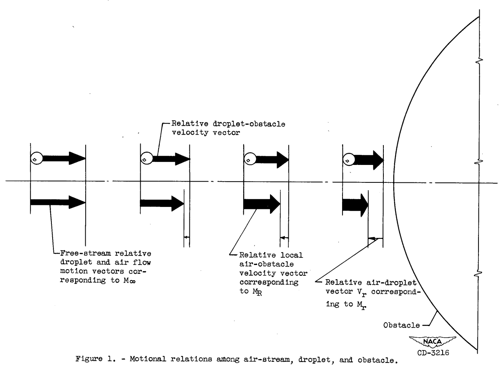

title: Water drop evaporation  
Category: Diversions  

###_"snow-flakes will form and these will grow by vapor condensation and by evaporation of fog droplets" [^1]_  

  

##A "mini-thread" on the evaporation of water drops  

This thread will have a mix of NACA-era and post-NACA era data. 

##Topics:

###[Irving Langmuir, "Super-Cooled Water Droplets in Rising Currents of Cold Saturated Air"]({filename}Langmuir Rising Currents.md)  
>Evaporation and condensation rates on water drops are calculated. 

###[Let's build a 1D particle motion simulation: Impingement on the stagnation point of a cylinder]({filename}build_a_1d_drop_motion_simulation.md)  
>A 1D water drop motion simulation is built. 

###[The AEDC 1-Dimensional Multi-Phase code (AEDC1DMP) and the iads1dmp]({filename}aedc1dmp.md)    
>Water drop evaporation rates in an icing tunnel are calculated.

NACA-TN-3024 revisited  

<!--
Effect of humidity on icing tunnel tests  

A more detailed ice detector simulation  
-->

##Notes:

[^1]:
Langmuir, Irving: Super-Cooled Water Droplets in Rising Currents of Cold Saturated Air, Pt. I. Res. Lab., General Electric Co., Oct. 1943-Aug. 1944. (Army Contract W-33-106-sc-65.)  

