Title: The Greatest Thing That You Have (Probably) Never Read: 1969 Aircraft Ice Protection Report of Symposium, Ramon Wilder [^1]  
Category: Diversions  

###_"The upper surface [ice] horn acts as a spoiler, increasing drag, and reducing lift."_  

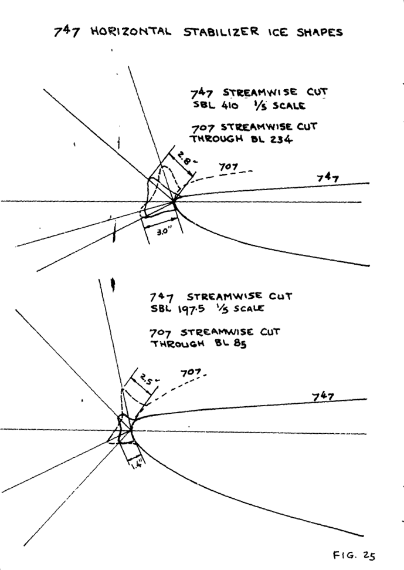  

#"Techniques Used to Determine Artificial Ice Shapes and Ice Shedding, Characteristics of Unprotected Airfoil Surfaces" [^1]  

##Summary 
Glaze ice shape correlations for two commercial aircraft airfoils are developed.

##Key Points 
1. Icing wind tunnel tests with two commercial aircraft airfoils were conducted.  
2. Glaze ice shape correlations were developed.  
3. Airplane level ice effects are detailed.  
4. The state of the art in 1969 is documented.  

##A Note

I briefly worked with Ramon Wilder (circa 1991?), 
but I did not ask him about this particular publication. 
I (a much junior engineer) did off-handedly ask him once about a certain heat conduction equation. 
He said "I'll get back to you." 
The next day he came in with a elegant, hand written, 10 page proof, and said 
"That was a little tough. It took me three hours last night!" 
That was the kind of engineer Ramon was.

##Summary  

>To determine the need for airfoil ice protection systems and the effects
of large ice shapes on airplane performance, The Boeing Company has conducted
comprehensive flight test programs utilizing artificial ice shapes attached
to tail and wing surfaces.  

>The ice accretion information available from published data for determining
the ice shapes was applicable to unswept airfoils at limited angles of attack.
Therefore, Boeing initiated a research program to obtain basic ice accretion
and ice shedding data on typical jet transport swept airfoils. This program
sponsored by the Federal Aviation Agency was conducted in the NASA 6-foot by
9 foot icing tunnel at Cleveland, Ohio.  

>Ice accretion tests were conducted on two swept airfoil sections representative 
of the inboard and outboard wing or horizontal stabilizer airfoil
sections of typical jet transports. The size and shape of these ice accretions
were measured through photographs end actual plaster casts of the ice cap. Tests
were conducted over a range of simulated flights and icing conditions designed
to give the rough or glaze shape which results in the highest drag penalty.
These test results were than correlated with theoretical water impingement
parameters obtained from a digital computer program.  

>Ice accretion characteristics are discussed and shown to be dependent on
airfoil shape, particularly leading edge radius, camber and angle of attack.
The test data and results are comparable to limited published ice accretion
data on an unswept 65AOO4 airfoil.  

>An empirical relationship is developed 
which correlated measured ice accretion
rates with theoretical water impingement parameters. The correlation was
obtained primarily by use of glaze ice heights and angles measured from the
plaster casts of the actual ice shapes so taken from the two swept airfoil
models.  

>A calculation procedure for determining artificial ice shapes is also
developed using the ice shape correlation curves and illustrated for the 747
horizontal stabilizer.  

>The complex trends of the data obtained in this test program precluded a
general ice accretion relationship with other airfoils. Airfoil camber or
shape and angle of attack were found however, to be significant in determining 
the size and shape of the ice cap. Additional testing of other
airfoil shapes and angle of attack would be desirable to provide for broader
application of the ice cap calculation procedures developed herein.  

>Airplane performance penalties associated with icing in terms of landing
weight penalties and when these penalties arr assessed are also discussed.
Destination airport temperatures and ice shedding characteristics are shown
to be significant in determining the frequency of aerodynamic penalties due
to ice.  

>A method of calculating the airfoil ice interface temperature and
predicting the time the ice will shed has been developed using icing tunnel
test data in conjunction with a heat transfer analysis. The ice shedding
calculation procedure is demonstrated and shown to be conservative from
natural icing flight teat data.
Different types of descent profiles are
considered and operating procedures are discussed to ensure ice shedding
prior to approach flight conditions.

##Discussion  

This is a long publication (75 pages, 40 figures). 
In the interest of brevity the focus here will be on the ice shape correlations. 
There is much else also of interest in this publication, 
such as ice shedding and icing conditions selection,
that readers are encouraged to study in the full publication. 
However, this will still be a lengthy review.

This was published after the NACA-era, at the [same conference]({filename}1969 Aircraft Ice Protection Report of Symposium.md) 
where the original ["Selected Bibilography of NACA-NASA Aircraft Icing Publications"]({filename}/The Historical Selected Bibliography of NACA-NASA Icing Publications.md) 
was published. 
It is clear that this publication was influenced by the NACA-era, as ADS-4 is referenced 
and [NACA-TN-4151]({filename}NACA-TN-4151.md) was used as a starting point for this investigation 
of commercial aircraft airfoils. 

This gives us a detailed snapshot of at least 
one airplane manufacturer's "state of the art" for determining ice shapes in 1969.  

###Calculation Procedures  

>Procedures developed for determining the ice cap size by various
manufacturers are based on calculating the airfoil water catch and adjusting
this water catch or ice thickness into a typical mushroom ice shape. 
For rime ice, the ice thickness and shape can be calculated directly from
the
local water catch and ice density since the water freezes immediately on
contact with the airfoil.
The local ice thickness is related to the local
water catch by:  
```text
delta_i = w_beta * theta / gamma_i                (1)

where 
      delta_i = ice thickness, feet
      w_beta = local water catch rate
      theta = icing time, minutes or hour
      gamma_i = ice density

```

Note the "Procedures developed for determining the ice cap size __by various manufacturers__". 
Several of my mentors had worked as more than one aircraft company, 
and there was a fair amount of "cross pollination" of ideas. 

>Thus, a theoretical ice shipe for rine ice can be estimated by calculatine
the local water catch for various positions in the impingenent area by:
```text
w_beta = 0.38 * beta * V * cos(sweep*w)           (2)

where 
      beta = local water catch efficiency
      V = airspeed, knots
      sweep = airfoil sweep angle
      w = cloud liquid water content, g/m^3

```
>This procedure, with modifications, was used for calculating the ice 
shapes for 707 and 727 series airplanes. To account for glaze icing and the
effects of ice shape on water impingement, the following procedure was used. 
The maximum local water catch efficiency beta_max was assumed to be 1.0, that
is all of the water in the cloud in the path of the airfoil would impinge
on the airfoil. This assumption was made to account for the effects of ice 
shape on water collection efficiencies. This assumption is approximately
correct for small airfoils where the maximum local collection efficiency 
is near 0.8, but becomes overly conservative for larger inboard wings and
stabilizers where the collection efficiencies are less than 0.5. The ice 
thickness calculated using beta_max equals 1.0 was then adjusted to give 
a typical mushroom or glaze ice shapes using the known impingement limits. 

In other procedures, References 2 and 6, the ice shape is determined from 
the calculated total water catch from bare airfoil impingement data as:
```text
w_c = 0.38 * V * cos(sweep) * Em * H / c * c * w  (3)

where
      w_c = total water catch rate, lbm/h/ft.LE
      Em = total water chatch efficiency
      H = airfoil projected height, feet
      c = airfoil chord length, feet

```

This water catch rate is in terms of pounds of ice per hour per foot of span. 
The cross-sectional area of the ice cap is then:
```text
Area = 144 * w_c * theta / gamma_i                (4)

```
>A double peaked glaze ice shape such as shown in Figure 6 is then drawn by 
trial
and error which contains the calculated theoretical cross-sectional
area. 

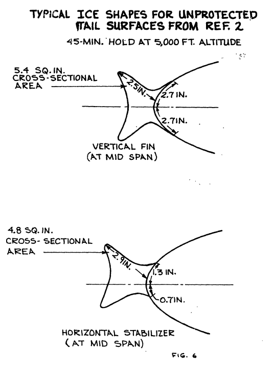  

>The above calculation procedues only approximate the actual ice shape
since accurate ice accretion data for most airfoils is not available. 
Also,
water drop sizes and resultant collection efficiencies must be checked for the
water catch. Figure 7 shows a typical plot of the effect of drop
size on collection efficiency and cloud liquid water content. This
calculation will generally show that the maximum catch rate will occur with
20 to 25 micron droplets.

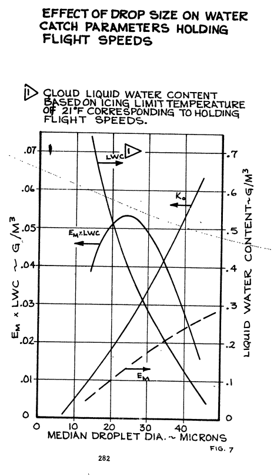  

>A correlation of measured ice shapes from icing tunnel tests with
theoretical impingement parameters has been reported in Reference
(NACA TN 4151) for an unswept symmetrical four percent thick airfoil. 
The
data in this report for mushroom ice plotted in a slightly different manner
as shown in Figure 8. It indicates the measured maximum ice height is less
than the theoretical height based on the maximum local water catch. This
is not surprising since all of the impinging water does not freeze at the
point of maximum
collection efficiency under these icing conditions.
Unfortunately, there is no similar published data for highly cambered swept
airfoils. Therefore Boeing initiated a research program to obtain basic ice
accretion data on two airfoils representative of the inboard wing and
horizontal stabilizer configuration of typical current jet transport aircraft.
This program a conducted in the NASA 6 foot by 9 foot icing tunnel at
Cleveland, Ohio. Frm ice accretion data obtained in the test program, an
emperical relationship was obtained which correlated ice accretion thickness
and ice angles with theoretical impingement parameters. Use of these
relationships allows the direct determination of ice shapes adjusted for any
given icing and flight condition as well as for size and sweep of the airfoil.

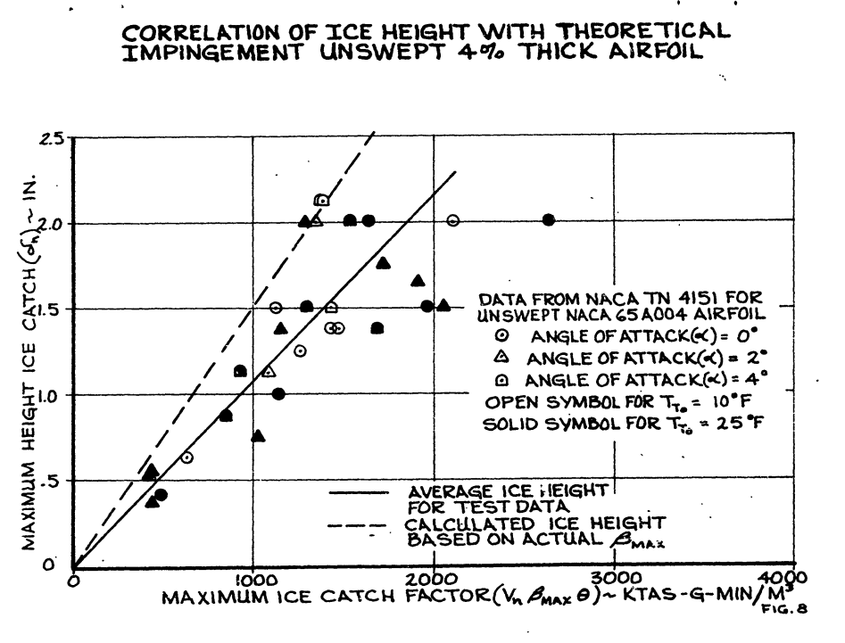  

>The revised 737 inboard wing and 747 tail surface ice shapes have been
determined from these data. These shapee show good agreement with the
707/727
ice thicknesses at the horizontal stabilizer tip. However, the
ice accretion test data indicated a more blunt ice shape due to the effects
of airfoil sweep than the "hammerhead" shape use in previous 707/727 flight
test programs.  

>Since this procedure is substantially different than currently used
in the aircraft industry, the test program and results are of interest and
will be briefly discussed.

###Ice Accretion Test Setup and Procedure  

>The models used in this study were chosen to represent the type of airfoils
used on present-day commercial jet aircraft. Cross-sections of these airfoils
are shown in Figure 9. One model, designated BAC 450, was typical of an
inboard wing section with a 12.5 percent thickness ratio and 27.5 degree 
sweep angle. The other model, designated BAC 470, represented outboard wing
and horizontal stabilizer sections with an eight percent thickness ratio and
40 degree sweep angle. These models,
shown in Figure 10, have a 6 foot
streamwise span and chord length and were mounted vertically in the Lewis
icing tunnel at Cleveland. Ohio. Each model was fabricated from aluminum with
six thermocouples end three electrical heater pads marked A, B, end C in
Figure 10, bounded to the inner surface of the leading edge. The thermocouples
were used to monitor the leading edge surface temperature during icing
runs and the heater pads were used to assist in removing ice samples.

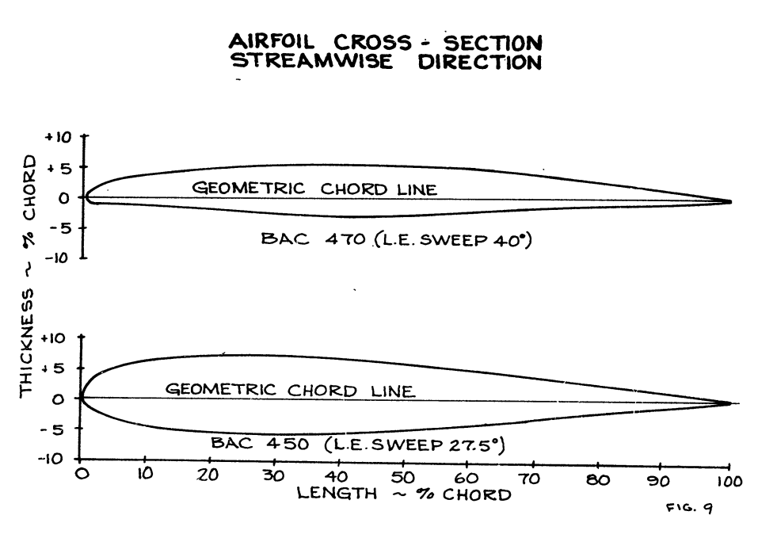  

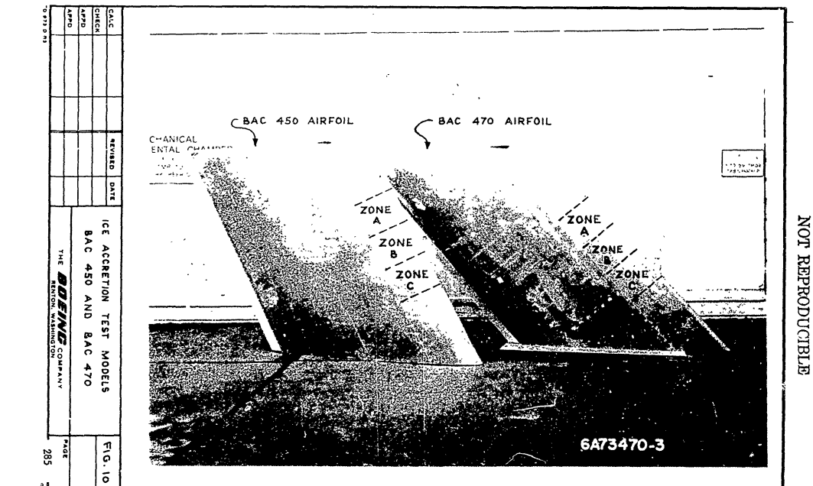  

>Icing conditions in the tunnel were obtained and measured according to
previously established techniques and calibrations. Icing cloud factors
considered in this study were cloud liquid water content, icing time,
airspeed, and temperature. Cloud droplet size could not be varied independently
due to the limitations in the design of the tunnel spray system. As a result,
the cloud droplet sizes increased with increased liquid water content and
decreased with an increase in airspeed.  

>An icing run consisted of a 7.5 or 15 minute exposure of the model to a
particular set of icing conditions and airfoil angle of attack. On completion
of the prescribed icing time, the tunnel was stopped and measurements taken
of the final ice shape. One or more sections of the ice cap, approximately
six inches in length, were removed using the heater pads and the ice scraper
used in Reference 4 tests. This scraper is steam heated and has an internal
vacuum chamber to assist in drawing off the melted ice so as not to affect
the sample weight or shape. The removed sections were than dipped repeatedly
in liquid paraffin to create a mold of the ice shape. When the ice in the
mold melted, it was poured into a beaker and weighed. The resultant cavity
was then refilled with tap water which was then poured into the beaker and
weighed to determine the specific gravity of the ice. Representative values
of the specific gravity of the ice cap measured in this manner were from 0.75
to 0.91. 

>A replica of the ice sample was then made by pouring plaster of paris
into the mold and later melting the wax in an oven.

>Sample plaster ice cap photographs are shown in Figures 13 and 14.

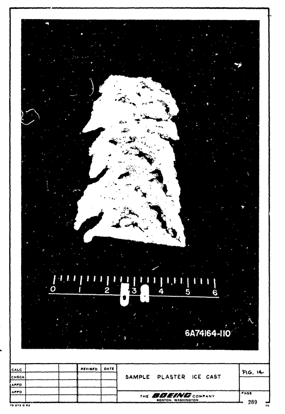  

>After the ice sample was removed from the mold, the cross-section of the 
ice cap was photographed against a 1/4-inch wire mesh grid held normal to
the airfoil leading edge. A typical ice cap cross-section is shown in
Figure 15. Due to the difficulty in discerning the cross-sectional outline 
from the photographs, all ice cap measurements were made from the plaster
casts as defined in Figure 16. 

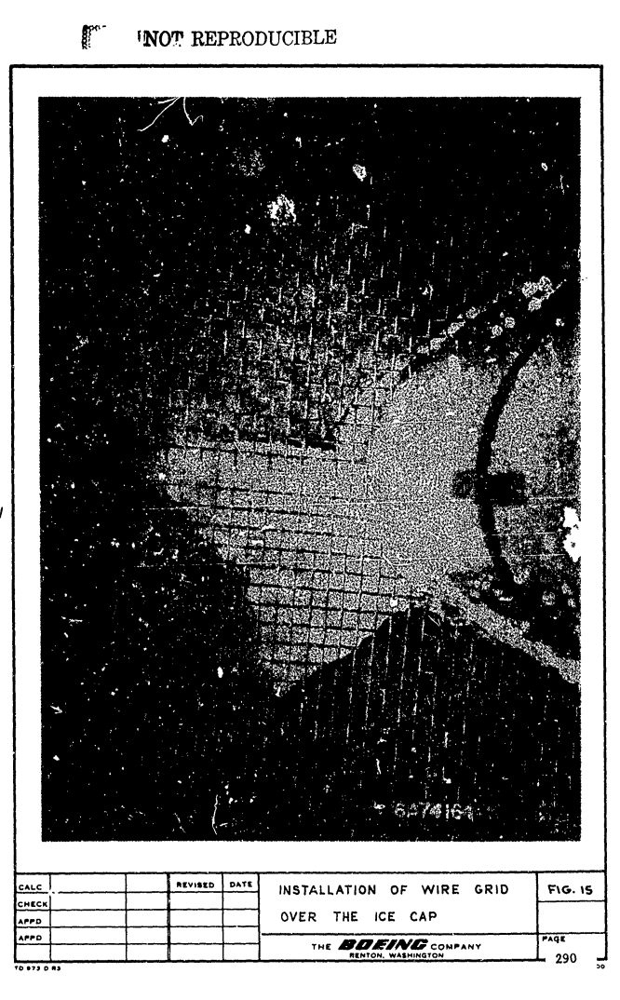  

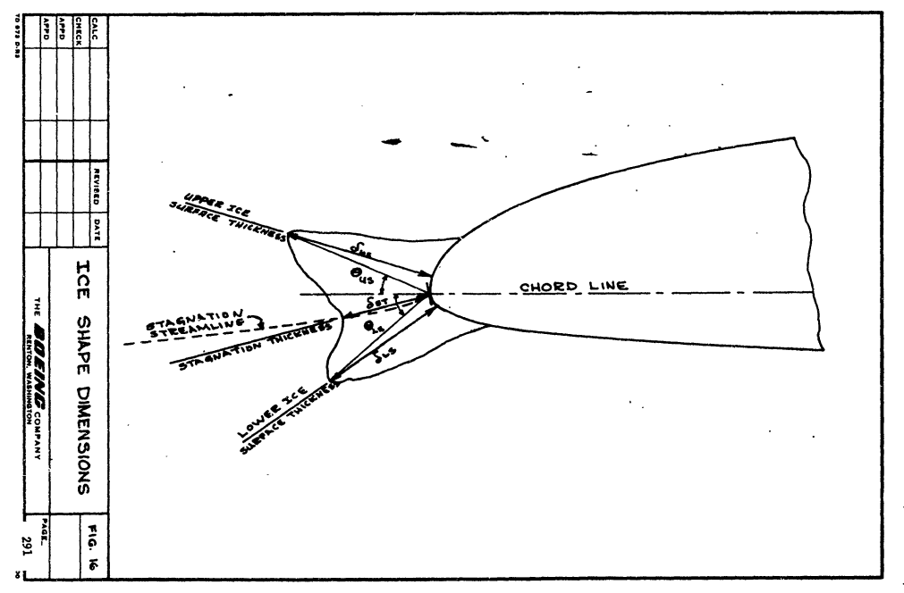  

>The majority of the ice samples were of the glaze type with typical double
horn protuberances. A few rime ice samples were obtained and the remainder 
were a mixture of the two. Figure 17 shows representative ice shapes obtained 
during this test program. The effect of the wing sweepback was most noticeable 
in the discontinuous cup shapes formed in the spanwise directions as shown in 
Figures 18 and 19. 

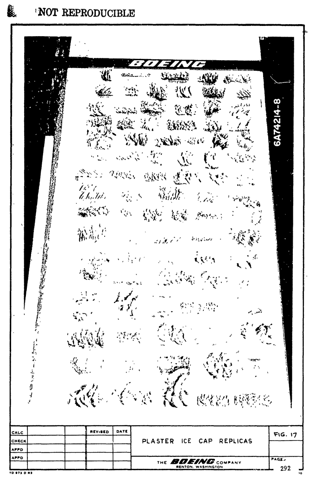  
[Years later, these plaster casts had been dispersed and kept on desks as "trophies".]  

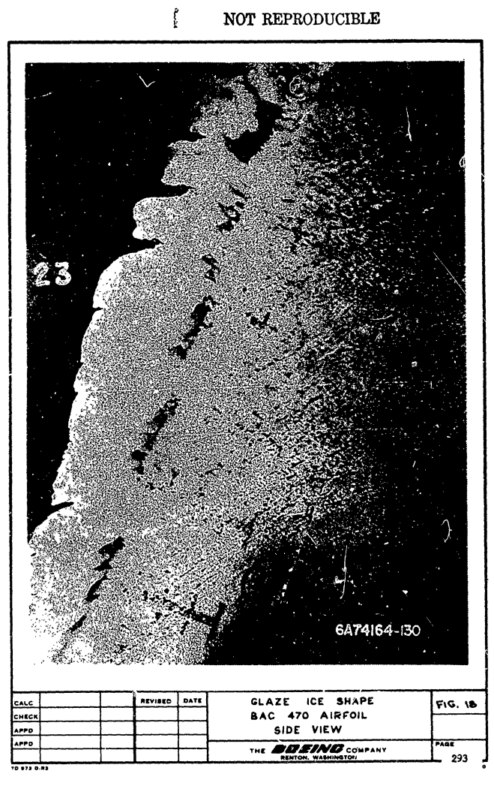  

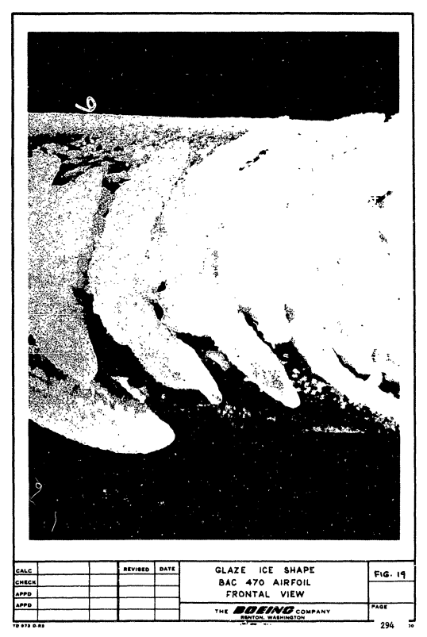  

>The separations were most prominent in the glaze ice formations and became
larger
as the ice thickness increased. In those samples which tended toward
rime ice, the distance between individual cups decreased and in some cases
was a continuous solid ice cap along the span of the airfoil.

>The leading edge temperatures for the glaze icing runs varied between
25 and 29 F. Dues to the relatively high thermal conductivity of the aluminum
leading edge (typical of current aircraft configurations) the chordwise
temperature gradient under the ice cap was negligible. Had the leading edge
be made of an insulating material, the ice cap could have had a significantly
different shape since the impinging water would see a warmer stagnation
point surface temperature. This would allow the water to flow further along
the surface before freezing. No attempt was made in this study to determine
the magnitude of this effect of material properties on ice shape. 

Having worked with aircraft both aluminum and composite leading edge materials, 
I have not seen a notable effect due to material.

###Theoretical Impingement Characteristics  

>The theoretical impingement characteristics in terms of water drop
collection efficiency and impingement limits is shown In Figure 20 for the two
angles of attack considered in this study. These data were obtained from a
water droplet trajectory computer program and are plotted as a function of
a modified inertia parameter Ko. This parameter described and defined in
Reference 5 allows the
impingement data taken for one flight condition to be
used for other flight conditions. 

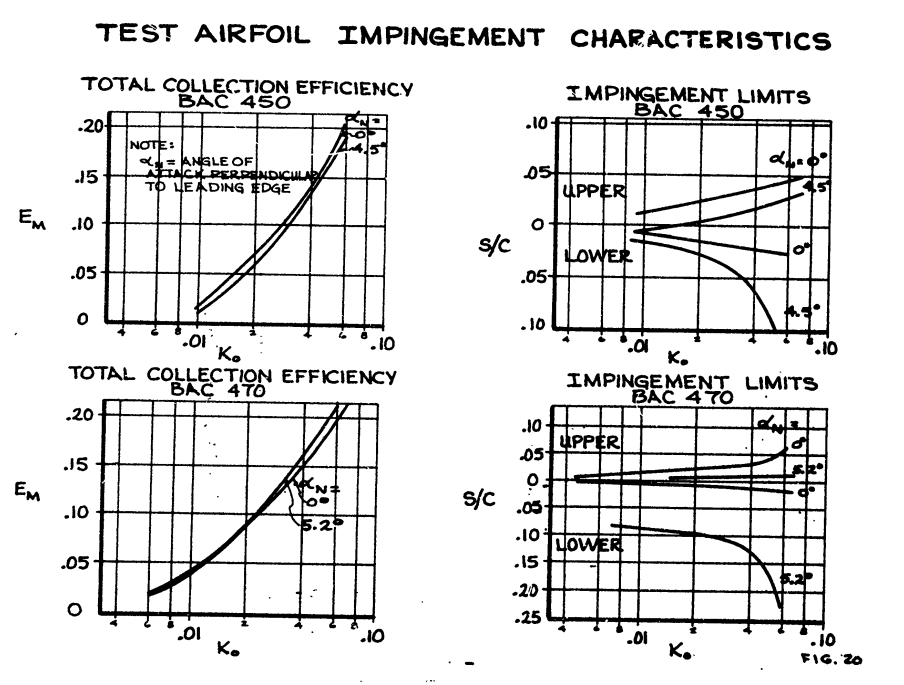  

>The projected height of the airfoil an shown in Figure 21 was used in this
study as the characteristic dimension for overall water drop collection efficiency
and in the ice shape correlation parameters. 

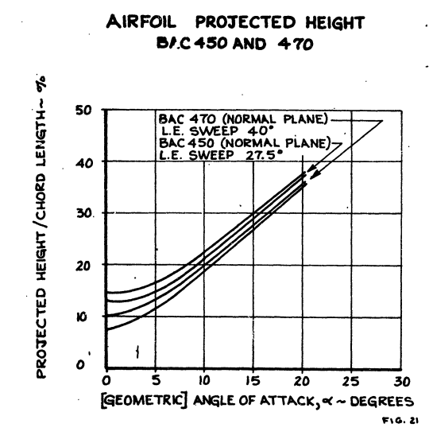  

>This is in line with the impingement data as presented in Reference 2.

###Ice Accretion Test Result:

>Correlation of the measured ice cap dimensions was based on the water
catch parameters which are indicative of the ice thickness. Under conditions
of glaze icing, the ice thickness is more a function of total water catch or  
```text
delta_i = f(w_c * theta / (gamma_i * delta_s))    (5)
```

>where the total water catch is calculated from

```text
w_c = 0.38 * V * cos(sweep) * Em * H / c * c * w  (6)
```

>An icing parameter indicative of the ice thickness in terms of the water
catch can be defined from the relationship in equation (5) as:  
```text
w_c * theta / (gamma_i * delta_s) 
= 0.38 / gamma_i * V * cos(sweep) * w * theta * Em / (delta_s/c) * (H / c)^X    (7)
```

>The ice density under glaze icing can be asumed relatively constant, and further,
the term Em / (delta_s/c)
it a single valued function for a given Ko value. Since delta_s/c
is difficult to measure or obtain accurately and is a particular value
for
Em, only the total collection efficiency was used in this correlation. Thus,
the icing parameter indicative of a theoretical average ice thickness
reduces to
```text
i = w_c * theta / (gamma_i * delta_s) 
~= V * cos(sweep) * w * theta * Em * (H / c)^X   (8)

where X is the factor used to correlate angle of attack effects

```

>Measured ice thicknesses in terms of the stagnation, upper and lower ice
cap protuberances are plotted against the icing parameter defined by equation
(8) in Figures 22 and 23 for both the BAC 470 and 450 airfoils. The effect
of angle of attack was resolved for the BAC 450 airfoil by raising the projected
height to the fifth power. No factor was found necessary for the BAC 470
airfoil since the projected height to chord ratio (h/c) provided sufficient
angle of attack correction.
These factors are empirical for the range of the
test data or from 0 to 4.5 degrees. However, some extrapolation beyond
these limits is felt to be valid and within the accuracy of the test data.

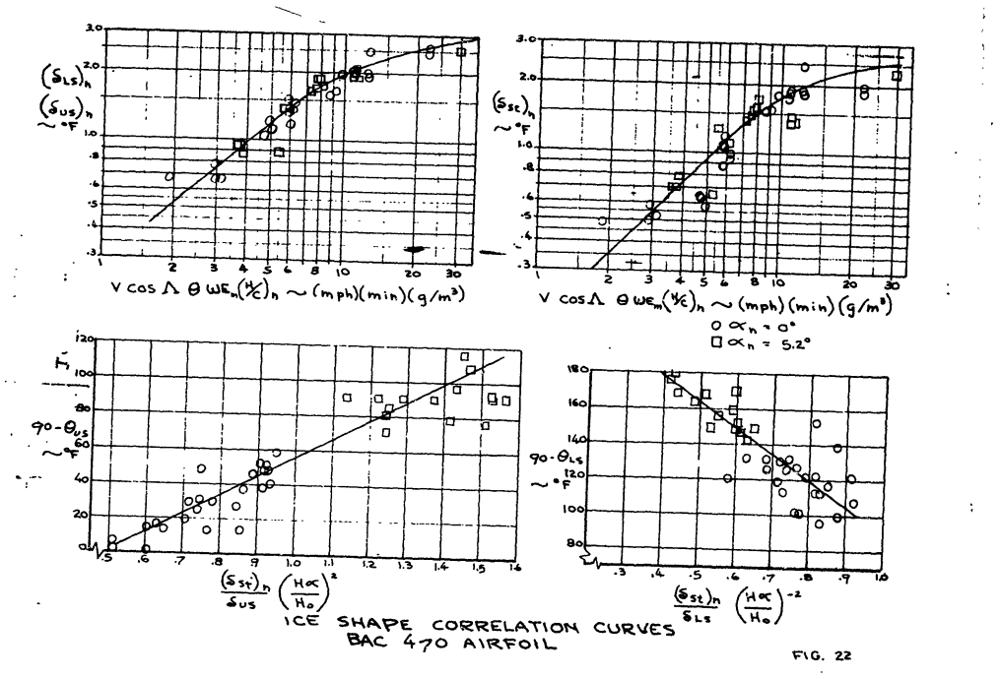  

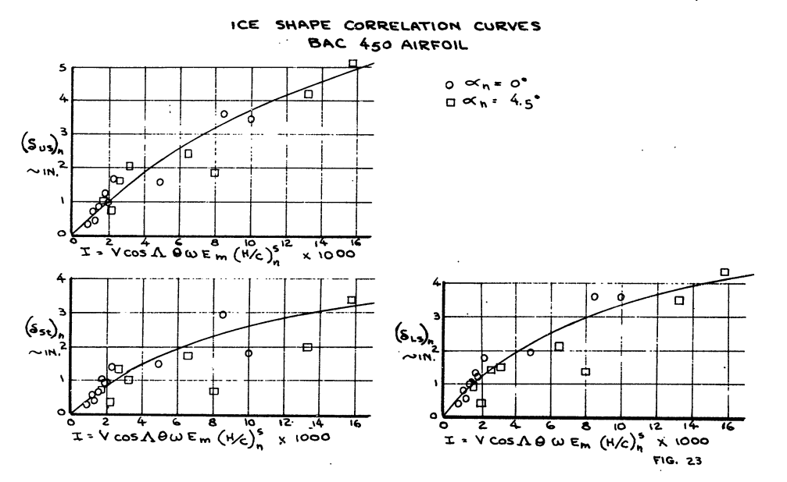  

>These curves define the ice thicknesses, but not their relative positions.
The angles, which the upper and lower pinnacle dimensions are with the geometric
chord line, were measured end correlated in a similar manner. This correlation
is shown in Figure 22 for the 470 airfoil. These data were not as orderly as
the ice thickness data, but they provide a definite trend which in useful in
defining the ice shapes. It is not recommended that this ice angle data be
extrapolated much beyond the airfoil angles of attack from which the data
was obtained without correlating impingement data.  

>The frontal heights, obtained through these ice angles are maximum dimensions
since the test data was obtained at or near maximum icing temperatures where
the impinging water can run farther aft before freezing. The range of flight
and icing conditions during holding or approach is within the test icing
conditions so these dimensions will also be valid for flight conditions.

>Some significant trends are readily apparent from these curves obtained
by this correlation (Figures 22 and 23). The most significant of these is the
distinct reduction in slope, which occurs once the ice attains a thickness
between 1-1/2 to 2 inches. This change in the slope is indicative of a
reduced rate of growth for the ice shapes. This can be explained by the physics
of the ice accretion. As the ice pinnacles associated with the glaze ice shape
builds to these heights, the droplets impinging near the stagnation area become
trapped and assisted by the spanwise velocity component of the swept wing
freeze within the pinnacles instead of contributing to additional growth of
the pinnacles. This is apparent in the more blunt ice shapes. For the larger
ice shapes, the ratio of stagnation ice thickness to pinnacle heights
(delta_st/deltas_us, delta_st/delta_ls),
approaches unity i.e.:
```text
  Icing Parameter  (delta_st)_n  (delta_us)_n   (delta_st)_n/(delta_us)_n  
      I                
      3                0.54          0.76                0.710
      8                1.5           1.75                0.857
     20                2.33          2.61                0.893
```
>A comparison of the curves for the two airfoils also illustrates the
influence of camber and leading edge radius on the maximum ice thickness.
The BAC 450 airfoil, being blunt, has a larger actual ice accretion area.
This resulted in a larger ice cap both in thickness and area over the less
blunt highly cambered BAC 470 airfoil.

A detailed example calculation is given, the results of which are shown in Figure 25.

  

###Performance Penalties

> In addition to evaluating flight characteristics, airplane performance must 
also be considered due to the ice effects on drag. Figure 29 shows a typical 
drag polar obtained from flight tests on a Boeing jet transport. These data, 
along with wind tunnel test data, are used to evaluate the flaps down approach 
and landing climb performance as required for use in the flight manual. 
Figure 30 shows the effect of ice in terms of climb gradient and aircraft 
gross weight. The increment between the ice on and ice off curves must be 
subtracted from the aircraft maximum allowable landing weight. On short haul 
aircraft, where the maximum landing weight is nearly the takeoff weight, this 
weight decrease can com out of payload. This performance penalty has been 
assessed anytime icing conditions enroute are anticipated, and the destination 
airport temperature is below the temperature at which the ice will shed. 

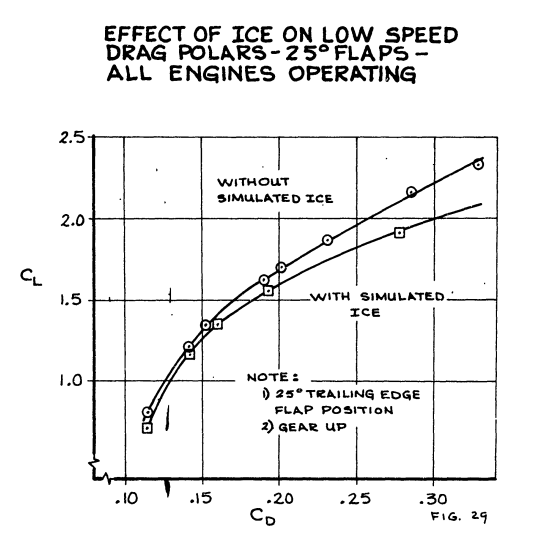  

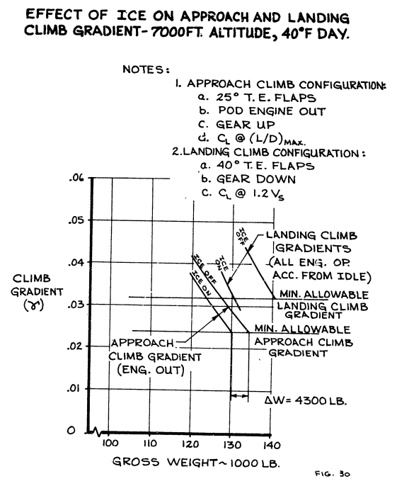  

##Conclusions  

>The determination of the need for airfoil ice protection requires the
establishment of the effects of large ice accretions on airplane performance. The
ice accretion test program conducted by Boeing provides a basis for accurately
determining the size and shape of these ice accretions. This has been
accomplished by correlating the measured ice cap dimensions with theoretical
impingement parameters. Use of this correlation will enable the calculation
of artificial ice shapes representative of those which would accrete on
the airplane during a severe icing encounter.

>Boeing icing tunnel testing and analysis have shown that ices shedding
characteristics can be analytically determined for a given descent profile.
Use of the procedures illustrated here will enable the determination of
the time and altitude at which the ice will shed or what destination airport
temperature is required to assure ice shedding prior to approach.

This publication simplified the ice shape correlation 
(compared to NACA-TN-4151) 
by only considering glaze ice characteristics 
(even though some rime and mixed test conditions were included). 

>__"The correlation was
obtained primarily by use of glaze ice heights and angles measured from the
plaster casts of the actual ice shapes"__

This allowed omitting a temperature value from the correlation, 
but that may have lost some of the broader detail and applicability. 

##Citations

This publication cites 6 references:  

- Airworthiness Standards Transport Category Federal Regulations Part 25.  
- Bowden, D.T, et.al., “Engineering Summary of Airframe Icing Technical Data”, FAA Technical Report ADS-4, General Dynamics/Convair, San Diego, California, 1963 [ADS-4](https://apps.dtic.mil/sti/citations/AD0608865)  
- Messinger, B. L.: Equilibrium Temperature of an Unheated Icing Surface as a Function of Airspeed. Preprint No. 342, Presented at I.A.S. Meeting, June 27-28, 1951.  
- Gray, Vernon H.: Correlations Among Ice Measurements, Impingement Rates, Icing Conditions and Drag Coefficients for an Unswept NACA 65A004 Airfoil. NACA-TN-4151, 1958.  
- Sherman, P., Klein, J. S., and Tribus, Myron: Determination of Drop Trajectories by Means of an Extension of Stokes' Law. Eng. Res. Inst. Air Res. and Dev. Command, USAF, Univ. Mich. Apr. 1952. (Contract AF 18 (600)-1, Proj. M992-D.)  
- Stoffel, G. J., "Determination of the Necessity of Tail Ice Protection on Commercial Jetliners", Procedings of the 5th Annual National Conference on Environmental Effects on Aircraft and Propulsion Systems, 1965.  

I could not find a citation of this publication in the literature,
and so this truly qualifies as a candidate for __"The Greatest Thing That You Have (Probably) Never Read"__,
or at least "a thing that you have (probably) never read". 

However, see "Related" below. 

##Related  

An online search found 19 citations of this similarly titled publication:   
Wilder, R. W. "A theoretical and experimental means to predict ice accretion shapes for evaluating aircraft handling and performance characteristics." AGARD Aircraft Icing 20 p(SEE N 79-15036 06-05) (1978).  

I could not find this publication online. 

[https://scholar.google.com/scholar?hl=en&as_sdt=0%2C48&q=A+theoretical+and+experimental+means+to+predict+ice+accretion+shapes+for+evaluating+aircraft+handling+and+performance+characteristics&btnG=  ](https://scholar.google.com/scholar?hl=en&as_sdt=0%2C48&q=A+theoretical+and+experimental+means+to+predict+ice+accretion+shapes+for+evaluating+aircraft+handling+and+performance+characteristics&btnG=  )

See also the review of the conference where this paper was presented, 
[1969 Aircraft Ice Protection Report of Symposium]({filename}1969 Aircraft Ice Protection Report of Symposium.md), 
which stated:  
>"The subject of aircraft ice protection has provoked much controversy and discourse among theorists, designers, laboratory and test engineers, and flight operations people.".  

##Notes

[^1]: Wilder, Ramon W.: "Techniques used to determine Artificial Ice Shapes and Ice Shedding, Characteristics of Unprotected Airfoil Surfaces" in Anon., "Aircraft Ice Protection", the report of a symposium held April 28-30, 1969, by the FAA Flight Standards Service; Federal Aviation Administration, 800 Independence Ave., S.W., Washington, DC 20590. [https://apps.dtic.mil/sti/pdfs/AD0690469.pdf](https://apps.dtic.mil/sti/pdfs/AD0690469.pdf).  
