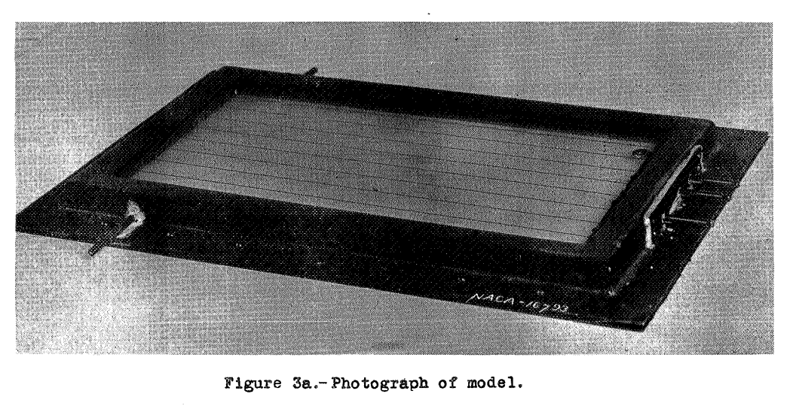

Title: Windshield Ice Protection  
status: draft  
tags: ice protection   

_"... ice on the airplane windshield, which is known to be a problem in urgent need of solution."_  

##"An Investigation of the Prevention of Ice on the Airplane Windshield", NACA-SR-130  

>SUMMARY  
>An investigation has been completed on several methods
for the prevention and removal of ice on an airplane windshield.
Tests were made on the use of electric heating,
hot-air heating, and an alcohol-dispensing, rotating wiper
blade.
The results showed that vision through the airplane
windshield could be maintained during severe icing conditions by the use of heat.
When put in operation prior to
the formation of ice on the windshield, the rotating wiper
blade prevented the formation of ice.
A combination system that employs the use of heated air and a rotating
wiper blade would appear to give protection against formation 
of ice on the windshield exterior, prevent frost on
the interior, and provide for the removal of rainfall.

>INTRODUCTION  
>The National Advisory Committee for Aeronautics is
conducting a program of ice research aimed to reduce the
risks now attendant with airplane operations during icing
conditions.
A part of this program is concerned with the
prevention of ice on the airplane windshield, which is
known to be a problem in urgent need of solution.

>APPARATUS
Most of the tests on the models applying to various
methods included in the investigation were made under
simulated icing conditions in flight although some preliminary 
tests of the electrically heated model were made
in the N.A.C.A. 7- by 3-foot ice tunnel.

>Electrically Heated Tunnel Model  
The tunnel model of the electrically heated windshield
was mounted in the leading edge of an airfoil shape as
shown in figure 1. The dimensions of the transparent area
of this model are 9 inches by 9 inches.
The test panel is
made of two panes of glass 1/8 inch thick,mounted in a
frame and separated by a 1/4-inch gap.
The gap between
the two panes of glass contains electric heating wires.
A liquid dielectric, ethylene glycol, was used to surround
the heating wires and aid the transmission of heat from
the wires to the glass and prevent local overheating of
the glass panes.

  

>Electrically Heated Flight Model  
The flight model of the electrically heated windshield was mounted 
in the right front windshield frame of a four-place cabin monoplane (fig. 2).

  

  

  

>Air-Heated Flight Model  
The heated-air windshield mounted
on the airplane for
flight tests is shown in figure 4.
The test panel, when
mounted as shown, was set into the side window of the cabin
airplane at an angle of 30° with the side of the craft.
This model was also mounted in a cut-out in the right front
windshield during part of the tests,
When mounted in the
front windshield panel, the direction of the hot-air flow
in the model with relation to the direction of the air
stream over the outside was thought to be unfavorable to
the most efficient operation of the heating system.
In order to avoid the extensive changes required to both the
airplane windshield frame and to the model to obtaina desirable 
orientation, the model was moved to the side location.
The side mounting was therefore utilized for the
rest of the tests because it eliminated the objectionable
features of mounting in the front panel of this particular 
airplane and yet provided conditions that would give
valid test results. 
The dimensions of the exterior of the
frame were 9 by 14 inches.
The size of the transparent region over which ice was prevented 
was 6 by 11 inch. 

  

  

>Rotating Windshield-Wiper Blades  
Ice was prevented from forming by the rotating windshield-wiper 
blades but could not be removed if formation
occurred before the blade was put in operation. Photographs
showing the test panel after a flight during which
ice was prevented from forming are shown in figures 12(a)
and 12(b). All the alcohols used weres atisfactory for
the prevention of ice, although the denatured alcohol
caused as light blurring of vision through the protected
disk.
No data are nvailable regarding the contents of the
denaturant used.
Later tests were made with pure ethyl
alcohol and with isopropyl alcohol.
The quantity of alcohol used is thought to be correct.
One gallon was sufficient for a flight of 2 hours in moderately severe icing
conditions.
Then ice was permitted to form prior to the
rotation of the wiper blade shaft, ice could not be removed.
Attempts to operate the rotating wiper blade after
ice had formed on the glass resulted in mechanical failure
of the drive.

  

  

>The heated-air panel appears to be the most satisfactory
solution to the windshield-icing problem, provided
that a source of air at a temperature of between 170 and
200 F is available. 
The air-heated panel has two advantages over the electrically heated panel;
it is more easily
designed and uses normally wasted exhaust-gas energy;
whereas, the electrically heated panel must be kept liquid-tight
and must use electric batteries for power.
The air-heated model also has the same advantages over the windshield
wiper with regard to the source of heat and, in addition, 
has the advantage of being free from moving mechanical parts.
In as much as each of the systems tested
has given, in some measure, satisfactory results, it is
expected that all will find application according to the
requirements and limitations of the particular installation.
The possibility and advantages of combining the rotating 
wiper blade with the hot-air system will be noted.
By such a combination, protection against ice will have
been doubly provided over a limited area.
In addition,
the interior of the heated windshield will be protected
against frost and provision will have been made for some
vision through the windshield when flying in rain.
The existing practice of making the air plane windshield retractable
or removable by the pilot may become unnecessary
if adequate protection against loss of vision due to rain
or ice can be provided.
The possibility is therefore noted
that the added design complications resulting from the installation of 
ice-prevention equipment may in part be offset by other design simplifications.
 
>CONCLUSIONS  
Tests in the 7- by 3-foot
ice tunnel and in flight in dicated that:  
>1. Ice could be prevented from forming on the windshield by 
electric heat,by heated air,or by an alcohol-dispensing, rotating wiper blade.
>2. Preformed ice could be removed from the airplane
windshield by the use of either electric or hot-air heating.
>3. The power required by a heating system for the
protection against ice could be computed by one of the following equations:  
>>
>>Pw = 7 * V ^0.78 watts per square foot  
>>Pa = 24 * V ^0.78 B.T.U. per square foot per hour  
>>
>>Where Pw is the power required by heated wires;  
Pa, the power required by heated air; 
and V, the airspeed in miles per hour.  
>
>Approximately one-half gallon of alcohol per hour
was required for the prevention of ice over a disk 10
inches in diameter covered by a rotating wiper blade during
moderately severe icing conditions at air speeds up to 150 
miles per hour.

##"A Method for Calculating the Heat Required for Windshield Thermal Ice Prevention Based on Extensive Flight Tests in Natural—Icing Conditions", NACA-TN-1434  

>SUMMARY  
An equation is presented. for calculating the heat flow required.
froth the surface of an internally heated windshield in order to
prevent the formation of ice accretions during flight in specified.
icing conditions. To ascertain the validity of the equation,
comparison is made between calculated values of the heat required
and measured values obtained for test windshields in actual flights
in icing conditions.  
The test windshields were internally heated and provided data
applicable to two common types of windshield configurations; namely
the V-type and. the type installed flush with the fuselage contours. 
These windshields were installed on a twin-engine cargo airplane and.
the icing flights were conducted over a large area of the
United States during the winters of 1945-46 and 1946-47. In
addition to the internally heated windshield investigation, some
test data were obtained for a windshield ice-prevention system in
which heated air was discharged into the windshield boundary layer.
The general conclusions resulting from this investigation are
as follows:  
>1. The amount of heat required for the prevention of ice
accretions on both flush- and V-type windshields during flight in
specified. icing conditions can be calculated with a degree of
accuracy suitable for design purposes.  
>2. A heat flow of 2000 to 2500 Btu per hour per square foot
is required for complete and. continuous protection of a V-type
windshield in flight at speeds up to 300 miles per hour in a
moderate cumulous [sic, cumulus] icing condition. For the same degree of protection
and the same speed range, a value of 1000 Btu per hour per square
foot suffices in a moderate stratus icing condition.  
>3. A heat supply of 1000 Btu per hour per square foot is
adequate for a flush windshield located well aft of the fuselage
stagnation region, at speeds up to 300 miles per hour, for flight
in both stratus and. moderate cumulous icing conditions.  
>4. The external air discharge system of windshield thermal
ice prevention is thermally inefficient and requires a heat supply
approximately 20 times that required for an internal system having
the same performance.

- Rodert, Lewis A.: "An Investigation of the Prevention of Ice on the Airplane Windshield", NACA-SR-130, 1938. Also NACA-TN-754, 1940.   
- Jones, Alun R., Holdaway, George H., and Steinmetz, Charles P.: A Method for Calculating the Heat Required for Windshield Thermal Ice Prevention Based on Extensive Flight Tests in Natural—Icing Conditions. NACA-TN-1434, 1947.  
